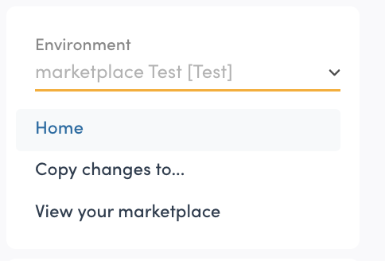
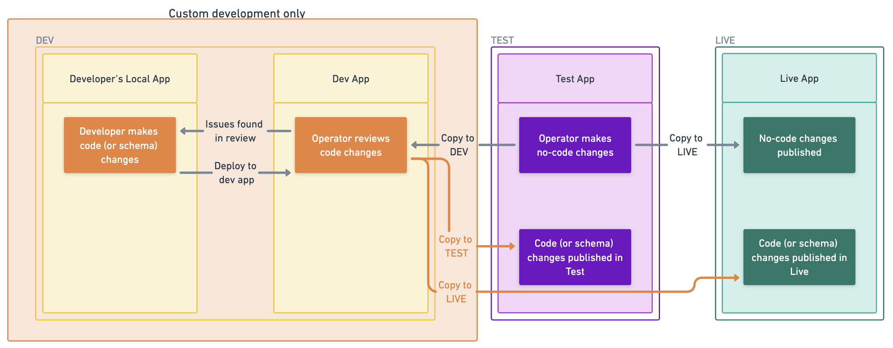

Sharetribe environments are instances of your own marketplace, but with
different functions. When you first create a Sharetribe account, you
have two environments: Test and Dev. When you are ready to go live, we
will create a third environment: Live.

The environment can be changed from the dropdown in the top of your
navigation sidebar.

<info>

**Organization** and **environment** are terms that are used to
communicate which Sharetribe marketplace you are looking at in Console.

**Organization**: An entity that is created when you first create an
account. This is where you can invite other admin users to work with. An
organization can include multiple environments for different purposes,
but it can only include one live environment.

**Environment**: A marketplace instance within your organization which
can be created for different purposes. There are three different types
of environments: Dev, Test, and Live. You can access them all with the
same Sharetribe account.

</info>

## Environment types

Environments store your marketplace data and configuration. The three
environments in Sharetribe each have their own specific workflow
described below.

Each environment should also be connected to its own dedicated
marketplace application. The marketplace application renders the data
and configurations stored in its environment. It can also contain custom
code changes.

The marketplace application type follows the type of environment to
which it connects. A Test environment is connected to a test marketplace
application, Dev environment to a dev marketplace, and a Live
environment to a live marketplace.

### Test environment

The Test environment is where building your marketplace no-code happens.
It is connected to a test marketplace application, where you can try the
build functionalities in peace by using test users and test payments.

Once you have a Live environment, the Test environment functions as a
preview environment for how your Live marketplace application will work.
You as the operator make no-code changes in Test, and copy them to Live.
Because Test and Live are identical, your changes made in Test show up
correctly when published to Live.

Note that you should not onboard real users or listings to Test, as they
cannot be moved into Live.

### Live environment

The Live environment is where the business happens: here you can onboard
your real customers and listings, and your customers can make real money
transactions.

When the necessary configurations and development have been done, and
your marketplace is ready for onboarding real users, you can initiate
the Live environment setup from Console. This is also the point when you
start paying for a subscription (see more information about
[Sharetribe pricing at the bottom of our website](https://www.sharetribe.com/new-sharetribe/).

You rarely make no-code or code changes in your Live environment.
Changes are made in the Dev environment and the Test environment, then
copied to your Live environment.

### Dev environment

The Dev environment is purely for development purposes. This is where
your development team implements custom code to work alongside the
no-code content and configurations you set.

Even after launching your marketplace, you can continue building new
features in Dev without causing disruptions to your Test or Live
marketplaces. Note that you should not onboard real users or listings to
Dev, as they cannot be moved into Live.

## Workflow between the three environments

In a nutshell, the workflow between the environments is that changes
flow either from Test or from Dev to the other environments:

- no-code changes are made in Test, and get pushed from Test to Dev and
  Live
- code changes are made and reviewed in Dev, and get pushed from Dev to
  Test and Live

No-code changes include:

- Configuration changes in Console like adding new listing fields
- Content changes in Console like editing your landing page

Code changes include:

- client application development, updated through your development code
  repository
- transaction process changes, updated through Sharetribe CLI
- search schema changes, updated through Sharetribe CLI

We recommend that you keep Test and Live identical as much as possible.
In other words, push any code changes from Dev to Test and Live at the
same time before making further no-code changes in Test. This will
ensure that Test accurately works as a preview environment for Live.

## Additional development environments

Depending on your development flow, you might need additional dev
environments for your organization, e.g. for Quality Assurance (QA) or
automated testing. We can include additional environments to your paid
subscription at a price of \$49 per month per environment. To include
additional development environments in your subscription, contact
Sharetribe Support!
