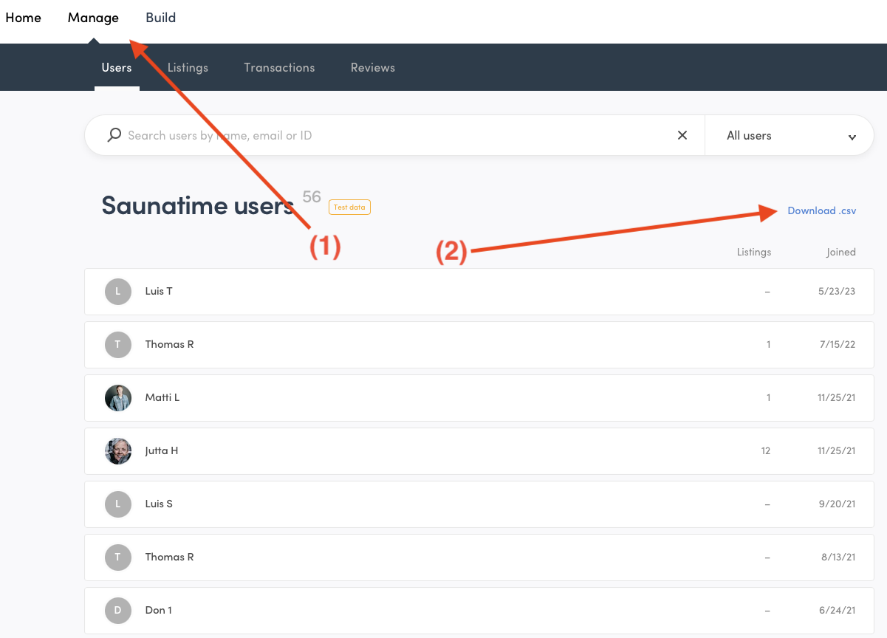
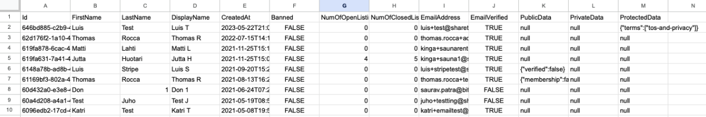
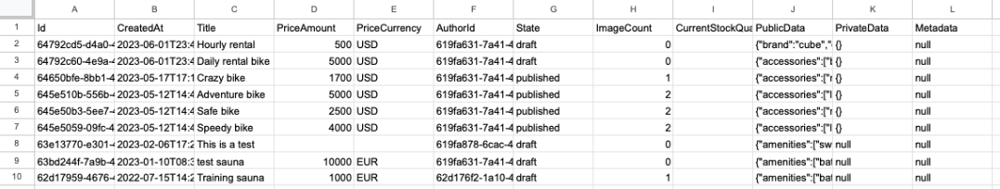
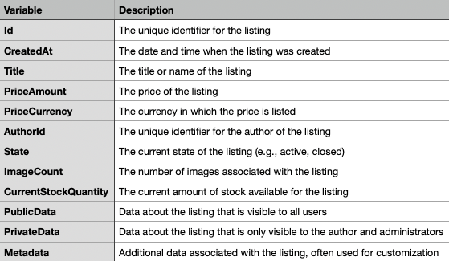
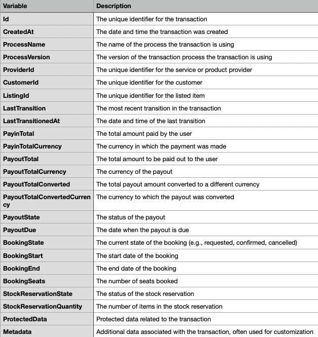
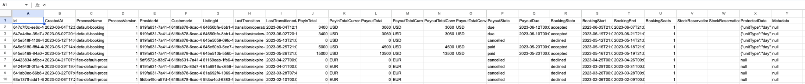
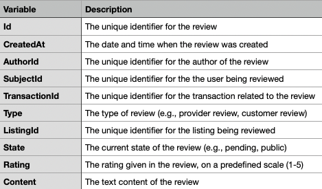

---
title:
  How to download your marketplace data as a CSV export on Sharetribe
slug: how-to-download-csv-exports-on-sharetribe
updated: 2023-06-14
category: concepts
ingress:
  Illustrated guide of the CSV export functionality on Sharetribe.
published: true
---

## Introduction

CSV (Comma Separated Values) exports are a handy feature on Sharetribe
that allows you to download important marketplace data, like user
details, listings, transactions, and reviews. These can be opened and
analyzed in spreadsheet programs like Excel, Google Sheets, or Numbers.
The screenshots below have been taken within a regular test environment:
your mileage may vary.

## Where to find the csv export buttons

The CSV exports are accessed from the Console. You can find the links
for downloading the CSV files from the "Manage" section of the Console
(1). For example, the link to download the user list of the marketplace
is found in the "Manage" -> "Users" section at the top right part of the
screen (2). The "Listings", "Transactions", and "Reviews" sections of
the Console have similar links.

<extrainfo title="Finding the download .csv button from the Console for downloading user data">

</extrainfo>

## How to use the different exports

### Users

This dataset includes information about each user in your marketplace.
To export it, go to the "Manage" -> Users" section in Console, and click
on the "Download .csv" button. Click below for descriptions on what data
the file contains.

<extrainfo title="What the users csv export looks like (example data, first few rows)">

</extrainfo>

<extrainfo title="Explanations for the columns in the user csv export">

</extrainfo>

### Listings

This includes information about all the listings in your marketplace.
Find this by navigating to the "Manage" -> "Listings" section in Console
section and clicking on "Download .csv". Click below for descriptions on
what data the file contains.

<extrainfo title="What the listings csv export looks like (example data, first few rows)">

</extrainfo>

<extrainfo title="Explanations for the columns in the listing csv export">

</extrainfo>

### Transactions

This dataset consists of all transactions that occurred in your
marketplace. Go to the "Manage" -> Transactions" section and click
"Download .csv". Click below for descriptions on what data the file
contains.

<extrainfo title="What the transactions csv export looks like (example data, first few rows)">

</extrainfo>

<extrainfo title="Explanations for the columns in the transaction csv export">

</extrainfo>

### Reviews

This includes all reviews left by users. Find this in the "Manage" ->
"Reviews" section and then click on "Download .csv". Click below for
descriptions on what data the file contains.

<extrainfo title="What the reviews csv export looks like (example data, first few rows)">

</extrainfo>

<extrainfo title="Explanations for the columns in the review csv export">

</extrainfo>

After clicking "Download .csv" on any of these lists, a CSV file will be
generated and downloaded. You can open this file in any spreadsheet
program (and even in a text editor, if needed).

Remember, these files contain important and sensitive data of your
users, so handle them with care. Also, exporting large amounts of data
may take some time if your marketplace has grown very large.

## Analyzing Your Data

With these data sets, you can analyze the performance of your
marketplace. For example, you can monitor your marketplace's user growth
based on the users export with the help of the 'CreatedAt' column,
examine the popularity of listings from the transactions export and its
'ListingId' value, track the number of transactions in a given month, or
measure user satisfaction based on reviews, and much more. Understanding
these data sets will help you make informed decisions to improve your
marketplace.
