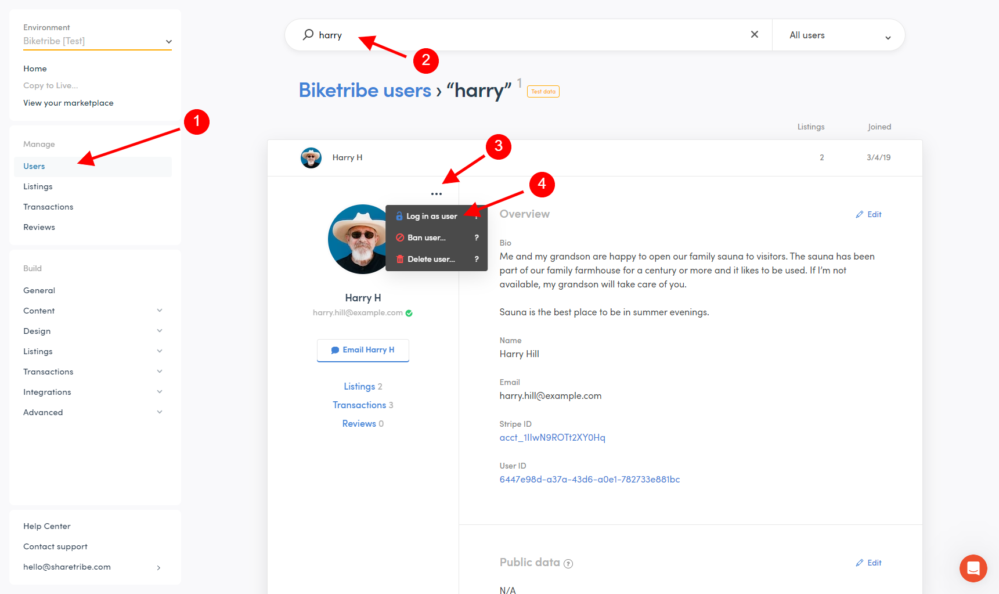

# Login as another user

As a marketplace operator of a Sharetribe marketplace, you have the
ability to login on behalf of your marketplace's users. This feature is
useful for understanding the user experience, solving reported problems,
and helping users edit their listings or user profiles. For example, you
can log in as a new seller and use the feature to help them complete
their first listing on the marketplace to make their onboarding
experience extra smooth.

There are certain things you cannot do when using the marketplace in
this way. For a seller, you cannot change the user's payout details,
send messages to other users or interact with ongoing transactions. You
can only interact with ongoing transactions when you have an operator
transition in the transaction process, like you do in the
[default product purchase process.](https://www.sharetribe.com/docs/operator-guides/default-transaction-process-options/#operator-actions-1).
You also cannot make purchases when logged in as another user.

## How to use the "Login as user" feature

The way you can login as a user is through the Console. From there, you
can access the user list from the "Manage" -> "Users" section (1). You
can then search for the user you want to log in as (2) or select them
from the user list. When you are viewing their profile card, click on
the three dots near the user's profile picture (3), and from there, you
can select the "Log in as user" option (4).

This takes you to the marketplace front page, logged in as the user you
were viewing. You will see a banner at the top that reminds you of who
you're logged in as (5), and that you have limited rights. From here,
you can for instance create a listing on behalf of a user (6), enter
their inbox (7), and access their profile and account settings (8).
Aside from the limitations mentioned earlier, all these functions work
as they would when you are logged in normally on the marketplace.

Click below for screenshots showing the two parts of the process.

<extrainfo title="Steps 1-4: Accessing the feature from the Console">

</extrainfo>

<extrainfo title="Steps 5-8: Logged in on the marketplace as another user">

</extrainfo>
