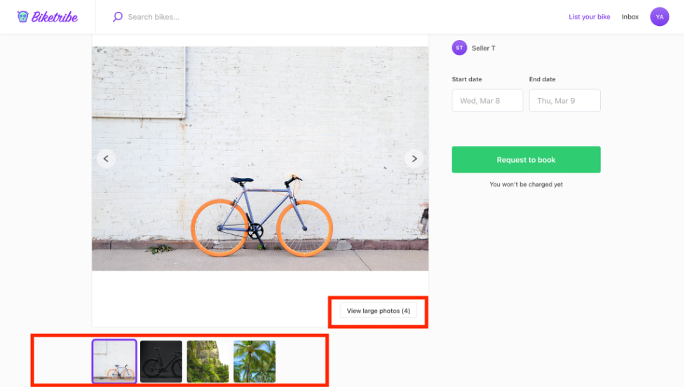
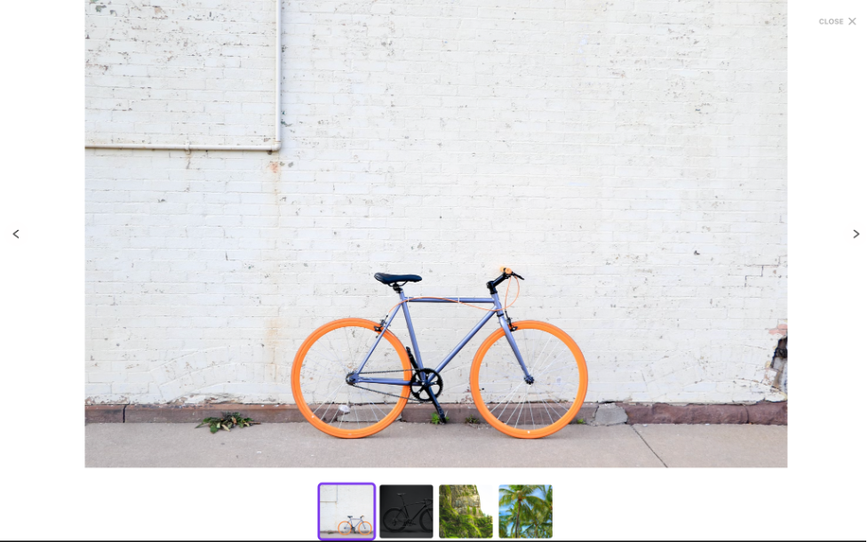
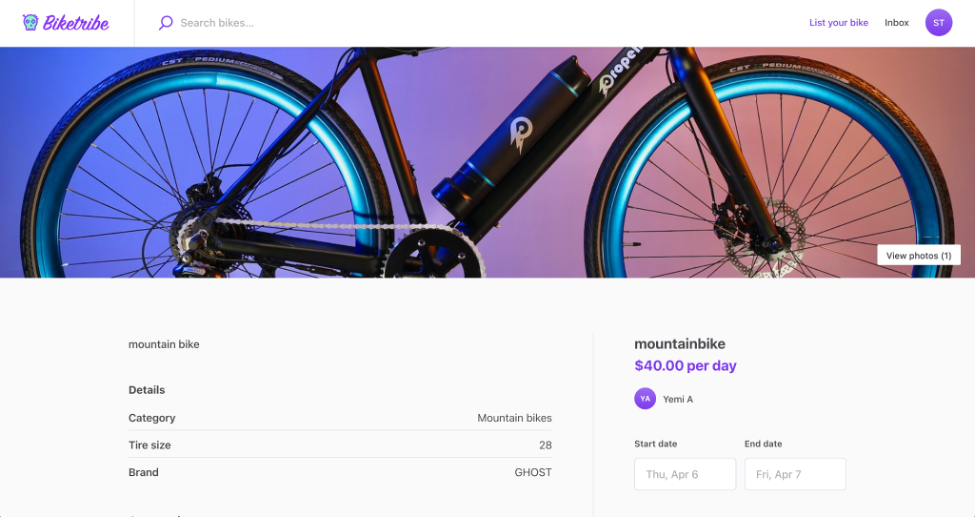

When posting a listing, your users can add images to the make their
posts, offers or request, more appealing. With this setting you can
determine the best layout for all your listings. You can choose your
layout in the "Design → Layout" page of your Console account.

A primary image is always displayed on the listing page or as a
[thumbnail in the search page](https://www.sharetribe.com/docs/the-new-sharetribe/listing-thumbnail-aspect-ratio/),
but you can add as many photos as you need. Users will be able to expand
and look at the other pictures as well.

There are two options for the listing page image layout: an image
carousel with a thumbnail and a screen-wide cover photo.

## Image Carousel with thumbnails

This option displays the main image to the left of the transaction
actions.The secondary images are shown as thumbnails in a carousel below
it. The transaction actions section can be found on the right side of
the image. If you have a marketplace focused on buying and selling
products that require multiple images, then the image carousels with
thumbnails may be the best option for you. With this, the prospective
buyer can quickly scroll through the carousel thumbnails to see the
different images before proceeding with the transaction.

For a more detailed view, the user can enlarge the images.

Here’s what the listing page carousel with thumbnails looks like:

Here's how it would when user's select the option "View large photos".
The image becomes full screen.

## Screen-wide cover photo

This option displays the first uploaded image as the top hero section of
the listing page, filling the screen's width. The screen-wide cover
photo is only one image shown by default, with a link, on the bottom
right of the image, to see the rest of the listing images. The
transaction action section, and the rest of the listing information, can
then be found under the screen wide photo.

Screen-wide cover photos are ideal for showing landscape photos.
Listings of rental properties, services or experiences commonly use this
layout. If the condition of the item is not fundamental for the
marketplace, this layout might be better for you.

## What images can my users upload?

It’s possible to add JPEG and PNG files types. All listing images can be
up to, but not more than, 20 MB and 3072x3072 pixels.
[Read more about marketplace images](https://www.sharetribe.com/docs/the-new-sharetribe/how-to-add-good-looking-logos-and-images/).
