# Default Availability Management Options

By selecting a listing type associated with the calendar booking
transaction process, sellers are empowered to manage the availability of
their services or items. This feature allows sellers to display their
availability, which buyers can then view and select from when making a
booking.

## How sellers add their availability

### Daily/nightly availability management in listing creation

When creating a listing that operates on a daily or nightly basis,
sellers can specify their available days or nights. This could be done
by selecting specific dates from a calendar or setting recurring
availability. For example, a seller could indicate that a service or
item is available every Monday, or only for specific dates.

If a seller wants to set exceptional availability outside of their
default schedule, they can set an “Availability exception”. Availability
exceptions allow sellers to add specific days or nights when they are or
are not available, overriding their default calendar. If the seller does
not have any kind of recurring schedule, they can leave the regular
schedule completely unavailable and manage their availability just by
adding exceptions.

Click below for screenshots.

<extrainfo title="Setting a recurring schedule for a daily availability listing">

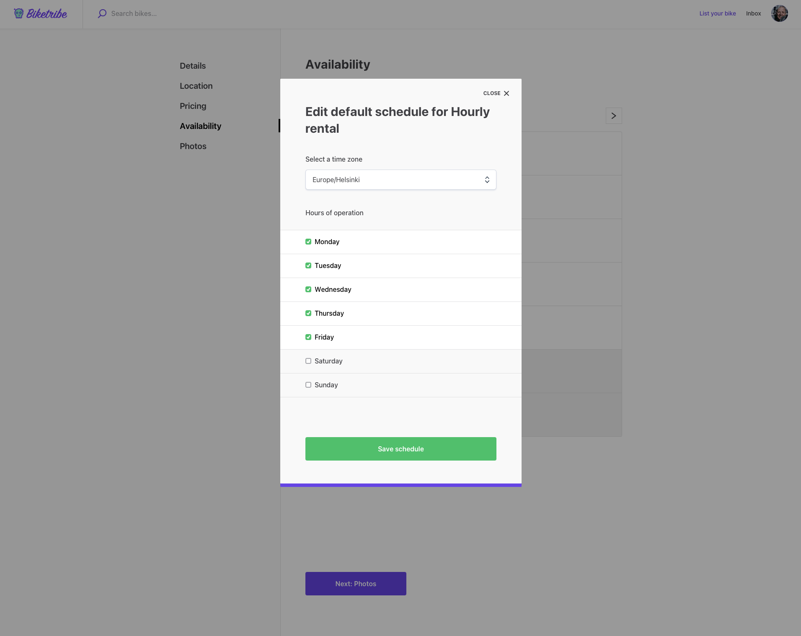

</extrainfo>

<extrainfo title="What the recurring availability looks like after done">

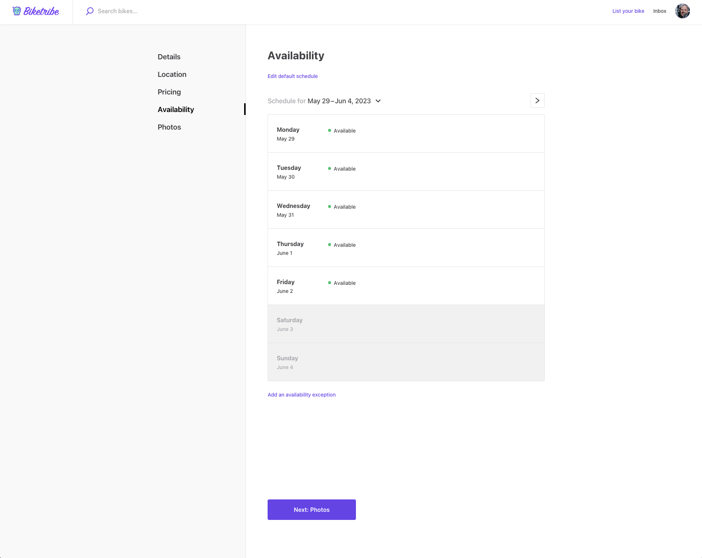

</extrainfo>

<extrainfo title="Adding an exception to daily availability">

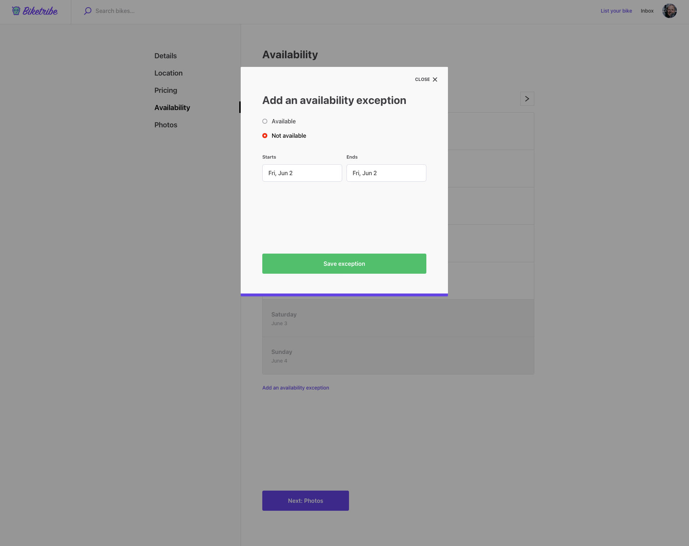

</extrainfo>

<extrainfo title="What the recurring availability looks like after exceptions">

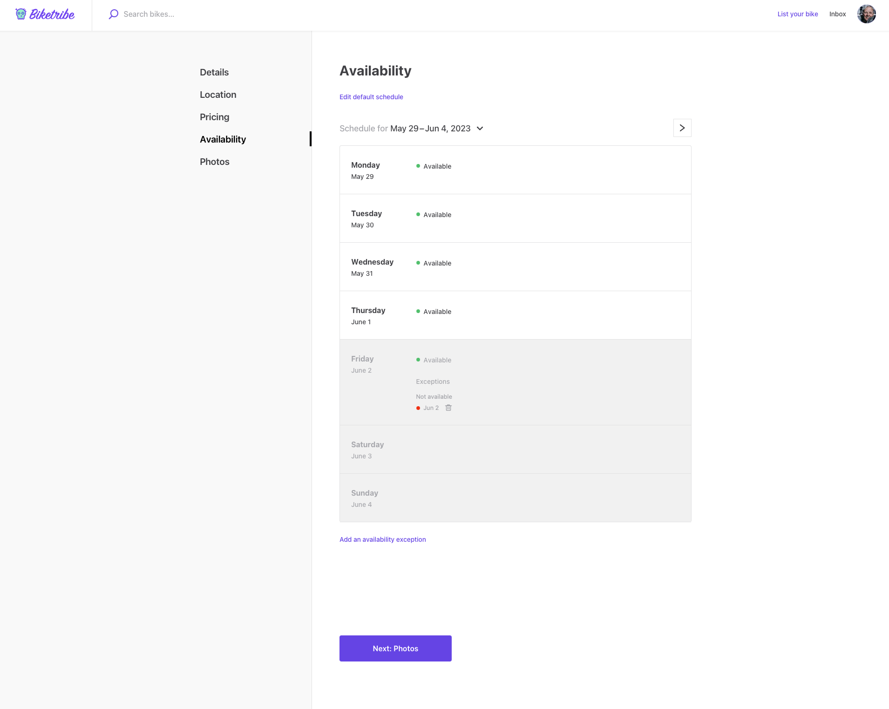

</extrainfo>

### Hourly availability management in listing creation

For services or items that are available on an hourly basis, sellers can
set their availability by specifying the hours during which they are
available. This could include setting availability for specific hours on
specific days, or recurring hourly availability such as every weekday
from 9:00 AM to 5:00 PM.

If a seller wants to set exceptional availability outside of their
default schedule, they can set an “Availability exception.” Availability
exceptions allow sellers to add specific dates and times when they are
or are not available, overriding their default calendar.

Click below for screenshots.

<extrainfo title="Seller adding a recurring hourly schedule">

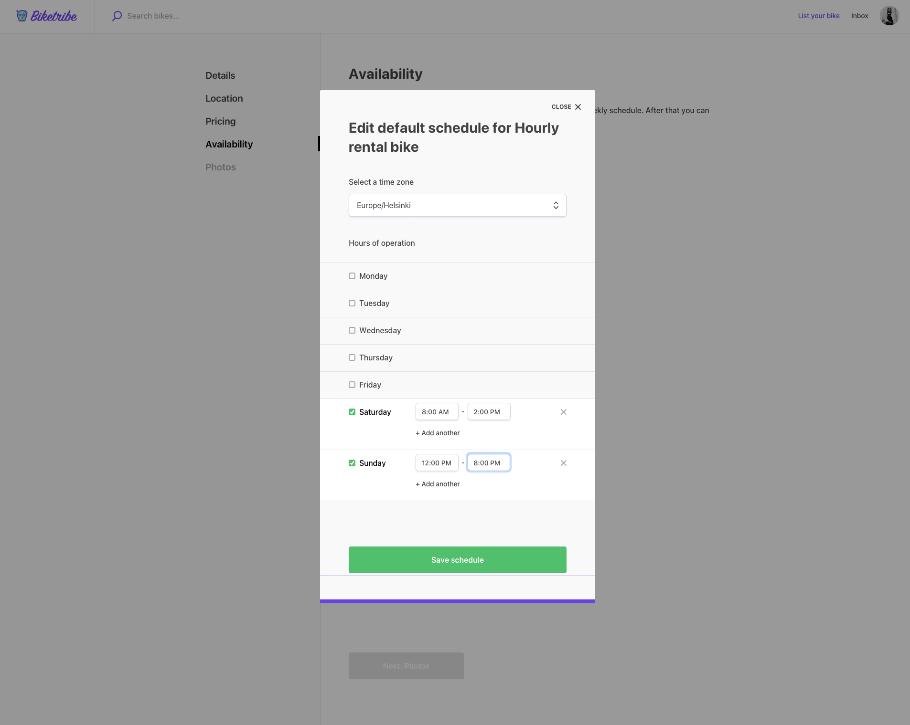

</extrainfo>

<extrainfo title="How the recurring schedule looks like after creation">

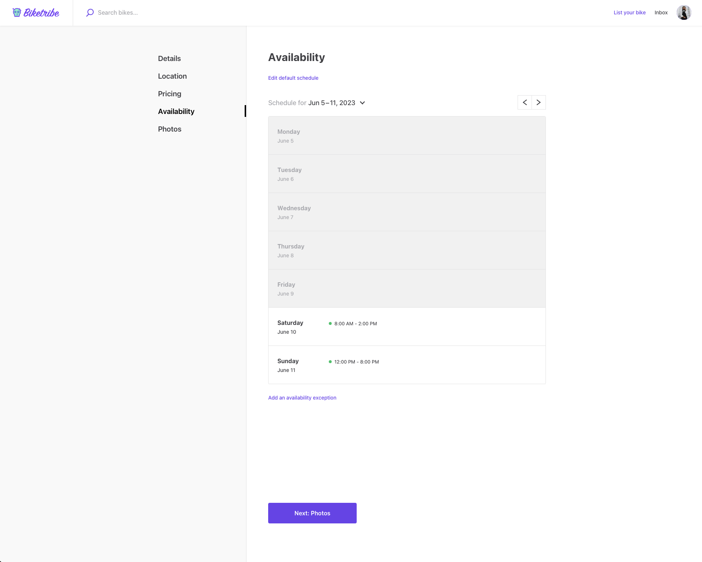

</extrainfo>

<extrainfo title="Adding an exception to the schedule">

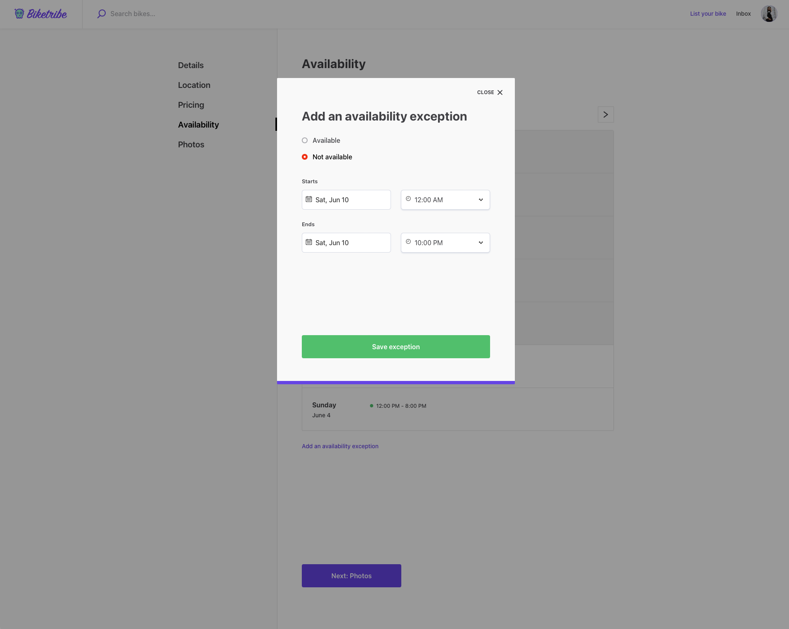

</extrainfo>

<extrainfo title="What the exceptions look like in the recurring schedule">

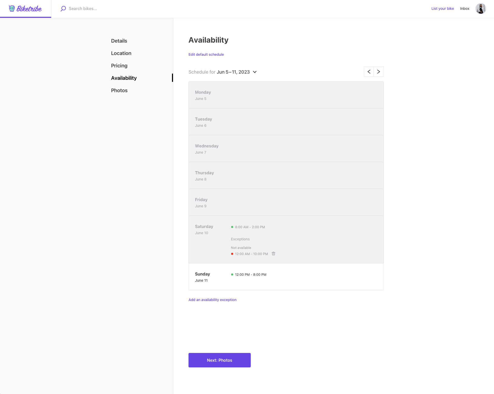

</extrainfo>

## How buyers book

### Daily and nightly bookings

Buyers can make bookings based on the seller's available days or nights.
By viewing the availability calendar in the booking panel, buyers can
select their desired dates from a calendar view and proceed with the
booking process.

The booking panel provides a visual interface for buyers to view and
select availability. Dates and/or hours available are highlighted, and
unavailable times are grayed out or otherwise marked as unavailable.
Buyers can select from the available times and add these to their
booking.

Pricing for daily or nightly bookings is set by the seller and is
visible to buyers on the listing page. The total price will depend on
the number of days or nights booked.

<extrainfo title="Buyer's view when looking at a daily availability listing">

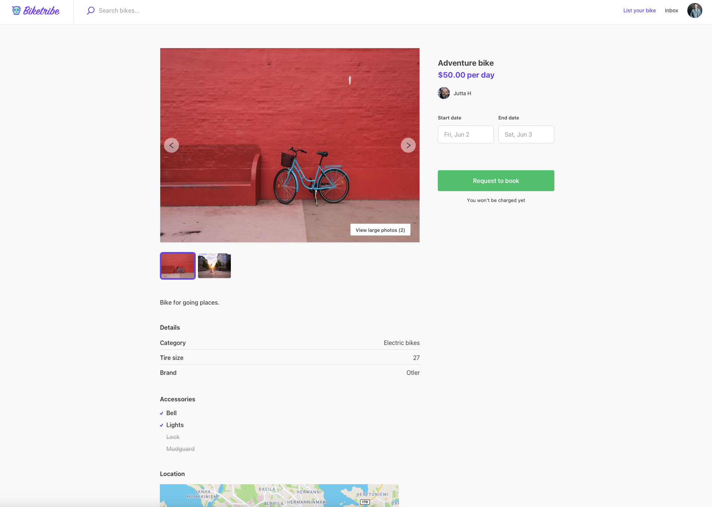

</extrainfo>

<extrainfo title="Buyer's view when selecting the dates for a daily availability listing">

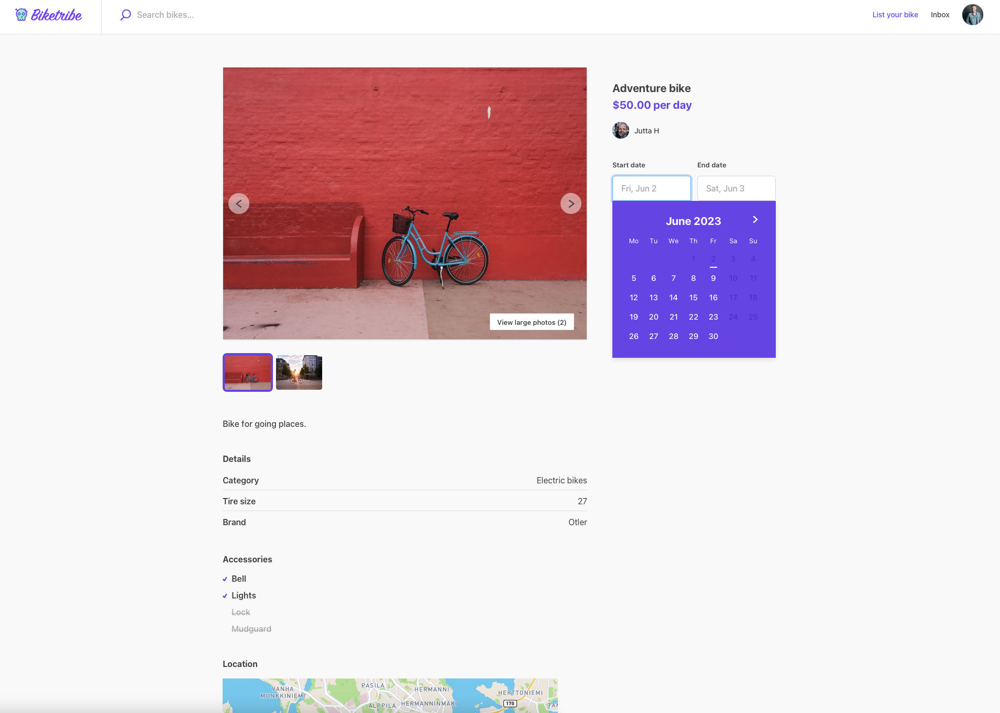

</extrainfo>

### Hourly bookings

For hourly bookings, buyers can select the hours they want to book from
the seller's availability in the booking panel. This allows for
flexibility, especially for services that do not require a full day or
night.

Just like for daily/nightly bookings, the booking panel provides a
visual representation of available hours for buyers to select from. The
date can be picked from a calendar-style pop up, whereas the time can be
picked from a dropdown menu.

Hourly pricing is determined by the seller and is visible on the listing
page. The total cost for the buyer will depend on the number of hours
booked.

Managing your availability accurately and in a timely manner is crucial
for a smooth transaction process. This ensures that buyers always have
up-to-date information, reducing the potential for booking conflicts and
cancellations.

<extrainfo title="Buyer's view of an hourly listing page">

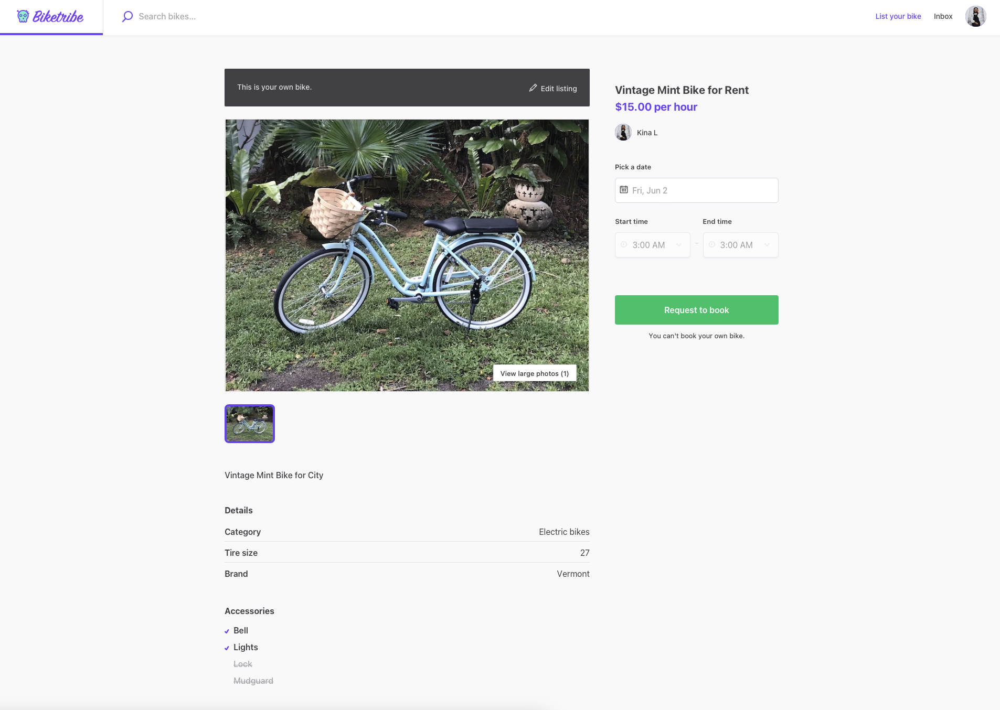

</extrainfo>

<extrainfo title="Buyer's view when choosing the date of the booking">

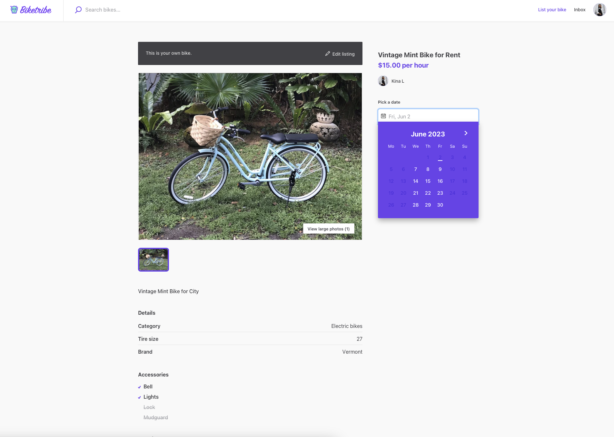

</extrainfo>

<extrainfo title="Buyer's view when selecting the time of the booking">

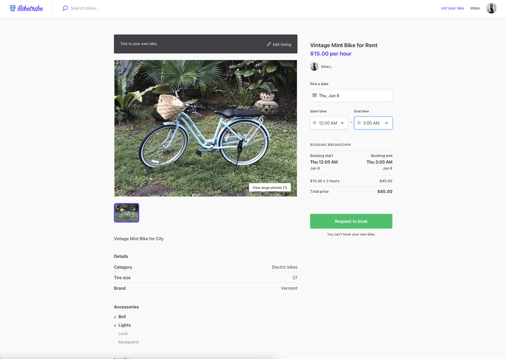

</extrainfo>

## Changing default availability management options

You may want to change these default functionalities for your
marketplace to work how you need. This is possible with Sharetribe by
extending your marketplace with code. If you are a developer, consult
our developer documentation for more information on how
[availability management](https://www.sharetribe.com/docs/references/availability/)
works under the hood. If you are not a developer, then consider
[hiring a developer](https://www.sharetribe.com/docs/operator-guides/how-to-hire-developer/)
to help you modify how availability management works on your
marketplace.
