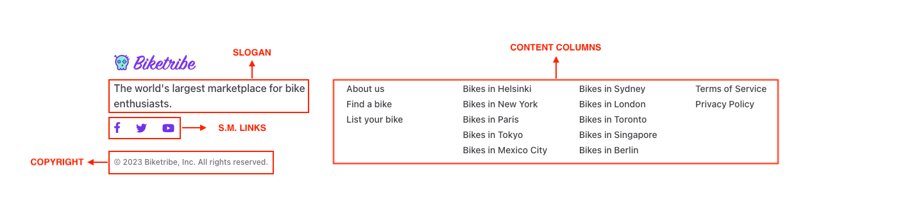

The Footer section in the
[Console](https://flex-console.sharetribe.com/) Build → Content allows
you to create a footer for your marketplace, an important component that
can enhance the navigation experience for your users by providing them
with quick access to relevant content and links to social media
channels.

There are four elements in the footer that be customized:

## Slogan

Consider adding a catchphrase that captures your marketplace is all
about. This slogan can act as a brand identifier and leave a lasting
impression on your users.

## Copyright

You can a copyright notice in the footer, indicating ownership of your
marketplace's content and protecting your intellectual property.

## Social media links

You can display links to your various social media channels:

- Facebook
- Instagram
- LinkedIn
- Twitter
- Pinterest
- Youtube
- TikTok

This encourages users to connect with your brand on multiple platforms,
increasing your visibility and online presence.

## Content columns

The content block in the footer allows you to enable up to 4 columns.
The footer supports
[markdown](https://www.sharetribe.com/docs/operator-guides/how-to-format-your-text-in-pages/#what-is-markdown)
partially, so consider utilizing these columns to add links to relevant
content, such as blog posts, terms of service, customer testimonials, or
any other valuable information about your marketplace.

