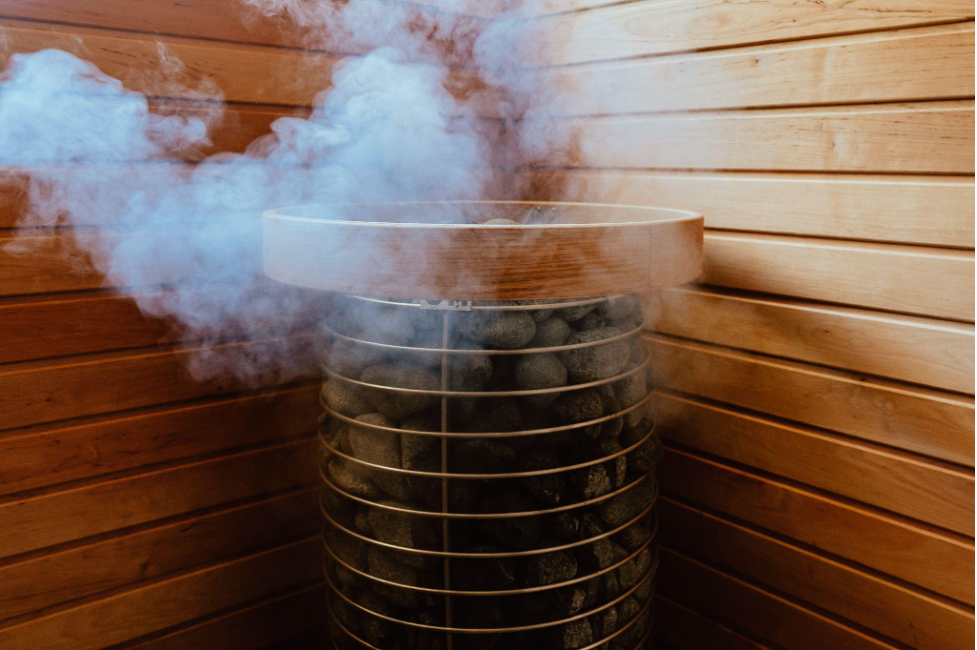
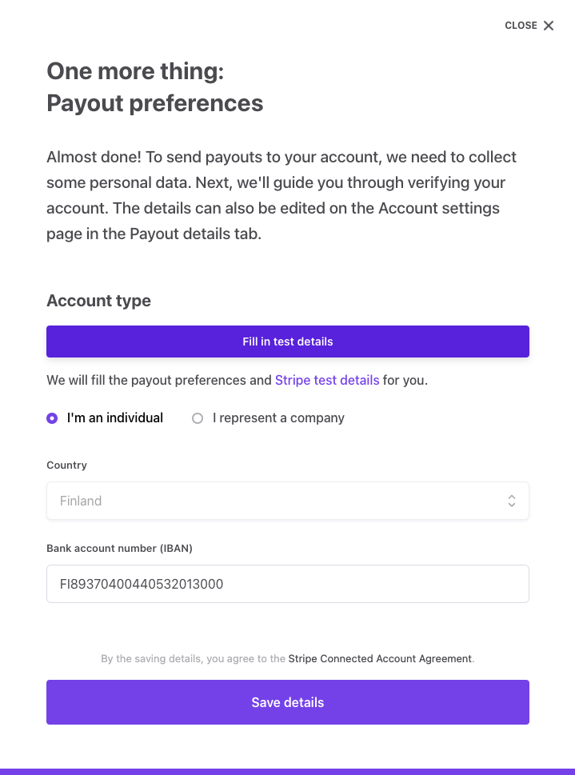

To create a listing, you first need to create user account. If you
haven't signed up to your marketplace as a new user, follow the steps in
the previous article. Once logged into your marketplace, click on the
link “List your Sauna” on the top bar. This will take you to the Listing
creation form.

In the listing creation form each section needs to be completed before
being able to move to the next and all sections need to be completed
before being able to publish a listing. These sections include:

- Listings details
- Location
- Pricing
- Availability
- Photos
- Payout details

If you don't complete all sections, your listing will stay in draft mode
and you can continue editing it later. Once a listing has been
published, you can skip to any section to update it.

<info>
 You can create a listings when using the "log in as user" feature. However, using this feature will prevent you from experiencing the entire process as your users would.
 </info>

## 1. Add Listing details

Add the following details to the listing details:

- **Listing title**: Cozy sauna in Helsinki
- **Listing description**: This electric sauna is located in Helsinki,
  It is a cozy sauna in the middle of the forest.
- **Category**:Electric Sauna
- **Amenities**: Check the options “Bathroom” and “Own drinks allowed”
- **Sauna Privacy (Optional field, if you added it)**: Public
- **Sauna capacity (Optional field, if you added it)**: 5

## 2. Add Location

Add a location to your sauna. Use the following address: "Bulevardi 14,
00120, Helsinki, Finland".

**Type "Bulevardi 14,00120, Helsinki"**

Once the dropdown options appear select the first one for the complete
address.

Leave the optional field blank.

## 3. Choose pricing

Add a price per day of 50 (dollars).

**Type "50"**

## 4. Adjust availability

When adjusting availability, you first need to choose your time zone and
set your default schedule.

- Select “Europe/Helsinki” as the time zone.
- Check Thursday, Friday, Saturday, and Sundays as the “Weekly schedule”
  After all, your sauna is mostly booked for weekend events.
- Click “Save schedule”.

### Adding availability exceptions

Once you have saved the default schedule, you can add availability
exceptions for extraordinary dates. Let’s do that now.

**Click Add an availability exception**

Make next Tuesday available.

- Select "Available"
- Choose next Tuesday’s date as the “Starts” and “Ends” dates.
- Click "Save exception".

Let’s say that you don't want to rent your Sauna next weekend. Add an
availability exception to make next weekend unavailable.

Add another availability exception.

- Select “Not available”
- Add next Thursday as the "Starts" date and Sunday as the "Ends" date.
- Click “Save exception”.

You should be able to see that the listing is Available by default on
Thursdays, Fridays, Saturdays and Sundays, but the Exception makes those
specific dates unavailable.

## 5. Add photos.

Add this image to your listing’s photos:

Once the image uploads, **click “Publish listing”**

## 6. Connecting your Bank account with Stripe

The first time you create a listing as a user, a pop-up window will open
for you to provide Payout preferences.

<extrainfo title="Payout preferences pop-up">

</extrainfo>

If you have been following this tutorial, this should be now. If you
have already added your payment information directly in the Account
settings of your profile, you will not see this and you can skip this
section.

**Click on “Fill in test details”**

The system to provide a test bank account for you.

<extrainfo title="Failed to click fill in test details first?">
If you click another button first, you will need to fill out the rest
of the information by hand. Choose <b>"I'm and individual"</b>. Choose <b>"Finland"</b> as your country and add <b>“FI2112345600000785”</b> as the Bank account. Click <b>“Save details”</b>.
</extrainfo>

You will immediately see another message with the title “Stripe needs
more information”. **This is normal.**

<extrainfo title="Get verified pop-up">

</extrainfo>

**Click “Get verified”** to visit Stripe and provide your payment
information.

- Fill out any information that Stripe request
- Click "Agree & submit"

<info>
In the test marketplace, you don’t need to provide your real name, date
of birth, or address; however, if asked, you have to provide a valid postal code, and
you should provide <b>your real email and phone number</b> since they will be used
for verification purposes in the future. This shouldn’t be fundamental for testing purposes, but in the future, if for some reason you want to log back to edit your payout details, you will be asked to verify the phone number or email address. 
</info>

## Publish the listing

Once you are returned to the marketplace.

**Click “Publish listing”**

You will be redirected to the public listing page and should now be able
to find the listing on your search page. \*Try searching for listings in
Helsinki".
