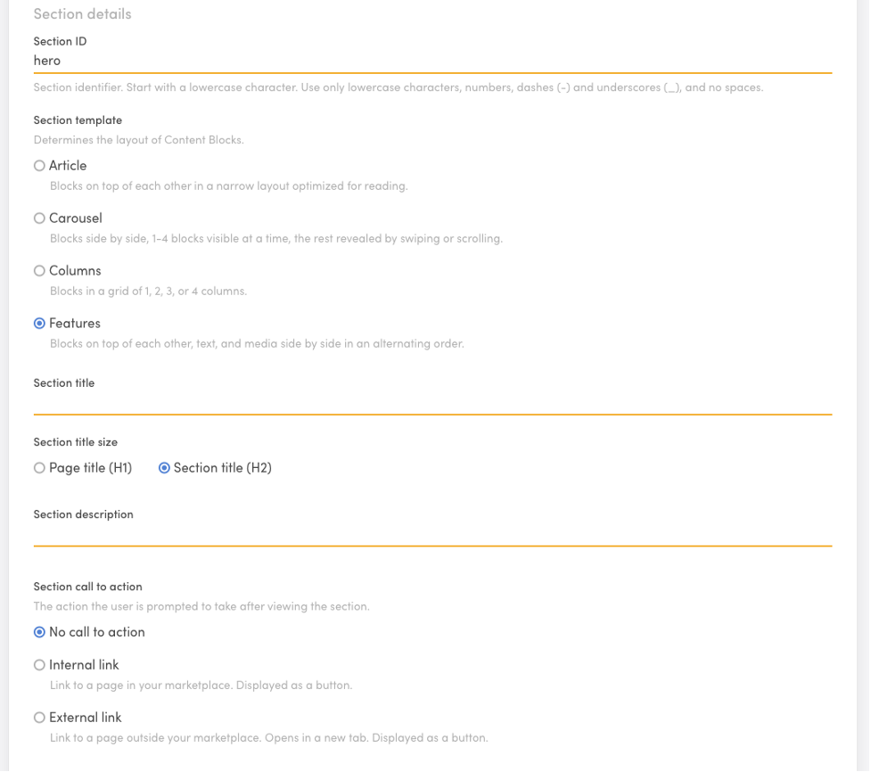
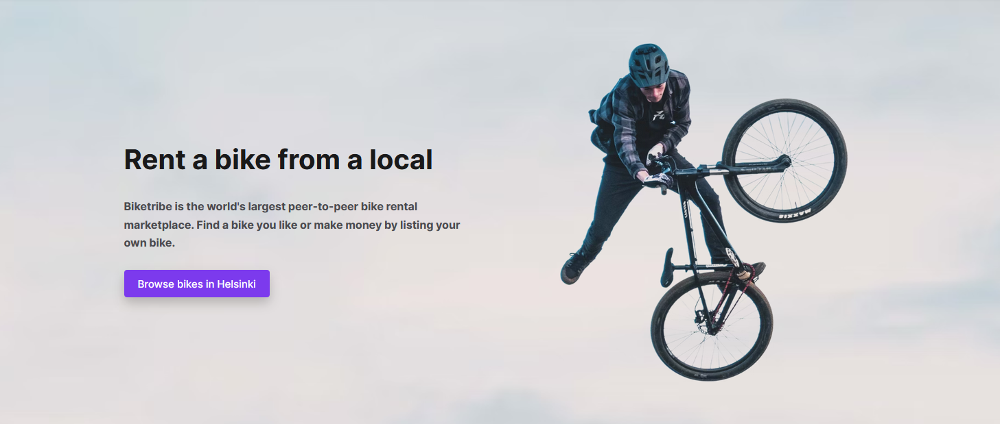
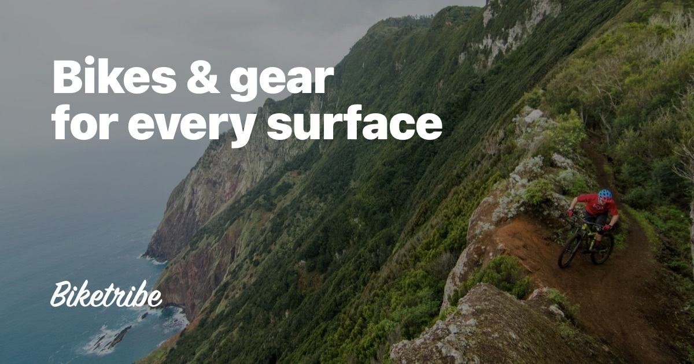

To customize the landing page and construct additional pages, we'll take
advantage of Sharetribe's built-in Content Management System, Pages.
With Pages, you can edit your content pages like "About us", "How it
works", "Terms of use", and so on, or even create a simple blog. In this
tutorial, we will only work on your Landing page.

All your content pages can be modified under **Content → Pages**. Once
in Pages, Go to your landing page card and click on **“Edit content.”**

_Optional Tip: Before editing the content, click **“View page,”** which
will open the landing page on a separate tab. You can use this tab’s
refresh option in your browser and see changes after saving each
section._

Within the landing page edit page, you will encounter several sections.
You can add and remove sections according to your unique needs. In this
tutorial, we'll only make a few quick modifications to the existing
sections to build a landing page for our bike marketplace with a minimum
amount of work.

### 1. “hero” section

The first section of a landing page is typically called "Hero". It often
includes your main message, with the most important "call-to-action" (an
invite for a user to take a specific action by clicking a button, etc).
We'll keep this section, but it should be talking specifically about
bikes.

There are several settings we can keep intact.

- Don’t change Section ID. Don’t change the Section template selection
  (leave it as “Features”)
- Leave the section title and Section description empty. You will affect
  the look of this section through the section Block.
- Keep the default “No call to action” option.

The settings should look like this:

<extrainfo title="Hero section configuration">

</extrainfo>

We do want to change the background image though.

- In the Section appearance section choose “Custom” And add this image:

Then, let's change the text content. The hero section already has a
content block called "hero-block". Make the following changes:

- Replace the Image file for the file below. Leave the Aspect ratio and
  Image alt text as they are.
  [Download the image here](./flying_biker.png)
- Replace the Block title content for: “Welcome to Biketribe” and select
  Page title (H1) as the Block title size.
- Replace the Block text content for: write “We want to bring everyone
  access to any kind of bikes, while reducing the need to own a bike.
  That's better for the people and for the planet.”
- Change the Internal link text to “Browse bikes in Helsinki.” Leave all
  other call-to-action settings intact.

Save changes and check the current view on the “view page” tab you
opened earlier.

### 2. “locations” section

The next section, locations, can be used to link directly to locations
where you have or expect to have, the most listings. By default, the
section already contains some locations. We will use the pre-set
locations for this tutorial.

We'll only make a few minor changes to the text content:

- Change the Section Title to: “Find a bike anywhere”.
- Change the section description to “No matter where you are, we have
  the right bike for you.”

There's no need to change the Section call to action or the Section
appearance

Within the Content blocks, you will see there are 6 cities pre-set.
Within each city’s Content Block open the Block and alter the Block
text, and only the Block text. Insert the word “bikes”.

### 3. “how-it-works” section

Open the “how-it-works-for-customers” section. Change the section ID to
“how-it-works”. Replace or insert the word “Bike" in every appropriate
text of the section. You can change it in:

- Section title
- Section description
- Content blocks:
- Block titles
- Block texts

In Block 3 of the section, **“how-it-works-step-3”**, Change the Block
title for **“3. Start enjoying!”** and the Block text for: **“Use
Biketribe’s messaging system to iron out the details of the rental, and
prepare for an exciting experience!”**

### 4. Other sections

Remove all other sections from the Page editor.

Remember to “Save changes”

### 5. SEO & Social

At the top of the page editor, there's a tab "SEO & Social". It allows
you to set titles and descriptions for your page for search engines and
social media sites.

Add the following content:

- Page title: Biketribe - Find a bike everywhere
- Page description: The largest online community to find and rent a
  bike.
- Page title for social media: Find a bike everywhere
- Page description for social media: The largest online community to
  find and rent a bike.
- Social media image: Add the following image

Save changes.

### 6. Other static Pages

By default, your marketplace includes three other static content pages
that you should change before you launch: "About", "Privacy Policy", and
"Terms of Service". "About" is an optional page you can remove if you
don't need it. "Privacy Policy" and "Terms of Service" are mandatory to
have. Sharetribe provides a template for both pages. In addition to
these, you can add any number of other content pages.

We won't go through these pages in this tutorial. Now that you know how
to edit your landing page, you can use the same editor for the other
pages.

### Next: listing type

That's it for landing page! Next, it's time to start configuring how
listings in your marketplace work.
[Go to Step 4: Adjust listing type](/the-new-sharetribe/tutorial-listing-type/).
