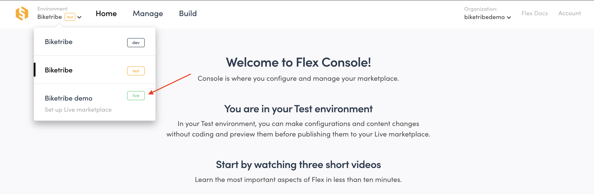
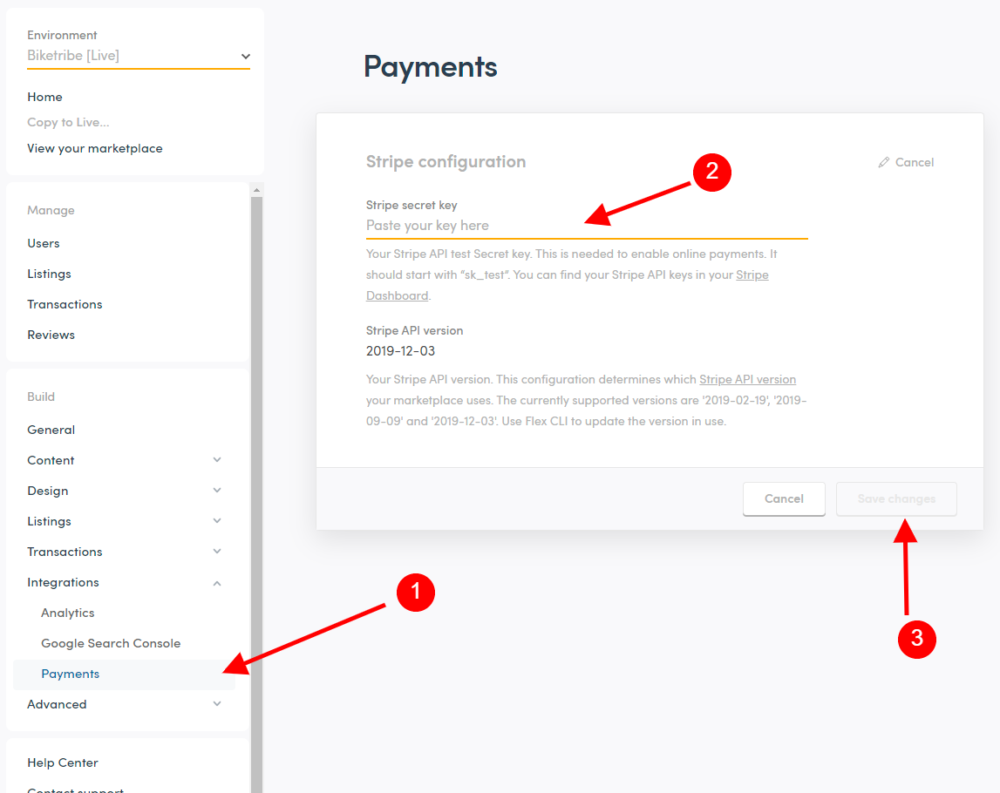
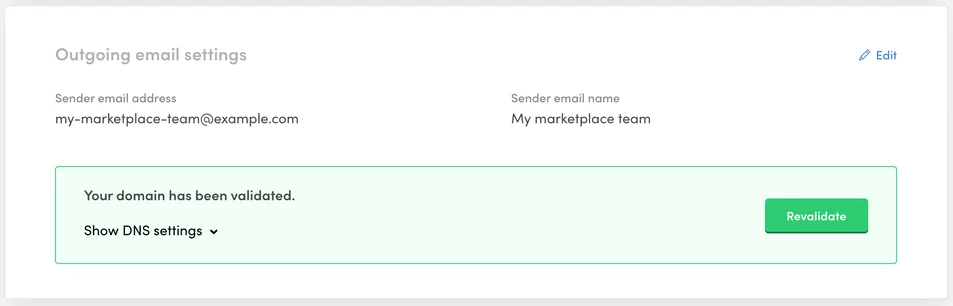
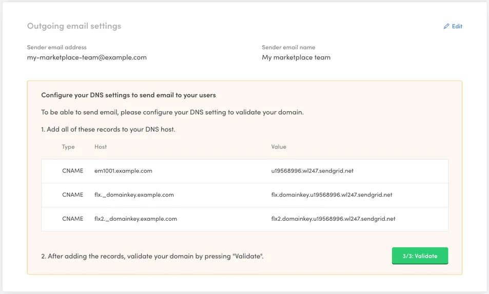
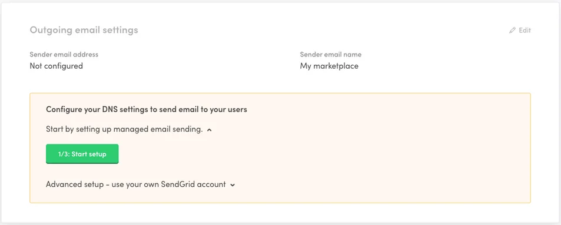

Once you are ready to bring the first users to your marketplace, you are
ready to go Live. Going Live unlocks the Live environment, where it is
possible to add real users and process transactions with real credit
card details.

Going Live takes several steps.

1. Subscription
2. Sharing information with Sharetribe about your custom domain,
   payments, analytics, and map provider
3. Configuring your custom domain
4. Sharetribe confirming your Live environment
5. Configure payments
6. Configure outgoing email address

This guide details how to complete each step.

# 1. Subscription

Go Live by subscribing to a paid plan. You can review different plans
and features available on the
[marketing site.](https://www.sharetribe.com/new-sharetribe/)

To subscribe, go to your
[Console.](https://flex-console.sharetribe.com/) Press your environment
dropdown menu in the top left and select “Go Live” Fill in your billing
information and submit.

# 2. Share information for setup with Sharetribe

After subscribing you will receive a confirmation email with your
invoice and billing information. The email also includes
[a link to this form](https://sharetribe.typeform.com/to/yKLsJryj) that
you should use to share information for setup with Sharetribe. If the
form is not working for you for some reason, please email us the
following information at hello@sharetribe.com.

Here is a list of the information that will be collected from you during
the setup process:

### Custom domain

Your Live marketplace will be accessible at a custom domain of your
choice. You must purchase, host, and configure your DNS settings with a
hosting provider in order to use a custom domain. You can use any
hosting provider, such as GoDaddy, Google Domains, or Hover.

During the setup process, please share with us your custom domain name.
You should also start
[configuring your DNS records with your hosting provider.](https://www.sharetribe.com/docs/the-new-sharetribe/going-live/#3-configure-your-custom-domain)
so that when we receive the information everything is ready for us to
set up your live environment.

Sharetribe provides a dedicated SSL certificate for your marketplace
address when your domain is connected to your marketplace.

### Stripe Publishable key

A marketplace-specific payment system called Stripe Connect powers
payments on your marketplace. Stripe Connect requires several setup
steps. Please consult
[our guide for help setting up your Stripe Connect.](https://www.sharetribe.com/docs/the-new-sharetribe/how-to-stripe)

After setup, you can find your Publishable key in
[Stripe->Developers->API keys.](https://dashboard.stripe.com/apikeys)
Share with us this key, which will look something like
_pk_live_somelongrandomvaluelikeVqFze9etc_.

You will configure your Secret key after Sharetribe confirms your Live
environment.

### Map provider public key

You need to select a map provider to power geolocation functionalities
on your marketplace, such as a location-based search for listings. Even
if customers use keywords to search, a map provider is necessary to let
your sellers input a pickup location if they want.

You can choose either Mapbox or Google Maps as a map provider. If you
are not sure where to start, we recommend Mapbox due to their generous
free tier.

**Mapbox**

[Sign up to Mapbox](https://account.mapbox.com/auth/signup/) and go to
the [account page.](https://account.mapbox.com/) Then copy the
<code>Default public token.</code>

If you wish to create a new one, click <code>+ Create a token</code>,
give it a name and make sure all Public scopes are selected. Create the
token and copy its value.

**Google Maps**

Go to the
[Google Maps JavaScript API V3 Reference](https://developers.google.com/maps/documentation/javascript/reference),
and click on the "Get started" button in the top bar, and follow the
instructions to generate your key. Share this key with Sharetribe.

Next, you must enable certain capabilities within Google Maps.Follow the
instructions in the
[Getting started](https://developers.google.com/maps/documentation/javascript/places#GetStarted)
section of the Places library documentation to enable using the required
services. You should enable: Google Places API Web Service ("Places API"), Maps Static
API, and Maps JavaScript API.

### Google Analytics

Google Analytics lets you browse and analyze lots of data, such number
of visitors, pages viewed, time spent on your marketplace, traffic
sources, and more. Sharetribe has built-in support for Google Analytics.
Google Analytics is free to use.

Using Google Analytics is optional. If you want to use Google Analytics,
you need to share your Google Analytics measurement ID with Sharetribe
during the setup process. You can always setup Google Analytics at any
point later by sharing the measurement

You can generate this ID by creating a Google Analytics account and
generating a <code>Measurement ID</code> It should look something like
"G-XXXXXX".

Note that we strongly recommend disabling the “Enhanced measurements”
feature in Google Analytics 4 as it can affect your marketplace’s
navigation.

# 3. Configure your custom domain

To connect your custom domain to your marketplace, you must configure
DNS records in your domain provider/hosting dashboard. You can host your
marketplace in any domain or subdomain as long as you own the domain.
Sharetribe strongly recommends hosting your marketplace in a www (or
other) subdomain and having your root (main) domain, if needed, as a
redirect. The Sharetribe team can set one redirect for you. This would
normally be from the root domain to your www subdomain.

<info>
If you are already using the domain you plan to use for your marketplace on another site, please contact support before making any DNS record changes. This will ensure a smooth transition and avoid unnecessary down time in your domain property. 
</info>

### Configure your subdomain DNS record: For **www** or any other subdomain.

Your subdomain records can be set to make your marketplace accessible at
any subdomain, the default option is "www", but there are other options
possible like "listings", or "marketplace", or "shop".
`www.myexampledomain.com` or `www.sharetribe.com` or
`marketplace-academy.sharetribe.com` are examples of subdomains. If you
are planning to also use your root domain for your marketplace, `www`
should be your main subdomain.

1. Look over the existing CNAME records.
2. If a CNAME record exists where "Host" or "Source" or "Name" is set to
   "www" or your desired subdomain, click edit and set "Points To" or
   "Value" or "Target" to `proxy.mysharetribe.com`.
   - Note that depending on the DNS provider you may need to add a
     period at the end: `proxy.mysharetribe.com.`
   - Note that the target address for this record,
     proxy.mysharetribe.com, should be copied as-is. You don't need to
     change it to your own marketplace's address.
3. If a CNAME record doesn't exist, click "Add record" or "Create
   record".
   - From the record type list, select CNAME.
   - Fill in the "Host" or "Source" to any subdomain you want to use,
     like "www" or "listings" or "marketplace" or "your-own-subdomain".
   - Set or fill the "Points To" or "Value" or "Target" field to
     `proxy.mysharetribe.com`.
   - If you have to fill a field named "TTL", set it to "3600".
   - Note that some domain providers use the entire subdomain address
     for the setup, instead of only the subdomain part, so instead of
     adding just `www` as the "Host" or "Source", you would need to add
     `www.myexampledomain.com`
   - Note that the target address for this record,
     `proxy.mysharetribe.com`, should be copied exactly as-is.
4. Save changes.
5. Check that the record has been updated or created according to your
   changes.

### Configure your root domain record

Your root domain is your base domain without “www”.
`myexampledomain.com` and `sharetribe.com` are examples of root domains.
The root domain should redirect to your main marketplace domain if you
are using a `www` subdomain. You normally don't need to set the root
domain DNS record if you are not planning to use "www" as your main
(sub)domain, sou can ignore this instructions if you are going to use a
subdomain other than "www".

1. Look over any existing A records
2. If an A record exists for your root domain, you need to modify the
   address and point it to Sharetribe's IP address instead:
   `34.248.140.98`
   - In many domain providers your root domain is set via the `@` sign,
     if you have any A type record with a "Host" or "Source" or "Name"
     set to `@`, edit the record and set "Points To" or "Value" or
     "Target" to `34.248.140.98`
   - Some domain providers, use the entire domain instead of just the
     `@` sign. In those providers, you should look for and modifyt an A
     type record with your entire domain (and without any subdomain
     attached to it). For example `myexampledomain.com`.
3. If an A record doesn't exist, click "Add record" or "Create record".
   - From the record type list, select A.
   - For most domain providers in order to create a record, you need to
     set the "Host" or "Source" or "Name" to `@`.
     - Set the "Points To" or "Value" or "Target" to `34.248.140.98`
   - If you have to fill a field named "TTL", set it to "3600".
   - Note that in some domain providers, instead of setting the record
     via the `@` sign, you need to write the entire domain.
4. Save changes.
5. Check that the record has been updated or created according to your
   changes.

<info>
If you have any questions setting your DNS records, we recommend contacting your domain provider's support team and sharing this instructions. Most domain provider's teams are super familiar with helping with DNS record changes for third party tools (as it is quite a common request). The Sharetribe team is of course happy to help always, but have no access to your DNS configurations. 
</info>

# 4. Sharetribe confirms your Live environment

After submitting your details, Sharetribe will set up your Live
environment. Sharetribe typically turns around your marketplace in 24
hours during business days, often less. Follow instructions carefully to
prevent any delays during setup.

# 5. Configure payments

Navigate to your new Live environment using the environment drop down
menu. Then, add your Stripe live key to your Flex Console. Find this key
where you got your public key or follow our instructions for more
information. It should look like
_sk_live_somelongrandomvaluelike0Rx3jvetc_

Paste your live key in Console->Build->Payments and save changes.

# 6. Configure outgoing email address

The final step is configuring your outgoing email settings. This setup
will ensure your emails are branded with your marketplace name and
sender address as well as help ensure reliable email delivery.

Navigate to Console->Build->General to complete this setup.

### Add sender name and address

Under “Outgoing email settings”, click on the "1/3 Start setup" button
to start the setup. Follow the instructions in the UI.

When you have added your sender email information, you will be prompted
with DNS information.

### Configure email DNS

Next, you need to add the generated records from your Console to your
DNS hosting. This is an important step for your sender reputation and
your email deliverability. You should add all the records in the table
visible in Console.

[These DNS provider video tutorials](https://sendgrid.com/docs/ui/account-and-settings/dns-providers/)
by SendGrid might be useful if you are not sure how to configure the DNS
records for your specific DNS provider.

### Validate email DNS

When you have configured your email DNS records, you still need to
validate the records for your emails to work. You can do that by
clicking on the "3/3 Validate" button in Console. If everything is set
up correctly, you should see a success message in Console.

Whenever you change your DNS records, you can revalidate to check that
everything is set up correctly.

Voila! You’re Live and fully functional!
