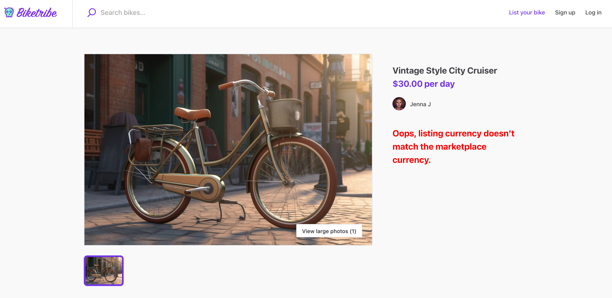
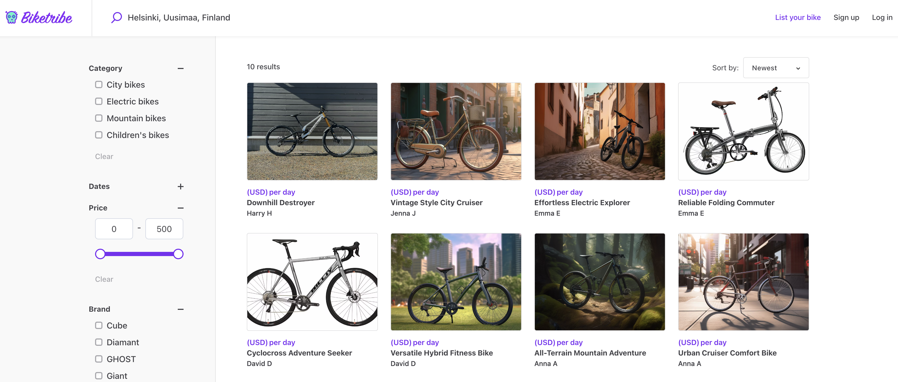
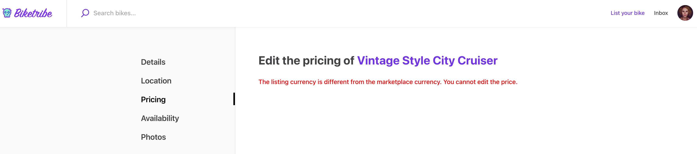

The New Sharetribe currently supports the following currencies: 

- AUD
- CAD
- EUR
- GBP
- NZD
- SGD
- USD

The marketplace currency can only be changed by a member of the Sharetribe team. If you wish to change your currency, please send us an email at help@sharetribe.com or a message through the chat widget in your Console, and let us know which currency you would like to use.

## What happens when the currency is changed

After the Sharetribe team enables your new currency, you must address listings on your marketplace that use your old currency. You or your users should close listings created with the old currency and create new listings with the new currency. 

The most common scenario is that you will only need to deal with pre-created test listings from Sharetribe or any test listings you created yourself in the Test environment. 

Let's consider an example: you started building your marketplace in the Test environment and Sharetribe just changed your marketplace currency GBP per your request. The pre-created test listings, and any listings you might have already created, will now display an error message. 

_error message displayed after currency is changed._

Moreover, the numeric price of these old listings will be replaced by the currency letters in the search page. 

_currency in listing homepage._

Finally, it will not be possible to update the price of the old listing.

_editing listing price after currency change._

To complete your currency change, you should close or delete the existing listings from your Console. Then, in your hosted marketplace application, you should create a new listing using a test user account [or login as an existing user](https://www.sharetribe.com/docs/the-new-sharetribe/login-as-user/). This new listing will display the price in GPB throughout your marketplace (on the listing page, search page, and listing creation page). 

If you are changing your currency and you have a Live environment, deleting and re-creating listings might not be a viable option. You can reach out to us at help@sharetribe.com and we will help you figure out a solution.

## How can my marketplace support payments in multiple currencies

Your marketplace displays a single currency by default, but your payment system is capable of processing many different currencies. Therefore, buyers from all over the world can purchase listings even if their currency does not match the seller’s currency. Stripe, the payment processor, converts currencies automatically in this case. 

If you would like to display multiple currencies in your marketplace, including capabilities like letting sellers choose the currency they offer their listing in or letting buyers choose which currency they see, then you will need to extend your platform with custom code. The fastest way to extend with custom code if you are not a developer yourself is to hire  verified Sharetribe developer directly in via the [Expert directory](https://www.sharetribe.com/experts/) or by getting recommendations from Sharetribe via [a call](https://calendly.com/the-new-sharetribe-pilot-discussions/onboarding-feedback).