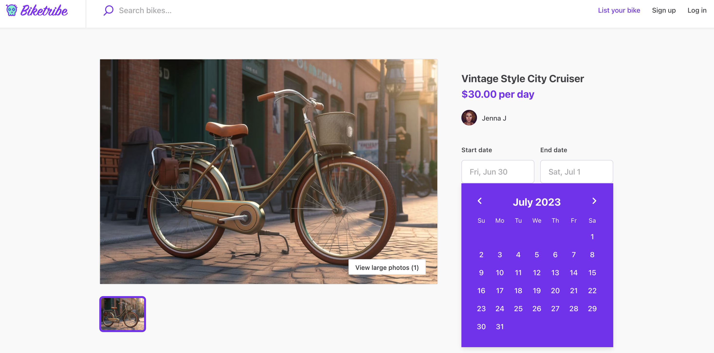
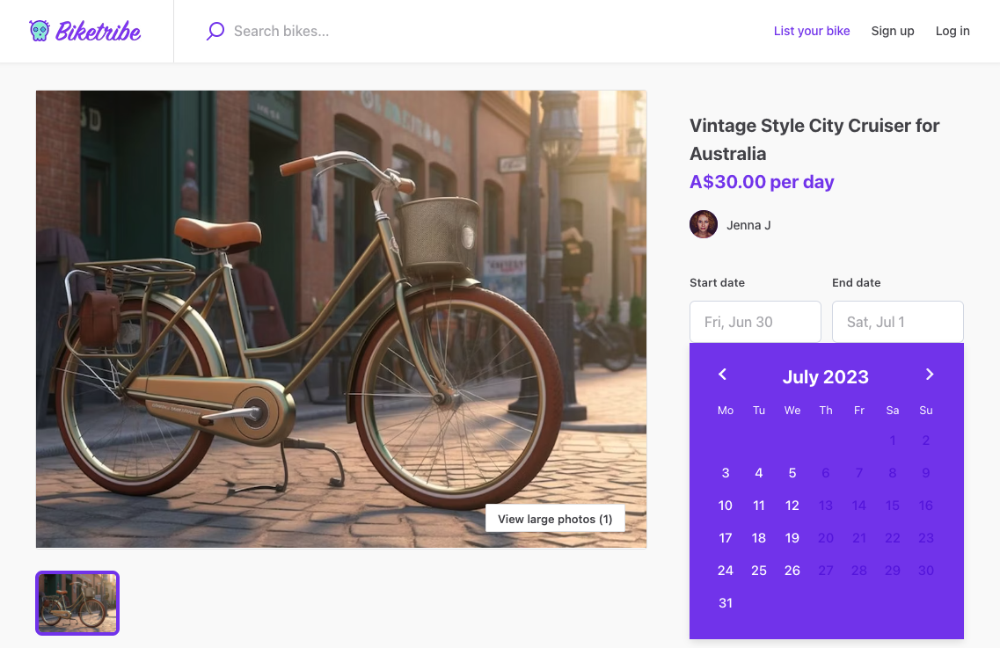

The New Sharetribe currently supports English as the marketplace language. Within the English language, there are several versions that the new Sharetribe supports, including:

- English - Australia
- English - Canada
- English - Ireland
- English - New Zealand
- English - Singapore
- English - United Kingdom
- English - United States

Furthermore, you have the flexibility to customize the first day of the week to either Monday or Sunday. This change will be reflected in the calendar used for booking and availability management. You can learn more about the availability management using the calendar [in this article](https://www.sharetribe.com/docs/the-new-sharetribe/default-availability-management-options).

## What happens when you change your English locale? 

By default, the starting locale of the marketplace is set to English - US.

When you change your locale to a different version of English, it impacts how the currency is displayed next to the listing price. Let's take a look at an example to illustrate this:

In the English - United States locale, the currency is displayed using only the symbol (“$”), as shown below:

_Locale in English - United States, Sunday first day of the week._

However, in the English - Australia locale, the currency is displayed using a combination of letters and a symbol “A$”. Note that the [currency was also changed in this marketplace](https://www.sharetribe.com/docs/the-new-sharetribe/supported-currencies) to Australian Dollars.

_Locale in English - Australia, Monday first day of the week._

By changing your locale, you can ensure that the currency is presented in the appropriate format for your target audience.

In some cases, you may also want to implement words, spelling and grammar conventions specific to your version of English, for example, if you’re using the British English convention. For that, you can use the Microcopy Editor to modify the texts displayed on your marketplace. You can learn more about the Microcopy Editor in [this article](https://www.sharetribe.com/docs/the-new-sharetribe/how-to-use-microcopy-editor/).

## How to change the marketplace locale

Currently, the locale can only be changed by a member of the Sharetribe team. If you wish to change your marketplace locale and/or  first day of week setting, please send us an email at help@sharetribe.com or a message through the chat widget in your Console and let us know:

  1. What locale you would like to use (from the list above)
  2. What should be the first day of the week (Monday or Sunday)