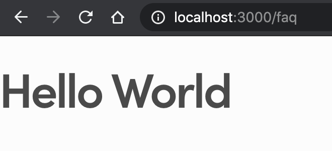
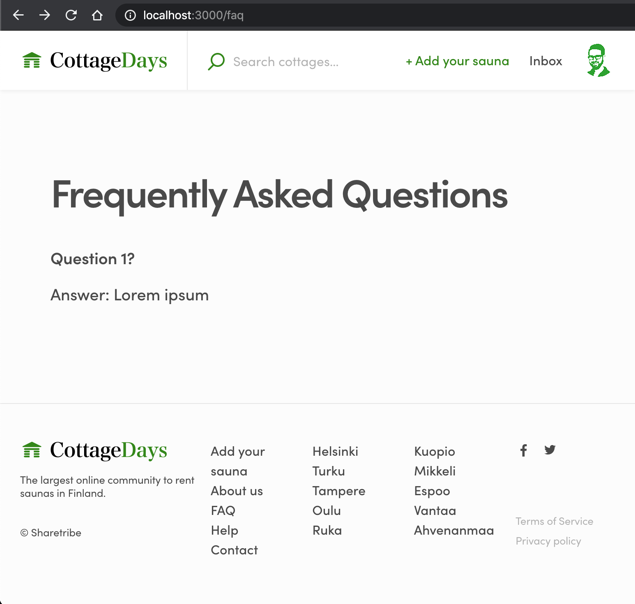

One common task, before our newly branded FTW-daily customization is
ready to be published, is to add pages that describe the marketplace
features more deeply. We call them static pages because those pages
don't need to fetch data (e.g. listing entities) from API. They just
render text and images.

In this tutorial, we create a _FAQPage_ component for the frequently
asked questions.

## Hello world

All the page-level components are located in the _src/containers_
directory:

```shell
└── src
    └── containers
```

The word _"container"_ comes from Redux vocabulary. In FTW templates,
page-level components are actually Redux containers. However, we don't
need to worry about that since static pages don't really need to deal
with Redux data flow.

To create a simple page component, we create a new directory called
`FAQPage` and also add the main component file there (called
`FAQPage.js`). FTW templates follow a convention where the main file in
a component directory has always the same name as the directory itself.

```shell
└── src
    └── containers
        └── FAQPage
            └── FAQPage.js
```

Let's create a simple React component to that file:

```jsx
import React from 'react';

const FAQPage = () => {
  return <h1>Hello World</h1>;
};

export default FAQPage;
```

So, the _FAQPage_ component is exported there and could be imported
directly from that file:

```js
import FAQPage from '../../containers/FAQPage/FAQPage';
```

## Routing

Now that the initial page component is created, we could try to check
how it looks. To make that possible, we need to add a route to that
page.

FTW templates have route configuration defined in a file
_routeConfiguration.js_:

```shell
└── src
    └── routeConfiguration.js
```

<extrainfo title="FTW-product has routeConfiguration.js file in a different location">

```shell
└── src
    └── routing
        └── routeConfiguration.js
```

</extrainfo>

First we need to import _FAQPage_:

```js
const FAQPage = loadable(() =>
  import(
    /* webpackChunkName: "FAQPage" */ './containers/FAQPage/FAQPage'
  )
);
```

And then we need to add the actual configuration. Find
`routeConfiguration` variable and add the following piece of
configuration there:

```js
    {
      path: '/faq',
      name: 'FAQPage',
      component: FAQPage,
    },
```

<extrainfo title="Show a larger context">

```js
const routeConfiguration = () => {
  return [
    {
      path: '/',
      name: 'LandingPage',
      component: LandingPage,
    },
    {
      path: '/about',
      name: 'AboutPage',
      component: AboutPage,
    },
    {
      path: '/faq',
      name: 'FAQPage',
      component: FAQPage,
    },
    // etc.
  ];
};
```

</extrainfo>

So, the **path** to that page will be `/faq`, **name** is used for
in-app linking, and then we tell the app to render **component** called
_FAQPage_, when the path is accessed. You can read more about routing
from the article:
[How routing works in FTW](/ftw/how-routing-works-in-ftw/)

After the routeConfiguration.js has been updated, you should see plain
"Hello World" heading on that page:



## Static page and layout

"Hello World" text is a good start, but we should also add common
components and some layout for the FAQ page. Let's continue to improve
FAQPage component:

```shell
└── src
    └── containers
        └── FAQPage
            └── FAQPage.js
```

Let's add some more content to the FAQPage:

```jsx
import React from 'react';
import {
  LayoutSingleColumn,
  LayoutWrapperTopbar,
  LayoutWrapperMain,
  LayoutWrapperFooter,
  Footer,
} from '../../components';

import StaticPage from '../../containers/StaticPage/StaticPage';
import TopbarContainer from '../../containers/TopbarContainer/TopbarContainer';

import css from './FAQPage.module.css';

const FAQPage = () => {
  // prettier-ignore
  return (
    <StaticPage>
      <LayoutSingleColumn>
        <LayoutWrapperTopbar>
          <TopbarContainer />
        </LayoutWrapperTopbar>

        <LayoutWrapperMain className={css.mainWrapper}>
          <h1>Frequently Asked Questions</h1>

          <div>
            <h3>Question 1?</h3>
            <p>Answer: Lorem ipsum</p>
          </div>
        </LayoutWrapperMain>

        <LayoutWrapperFooter>
          <Footer />
        </LayoutWrapperFooter>
      </LayoutSingleColumn>
    </StaticPage>
  );
};

export default FAQPage;
```

Here we use **StaticPage** wrapper that provides some basic
functionality for the page. Inside it, we use **LayoutSingleColumn**
component, which uses 3 child components: _LayoutWrapperTopbar_,
_LayoutWrapperMain_, _LayoutWrapperFooter_.

**TopbarContainer** is a special Redux container component. Among other
things, it uses the current user's info from Redux store to show his/her
avatar image. **Footer** component is a purely presentational
component - so, it's imported from _components_ directory.

The main content is added as a child to _LayoutWrapperMain_ component.

In addition, we have imported "css" object from FAQPage.module.css file.
You can create that file with the following content:

```css
.mainWrapper {
  width: calc(100% - 48px);
  max-width: 720px;
  margin: 24px auto;

  @media (--viewportMedium) {
    max-width: 650px;
    width: calc(100% - 72px);
    margin: 72px auto 36px auto;
  }
}
```

After that the page should start to look like a proper page:



> **Tip**: If you have lots of questions on FAQPage, you might want to
> create an Accordion component so that users can open and collapse the
> answer for each question.

## Page schema

One final touch to the page component is to add page schema to it.

Previously, we mentioned that Flex search engine needs to understand
extended data keys and we added schema to **amenities** public data key.
Page schema is different, but a similar concept. It is not added for the
Flex listing queries but website search engines (e.g. Google and
DuckDuckGo). You can read more about website schema from
[schema.org](https://schema.org/).

_StaticPage_ component can take 2 props that help with this search
engine optimization (SEO). **Title** is pretty self-explanatory: it's
used to overwrite the default `<title>` tag in the `<head>` section of
the generated HTML page.

The second property (**schema**) takes in JSON-LD type of content. Here,
we state that this page is actually of type "FAQPage" in the context of
schema.org vocabulary and we also add _name_ and _description_ for it.

In addition, we could actually describe all the questions and answers to
search engines too. This can be done through `mainEntity` key. Check
[Google's developer docs](https://developers.google.com/search/docs/data-types/faqpage)
for more information about this.

```js
  return (
    <StaticPage
      title="Frequently Asked Questions"
      schema={{
        "@context": "http://schema.org",
        "@type": "FAQPage",
        "description": "Frequently asked questions in CottageDays marketplace.",
        "name": "Frequently Asked Questions",
        "mainEntity": [
          {
            "@type": "Question",
            "name": "Question 1?",
            "acceptedAnswer": {
              "@type": "Answer",
              "text": "Answer: Lorem ipsum"
            }
          }
        ]
      }}
    >
```

<extrainfo title="How can I test page schema?">

The next article describes how you can get the site available online
through Render. After that, you can test if Google's
[schema debugger](https://search.google.com/structured-data/testing-tool)
finds any schema errors from your page.

Alternatively, you could find text `<script type="application/ld+json"`
from the `<head>` section of the generated HTML and test its content as
a code snippet through the debugger.

</extrainfo>

## Add a link to the new page

```shell
└── src
    └── components
        └── Footer
            └── Footer.js
```

Currently, we have a FAQ link in Footer component that just leads to
LandingPage:

```jsx
<li className={css.listItem}>
  <NamedLink name="LandingPage" className={css.link}>
    <FormattedMessage id="Footer.toFAQPage" />
  </NamedLink>
</li>
```

**NamedLink** component creates an in-app link to the page with the same
**name** in the _routeConfiguration.js_ file as what's defined in its
props. If we just change that to "FAQPage", the link goes to our new
page:

```jsx
<li className={css.listItem}>
  <NamedLink name="FAQPage" className={css.link}>
    <FormattedMessage id="Footer.toFAQPage" />
  </NamedLink>
</li>
```

---

After all these changes, the client app starts to look like CottageDays
marketplace. It's time to get it online and share it with people who
could give you some feedback. In the next article, we'll deploy the app
to Render.<br /> [› Go to the next article](/tutorial/deploy-to-render/)
