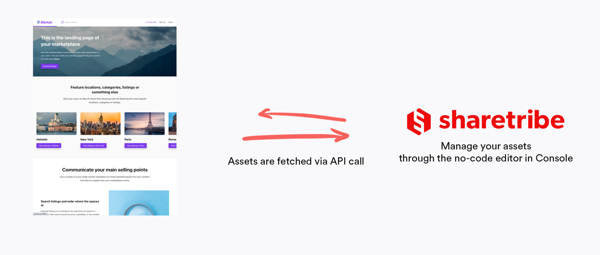
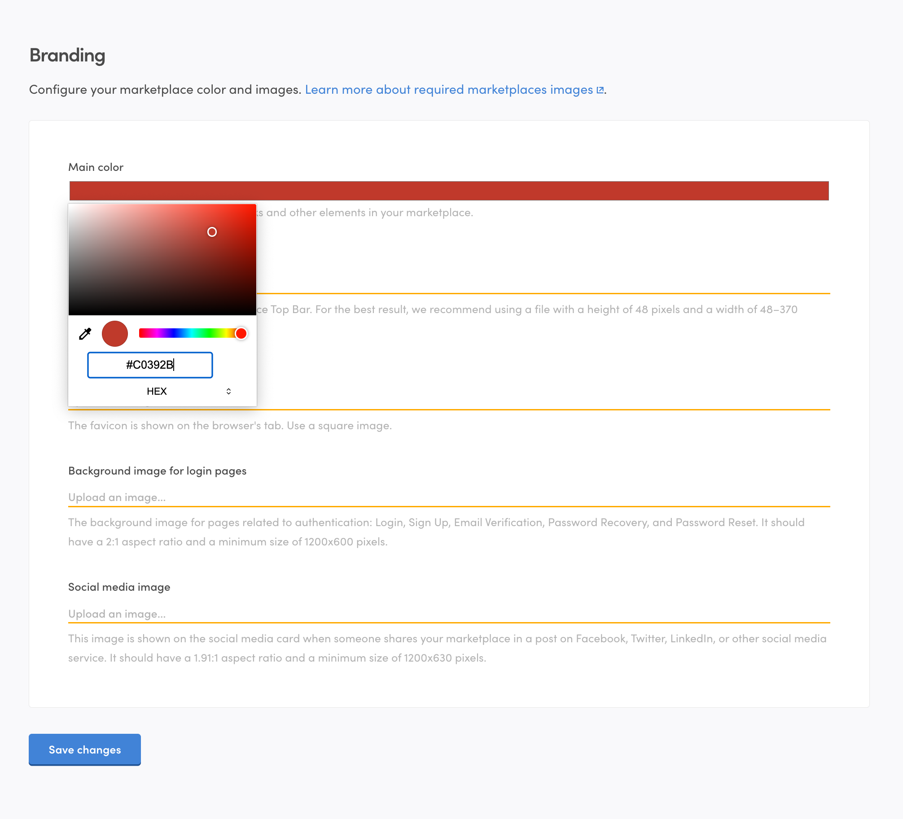

In this tutorial, you will learn how to configure your marketplace's
brand color and images. By following these steps, you will be able to
update your marketplace's colour, logo, favicon, background image for
login pages, and social media image using the no-code editor in Console.

## What are hosted assets

You can modify your marketplace's visual assets using
[Console](https://flex-console.sharetribe.com/design/brandin). The
Console allows non-technical users to manage and edit visual assets like
logos and favicons without touching code. Once you have uploaded the
assets through the Console, the template app uses an API call to
retrieve and fetch these assets. Our documentation refers to these
assets as **hosted assets**.

The template app follows a headless architecture, which decouples the
front-end presentation layer from the back-end functionality.
Specifically, the headless architecture separates the Console, where
non-technical users manage and edit visual assets, and the template app
itself. This separation means that the visual assets can be modified and
updated without directly touching or modifying the underlying code of
the template app.

For a more technical reference, see our
[API documentation on our Asset Delivery API](https://www.sharetribe.com/api-reference/asset-delivery-api.html).

## Choose your marketplace color

Using the Console, you can define a primary color for your marketplace.
This color is used to generate light and dark variants throughout your
marketplace. The darker and lighter color variants are used for effects
like color changes when the cursor hovers over a button.

Let's use a bright red for our Sauna themed marketplace. We'll use the
hex color `#c0392b`. You can change the color of your marketplace by
navigating to **Build** > **Content** > **Branding** in
[Console](https://flex-console.sharetribe.com/design/branding) and
clicking on the color picker. You can cycle the different colour input
options between RGB, HSL and HEX by clicking on the color picker.

## Upload your marketplace logo and favicon

Next, we will want to change the marketplace logo. For your Sauna themed
marketplace, you can use the following logo:

In addition to the logo, you can download the
[favicon here](./favicon.ico).

Upload the logo file and favicon using the interface in Console. For
more information on best practices and ensuring that your logo images
and favicons look good, read our article on
[how to add good looking logo and images](/operator-guides/how-to-add-good-looking-logos-and-images/).

## Upload a background image and social media image

As the final step, you'll need to choose a background image for your
marketplace. You can see this background image in various components as
the background for modals, popups and login pages. You can think of this
image as a backdrop that reinforces your marketplace's branding. You can
use the following image as the background image:

In addition to the background image, you'll upload a social media image.
This image is shown on the social media card when someone shares your
marketplace in a post on Facebook, Twitter, LinkedIn, or another social
media service.

## Summary

In this tutorial, you learned how to configure your marketplace's brand
color and images using the no-code editor in Console. By following the
steps outlined, you can easily update your marketplace's primary color,
logo, favicon, background image, and social media image, ensuring a
cohesive and visually appealing experience for your users.

To read more about best practices regarding visual assets and how to
make your images look good, read more in our article on
[how to add good looking logos and images](/operator-guides/how-to-add-good-looking-logos-and-images/).
