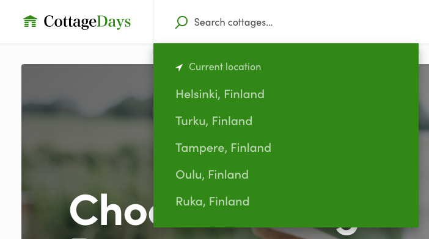
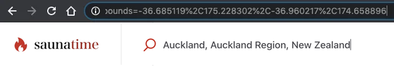
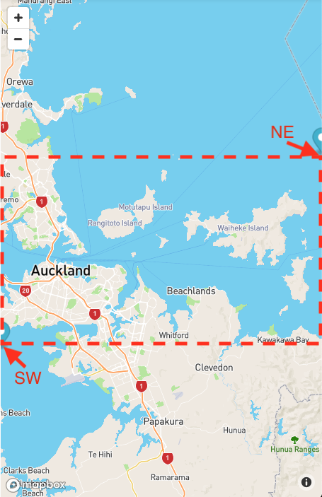
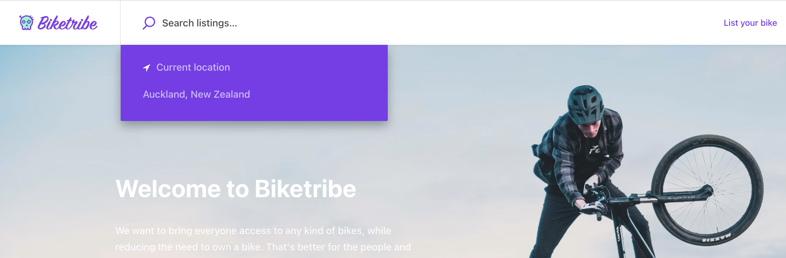

When you make a location search, you notice that the template suggests
the user's current location by default. In addition, you can configure
default searches for certain key locations in your marketplace.



Default locations improve UX, since users don't need to type anything
and they guide users to the most popular locations in your marketplace.

In addition to current location, we want to help users find listings in
specific locations. Let's add a suggestion: _"Auckland, New Zealand"_.

## Change configDefaultLocationSearches.js

The component, that actually makes geocoding calls to the map providers
geocoding API, is called _LocationAutocompleteInput_. However, the
default locations are actually set in a file called
_configDefaultLocationSearches.js_:

```shell
└── src
    └── config
        └── _configDefaultLocationSearches.js
```

In that file you can see example locations, in comments, listed inside
an array returned as default export:

```js
const defaultLocations = [
  // {
  //   id: 'default-helsinki',
  //   predictionPlace: {
  //     address: 'Helsinki, Finland',
  //     bounds: new LatLngBounds(new LatLng(60.29783, 25.25448), new LatLng(59.92248, 24.78287)),
  //   },
  // },
  // the rest of the default locations.
];

export default defaultLocations;
```

There are two strings (_id_ and _address_) that are pretty easy to
change, but it also contains a _bounds_ object. This bounds object
contains two LatLng coordinates (NE, and SW) which create a bounding box
for the area that will be shown on the _SearchMap_ component.



If you search for Auckland and check the URL it generates, you find the
value of **bounds** parameter from there too. It should be something
like `-36.685119%2C175.228302%2C-36.960217%2C174.658896` and when you
URL decode that string it gives
`-36.685119,175.228302,-36.960217,174.658896`.

The first two values are the north-east corner of the search area (aka
bounding box) and the last two coordinates are south-west corner. The
map component will find a zoom-level that fits the specified bounding
box inside its current viewport. So, it actually shows a little bit
bigger area than what the bounding box states.

In the next screenshot, the search map has a narrow aspect ratio.
Therefore, the bounding box for Auckland takes the whole width, but not
the whole height:



We could manually change this bounding box a bit. Let's use **-36.545,
175.298** for _NE_ and **-37.047, 174.498** for _SW_.

Then we can just uncomment the first default location, 'Helsinki', and
change it to point to Auckland:

```js
{
  id: 'default-auckland',
  predictionPlace: {
    address: 'Auckland, New Zealand',
    bounds: new LatLngBounds(new LatLng(-36.545, 175.298), new LatLng(-37.047,174.498)),
  },
},
```

The result should look like this:



You can add other locations in a similar fashion.

## Other hard-coded links with a location search

There are hard-coded links to search page from other components too.
Check at least the **Footer** component.

<extrainfo title="Extra: adjust locations listed in Footer component">

```shell
└── src
    └── components
        └── Footer
            └── Footer.js
```

_Footer_ has hard-coded links to the search page. These links use
_NamedLink_ component, which just gets the full list of _search_ params:

```js
<NamedLink
  name="SearchPage"
  to={{
    search:
      '?address=Helsinki%2C%20Finland&bounds=60.2978389%2C25.254484899999966%2C59.9224887%2C24.782875800000056&origin=60.16985569999999%2C24.93837910000002',
  }}
  className={css.link}
>
  <FormattedMessage id="Footer.searchHelsinki" />
</NamedLink>
```

> **Note**: origin is an unnecessary search parameter with the default
> configuration of Sharetribe Web Template.

You also need to create a new microcopy key. E.g.
_'Footer.searchAuckland'_ and add it to the microcopy file.

  </extrainfo>

On the search page, you can use different kinds of filters. In the next
article, you will learn how to update listing attributes used on listing
creation page and search filters.<br />
[› Go to the next article](/tutorial/modify-listing-extended-data/)
