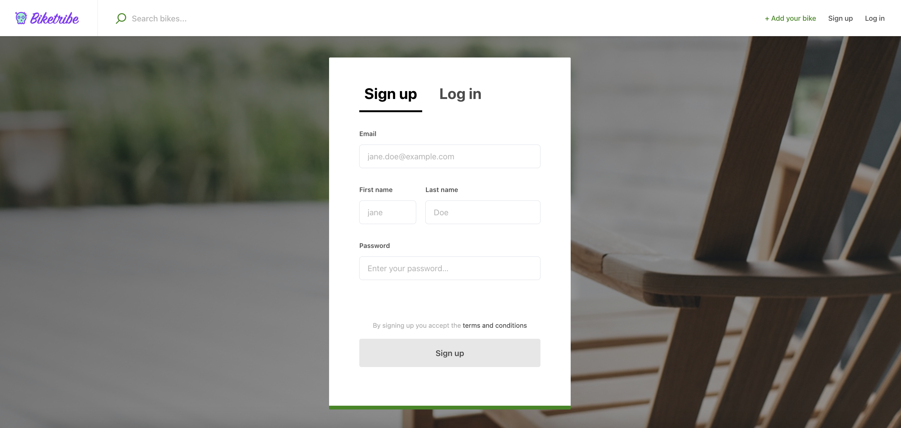
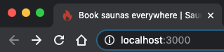
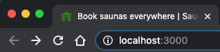

## Default background image

In the [previous step](/tutorial/first-edit/), you made changes to the
marketplaceDefaults.css file. This time you make changes to
propertySets.css. **`--backgroundImage`** variable can be found from
there. It is used to provide a background image for Hero component on
the landing page as well as some of the other pages: sing-up and log-in,
email verification etc.

```shell
└── src
    └── styles
        └── propertySets.css
```

```css
/* Full screen Background image located in root-folder/src/assets */
--backgroundImage: {
  /* Gradient direction and overlaying the black color on top of the image for better readability */
  background: linear-gradient(
      -45deg,
      rgba(0, 0, 0, 0.3),
      rgba(0, 0, 0, 0.6)
    ), url('../../assets/background-1440.jpg');

  /* Add loading color for the div */
  background-color: var(--matterColor);

  /* Cover the whole screen with the background image */
  background-size: cover;

  /* Align the image within the container */
  background-position: center center;

  @media (--viewportLarge) {
    border-radius: 40px;
    border: solid 36px var(--matterColorBright);
  }
}
```

That **background** styling-rule refers to _background-1440.jpg_ image
in the _assets_ directory:

```shell
└── src
    └── assets
        └── background-1440.jpg
```

So, to change it, we could just save a different image as
'background-1440.jpg' to replace the default background image (or you
can add a new image and then change the filename in `--backgroundImage`
property set). The image should be 1440 pixels wide so that it doesn't
look bad on retina displays.

Here's an image, we used in this tutorial:<br />
[Summer house by Markus Spiske (cropped)](/tutorial-assets/markus-spiske-summer-house-unsplash.jpg)



## Images for social media

In the same _assets_ directory, there are a couple of other images that
you should also pay attention to:

```shell
└── src
    └── assets
        ├── background-1440.jpg
        ├── saunatimeFacebook-1200x630.jpg
        └── saunatimeTwitter-600x314.jpg
```

These images (**saunatimeFacebook-1200x630.jpg** and
**saunatimeTwitter-600x314.jpg**) are used by social media sites to
generate previews when your marketplace is shared in their platforms.

The default content is Saunatime branded so these images should be
changed too:


Here are two image files you could use in the context of this tutorial:

- [Facebook sharing preview graphics](/tutorial-assets/cottagedays-facebook-1200x630-by-markus-spiske.jpg)
- [Twitter sharing preview graphics](/tutorial-assets/cottagedays-twitter-600x314-by-markus-spiske.jpg)

**Steps to follow**:

1. Save those files to the assets directory
1. Find all the modules where _saunatimeFacebook-1200x630.jpg_ and
   _saunatimeTwitter-600x314.jpg_ are imported. There should be 2 files:
   - _src/components/Page/Page.js_
   - _src/containers/LandingPage/LandingPage.js_<br /> (This is an
     example of how to overwrite default sharing images per page.)
1. Change the imported asset files

<extrainfo title="Extra: how to test social media sharing?">

You can use online debuggers to check how your social media sharing
previews look like. However, the app needs to be available from the
public internet before you can use these tools:

- [Facebook sharing debugger](https://developers.facebook.com/tools/debug/)
- [Twitter card validator](https://cards-dev.twitter.com/validator)

> **Note**: You could deploy the app to Heroku to test these tools. We
> will cover [Heroku deploys](/tutorial/deploy-to-heroku/) later in this
> tutorial.

</extrainfo>

## Favicon and app icons

There's also a second type of generic image assets: favicon and other
app icons:

```shell
└── public
    └── static
        └── icons
            ├── android-chrome-192x192.png
            ├── android-chrome-512x512.png
            ├── apple-touch-icon.png
            ├── browserconfig.xml
            ├── favicon-16x16.png
            ├── favicon-32x32.png
            ├── favicon.ico
            ├── map-marker-32x32.png
            ├── mstile-150x150.png
            └── safari-pinned-tab.svg

```

The default favicon of FTW-daily template, Saunatime, is a flame icon:



To change it, we need to have favicon files - or if you have a square
logo available, you can follow
[this guide article](/ftw/how-to-change-ftw-icons/) to generate
those icons.

In the context of this tutorial, we just show how to change the
favicons. You can use these files:

- [favicon.ico](/tutorial-assets/favicon.ico)
- [favicon-16x16.png](/tutorial-assets/favicon-16x16.png)
- [favicon-32x32.png](/tutorial-assets/favicon-32x32.png)

Then go to _public/static/icons/_ directory and replace the current
_favicon\*_ files with the new ones. After those files have been saved,
you should see a new favicon in the browser's tab:



There's one obvious Saunatime image still visible on top bar: Logo. It's
time to change that.<br />
[› Go to the next article](/tutorial/change-logo/)
