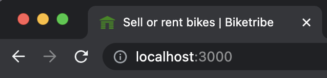

## Default background image

In the [previous step](/tutorial/first-edit/), you made changes to the
brand configurations in the configBranding.js file. You will continue
making changes in that same file.

```shell
└── src
    └── config
        └── configBranding.js
```

The **brandImage** configuration is used to provide a background image
for the Hero component on several pages.

```js
import brandImage from '../assets/biketribe-brandImage-1500.jpg';
...
// brandImageURL is used as a background image on the "hero" section of several pages.
// Used on AuthenticationPage, EmailVerificationPage, PasswordRecoveryPage, PasswordResetPage etc.
// NOTE: Those pages use ResponsiveBackgroundImageContainer component,
//       it's possible to include more image variants to make image fetching more performant.
export const brandImageURL = brandImage;
```

So, to change the background image, we could just save a different image
as 'biketribe-brandImage-1500.jpg' to replace the default background
image (or you can add a new image and then change the filename of the
`brandImage` import). The image should be at least 1440 pixels wide so
that it doesn't look bad on retina displays.

Here's an image that we used in this tutorial:<br />
[Summer house by Markus Spiske (cropped)](/tutorial-assets/markus-spiske-summer-house-unsplash.jpg)

```diff
- import brandImage from '../assets/biketribe-brandImage-1500.jpg';
+ import brandImage from '../assets/markus-spiske-summer-house-unsplash.jpeg';
```

And this is how the authentication page looks with the new background
image:

// TODO take screenshot of AuthenticationPage once Biketribe branded
microcopy etc exists!


## Images for social media

In the same _assets_ directory, there are a couple of other images that
you should also pay attention to:

```shell
└── src
    └── assets
        ├── biketribe-brandImage-1500.jpg
        ├── biketribe-facebook-sharing-1200x630.jpg
        └── biketribe-twitter-sharing-600x314.jpg
```

These images (**biketribe-facebook-sharing-1200x630.jpg** and
**biketribe-twitter-sharing-600x314.jpg**) are used by social media
sites to generate previews when your marketplace is shared in their
platforms.

The default content is Saunatime branded so these images should be
changed too:

// TODO: Change preview image to the Biketribe one


Here are two image files you could use in the context of this tutorial:

- [Facebook sharing preview graphics](/tutorial-assets/cottagedays-facebook-1200x630-by-markus-spiske.jpg)
- [Twitter sharing preview graphics](/tutorial-assets/cottagedays-twitter-600x314-by-markus-spiske.jpg)

**Steps to follow**:

1. Save those files to the assets directory
1. Change the imported asset files in **configBranding.js**

```diff
- import facebookImage from '../assets/biketribe-facebook-sharing-1200x630.jpg';
- import twitterImage from '../assets/biketribe-twitter-sharing-600x314.jpg';
+ import facebookImage from '../assets/cottagedays-facebook-1200x630-by-markus-spiske.jpeg';
+ import twitterImage from '../assets/cottagedays-twitter-600x314-by-markus-spiske.jpeg';
```

<extrainfo title="Extra: how to test social media sharing?">

You can use online debuggers to check how your social media sharing
previews look like. However, the app needs to be available from the
public internet before you can use these tools:

- [Facebook sharing debugger](https://developers.facebook.com/tools/debug/)
- [Twitter card validator](https://cards-dev.twitter.com/validator)

> **Note**: You could deploy the app to Render to test these tools. We
> will cover [Render deploys](/tutorial/deploy-to-render/) later in this
> tutorial.

</extrainfo>

## Favicon and app icons

There's also a second type of generic image assets: favicon and other
app icons:

```shell
└── public
    └── static
        └── icons
            ├── android-chrome-192x192.png
            ├── android-chrome-512x512.png
            ├── apple-touch-icon.png
            ├── browserconfig.xml
            ├── favicon-16x16.png
            ├── favicon-32x32.png
            ├── favicon.ico
            ├── mstile-150x150.png
            └── safari-pinned-tab.svg

```

The default favicon of the Sharetribe Web Template, Biketribe, is a
skull:

// TODO: Update text and image once microcopy exists


To change it, we need to have favicon files - or if you have a square
logo available, you can follow
[this guide article](/ftw/how-to-change-ftw-icons/) to generate those
icons.

In the context of this tutorial, we just show how to change the
favicons. You can use these files:

- [favicon.ico](/tutorial-assets/favicon.ico)
- [favicon-16x16.png](/tutorial-assets/favicon-16x16.png)
- [favicon-32x32.png](/tutorial-assets/favicon-32x32.png)

Then go to _public/static/icons/_ directory and replace the current
_favicon\*_ files with the new ones. After those files have been saved,
you should see a new favicon in the browser's tab:



There's one obvious Biketribe image still visible on top bar: Logo. It's
time to change that.<br />
[› Go to the next article](/tutorial/change-logo/)
