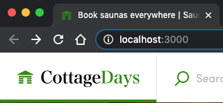
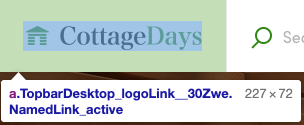

## Change Logo configuration

Components can be found from one of two directories:

- **containers**: Page-level components and TopbarContainer are
  [Redux container components](https://redux.js.org/basics/usage-with-react#presentational-and-container-components).
  These container folders also include all the forms and presentational
  components that are only used on that specific page.
- **components**: Shared presentational components that are used on
  multiple pages or in other components.

Logo is a presentational component and it can be found in the
**components** directory:

```shell
└── src
    ├── components
    │   └── Logo
    │       └── Logo.js
    ├── containers
    └── forms
```

The main component has the same name as the directory it lies:
Logo/Logo.js. If you open that file, you'll notice that logo images are
set in the same **configBranding.js** file as the previous changes.

```js
// NOTE: logo images are set in src/config/configBranding.js
const { logoImageDesktopURL, logoImageMobileURL } = config.branding;
```

You can use either PNG files or SVG files for the logo component. In
this tutorial, we'll use raster images (PNGs):

- [CottageDays mobile logo](/tutorial-assets/cottagedays-logo-small.png)
- [CottageDays desktop logo](/tutorial-assets/cottagedays-logo.png)

Save those files to the **src/assets** directory, and then change the
imports in **configBranding.js**:

```shell
└── src
    ├── assets
    └── config
        └── configBranding.js
```

```diff
- import logoImageDesktop from '../assets/biketribe-logo-desktop.png';
- import logoImageMobile from '../assets/biketribe-logo-mobile.png';
+ import logoImageDesktop from '../assets/cottagedays-logo.png';
+ import logoImageMobile from '../assets/cottagedays-logo-small.png';
```

After those changes, you should see the updated Logo:



Logo component is used in several places. Check these locations to
verify that your changes don't break anything:

- **Topbar** - Both desktop and mobile layout. The breakpoint is at
  768px.
- **Footer**
- **CheckoutPage** - This page has its own Topbar component.

## Troubleshooting

If your logo has a completely different aspect ratio, you might need to
change the paddings and other styles that are used to style the parent
component of the Logo. E.g. you might need to adjust the _paddings_ so
that the component doesn't overflow from the area reserved for Topbar.

The easiest way to figure out styles related to any component is to use
the browser's Web Inspector and check the classes that affect the
component.



<info>

Sharetribe Web Template uses
[CSS Modules](https://github.com/css-modules/css-modules) instead of
plain CSS for styling components. CSS Modules creates unique class names
for the rendered component - and those class name strings are in format:
**`<ComponentName>_<className>__<hash>`**.

So, you can backtrack the correct component from the class name. In the
example image above: the component which provides the paddings rule is
_TopbarDesktop_.

</info>

## Styling other components

Creating a new visual brand needs a lot of changes to existing
components. You should read the following article to understand **_how
to customize FTW styles_**: <br />
[How to customize FTW styles](/ftw/how-to-customize-ftw-styles/)

Especially, you should check
[the best practices topic](/ftw/how-to-customize-ftw-styles/#styling-guidelines)
to check the philosophy of how the existing components are styled.

<br />

While you are styling components, you also need to change some
copy-texts in them. In the next article, we'll change the copy-texts of
Topbar component.<br />
[› Go to the next article](/tutorial/working-with-microcopy/)
