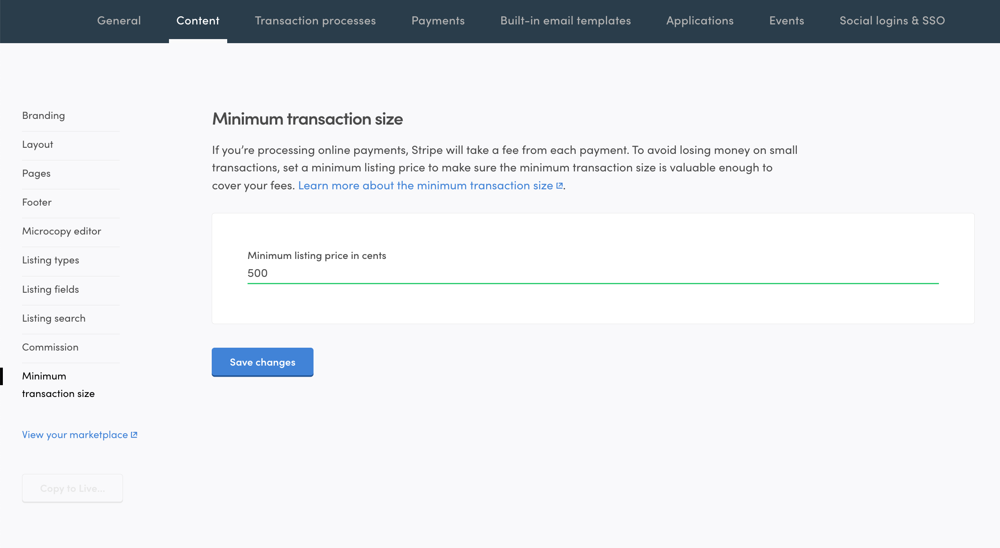

There are several files that affect the configuration of the Sharetribe
Web Template. The bottom layer consists of _environment variables_ and
all the files in the _src/config_ folder. In addition to that, you can
adjust many of your marketplace settings through Console.

## Environment variables and configuration files

You make a lot of adjustments to your marketplace via environment
variables, configuration files and through Console. These configurations
are specific to the runtime environment. For example, the
`REACT_APP_SHARETRIBE_SDK_CLIENT_ID` environment variable might be
pointing to the client ID of your Sharetribe development environment on
localhost and on your staging server (if you have one).

You already have set up a couple of those environment variables, when
you completed the
[Getting started with the Sharetribe Web Template](/introduction/getting-started-with-web-template/).
That happened, when you executed command:

```shell
yarn run config
```

That config script asked you to input all mandatory variables and then
created a new hidden file: "**.env**". You can open that file with your
preferred text editor:

```shell
└── .env
```

A full list of environment variables can be found here:
[template environment variables](/template/template-env/). You can
change any of these variables _locally_ by just editing the **.env**
file. Then you need to restart the server by running `yarn run dev`
again.

You can also find a full list of configuration variables that can be
changed through the template codebase in the
[Configuration variables](/template/configuration/) article.

## Change the currency

Most configurations are defined in the different files in the
**src/config** folder.

```shell
└── src
    └── config
        └── configDefault.js
```

Some environment variables are imported in the
[_configDefault.js_](https://github.com/sharetribe/web-template/blob/main/src/config/configDefault.js)
file, which is then imported into the components that use those
variables.

However, the **configDefault.js** file also contains other variables
that are hard-coded in the file.

One of those variables is marketplace currency. To change it, you will
need to add the correct currency code. You can check the available
currencies in
[**src/config/settingsCurrency.js**](https://github.com/sharetribe/web-template/blob/main/src/config/settingsCurrency.js).

```diff
  // Marketplace currency.
  // The currency used in the Marketplace must be in ISO 4217 currency code. For example USD, EUR, CAD, AUD, etc. The default value is USD.
  // It should match one of the currencies listed in currencySettings.js
- currency: 'USD',
+ currency: 'EUR',
```

If you already created listings before changing the currency, listings
using the old currency will not be bookable anymore. The Sharetribe Web
Template does not support multiple currencies and does not know how to
convert a listing's price from one currency to another.

If you have existing listings in another currency, you can close those
listings through Console.

<info>

If you want to change the currency of a live marketplace, you need to
customize your client app so that it allows providers to update the
listing's price even if the currency is wrong.

</info>

</extrainfo>

<extrainfo title="Extra: how to import currency in a component file?">

The _configDefault.js_ file defines the currency and exports it among
other variables:

**src/components/SomeComponent/SomeComponent.js**:

1. Your component can then use the configurations by implementing the
   **useConfiguration** hook:

   ```js
   import { useConfiguration } from '../../context/configurationContext';
   ...
   const SomeComponent = props => {
    const config = useConfiguration();
   ```

2. Later in that component, the currency can be referenced from config:
   ```js
   const currency = config.currency;
   ```

</extrainfo>

## Set a minimum price for your listings

Now we'll set a minimum transaction size. This can be set through
[Console](https://flex-console.sharetribe.com/a/transactions/minimum-transaction-size)
and it will be enforced when users create new listings. Users will not
be able to create listings below the minimun transaction size you define
in Console.

<info>

Existing listings in your marketplace will not be affected by the new
minimum price.

</info>

You can adjust the minimun transaction size in
[Console](https://flex-console.sharetribe.com/a/transactions/minimum-transaction-size):



The value you input will be in cents. Therefore, 500 represents a
minimun transaction size of 5 euros.

Stripe (the payment processor used by Sharetribe) has a
[minimum (and maximum) charge amounts per currency](https://stripe.com/docs/currencies#minimum-and-maximum-charge-amounts).
For euros, the minimum charge amount is 50 cents at the time when this
article was written.

We need to ensure that providers don't create listings that are cheaper
than the minimum price. If the listing price is lower, Stripe will not
process the payment and the booking fails.

## Summary

In this tutorial, we changed the marketplace currency and set a minimun
price for transactions using the no-code UI in Console. Currency needs
to be edited through the configDefault.js file and changing the currency
code to the desired value. You should consider what you want to set as
the minimum transaction price of your marketplace. The recommendation is
that the minimum listing price be at least the same as Stripe's minimum
charge amount in the country you are operating. If the listing price is
lower than Stripe's minimum charge amount, Stripe will not process the
payment and the transaction will fail.

## Further reading

- [Currency configurations](/template/how-to-set-up-currency-in-template/)
- [Environment variables](/template/template-env/)
- [Configuration variables](/template/configuration/)
