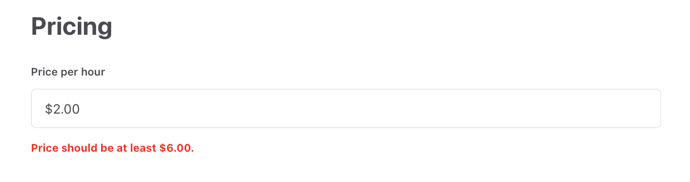

There are several files that affect the configuration of FTW templates.
The bottom layer consists of _environment variables_ and _src/config.js_
file.

## Environment variables

FTW templates have a couple of environment variables. Those variables
are more or less specific to a runtime environment. For example,
`REACT_APP_SHARETRIBE_SDK_CLIENT_ID` might be pointing to the client id
of your Flex test-environment on localhost and on your staging server
(if you have one).

You already have set up a couple of those environment variables, when
you completed the
[Getting started with FTW-daily guide](/introduction/getting-started-with-ftw-daily).
That happened, when you executed command:

```shell
yarn run config
```

That config script just asked a couple of mandatory variables from you
and then created a new hidden file: "**.env**". You can just open that
file with your preferred text editor:

```shell
└── .env
```

Full list of configuration variables can be found here:
[FTW environment variables](/ftw-configuration/ftw-env/). You can change
any of these variables _locally_ by just editing the **.env** file. Then
you need to restart the server by running `yarn run dev` again.

<extrainfo title="What you should see inside .env file?">

In the `.env` file, you should see these environment variables:

- **Mandatory configuration** (Flex Client ID, Stripe Publishable key,
  and Mapbox Access token)
- **Defaults** (currency, root URL)
- **Features enabled** (enable availability and default search
  locations)
- There are also a few variables that are commented out with `#`:

  ```shell
  # REACT_APP_SHARETRIBE_USING_SSL=true
  # SERVER_SHARETRIBE_TRUST_PROXY=true
  # REACT_APP_SENTRY_DSN=change-me
  # REACT_APP_CSP=report
  # BASIC_AUTH_USERNAME=sharetribe
  # BASIC_AUTH_PASSWORD=secret
  # REACT_APP_GOOGLE_ANALYTICS_ID=change-me
  ```

> **Note**: You should take _Content Security Policy_ (CSP) into use
> (block mode) before going to production. Read more about it from
> [this article](/ftw-security/how-to-set-up-csp-for-ftw/).

</extrainfo>

### Task: _Change the currency to EUR_

To change the currency, we need to find the line where
**`REACT_APP_SHARETRIBE_MARKETPLACE_CURRENCY`** is mentioned:

```shell
REACT_APP_SHARETRIBE_MARKETPLACE_CURRENCY=USD
```

and change it:

```shell
REACT_APP_SHARETRIBE_MARKETPLACE_CURRENCY=EUR
```

Restart your development server: **ctrl+c** and `yarn run dev`.

<extrainfo title="Why my old listings have a wrong currency?">

If you already created listings before changing the currency, listings
using the old currency will not be bookable anymore. FTW templates don't
support multiple currencies and they don't know how to convert listing's
price from one currency to another.

You can just close those listings from Console.

> **Note**: if you want to change the currency of a production
> marketplace, you need to customize your client app so that it allows
> providers to update the listing's price even if the currency is wrong.

</extrainfo>

> **Note**: you can also change the currency by using the config script:
>
> ```shell
> yarn run config
> ```

## Config.js

```shell
└── src
    └── config.js
```

Most of the environment variables are just included in _config.js_ file,
which is then imported into those components that use those variables.

However, config.js file contains also other variables that are just
hard-coded there. For example, **siteTitle** is set in config.js - and
then that variable is used in `<meta>` tags and
[webpage's schema](https://schema.org/).

```js
// Site title is needed in meta tags (bots and social media sharing reads those)
const siteTitle = 'Saunatime';
```

You should check through the whole config.js file and, at least, change
all the variables that reference Saunatime or Sharetribe.

### Task: _Set listing's minimum price_

Let's continue our task of changing currency to euros. In the previous
chapter, we changed the currency to EUR and it is already in use when a
new listing is created.

<extrainfo title="Extra: how to import currency on component file?">

_Config.js_ gets the currency from environment variable and export it
among other variables:

```js
const currency = process.env.REACT_APP_SHARETRIBE_MARKETPLACE_CURRENCY;
```

**src/components/SomeComponent/SomeComponent.js**:

1. Your component can then import the _config.js_:

   ```js
   import config from '../../config';
   ```

2. Later in that component, the currency can be referenced from config:
   ```js
   const currency = config.currency;
   ```

</extrainfo>

There are two additional variables set in config.js that are related to
currency:

```js
const currency = process.env.REACT_APP_SHARETRIBE_MARKETPLACE_CURRENCY;

// Currency formatting options.
// See: https://github.com/yahoo/react-intl/wiki/API#formatnumber
const currencyConfig = currencyConfiguration(currency);

// Listing minimum price in currency sub units, e.g. cents.
// 0 means no restriction to the price
const listingMinimumPriceSubUnits = 0;
```

We can ignore the **currencyConfig** since our currency is the euro. If
you are using some other currency, you can read more about
currencyConfig from
[this document](/ftw-configuration/how-to-set-up-currency-in-ftw/#3-check-the-currency-configjs-file).

The third variable, **listingMinimumPriceSubUnits**, is more relevant.
Stripe (the payment processor used by Flex) has a
[minimum (and maximum) charge amounts per currency](https://stripe.com/docs/currencies#minimum-and-maximum-charge-amounts).
For euros, the minimum charge amount is 50 cents at the time when this
article was written.

We need to ensure that providers don't create listings that are cheaper
than the minimum price. If the listing price is lower, Stripe will not
process the payment and the booking fails.

So, we should set the minimum price to be higher than what Stripe
charges. We need to decide a level, where provider and marketplace also
get something. In this tutorial, we use €5 aka 500 cents:

```js
const listingMinimumPriceSubUnits = 500;
```

The error message, when creating a new listing
(_EditListingPricingForm_):



> **Note**: copy-text, "_euros_", come from translation file
> (_en.json_):<br/>
>
> ```
> "EditListingPricingForm.pricePerNight": "Price per night in euros",
> ```

In the next article, we change the default suggestions for search
locations.<br />
[› Go to the next article](/tutorial-branding/change-default-locations/)
