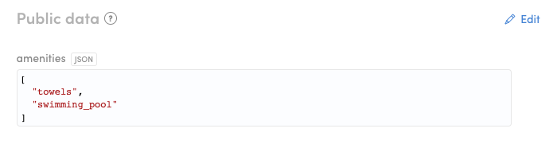

In the FTW-daily template, there are two example filters: _amenities_
and _category_.


In this tutorial, we change the options inside amenities filter, but the
same approach works with category filter too.

## Update Amenities filter

The configuration for the default filters on the search page can be
found from file: _marketplace-custom-config.js_

```shell
└── src
    └── marketplace-custom-config.js
```

In that file, the amenities options are listed in an array:

```js
export const amenities = [
  {
    key: 'towels',
    label: 'Towels',
  },
  // other options
];
```

**This _option_ syntax has two properties:**

- **key**:

  Key is saved to listing's public data when the listing is created.

  

- **label**:

  Label is just a hard-coded string that is shown in the UI. So, there
  are no translations for these in _en.json_ file. It's easier to modify
  options this way - just change the content of
  _marketplace-custom-config.js_.

We want amenities to be related to our cottage-rental marketplace. We'll
use the following options:

```js
export const amenities = [
  {
    key: 'terrace',
    label: 'Terrace',
  },
  {
    key: 'bathroom',
    label: 'Bathroom',
  },
  {
    key: 'swimming_pool',
    label: 'Swimming pool',
  },
  {
    key: 'jacuzzi',
    label: 'Jacuzzi',
  },
  {
    key: 'lake_view',
    label: 'Lake view',
  },
  {
    key: 'sea_view',
    label: 'Sea view',
  },
  {
    key: 'barbeque',
    label: 'Barbeque',
  },
  {
    key: 'fireplace',
    label: 'Fireplace',
  },
];
```

After you have saved the file, you should see the following options on
the search page:


<extrainfo title="Extra: how to remove Amenities filter from search page?">

This is not polished customization experience at the moment, but
basically there are three places you need to check:

- _[SearchPage](https://github.com/sharetribe/ftw-daily/blob/master/src/containers/SearchPage/SearchPage.js#L230)_:
  don't pass amenitiesFilter among primaryFilters prop.

  ```js
    primaryFilters={{
      categoryFilter: filters.categoryFilter,
      //amenitiesFilter: filters.amenitiesFilter,
      priceFilter: filters.priceFilter,
      dateRangeFilter: filters.dateRangeFilter,
      keywordFilter: filters.keywordFilter,
    }}
  ```

- _SearchFiltersMobile_ component: remove references to
  _amentiesFilter_.
- _SearchFilters_ component: remove references to _amentiesFilter_.

</extrainfo>

Then you need to create listings, which have some of these amenities
selected.

## How to take the filter into use?

Amenities filter is just an example filter component since quite many
marketplaces would need something like that. However, it is not added to
the search engine by default, because it might be that the relevant key
is not actually called _amenities_ but something different. (E.g.
_kitchenware_ could be a similar multi-enum filter for a cottage-rental
marketplace.)

If we want to make `sdk.listing.query` endpoint to understand that
listings have a new public data field, we need to add search schema for
it. Otherwise, this additional data is just gibberish to the search
engine. Search schema can be added with Flex CLI.

### Install Flex CLI

Quick start

```shell
yarn global add flex-cli
flex-cli login
```

The last command will prompt you your API key, which you need to create
in Flex Console
(_[Account > API keys](https://flex-console.sharetribe.com/api-keys)_).

Read more about
[how to install Flex CLI](/tutorials/getting-started-with-flex-cli/).

### Set search schema with Flex CLI

When you have installed Flex CLI to your command line environment, we
can set the search schema for amenities public data key. Since one
listing can have multiple amenities, the schema type is **multi-enum**.

```shell
flex-cli search set --key amenities --type multi-enum --scope public -m my-marketplace-test
```

Basically this command says that we set a new _search index_ for the
search engine:

- `--key amenities`: key for this new searchable data is _amenities_.
- `--type multi-enum`: the type is an enumeration with an array of
  choices.
- `--scope public`: key can be found from the public data section of a
  listing entity.

  Read more about [public data](/references/extended-data/).

- `-m my-marketplace-test`: your marketplace ID.

  With CottageDays test marketplace, the ID is _cottagedays-test_. You
  can check your marketplace ID from Flex Console (Build section).

Read more about
[setting search schemas with Flex CLI](http://localhost:8000/tutorials/manage-search-schemas-with-flex-cli/).

<extrainfo title="Extra: what about category filter?">

Category filter is similar filter than amenities, but only one
enumeration string is allowed per listing. Which is to say, that listing
can belong to only one category. So, if you decide to add _category_ key
to the search schema, you need to use type **enum** instead:

```shell
flex-cli search set --key category --type enum --scope public -m my-marketplace-test
```

</extrainfo>

After all these changes, the client app starts to look like CottageDays
marketplace. It's time to get it online and share it with people who
could give you some feedback. In the next article, we'll deploy the app
to Heroku.<br />
[› Go to the next article](/tutorial-branding/deploy-to-heroku/)
