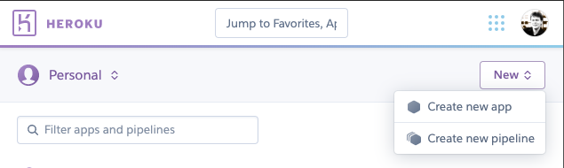
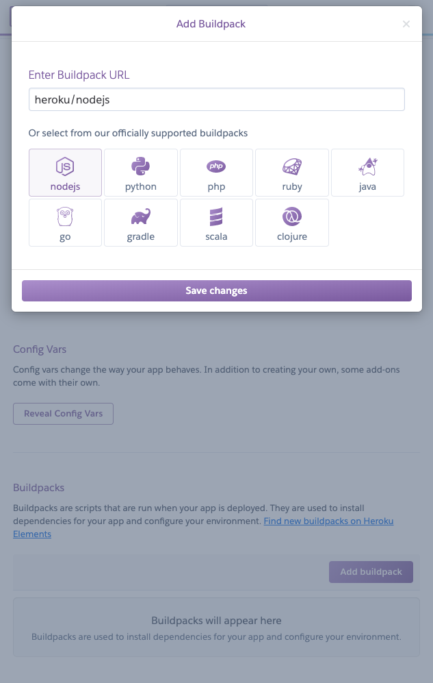
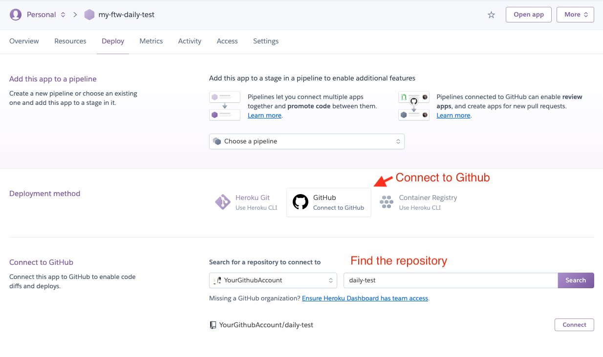

Now we have branded FTW-daily template to _CottageDays_ marketplace.
It's time to deploy the web app to some hosting service. After all, we
want to get some feedback from colleagues and friends.

**Note**: if you have removed all the Saunatime-related content from
your client app and your marketplace doesn't need more advanced
functionality to work, you should consider launching your marketplace.
If you want to read more, there's a Marketplace Academy article about
[why you should launch your marketplace early](https://www.sharetribe.com/academy/why-you-should-launch-your-marketplace-early/).

## Test server-side rendering locally

Before we push the code to Heroku or another hosting service, we need to
make sure that the server-side rendering (SSR) works.

FTW templates come with a small Node/Express server that renders the
public pages on the server. The server renders pages faster, but even
more importantly, it allows search engines to access them (in case they
don't execute JavaScript).

The previously used command, **yarn run dev**, doesn't start this
Node.js server but uses Webpack's dev-server with hot module replacement
functionality. There's a different package.json script that starts the
actual server:

```shell
yarn run dev-server
```

Then test that the application works on different pages.

<extrainfo title="Extra: troubleshooting">

If the server-side rendering doesn't work, you have likely called
functions that belong to "**window**" object/scope. In the server
environment, the "window" object is not available.

</extrainfo>

## Enable HTTP basic access authentication

You can enforce access control in your web application by enabling HTTP 
basic access authentication. It's a good idea to restrict access to your 
web application while still testing your marketplace: it prevents your 
site from being indexed in search engines and users from accidentally 
signing up in a marketplace still under development.

FTW exposes two environment variables with which you can set a username
and password that limit access to your web application. When you deploy
your application to Heroku, remember to define the following environment
variables in the "Config Vars" section:

`BASIC_AUTH_USERNAME` and `BASIC_AUTH_PASSWORD`

This will prevent anybody without the correct password and username from
accessing your test marketplace.

## Deploy to Heroku

Generic Heroku deployment has the following steps:

**Step 1: Create a Heroku account**

Go to Heroku and create a new account if you don't have one. There's a
[free plan available](https://www.heroku.com/pricing).

**Step 2: Create a new app**

Create a new app in the Heroku dashboard.



**Step 3: Change environment variables**

In Heroku, you can configure environment variables from the
[Heroku dashboard](https://devcenter.heroku.com/articles/config-vars#using-the-heroku-dashboard).

Go to the Settings page of your new app and reveal Config Vars:


Then add the following environment variables as Config Vars:

- `REACT_APP_SHARETRIBE_SDK_CLIENT_ID`

  Flex client ID. Check this from
  [Console](https://flex-console.sharetribe.com/applications).

- `SHARETRIBE_SDK_CLIENT_SECRET`

  Flex client secret. Check this from
  [Console](https://flex-console.sharetribe.com/applications).

- `REACT_APP_STRIPE_PUBLISHABLE_KEY`

  Stripe publishable API key for generating tokens with Stripe API. Use
  the test key (prefix `pk_test`) for development.

- `REACT_APP_MAPBOX_ACCESS_TOKEN`

  If you are using Mapbox instead of Google Maps

- `REACT_APP_SHARETRIBE_MARKETPLACE_CURRENCY`

  The currency used in the Marketplace is formatted in the ISO 4217
  currency code. For example USD, EUR, CAD, AUD, etc.

- `REACT_APP_CANONICAL_ROOT_URL`

  Canonical root URL of the marketplace. Remove trailing slash from the
  domain.<br />E.g. _`https://<the-name-of-your-app>.herokuapp.com`_

- `NODE_ENV`

  Defines whether the application is run in production or development mode. Use
  'development' for development and 'production' for production.<br/>
  Use value: 'production'

- `REACT_APP_ENV`

  A more fine-grained env definition than `NODE_ENV`. For example, this
  sends environment info to the logging service Sentry. (If you have
  enabled it with `REACT_APP_SENTRY_DSN`).<br/> For this setup, use
  value: 'development'

- `REACT_APP_SHARETRIBE_USING_SSL`

  Redirect HTTP to HTTPS?<br/> Use value: true

- `SERVER_SHARETRIBE_TRUST_PROXY`

  Set this when running the app behind a reverse proxy, e.g. in
  Heroku.<br/> Use value: true

- `REACT_APP_CSP`

  Content Security Policy (CSP). Read more from
  [this article](/ftw/how-to-set-up-csp-for-ftw/).<br /> Accepts values:
  _block_ and _report_. The recommended value is _block_.

- `REACT_APP_AVAILABILITY_ENABLED`

  Possible values: true/false<br/> Use value: true

- `REACT_APP_DEFAULT_SEARCHES_ENABLED`

  Possible values: true/false<br/> Use value: true

If you change these values later on, _you need to deploy the app again_.
Environment variables are baked into the static build files of the web
app - so a new build is required.

**Step 4: Add Node.js buildpack**

Go to the Settings page of your new app and add the official buildpack:
_heroku/nodejs_



**Step 5: Connect the Heroku app to Github**

Go to the Deploy page of your new app and
[connect the app with Github](https://devcenter.heroku.com/articles/github-integration#enabling-github-integration).



After that, you can deploy the app manually or enable automatic deploy
from your default branch (usually named as _main_ or _master_).

If everything works, your app should be available in a URL that looks a
bit like this: `HTTPS://<your-app-name>.herokuapp.com`

## What next?

You should test the app thoroughly with both desktop layout and mobile
layout. In addition, you should try to:

- Create new users
- Create new listings
- Book listings
- Test social sharing
  - [Facebook sharing debugger](https://developers.facebook.com/tools/debug/)
  - [Twitter card validator](https://cards-dev.twitter.com/validator)
- Save payment card

  Use [test card numbers](https://stripe.com/docs/testing).

If your marketplace concept needs advanced features, you need to
continue with customizations. In
[the next part of this tutorial](/tutorial/add-extended-data/), we'll go
through how to extend listing entity with extended data.

[› Go to the next article](/tutorial/add-extended-data/)
