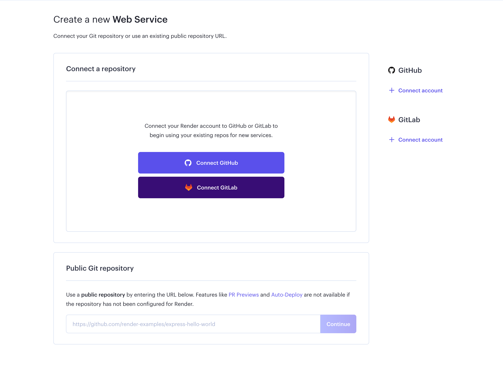
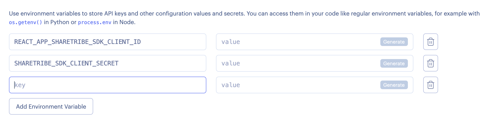
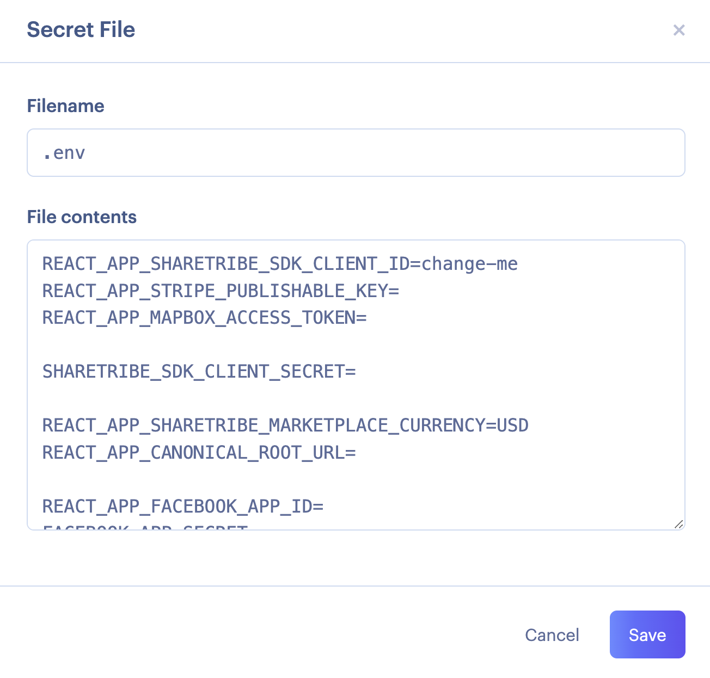

Now that you have customised your marketplace's styling, it is time to
deploy the web application to a public web server. After all, you want
your marketplace to be accessed by your colleagues and friends over the
Internet. This tutorial will provide an overview of how to deploy a test
environment to a public server, such as [Render](https://www.render.com)
or [Heroku](https://www.heroku.com/).

If you do not need to develop any advanced functionality for your
marketplace and are ready to deploy, you should consider launching
directly to production. Read our Marketplace Academy article on
[why you should launch your marketplace early](https://www.sharetribe.com/academy/why-you-should-launch-your-marketplace-early/).

## What is a test environment?

So far, you have been developing your marketplace in a development
environment on your local machine. At some point during the development
process, you will want to start testing features in an environment where
a server exposes your website to the public Internet. Using a cloud
hosting service like [Render](https://www.render.com) or
[Heroku](https://www.heroku.com/), you can deploy your application to a
server, after which your marketplace will be accessible through a public
URL.

## Prepare to publish your marketplace

Before deploying your test environment, you want to make sure
Server-Side Rendering (SSR) works. In addition, password-protecting your
test environment is a good idea to prevent it from being accessed by
unauthorized users.

### Test server-side rendering locally

Before you deploy your marketplace to Render or another hosting service,
you should first ensure that your client application runs without error
when using SSR.

The Sharetribe Web Template has a small
[Node/Express](https://expressjs.com/) server that enables SSR. It
allows pages to be rendered faster than on the client, but even more
importantly, it makes it easier for search engines to index your website
(in case they don't execute JavaScript).

To start up the server locally, you will need to run the command:

```shell
yarn run dev-server
```

This command will run the actual Node/Express server in server/index.js
so you can test server-side rendering, simulating how the client
application would run in a production environment.

<info>

If you have issues with SSR, you have likely called functions that
belong to the **window** object/scope. In the server environment, the
**window** object is not available.

</info>

### Enable HTTP basic access authentication

You can enforce access control in your web application by enabling HTTP
basic access authentication. It's a good idea to restrict access to your
web application while still testing your marketplace: it prevents your
site from being indexed in search engines and users from accidentally
signing up in a marketplace still under development.

Sharetribe Web Template exposes two environment variables with which you
can set a username and password that limit access to your web
application. When you deploy your application to Render, remember to
define the following environment variables:

`BASIC_AUTH_USERNAME` and `BASIC_AUTH_PASSWORD`

This will prevent anybody without the correct password and username from
accessing your test marketplace.

## Deploy to Render

This section provides a step-by-step guide on how to deploy your
marketplace to Render. You can also deploy your marketplace on another
cloud hosting platform, but we suggest using Render as it provides a
[free tier](https://render.com/pricing) and is quick and easy to set up.

<info>

Make sure you have completed the
[Tutorial introduction](https://www.sharetribe.com/docs/tutorial/introduction/),
as this step requires having your code hosted in a Git repository.

</info>

### Create an account on Render

Go to Render and
[create a new account](https://dashboard.render.com/register) if you do
not have one already.

### Create a new app

Go to the [Render dashboard](https://dashboard.render.com) and create a
new application. Select "web service":


### Connect Render with a GitHub repository

Log in using your GitHub account and give Render permission to access
the repository you want to deploy.



### Configure settings and environment variables

Give your web service a name. You do not need to touch any other
settings (such as environment, branch, build command and start command),
and select the free plan. Before clicking on "create web service", click
on "Advanced" to enter the required environment variables.

You can choose to enter the environment variables one-by-one through the
browser interface:



Or by creating a secret file that contains all environment variables:



You then need to add the following environment variables:

- `REACT_APP_SHARETRIBE_SDK_CLIENT_ID`

  Sharetribe client ID. Check this from
  [Console](https://console.sharetribe.com/advanced/applications). For a
  dev environment that is meant for developing further features, use the
  client ID from your _development environment_.

- `SHARETRIBE_SDK_CLIENT_SECRET`

  Sharetribe client secret. Check this from
  [Console](https://console.sharetribe.com/advanced/applications).

- `REACT_APP_STRIPE_PUBLISHABLE_KEY`

  Stripe publishable API key for generating tokens with Stripe API. Use
  the test key (prefix `pk_test`) for development.

- `REACT_APP_MAPBOX_ACCESS_TOKEN`

  If you are using Mapbox instead of Google Maps

- `REACT_APP_SHARETRIBE_MARKETPLACE_CURRENCY`

  The currency used in the Marketplace is formatted in the ISO 4217
  currency code. For example USD, EUR, CAD, AUD, etc.

- `REACT_APP_MARKETPLACE_ROOT_URL`

  This is the root URL of the marketplace. Remove trailing slash from
  the domain.<br />E.g. _`https://<the-name-of-your-app>.onrender.com`_

- `NODE_ENV`

  Defines whether the application is run in production or development
  mode. Use 'development' for development and 'production' for
  production.<br/> Use value: 'production'

- `REACT_APP_ENV`

  A more fine-grained env definition than `NODE_ENV`. For example, this
  sends environment info to the logging service Sentry. (If you have
  enabled it with `REACT_APP_SENTRY_DSN`).<br/> For this setup, use
  value: 'development'

- `REACT_APP_SHARETRIBE_USING_SSL`

  Redirect HTTP to HTTPS?<br/> Use value: true

- `SERVER_SHARETRIBE_TRUST_PROXY`

  Set this when running the app behind a reverse proxy, e.g. in
  Heroku.<br/> Use value: true

- `REACT_APP_CSP`

  Content Security Policy (CSP). Read more from
  [this article](/template/how-to-set-up-csp-for-template/).<br />
  Accepts values: _block_ and _report_. The recommended value is
  _block_.

- `REACT_APP_AVAILABILITY_ENABLED`

  Possible values: true/false<br/> Use value: true

- `REACT_APP_DEFAULT_SEARCHES_ENABLED`

  Possible values: true/false<br/> Use value: true

If you change these values later on, _you need to redeploy the app_.
Environment variables are baked into the static build files of the web
app, so a new build is required.

### Create web service

Once you are ready, click on the "create web service" button and wait
for your build to be deployed. Once the build is complete, you will be
able to access your marketplace through the URL displayed in the Render
dashboard.

### Domains and certificates

Render manages TLS certificates
[automatically](https://render.com/docs/tls) for new applications. You
can enable a custom domain through the _Settings tab_. Read more through
[Render's documentation](https://render.com/docs/custom-domains).

## What next?

Now that your marketplace is running in a test environment, you should
test the app thoroughly using both desktop and mobile layouts. In
addition, you should try to:

- Create new users
- Create new listings
- Book listings
- Test social sharing
  - [Facebook sharing debugger](https://developers.facebook.com/tools/debug/)
  - [Twitter card validator](https://cards-dev.twitter.com/validator)
- Save payment card
  - Use [test card numbers](https://stripe.com/docs/testing).

In [the next part of this tutorial](/tutorial/add-new-wizard-tab/),
we'll go through how to add new tabs to the listing wizard.
