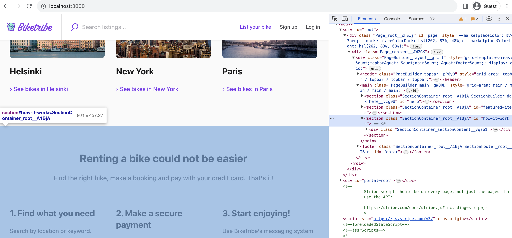
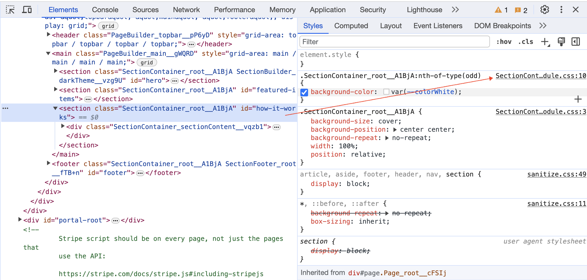

## Introduction

Styling your marketplace is the first step towards customizing its
appearance. You can make many visual changes using the no-code tools in
Console [TODO: Link to non-technical article about visual changes] but
for more extensive changes, you will need to edit the code of the
Sharetribe Web Template directly. This tutorial teaches you to style
components directly through code in the Sharetribe Web Template.

After this tutorial, you will know how to:

- Style components using CSS Modules
- Be familiar with how CSS Modules are used as a part of the Sharetribe
  Web Template

## CSS Modules

The Sharetribe Web Template uses [CSS Modules](TODO: LINK) to style
components. CSS Modules enable modular and scoped styling by generating
unique class names for each CSS module, preventing naming conflicts and
encapsulating styles within specific components. You can find
component-specific CSS styles in files in the component directory with
the extension `.module.css`.

For example, this is how the folder structure of the Footer directory
looks like:

```bash
├── Footer.js
├── Footer.module.css
├── Footer.example.js
└── FooterExample.module.css
```

In the CSS file (the one ending in .module.css), you can create separate
CSS classes for each element you want to style. You don't have to worry
about unique class names, as the CSS Modules library handles naming
conflicts by generating unique class names during build time.

## Styling a component

In this section, you'll change the background colour of an existing
component on the landing page. To do that, we will locate the component
we want to edit through the browser's developer tools and make a change
in the CSS file of that component.

By default, the background colour of the sections on the landing page
alternates between white and grey. Our goal is to change the colours to
alternate between grey and a light pastel purple.

Let's start by powering up the development environment by running:
`yarn run dev`

After that, you should be able to see your marketplace in your browser
by navigating to http://localhost:3000

Next, you'll want to inspect the element you want to modify using the
developer console in your web browser.



<info>

Inspecting elements using your browser's developer tools is a helpful
way of locating the correct component to edit when developing your
marketplace.

</info>

The element you are looking for is a `<div>` with the class name
`SectionContainer_root` and id `how-it-works-for-customers`. You'll
notice that the class name has some additional characters appended to it
like `SectionContainer_root_A1BjA`. That is the class name generated by
CSS Modules. The random characters added to the end of the class name
guarantee no clashes between classes, even if you use the same class
name to style another component elsewhere in your codebase.

Once you've identified the component you want to edit, you can deduce
the correct CSS file based on the class name. The first part of the
class name, `SectionContainer`, tells us which React component we want
to edit. This information makes it easy for us to locate the correct CSS
file, as all CSS files follow the same naming scheme:
`SectionContainer.module.css`

Alternatively, you can also directly identify the CSS file you need to
edit by using the developer tools:


The second part of the class name, `root` tells us which CSS selector we
want to edit. In `SectionContainer.module.css` we next identify the
.root selector:

```css
.root {
  background-size: cover;
  background-position: center center;
  background-repeat: no-repeat;
  width: 100%;
  position: relative;

  &:nth-of-type(odd) {
    background-color: var(--colorWhite);
  }
}
```

The &:nth-of-type(odd) selector targets elements that are the
odd-numbered siblings within their parent container. Therefore, the
background-colour property is applied to every second element on the
landing page.

Let’s change the background colour to a new colour. First, define a new
variable:

```css
var(—colorPastelPurple)
```

And assign it to background-color:

```css
  &:nth-of-type(odd) {
    background-color: var(--colorPurple);
  }
```

Now when we refresh the page, we’ll see that the background colour of
the sections alternates between grey and a pastel purple.

## How to assign CSS classes to React Components

You can import classes into your React component .js file using the
following syntax:

```js
import css from './SectionContainer.module.css';
```

After that, you can assign classes to React components or HTML elements
in your code using the className prop:

```jsx
className={css.root}
```

<info>

Don’t confuse the class attribute of HTML elements and the className
prop of React components!

</info>

## Summary

Next, it's time to deploy a test environment!<br />
[› Go to the next article](/tutorial/change-images/)
