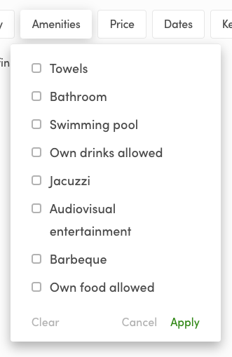
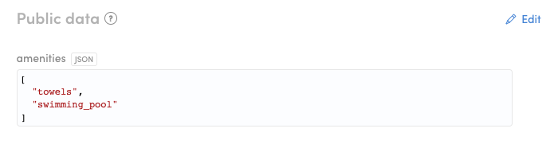
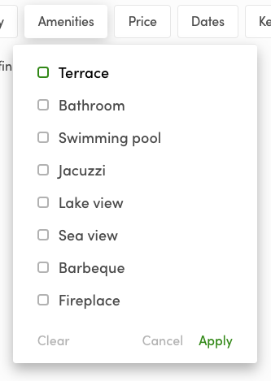

In the Sharetribe Web Template, there are four example filters:
_tire-size_, _brand_, _equipped-with_, and _category_.

//TODO: update image with Biketribe content



In this tutorial, we edit the _equipped-with_ filter into an _amenities_
filter, but the same approach works with the other filters too.

## Implement Amenities filter

The configuration for the default filters on the search page can be
found from file: _configListing.js_

```shell
└── src
    └── config
        └── configListing.js
```

In that file, the different listing extended data attributes and their
configuration options are defined in an array:

```js
export const listingExtendedData = [
```

Next, you can locate the filter _equipped-with_ from that list – this is
the filter we will replace with an _amenities_ filter – and you can see
some basic info. E.g. _equipped-with_ filter is actually of type
`SelectMultipleFilter`, which is the component that actually renders the
filter on the search page. In the config section, you can also find
`schemaOptions`:

```js
{
    key: 'equipped-with',
    scope: 'public',
    includeForTransactionTypes: [
      'product-selling',
      'daily-booking',
      'nightly-booking',
      'hourly-booking',
    ],
    schemaType: 'multi-enum',
    schemaOptions: [
      { option: 'bell', label: 'Bell' },
      { option: 'lights', label: 'Lights' },
      { option: 'lock', label: 'Lock' },
      { option: 'mudguard', label: 'Mudguard' },
    ],
    indexForSearch: true,
    searchPageConfig: {
      label: 'Equipped with',
      searchMode: 'has_all',
      group: 'secondary',
    },
    listingPageConfig: {
      label: 'Equipped with',
    },
    editListingPageConfig: {
      label: 'Equipped with',
      placeholderMessage: 'Choose…',
      isRequired: false,
    },
},
```

**The _option_ syntax has two properties:**

- **option**:

  The 'option' value is saved to the listing's public data when the
  listing is created.

  //TODO: Update image once Biketribe microcopy exists

  

- **label**:

  Label is just a hard-coded string that is shown in the UI. So, there
  are no microcopy for these in the _en.json_ file. It's easier to
  modify options this way - just change the content of
  _configListing.js_.

We want amenities that are related to our cottage-rental marketplace.
We'll use the following configuration:

```js
{
    key: 'amenities',
    scope: 'public',
    includeForTransactionTypes: [
      'product-selling',
      'daily-booking',
      'nightly-booking',
      'hourly-booking',
    ],
    schemaType: 'multi-enum',
    schemaOptions: [
      { option: 'terrace', label: 'Terrace' },
      { option: 'bathroom', label: 'Bathroom' },
      { option: 'swimming_pool', label: 'Swimming pool' },
      { option: 'jacuzzi', label: 'Jacuzzi' },
      { option: 'lake_view', label: 'Lake view' },
      { option: 'sea_view', label: 'Sea view' },
      { option: 'barbeque', label: 'Barbeque' },
      { option: 'fireplace', label: 'Fireplace' },
    ],
    indexForSearch: true,
    searchPageConfig: {
      label: 'Amenities',
      searchMode: 'has_all',
      group: 'secondary',
    },
    listingPageConfig: {
      label: 'Amenities',
    },
    editListingPageConfig: {
      label: 'Amenities',
      placeholderMessage: 'Choose…',
      isRequired: false,
    },
},
```

After you have saved the file, you should see the following options on
the search page: // TODO: update image


<extrainfo title="Extra: how to remove Amenities filter?">

The answer is simple: just remove the object literal from the
`listingExtendedData` array.

If you want to add more filters (of type: _enum_), you can modify the
existing configurations, or add more, that use `SelectSingleFilter` or
`SelectMultipleFilter`.

For example, you could modify the `brand` field to a public data field
`view`:

```js
 {
    key: 'view',
    scope: 'public',
    includeForTransactionTypes: [
      'product-selling',
      'daily-booking',
      'nightly-booking',
      'hourly-booking',
    ],
    schemaType: 'enum',
    schemaOptions: [
        { option: 'sea', label: 'Sea' },
        { option: 'lake', label: 'Lake' },
        { option: 'forest', label: 'Forest' },
        { option: 'garden', label: 'Garden' },
        { option: 'other', label: 'Other' },
    ],
    indexForSearch: true,
    searchPageConfig: {
      label: 'View',
      group: 'secondary',
    },
    listingPageConfig: {
      label: 'View',
      isDetail: true,
    },
    editListingPageConfig: {
      label: 'View',
      placeholderMessage: 'Choose…',
      isRequired: true,
      requiredMessage: 'You need to select a view.',
    },
  },
```

Read more in the article:
[Change search filters in Sharetribe Web Template](/how-to/change-search-filters-in-ftw/)

</extrainfo>

Then you need to create listings that have some of these amenities
selected.

## How to take the filter into use?

The Biketribe filters are just an example selection of filter
components, since quite many marketplaces would need something like
that. However, they are not added to the search engine by default,
because it might be that the relevant keys are not actually called
_brand_ and _equipped-with_ but something different – for instance
_amenities_ and _view_, like in this tutorial.

If we want to make `sdk.listing.query` endpoint to understand that
listings have a new public data field, we need to add search schema for
it. Otherwise, this additional data is just gibberish to the search
engine. Search schema can be added with Flex CLI.

### Install Flex CLI

Quick start

```shell
yarn global add flex-cli
flex-cli login
```

The last command will prompt you your API key, which you need to create
in Flex Console
(_[Account > API keys](https://flex-console.sharetribe.com/api-keys)_).

Read more about
[how to install Flex CLI](/introduction/getting-started-with-flex-cli/).

### Set search schema with Flex CLI

When you have installed Flex CLI to your command line environment, we
can set the search schema for amenities public data key. Since one
listing can have multiple amenities, the schema type is **multi-enum**.

```shell
flex-cli search set --key amenities --type multi-enum --scope public -m my-marketplace-test
```

Basically this command says that we set a new _search index_ for the
search engine:

- `--key amenities`: key for this new searchable data is _amenities_.
- `--type multi-enum`: the type is an enumeration with an array of
  choices.
- `--scope public`: key can be found from the public data section of a
  listing entity.

  Read more about [public data](/references/extended-data/).

- `-m my-marketplace-test`: your marketplace ID.

  With CottageDays test marketplace, the ID is _cottagedays-test_. You
  can check your marketplace ID from Flex Console (Build section).

Read more about
[setting search schemas with Flex CLI](/how-to/manage-search-schemas-with-flex-cli/).

<extrainfo title="Extra: what about category filter?">

Category filter is a similar filter to amenities, but only one
enumeration string is allowed per listing. In other words, a listing can
belong to only one category. So, if you decide to add _category_ key to
the search schema, you need to use type **enum** instead:

```shell
flex-cli search set --key category --type enum --scope public -m my-marketplace-test
```

</extrainfo>

---

In the next article, we add FAQ page. With that article, you learn how
to add static pages. Quite often there's a need to add more info about
how the marketplace works and adding a static page is the easiest way to
do that. <br /> [› Go to the next article](/tutorial/add-faq-page/)
