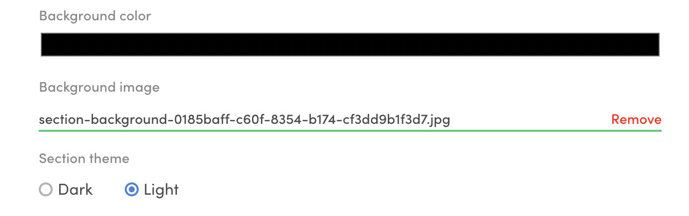

The default landing page for the Saunatime template shows generic
instructions and images for building a successful landing page. In this
tutorial, you will learn to modify the **hosted assets** on your landing
page.

You can modify your landing page in
[Flex Console > Build > Content > Pages](https://flex-console.sharetribe.com/content/pages).
By default, your marketplace has four content pages already created:

- Landing page
- Terms of Service
- Privacy Policy
- About

Each page is identified by their page ID. For pages other than landing
page, the page ID is reflected in the page address on your marketplace.
The landing page, however, shows up on the root page of your client site
by default.

For each page, you can see two links: _Edit content_ and _View page_. To
edit a page, you can either click the link, or just click anywhere in
the white container for the page.

Once you click the link, you can see the default **sections** for the
landing page. You can freely modify, add, and remove the sections as you
develop your marketplace.

In this tutorial, you will modify the first section, _hero_. Click on
the section to open the details.

<video>
    <source src='./lpsh.mp4' type='video/mp4'>
    <source src='./lpsh.webm' type='video/webm'>
    <source src='./lpsh.ogv' type='video/ogg'>
</video>

### Update section background image

With the hero section open, scroll down to the input for _Background
image_.

Remove the previous one, and then upload the same background image we
used in the previous step for Cottage Days:  

- [Summer house by Markus Spiske (cropped)](/tutorial-assets/markus-spiske-summer-house-unsplash.jpg)

With this image, we also need to switch the text from white to black. To
do that, toggle the _Text color_ buttons below the image input.

Once you have made these changes, scroll to the bottom of the page to
save your changes. Now, refresh your marketplace landing page, and you
can see the updated image on the top of the page.

Next, you will update the text content of this section.

### Update block contents

It is possible to add title and ingress content in sections. However, in
the _hero_ section, content is inside the block with id _hero-block_.
Click the block to open it and edit the contents.

Replace the existing title and text content with your marketplace title
and tagline. Click "Save changes", and refresh your landing page.

You can now see a customised hero element on your marketplace landing
page.

Read more:

- Detailed instructions on
  [editing content pages in Console](/operator-guides/how-to-edit-content-pages-in-console/)
- Guide on creating
  [an FAQ page](/operator-guides/how-to-create-an-faq-page/)

There is still one obvious Saunatime image visible on top bar: Logo.
It's time to change that next. 
[› Go to the next article](/tutorial/change-logo/)
