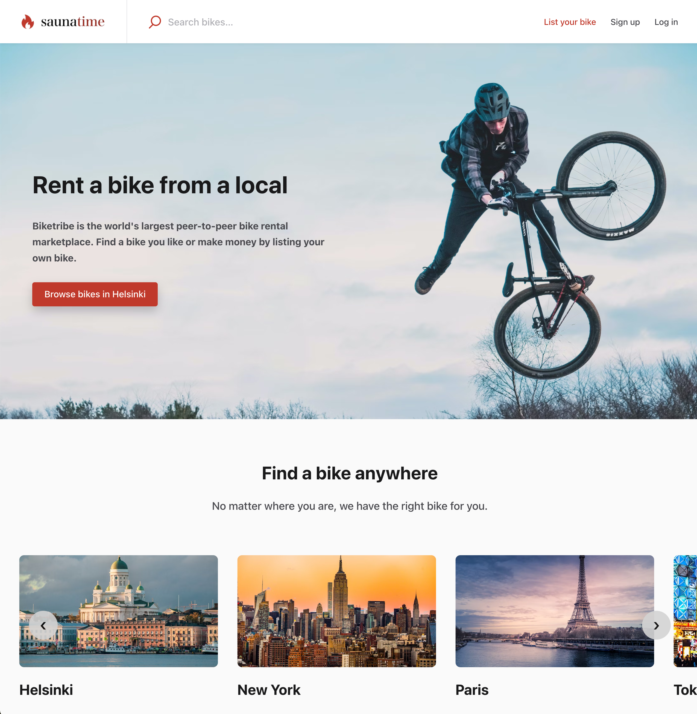
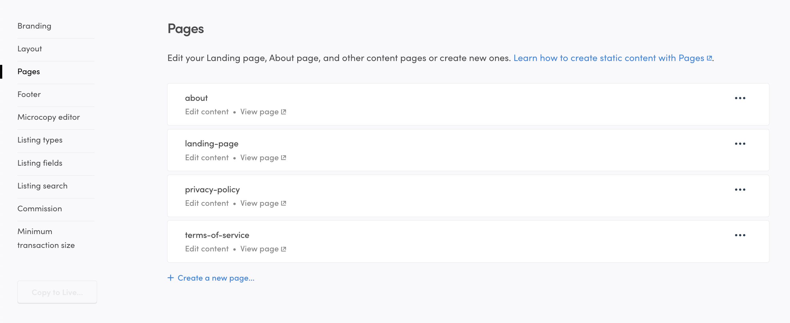
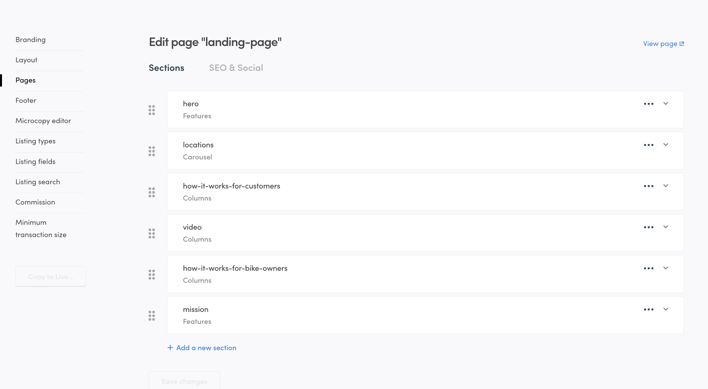
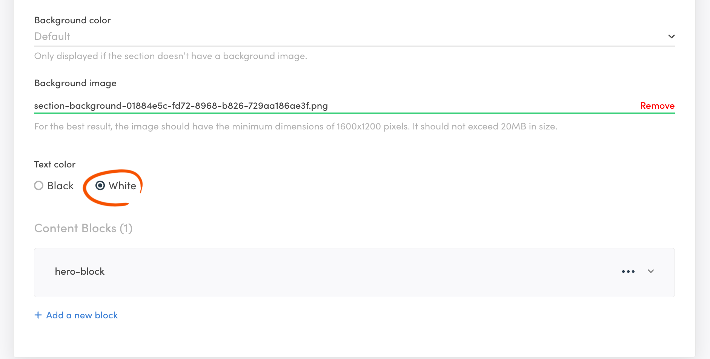
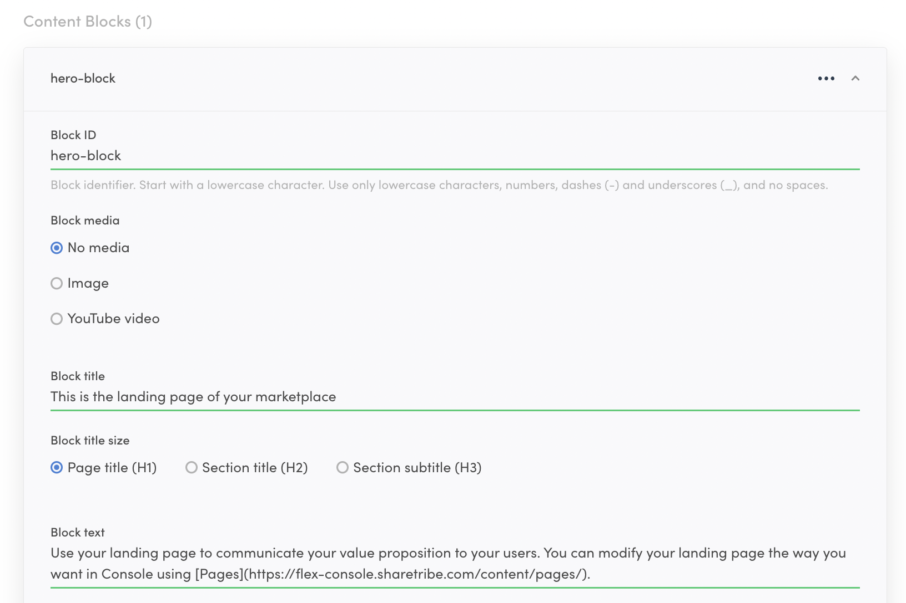
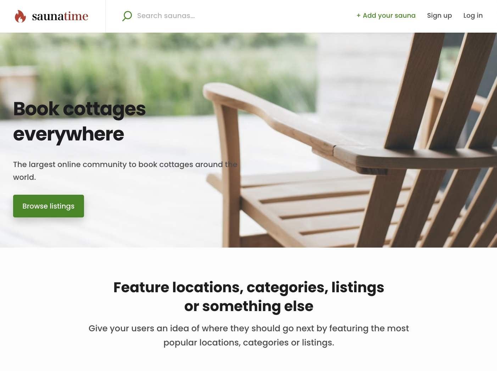

In this tutorial section, you will familiarise yourself with the
[Pages feature in Console](https://flex-console.sharetribe.com/content/pages).
The Pages feature allows you to modify the content and layout of your
landing page and other static pages in your marketplace using the
no-code editor in Console. At the end of this tutorial, you will have
learnt how to edit the landing page of your marketplace. We will change
your landing page images and content to align with our sauna-themed
marketplace.

This is what the our landing page looks like so far:

## Using Pages

Using the Console you can create and edit content pages without code.

You can modify your content pages by navigating to
[Flex Console > Build > Content > Pages](https://flex-console.sharetribe.com/content/pages).

By default, your marketplace has four content pages already created:

- About
- Landing page
- Privacy Policy
- Terms of Service

Each page is identified by their page ID. For pages other than landing
page, the page ID is reflected in the page address on your marketplace.
For example, you can access your About page at `/p/about` and your
Privacy Policy page at `/p/privacy-policy`.

The landing page, however, shows up on the root page of your template
app by default.

For each page, you can see two links: _Edit content_ and _View page_. To
edit a page, you can either click the link, or just click anywhere in
the white container for the page.

Once you click the link, you can see the default **sections** for the
landing page. You can freely modify, add, and remove the sections as you
develop your marketplace.

## Change your hero image

The hero image displayed on your landing page plays a vital role in
setting the visual tone and capturing the essence of your marketplace.
Our first step will be to change the current image with one that we can
associated with saunas.

You will begin by modifying the first section, _hero_. Click open the
landing page view and select the _hero_ section.

<video>
    <source src='./hero.mp4' type='video/mp4'>
    <source src='./hero.webm' type='video/webm'>
    <source src='./hero.ogv' type='video/ogg'>
</video>

### Update section background image

With the hero section open, scroll down to the input for _Background
image_.

Remove the existing one, and then upload the same background image we
used in the previous section of the tutorial:  

- [Saunatime background](/tutorial-assets/saunatime-background.png)

With this image, we also need to switch the text from white to black. To
do that, toggle the _Text color_ buttons below the image input.

Once you have made these changes, scroll to the bottom of the page to
save your changes. Now, refresh your marketplace landing page, and you
can see the updated image on the top of the page.

Finally, you'll need to edit the

Next, you will update the text content of this section.

### Update block contents

It is possible to add title and ingress content in sections. However, in
the _hero_ section, content is inside the block with id _hero-block_.
Click the block to open it and edit the contents.

Replace the existing title and text content with your marketplace title
and tagline. Click "Save changes", and refresh your landing page.

You can now see a customised hero element on your marketplace landing
page.

Read more:

- Detailed instructions on
  [editing content pages in Console](/operator-guides/how-to-edit-content-pages-in-console/)
- Guide on creating
  [an FAQ page](/operator-guides/how-to-create-an-faq-page/)

There is still one obvious Biketribe image visible on top bar: the logo.
It's time to change that next. 
[› Go to the next article](/tutorial/change-logo/)
