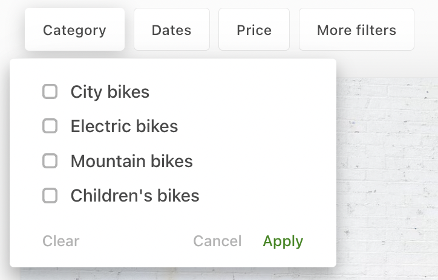
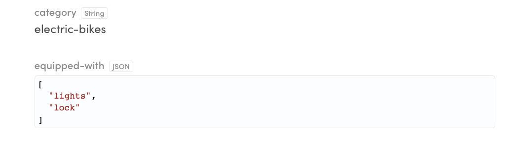
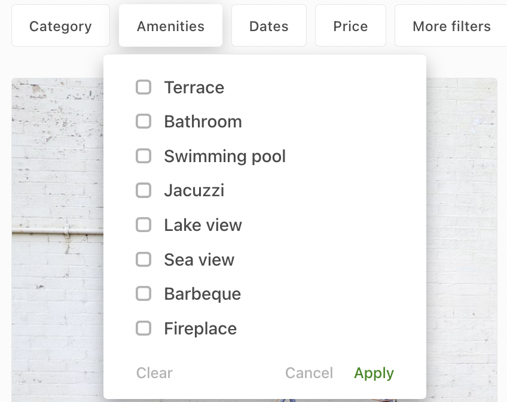

In the Sharetribe Web Template, listings are by default defined as
rental bikes. In other words, they have attributes that relate to the
topic – tire size, brand, category, add-ons. It is likely, however, that
your listings are not bike-related, so you will want to change the
attributes and their options.



In this tutorial, we edit the secondary _equipped-with_ filter into a
primary _amenities_ filter, but the same approach works with the other
filters too.

<extrainfo title="Primary or secondary filter?">

In the template application, primary filters are shown directly on the
map search page. Secondary filters are shown when the user clicks the
"More filters" button. The list search page shows both primary and
secondary filters by default.

</extrainfo>

The configuration for the default listing attributes can be found in the
_configListing.js_ file.

```shell
└── src
    └── config
        └── configListing.js
```

In that file, the different listing extended data attributes and their
configuration options are defined in an array:

```js
export const listingExtendedData = [
```

Locate the attribute _equipped-with_ from that list – this is the
attribute we will replace with _amenities_ – and you can see some basic
info.

We will look at some of these configurations in more detail, and you can
find in-depth descriptions of each attribute in the _configListing.js_
file.

```js
{
    key: 'equipped-with',
    scope: 'public',
    includeForTransactionTypes: [
      'product-selling',
      'daily-booking',
      'nightly-booking',
      'hourly-booking',
    ],
    schemaType: 'multi-enum',
    schemaOptions: [
      { option: 'bell', label: 'Bell' },
      { option: 'lights', label: 'Lights' },
      { option: 'lock', label: 'Lock' },
      { option: 'mudguard', label: 'Mudguard' },
    ],
    indexForSearch: true,
    searchPageConfig: {
      label: 'Equipped with',
      searchMode: 'has_all',
      group: 'secondary',
    },
    listingPageConfig: {
      label: 'Equipped with',
    },
    editListingPageConfig: {
      label: 'Equipped with',
      placeholderMessage: 'Choose…',
      isRequired: false,
    },
},
```

## Update schemaOptions

First, let's take a look at the _schemaType_ and _schemaOptions_
attribute. This extended data attribute has schemaType **multi-enum**,
which means that a listing can have one or more options selected as the
value of the attribute. The _schemaOptions_ attribute defines what those
values can be.

**The _option_ syntax has two properties:**

- **option**:

  The 'option' value is saved to the listing's public data when the
  listing is created.

  

- **label**:

  Label is just a hard-coded string that is shown in the UI. So, there
  are no microcopy for these in the _en.json_ file. It's easier to
  modify options this way - just change the content of
  _configListing.js_.

We want amenities that are related to our cottage-rental marketplace.
We'll use the following configuration for _schemaOptions_:

```js
    schemaOptions: [
      { option: 'terrace', label: 'Terrace' },
      { option: 'bathroom', label: 'Bathroom' },
      { option: 'swimming_pool', label: 'Swimming pool' },
      { option: 'jacuzzi', label: 'Jacuzzi' },
      { option: 'lake_view', label: 'Lake view' },
      { option: 'sea_view', label: 'Sea view' },
      { option: 'barbeque', label: 'Barbeque' },
      { option: 'fireplace', label: 'Fireplace' },
    ],
```

## Update search related configurations

Extended data attributes can be used as search parameters when querying
listings from Marketplace API. We want to include the _amenities_
attribute as a search filter, so we need to configure _indexForSearch_
as _true_.

In _searchPageConfig_, we can define the way this filter shows up on the
search page. We will need to change the label to 'Amenities', and group
to 'primary'. In addition, we can determine whether our search matches
only listings that have all of the selected amenities (_searchMode:
'has_all'_), or if we want to match listings that have any of the
selected options (_searchMode: 'has_any'_).

```js
    indexForSearch: true,
    searchPageConfig: {
      label: 'Amenities',
      searchMode: 'has_all',
      group: 'primary',
    },
```

## Take search filtering into use

The Biketribe extended data attributes are just an example selection of
attributes, since a fair number of marketplaces need some attributes
that can be used to filter listings. However, they are not added to the
search engine by default, because it might be that the relevant keys are
not actually called _brand_ and _equipped-with_ but something different
– for instance _amenities_, like in this tutorial.

If we want to make the `sdk.listing.query` endpoint understand that
listings have a new public data field, we need to add search schema for
it. Otherwise, this additional data is just gibberish to the search
engine. Search schema can be added with Flex CLI.

### Install Flex CLI

Quick start

```shell
yarn global add flex-cli
flex-cli login
```

The last command will prompt you your API key, which you need to create
in Flex Console
(_[Account > API keys](https://flex-console.sharetribe.com/api-keys)_).

Read more about
[how to install Flex CLI](/introduction/getting-started-with-flex-cli/).

### Set search schema with Flex CLI

When you have installed Flex CLI to your command line environment, we
can set the search schema for amenities public data key. Since one
listing can have multiple amenities, the schema type is **multi-enum**.

```shell
flex-cli search set --key amenities --type multi-enum --scope public -m my-marketplace-test
```

Basically this command says that we set a new _search index_ for the
search engine:

- `--key amenities`: key for this new searchable data is _amenities_.
- `--type multi-enum`: the type is an enumeration with an array of
  choices. The listingExtendedData attributes call this _schemaType_.
- `--scope public`: key can be found from the public data section of a
  listing entity.

  Read more about [public data](/references/extended-data/).

- `-m my-marketplace-test`: your marketplace ID.

  With CottageDays test marketplace, the ID is _cottagedays-test_. You
  can check your marketplace ID from Flex Console (Build section).

You can find the values for **key**, **type** and **scope** in the
**listingExtendedData** configuration. The value for **type** is called
**schemaType** in the configuration.

```js
    key: 'amenities',
    scope: 'public',
    includeForTransactionTypes: [...],
    schemaType: 'multi-enum',
```

Read more about
[setting search schemas with Flex CLI](/how-to/manage-search-schemas-with-flex-cli/).

## Update single listing configurations

The final configurations we will modify in this tutorial are the ones
related to displaying and modifying a single listing.

On listing page, the attribute is displayed based on its schema type, so
no extra configuration is needed. All you need to change here is the
label for the attribute.

On the listing edit page, the input component is also determined based
on the schema type of the attribute. However, in addition to the label
you can determine the placeholder for the input. You can also set the
attribute as required, if necessary.

```js
    listingPageConfig: {
      label: 'Amenities',
    },
    editListingPageConfig: {
      label: 'Amenities',
      placeholderMessage: 'Choose…',
      isRequired: false,
    },
```

After all these changes, your _amenities_ configuration should look like
this:

```js
{
    key: 'amenities',
    scope: 'public',
    includeForTransactionTypes: [
      'product-selling',
      'daily-booking',
      'nightly-booking',
      'hourly-booking',
    ],
    schemaType: 'multi-enum',
    schemaOptions: [
      { option: 'terrace', label: 'Terrace' },
      { option: 'bathroom', label: 'Bathroom' },
      { option: 'swimming_pool', label: 'Swimming pool' },
      { option: 'jacuzzi', label: 'Jacuzzi' },
      { option: 'lake_view', label: 'Lake view' },
      { option: 'sea_view', label: 'Sea view' },
      { option: 'barbeque', label: 'Barbeque' },
      { option: 'fireplace', label: 'Fireplace' },
    ],
    indexForSearch: true,
    searchPageConfig: {
      label: 'Amenities',
      searchMode: 'has_all',
      group: 'primary',
    },
    listingPageConfig: {
      label: 'Amenities',
    },
    editListingPageConfig: {
      label: 'Amenities',
      placeholderMessage: 'Choose…',
      isRequired: false,
    },
},
```

After you have saved the file, you should see the following options on
the search page:


Then you need to create listings that have some of these amenities
selected.

---

After all these changes, the client app starts to look like a
CottageDays marketplace. It's time to get it online and share it with
people who could give you some feedback. In the next article, we'll
deploy the app to Render. <br />
[› Go to the next article](/tutorial/deploy-to-render/)
