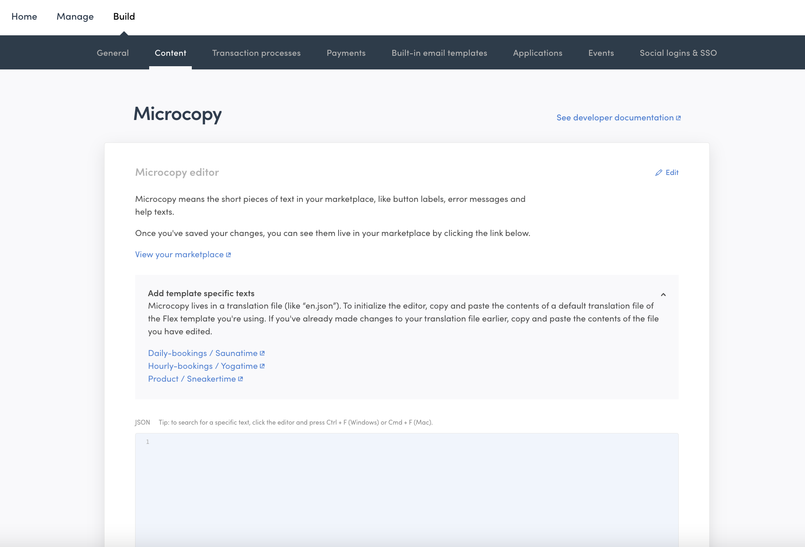
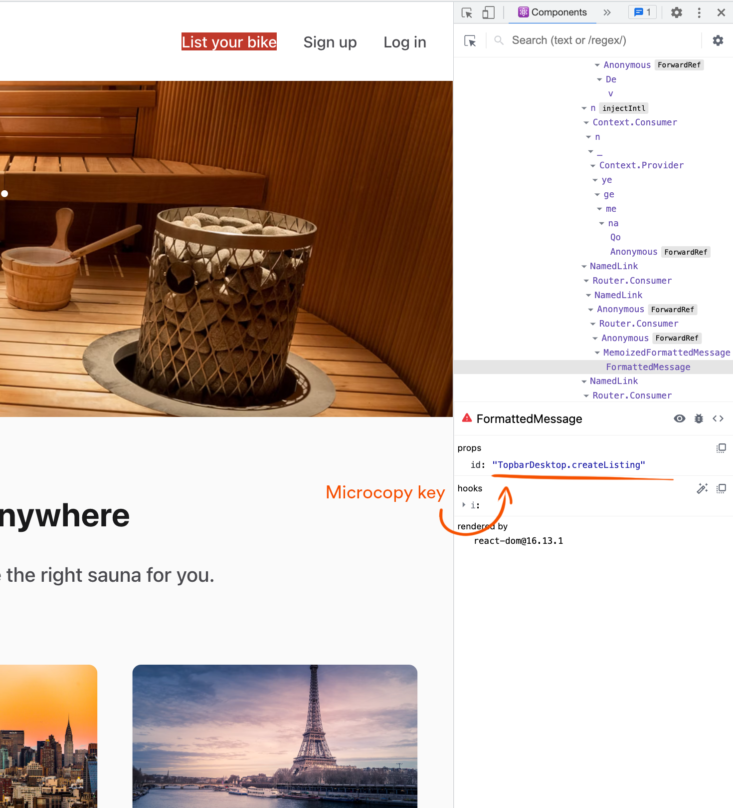
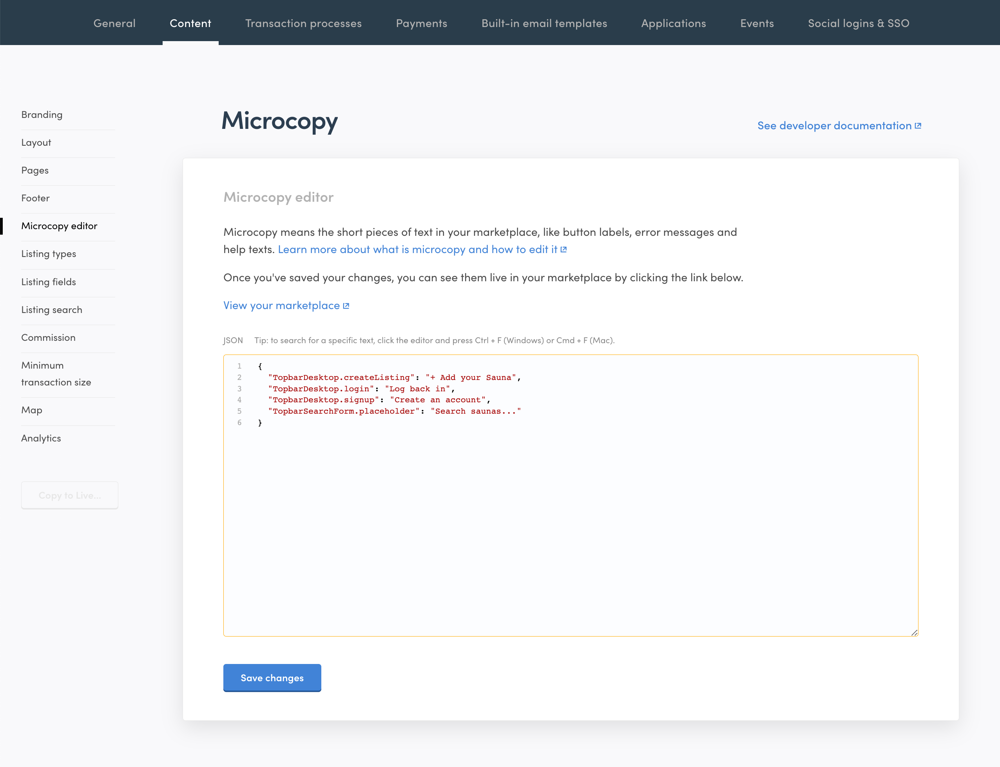
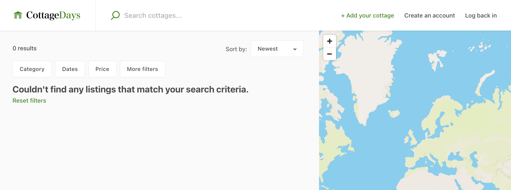

In this tutorial section, you will learn what is microcopy and how to
change it using the no-code interface in Console. We will change the
Bike-themed microcopy to match our Sauna-themed marketplace.

## What is microcopy

Microcopy refers to short, contextual written texts found throughout
your marketplace's interface, such as button labels, error messages, and
help texts. It plays a crucial role in setting the tone of communication
and making key vocabulary decisions that shape the user experience on a
website or application.

Like other hosted assets, your template application fetches the
microcopy you manage through the no-code interface in Console via our
[Asset Delivery API](https://www.sharetribe.com/api-reference/asset-delivery-api.html).

## Where to find microcopy

One of the biggest mandatory tasks for a customization project is to
change the user interface (UI) texts. Biketribe is a rental and sales
marketplace for bikes - so, there are quite many components and pages
where you will need to change the copy-texts.

The easiest way to modify the copy texts is through Flex Console, in
[Build > Content > Microcopy editor](https://flex-console.sharetribe.com/content).
This page helps you modify what in Flex is known as _microcopy_ – button
labels, help texts, and other small messages that help your user find
their way around the marketplace.



When you first start building your marketplace, the JSON field in the
Microcopy section is empty, and all microcopy comes from built-in
microcopy files in the template. (We refer to these texts as microcopy,
but in the template they are in the _translations_ folder. In addition
to the default _en.json_ file, there are other languages available,
which is why the folder is titled _translations_.)

In the Microcopy section, you can see a link that leads to the microcopy
folders for the Sharetribe Web Template repository, if you want to
[copy the relevant microcopy to Flex Console](/concepts/microcopy/#how-microcopy-are-handled-in-flex).
In this tutorial, we will not copy the full texts – instead, we will
enter only the microcopy we want to modify.

The built-in default microcopy for the Sharetribe Web Template can be
found in this _en.json_ file:

```shell
└── src
    └── translations
        └── en.json
```

In addition to microcopy, your marketplace has content pages, such as
**AboutPage**, **PrivacyPolicy**, and **TermsOfService**. Those pages
are managed in Flex Console under Content > Pages, and they can be
modified similarly to
[the landing page](/tutorial/modify-landing-page/).

In this tutorial, we change the microcopy of Hero component, but we have
another document that dives deeper into this topic:
[How to change bundled microcopy](/ftw/how-to-change-ftw-bundled-microcopy/)

## Change the microcopy for Topbar component

The content of the microcopy file has a format, where the "key" contains
a dot notation:<br />
_`"<ComponentName>.<microcopyKey>": "<microcopyMessage>"`_

So, there are a couple of ways to find the correct microcopy key for UI
components:

- You could search for a microcopy message in the microcopy file
- You could check the name of the component and search for the component
  name in the microcopy file.

The latter option becomes easier if you use browser extension: **React
Developer Tools**.<br /> Here's a link to
[Chrome extension](https://chrome.google.com/webstore/search/React%20Developer%20Tools?hl=en).



In the screenshot, the highlighted text (listing creation link) comes
from a component called **FormattedMessage**. This is a component from
[React Intl](https://github.com/formatjs/react-intl) library which the
template uses to embed microcopy messages to correct microcopy keys. If
you check the **props** section on the _Components_ tab of Web Inspector
(when React Developer Tools is installed), you see a row:
`id: "TopbarDesktop.createListing"`.

So, the microcopy message can be found from _en.json_ file under the
microcopy key: _TopbarDesktop.createListing_. There are also a few other
messages you can see in the top bar without signing in – some in the
_TopbarDesktop_ component and one in _TopbarSearchForm_. Let's change
all of them:

```json
{
  "TopbarDesktop.createListing": "+ Add your Sauna",
  "TopbarDesktop.login": "Log back in",
  "TopbarDesktop.signup": "Create an account",
  "TopbarSearchForm.placeholder": "Search saunas..."
}
```

Copy and paste the above rows, complete with the curly brackets, to the
Microcopy JSON field.



When you save the file, you should soon see the changes in the top bar
on the search page:



## Summary

Microcopy refers to short, contextual written texts found throughout the
marketplace's interface. In this tutorial, you learnt to modify the
microcopy of your marketplace using the no-code interface in Console.
You also learnt how to locate microcopy keys using the developer tools.

## Further reading

To get more insight into microcopy syntax, different language files, and
localization of dates and money values, you should check out the
article:
[How to change Sharetribe Web Template bundled microcopy](/ftw/how-to-change-ftw-bundled-microcopy/).

To learn more about how the hosted microcopy work in Sharetribe Web
Template, read the article on
[hosted assets in Sharetribe Web Template](/ftw/hosted-microcopy/).

To read more about how microcopy can be modified in Flex Console, check
out the article about [microcopy in Flex](/concepts/microcopy/).
