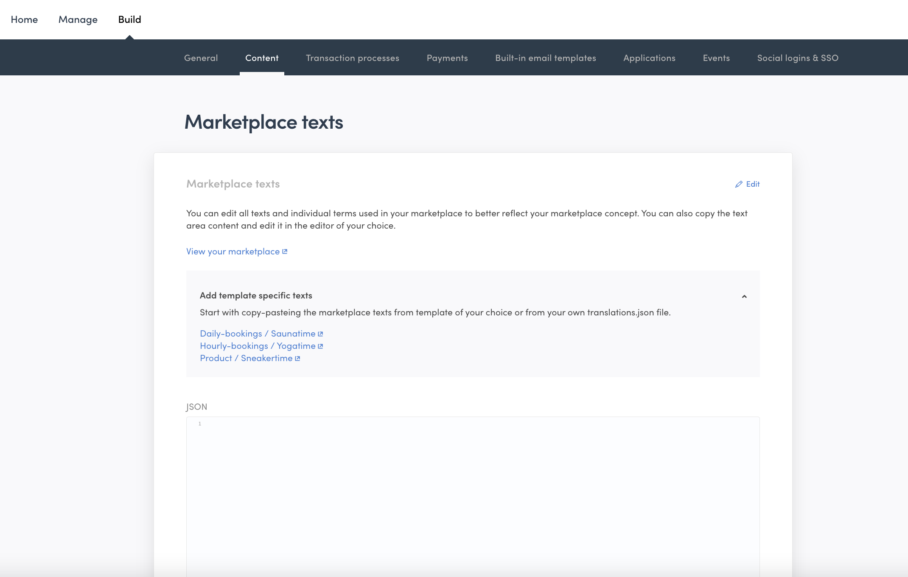
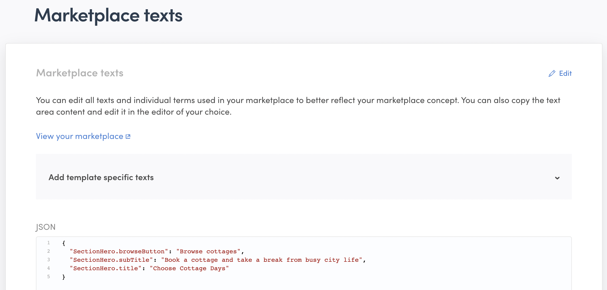

## Where to find copy-texts

One of the biggest mandatory tasks for a customization project is to
change the UI texts. FTW-daily is a rental marketplace for saunas - so,
there are quite many components and pages that need to change the
copy-texts.

The easiest way to modify the copy texts is through Flex Console, in
Build > Content.



_**Note:** Hosted assets are available in Flex and the FTW templates
starting from version v8.5. If you have an earlier version and want to
implement the feature in your template, you can see the necessary
modifications in the PR for [ftw-daily](https://github.com/sharetribe/ftw-daily/pull/1510)._

<extrainfo title="FTW-hourly and FTW-product versions with hosted translations">
In FTW-hourly, hosted translations are available in v10.5. In FTW-product, they are available in v9.2.
</extrainfo>

When you first start building your marketplace, the JSON field in
Marketplace texts is empty, and all marketplace texts come from built-in
translation files in the template. (We refer to copy-text as
translations, since there could be different translation files used
instead of the default one: _en.json_.)

In the Marketplace texts section, you can see links that lead to the
translation folders for each FTW template repository, if you want to
[copy the relevant translations to Flex Console](/concepts/translations/#how-translations-are-handled-in-flex).
In this tutorial, we will not copy the full texts – instead, we will
enter only the translations we want to modify.

The built-in default translations for the FTW template can be found in
this _en.json_ file:

```shell
└── src
    └── translations
        └── en.json
```

In addition to translations, there are also a couple of components that
contain a huge amount of text content (e.g. **AboutPage**,
**PrivacyPolicy**, and **TermsOfService**). The content of those
components is not included in the translation file since they need a
free-form structure and styling. It is easier to achieve that with a
markup language (like HTML and JSX) than key-value mapping you see in
_en.json_ file:

```json
  "LocationSearchForm.placeholder": "Search saunas…",
```

In this tutorial, we change the translations of Hero component, but we
have another document that dives deeper into this topic:
[How to change FTW bundled translations](/ftw/how-to-change-ftw-bundled-translations/)

## Change the translations for Hero component

The content of translation file has a format, where the "key" contains a
dot notation:<br />
_`"<ComponentName>.<translationKey>": "<translation>"`_

So, there are a couple of ways to find the correct translation for UI
components:

- You could search for a translation text in the translation file
- You could check the name of the component and search for the component
  name in the translation file.

The latter option becomes easier if you use browser extension: **React
Developer Tools**.<br /> Here's a link to
[Chrome extension](https://chrome.google.com/webstore/search/React%20Developer%20Tools?hl=en).


In the screenshot, the highlighted text (title) comes from a component
called **FormattedMessage**. This is a component from
[React Intl](https://github.com/formatjs/react-intl) library which FTW
templates use to embed translations to correct translation keys. If you
check the **props** section on the _Components_ tab of Web Inspector
(when React Developer Tools is installed), you see a row:
`id: "SectionHero.title"`.

So, the translation can be found from _en.json_ file under the
translation key: _SectionHero.title_. There are also 2 other
translations that SectionHero component uses. Let's change all of them:

```json
{
  "SectionHero.browseButton": "Browse cottages",
  "SectionHero.subTitle": "Book a cottage and take a break from busy city life",
  "SectionHero.title": "Choose Cottage Days"
}
```

Copy and paste the above rows, complete with the curly brackets, to the
Marketplace texts JSON field.



When you save the file, you should soon see the changes in the hero
section on the landing page:


To get more insight into translation syntax, different language files,
and localization of dates and money values, you should check the
article:
[How to change FTW bundled translations](/ftw/how-to-change-ftw-bundled-translations/).

To learn more about how the hosted translations work in FTW templates,
read the article on [hosted assets in FTW](/ftw/hosted-translations/).

To read more about how translations can be modified in Flex Console,
check out the article about
[translations in Flex](/concepts/translations/).

<br />

In the next article, you learn how to configure FTW-daily and change the
default currency.<br />
[› Go to the next article](/tutorial/configurations/)
