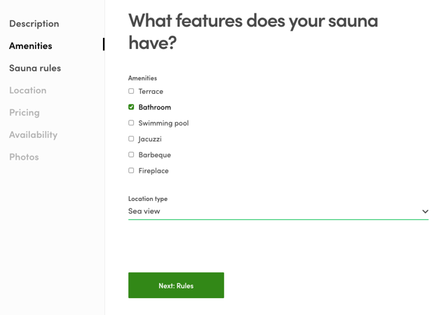

## Update listing's public data

Listing creation and updates are done in **EditListingWizard**
component. As the name suggests, it is a wizard-type UI component, where
a user needs to complete several steps to fill in the required
information. When the user has completed those steps, he/she has created
and published a new listing. EditListingWizard contains panel components
that provide those steps and inside each panel, there's a form, where
user's input is collected.

The first panel is a bit different than the others. When someone creates
a new listing, the listing entity is created after the first panel is
saved. At this point, the listing is in "draft" state, which means that
it is saved to the Flex, but the user has not yet provided all the data
for the listing and most importantly, the listing is not published yet.
Draft listings can't be discovered on the search page (i.e. with
`sdk.listing.query` call). All the other panels are just updating the
existing listing entity.

In this tutorial, we focus on the second panel. We want to split
CottageDays _amenities_ field into two. Currently, the options for
amenities contain both amenities and info about what kind of location
type or "view" the cottage has - is it by the lake, sea, forest, etc. To
create this new public data field, we'll edit two components:
EditListingFeaturesPanel and EditListingFeaturesForm.

```shell
└── src
    ├── components
    |   └── EditListingFeaturesPanel
    |       └── EditListingFeaturesPanel.js
    └── forms
        └── EditListingFeaturesForm
            └── EditListingFeaturesForm.js
```

<extrainfo title="FTW-product has moved EditListingWizard components under EditListingPage container">

FTW-product doesn't use EditListingFeaturesPanel, but you can use
EditListingDetailsPanel instead:

```shell
└── src
    └── containers
        └── EditListingPage
            └── EditListingWizard
                └── EditListingDetailsPanel
                    ├── EditListingDetailsPanel.js
                    └── EditListingFeaturesForm.js
```

</extrainfo>

> **Tip**: if you want to add a new panel to the _EditListingWizard_,
> you should check
> [this how-to guide](/how-to/extend-listing-data-in-ftw/) first.

### Save new field to public data

First, we start with EditListingFeaturesPanel.js. In that file,
EditListingFeaturesForm gets its props and we can modify what gets saved
to **_publicData_** attribute of the listing entity. We'll add _"view"_
key there with an empty string.

```jsx
  onSubmit={values => {
    const { amenities = [], view = '' } = values;

    const updatedValues = {
      publicData: { amenities, view },
    };
    onSubmit(updatedValues);
  }}
```

After that, if you save the form on the wizard, you'll actually save the
_"view"_ key to the public data and you can verify that by going to the
Flex Console and opening the correct listing card in _"Manage"_ tab.

### Pass initial values for the form

Saving public data to the Flex is one side of the coin. We also need to
get the saved value and pass it as the initial value for
EditListingFeaturesForm, when it gets rendered.

FTW templates use a library called
[🏁 React Final Form](https://final-form.org/) and it accepts
_initialValues_ property as a parameter. The existing code for setting
_initialValues_ looks like this:

```js
const amenities = publicData && publicData.amenities;
const initialValues = { amenities };
```

We'll change it to include _"view"_ field too:

```js
const amenities = publicData && publicData.amenities;
const view = publicData && publicData.view;
const initialValues = { amenities, view };
```

That's all we need to do for _EditListingFeaturesPanel.js_. However, the
UI hasn't changed on our client app yet, because we haven't provided any
inputs for the user.

> **Note**: since we are adding new form fields, it's good to make some
> copy-text changes too. E.g. change the word "amenities" to "features"
> on the panel's title by updating _src/translations/en.json_:
>
> ```json
> "EditListingFeaturesPanel.createListingTitle": "What features does your sauna have?",
> "EditListingFeaturesPanel.title": "Edit the features of {listingTitle}",
> ```

### Add FieldSelect input to the form

If we would add a text field to the listing entity, we could use
_FieldTextInput_ component with prop name being _"view"_. However, we'll
use FieldSelect component instead since we want to restrict the options
to known set - so that providers can't write whatever they want.

Before we add that JSX component, we need to define options for it. That
could be done directly in this file. However, since we are going to use
this field as a filter for listing queries in the future, we'll add the
config to the same file, where the amenities filter has its options:

```shell
└── src
    └── marketplace-custom-config.js
```

<extrainfo title="FTW-product has moved config files into a different location">

```shell
└── src
    └── config
        └── marketplace-custom-config.js
```

</extrainfo>

We'll add new single-select filter config after Amenities filter:

```js
  {
    id: 'view',
    label: 'View',
    type: 'SelectSingleFilter',
    group: 'secondary',
    queryParamNames: ['pub_view'],
    config: {
      // Schema type is enum for SelectSingleFilter
      schemaType: 'enum',
      options: [
        { key: 'sea', label: 'Sea view' },
        { key: 'lake', label: 'Lake view' },
        { key: 'forest', label: 'Forest view' },
        { key: 'garden', label: 'Garden view' },
      ],
    },
  },
```

Then we remove the `lake_view` and `sea_view` away from the options for
amenities filter.

Changes in _marketplace-custom-config.js_ file are already imported
through "config" import-variable and passed to EditListingFeaturesForm
component as _filterConfig_ property. We'll just need to add _view_ key
and options to the form. Then we need to import **FieldSelect**
component and add it to the returned JSX code:

```jsx
import {
  Button,
  FieldCheckboxGroup,
  FieldSelect,
  Form,
} from '../../components';
```

```jsx
  const options = findOptionsForSelectFilter('amenities', filterConfig);

  // Props for "view" select field
  const viewKey = 'view';
  const viewOptions = findOptionsForSelectFilter(viewKey, filterConfig);

  return (
    <Form className={classes} onSubmit={handleSubmit}>
      {errorMessage}
      {errorMessageShowListing}

      <FieldCheckboxGroup
        className={css.features}
        id={name}
        name={name}
        options={options}
        label="Amenities"
      />

      <FieldSelect
        className={css.features}
        name={viewKey}
        id={viewKey}
        label={'Location type'}
      >
        {viewOptions.map(o => (
          <option key={o.key} value={o.key}>
            {o.label}
          </option>
        ))}
      </FieldSelect>
```

> **Note**: we also added `label="Amenities"`to the amenities input.

Updated EditListingFeaturesPanel should look like this:


---

In then next article, we'll use this _"view"_ public data field on
listing page.<br />
[› Go to the next article](/tutorial/show-extended-data/)
