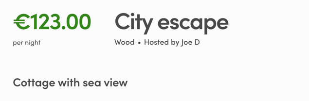

## Show public data on ListingPage

In the previous article, we added _"view"_ publicData key to the listing
entity. In this article, we add that info to the listing page.

To add a _view_ info to the **ListingPage** component we need to modify
_ListingPage.js_ and we also add a new subcomponent to that directory:
_SectionViewMaybe.js_.

```shell
└── src
    └── containers
        └── ListingPage
            ├── ListingPage.js
            └── SectionViewMaybe.js
```

### Add new subcomponent

_SectionViewMaybe.js_ contains the following code:

```jsx
import React from 'react';
import { FormattedMessage } from '../../util/reactIntl';

// Import css from existing CSS Modules file:
import css from './ListingPage.module.css';

// Create new React component
const SectionViewMaybe = props => {
  // Component's props should include all the possible options (from config)
  // and listing's publicData
  const { options, publicData } = props;
  const selectedOption =
    publicData && publicData.view ? publicData.view : null;

  // Don't return anything if public data doesn't contain view field
  // That's why we named this component as SectionViewMaybe
  if (!publicData || !selectedOption) {
    return null;
  }

  // Find selected options label
  const optionConfig = options.find(o => o.key === selectedOption);
  const optionLabel = optionConfig ? optionConfig.label : null;
  return (
    <div className={css.sectionFeatures}>
      <h2>
        <FormattedMessage
          id="ListingPage.viewType"
          values={{ view: optionLabel.toLowerCase() }}
        />
      </h2>
    </div>
  );
};

export default SectionViewMaybe;
```

### Modify ListingPage.js

We also need to modify _ListingPage.js_ to take the new subcomponent
into use.

##### Step 1: Import the component

```js
import SectionViewMaybe from './SectionViewMaybe';
```

##### Step 2: Get view options from filter config

This can be done similarly as amenity options

```js
const viewOptions = findOptionsForSelectFilter('view', filterConfig);
const amenityOptions = findOptionsForSelectFilter(
  'amenities',
  filterConfig
);
```

##### Step 3: Add new component to the returned JSX

```js
<SectionViewMaybe options={viewOptions} publicData={publicData} />
```

> **Note**: _publicData_ is already spread out of
> _currentListing.attributes_ on ListingPage.

### Add translation

In addition, we need to add the new translation key
(_"ListingPage.viewType"_) to microcopy:

```shell
└── src
    └── translations
        └── en.json
```

The translation we use contains a variable _"view"_.

```json
  "ListingPage.viewType": "Cottage with {view}",
```

---

After that you should have this new component visible on listings that
have "view" key set:


---

In the next article, we'll use this _"view"_ public data field on
listing page.<br />
[› Go to the next article](/tutorial/filter-with-extended-data/)
