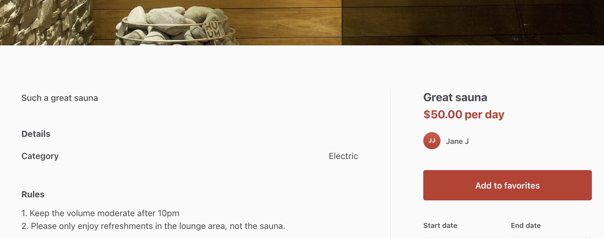
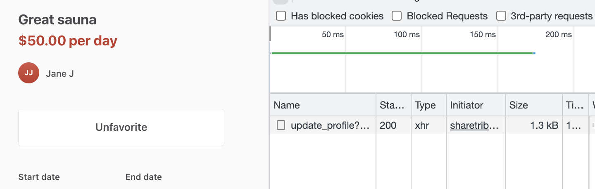
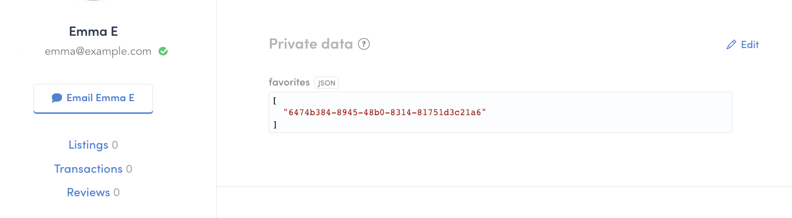
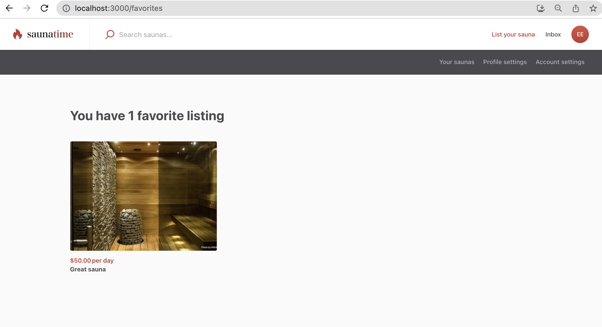
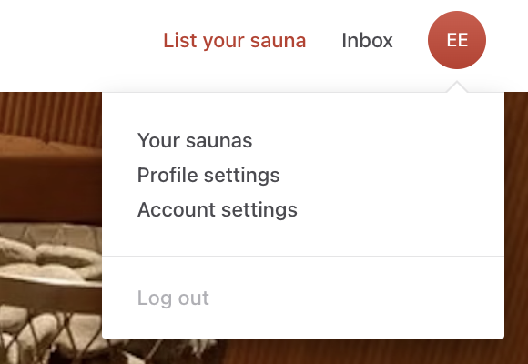
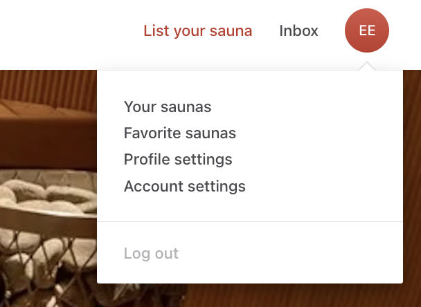
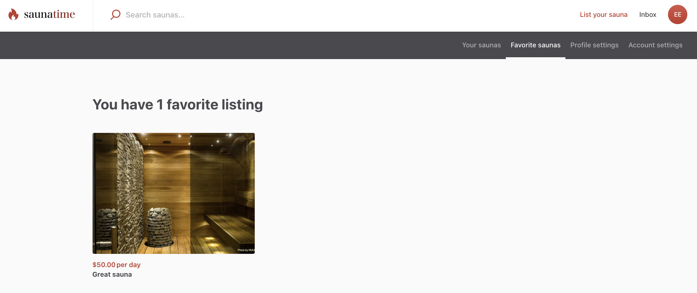

TODO FIGURE OUT IF THIS STILL EXISTS!

In the Saunatime marketplace, we want to enable users to save listings
on their favorites list. This way, users can save a list of favorite
saunas for the future, even if they don’t want to book immediately.

In this tutorial, you will

- Add a favorite button to the listing page
- Set the button to indicate whether the listing has already been
  favorited
- Save the favorites to the user’s extended data
- Create a new page, _FavoriteListingsPage_

<info>

This tutorial uses the following marketplace configurations:

- Layout > Listing page image layout: **Screen-wide cover photo**

</info>

## Add a favorite button to listing page

First, we will add a button on each listing so that a signed-in user can
favorite that particular listing. In this tutorial, we will add the
button to the _OrderPanel_ component, since it is used by both listing
page variants.

In addition, the listing’s title is shown in the _OrderPanel_ component,
and we want to add the favorite button as close to the listing title as
possible.

```shell
└── src
    └── components
        └── OrderPanel
            ├── OrderPanel.js
            └── OrderPanel.module.css

```

First, let’s import the button components. The _OrderPanel_ already
imports _PrimaryButton_, which is used as the “buy” button in the order
form, but we want our favorite button to look a bit different, so we
will import the components for _Button_ and _SecondaryButton_ as well.

```js
import {
  ModalInMobile,
  PrimaryButton,
  AvatarSmall,
  H1,
  H2,
  Button, // add these rows to the
  SecondaryButton, // existing import from '../../components'
} from '../../components';
```

Next, let’s add some props that we will need to build the functionality.
We are not yet receiving the props from the parent, so we can expect
some errors before we add them to the parent.

```diff
…
  fetchLineItemsInProgress,
  fetchLineItemsError,
+ onToggleFavorites,
+ currentUser,
} = props;
…
```

<extrainfo title="Add prop types for new props">

Whenever we add new props to a component, it is good practice to also
add their prop types to propTypes definition toward the end of the file.

```js
OrderPanel.propTypes = {
  rootClassName: string,
  className: string,
  …
  onToggleFavorites: func.isRequired,
  currentUser: propTypes.currentUser.isRequired,
…
```

</extrainfo>

Then, let’s create a button. We will add the button into a constant,
since we want to show a different button depending on whether the
listing has already been favorited. Add this snippet before the
`return (` row in the component.

```js
const isFavorite = currentUser?.attributes.profile.privateData.favorites?.includes(
  listing.id.uuid
);

const toggleFavorites = () => onToggleFavorites(isFavorite);

const favoriteButton = isFavorite ? (
  <SecondaryButton
    className={css.favoriteButton}
    onClick={toggleFavorites}
  >
    <FormattedMessage id="OrderPanel.unfavoriteButton" />
  </SecondaryButton>
) : (
  <Button className={css.favoriteButton} onClick={toggleFavorites}>
    <FormattedMessage id="OrderPanel.addFavoriteButton" />
  </Button>
);
```

<extrainfo title="Why does the isFavorite definition contain question marks?">

Above, we define the _isFavorite_ constant like this:

```js
const isFavorite = currentUser?.attributes.profile.privateData.favorites?.includes(
  listing.id.uuid
);
```

The question marks in between the attributes are
[optional chaining operators](https://developer.mozilla.org/en-US/docs/Web/JavaScript/Reference/Operators/Optional_chaining).
They are useful in situations where some of the attributes in the chain
might not exist.

For instance,

- _currentUser_ does not exist if the user browsing the listing is not
  signed in
- _favorites_ does not exist if the user is signed in but has not
  favorited anything yet

</extrainfo>

The button we added uses a css class _favoriteButton_. Let’s add it to
the end of _OrderPanel.module.css_.

```css
.favoriteButton {
  margin: 12px 0 36px 0;
}
```

Finally, we will show this component in the order panel, right under the
author information. Add the `{favoriteButton}` row under the `</div>`
with _className_ `css.author`.

```jsx
…
  <div className={css.author}>
    <AvatarSmall user={author} className={css.providerAvatar} />
    <span className={css.providerNameLinked}>
      <FormattedMessage id="OrderPanel.author" values={{ name: authorLink }} />
    </span>
    <span className={css.providerNamePlain}>
      <FormattedMessage id="OrderPanel.author" values={{ name: authorDisplayName }} />
    </span>
  </div>
  {favoriteButton} {/* Add this row */}
  {showPriceMissing ? (
    <PriceMissing />
  ) : showInvalidCurrency ? (
    <InvalidCurrency />
  ) : showBookingTimeForm ? (
…
```

Now, you can see the button in the order panel. However, the button text
shows the microcopy key of the message, not the message we want to show.


Let’s fix that by adding all the microcopy keys we need in this
tutorial. You can add them in Flex Console > Build > Content >
Microcopy, or in src/translations/en.js.

```json
…
  "FavoriteListingsPage.loadingFavoriteListings": "Loading listings…",
  "FavoriteListingsPage.noResults": "You haven't listed any saunas.",
  "FavoriteListingsPage.queryError": "Query failed. Please try again.",
  "FavoriteListingsPage.title": "View your favorite saunas",
  "FavoriteListingsPage.youHaveListings": "You have {count} favorite {count, plural, one {listing} other {listings}}",
  "OrderPanel.addFavoriteButton":"Add to favorites",
  "OrderPanel.unfavoriteButton":"Unfavorite",
  "TopbarDesktop.favoriteListingsLink": "Favorite saunas",
  "UserNav.favoriteListings": "Favorite saunas"
…
```

After adding the microcopy strings and saving your changes, you can
refresh your app and you will see the correct texts in the button.



Clicking the button will not do anything yet, so as the next step, we
will create the functionality to favorite a listing.

## Save the favorites to the user’s extended data

When the user clicks the favorite button, we want to save that click in
the user’s extended data. More specifically, if the listing is not in
the user’s favorites list, we want to add it there, and otherwise we
want to remove it.

In Flex, user profiles have four types of extended data:

- public data
- public metadata
- protected data
- private data

The first two types are, as the name suggests, public. They are the
correct choice when we want other marketplace users to be able to see
the data we save. Protected data can only be exposed in the context of a
transaction, and private data is only visible to the user themselves.

In this case, we want to use private data, because we do not need to
show the user’s favorite listings to other users.

We will add this logic to the listing page files. Since the template has
two different listing page components, the functionalities shared by the
two different components can be modified and added in the
_ListingPage.shared.js_ file.

We will then need to import and use those functionalities in the listing
page component we are using. Since the layout configuration in our
marketplace is _Screen-wide cover photo_, the corresponding listing page
component is _ListingPageCoverPhoto.js_.

<info>

If your listing page configuration is _Image carousel with thumbnails_,
you will need to modify the component _ListingPageCarousel.js_ instead.

</info>

Finally, we need to pass the necessary props to OrderPanel.js.

```shell
└── src
    └── containers
        └── ListingPage
            ├── ListingPage.shared.js
            └── ListingPageCarousel.js

```

First, we will add a _handleToggleFavorites_ function in the
_ListingPage.shared.js_ file. If the user is not logged in, we redirect
them to the signup page, and otherwise we toggle the listing id in their
favorites list.

```jsx
export const handleToggleFavorites = parameters => isFavorite => {
  const { currentUser, routes, location, history } = parameters;

  // Only allow signed-in users to save favorites
  if (!currentUser) {
    const state = {
      from: `${location.pathname}${location.search}${location.hash}`,
    };

    // Sign up and return back to the listing page.
    history.push(
      createResourceLocatorString('SignupPage', routes, {}, {}),
      state
    );
  } else {
    const { params, onUpdateFavorites } = parameters;
    const {
      attributes: { profile },
    } = currentUser;
    const { favorites = [] } = profile.privateData || {};

    let payload;

    if (!profile.privateData || !profile.privateData?.favorites) {
      payload = {
        privateData: {
          favorites: [params.id],
        },
      };
    } else if (isFavorite) {
      payload = {
        privateData: {
          favorites: favorites.filter(f => f !== params.id),
        },
      };
    } else {
      payload = {
        privateData: {
          favorites: [...favorites, params.id],
        },
      };
    }
    onUpdateFavorites(payload);
  }
};
```

This function receives the necessary information and actions from its
parameters, so all we need to know in this function is that we are
updating the current user’s private data.

Next, we call this function from _ListingPageCoverPhoto.js_. We will
first import the function we just created.

<info>

If your listing page configuration is _Image carousel with thumbnails_,
you will need to modify the component _ListingPageCarousel.js_ instead.

</info>

In addition, we need to import the Redux action that we will use to
actually update the user’s profile. For that, we can use the
_updateProfile_ action from _ProfileSettingsPage.duck.js_.

```js
import {
  LoadingPage,
  ErrorPage,
  priceData,
  listingImages,
  handleContactUser,
  handleSubmitInquiry,
  handleSubmit,
  handleToggleFavorites, // add this row to the existing './ListingPage.shared' import
} from './ListingPage.shared';

// Add this whole import statement
import { updateProfile } from '../ProfileSettingsPage/ProfileSettingsPage.duck';
```

<extrainfo title="What is Redux?">

The Sharetribe Web Template uses Redux to manage state. The app stores
some information so that it does not need to make API calls to fetch
information every time it needs to show something.

In addition, the template uses Redux for SDK and local API calls. This
means that containers or components themselves do not make SDK or API
calls, and instead they dispatch actions to Redux, and those actions
then call the SDK or API and handle the response. This means that those
actions can be called from several places in the application.

You can read more about Redux
[in their documentation](https://redux.js.org/).

</extrainfo>

We cannot call the _updateProfile_ Redux action directly as a function.
Whenever we use Redux actions from a container, we need to use the
[mapDispatchToProps](https://react-redux.js.org/using-react-redux/connect-mapdispatch)
mapping to use the actions through props in the component.

The _ListingPageCoverPhoto_ component already has a _mapDispatchToProps_
function, so we can add the _updateProfile_ action as a prop for the
component there.

Find the _mapDispatchToProps_ function in the component, and add the
_onUpdateFavorites_ row below.

```jsx
const mapDispatchToProps = dispatch => ({
 …
  onFetchTimeSlots: (listingId, start, end, timeZone) =>
    dispatch(fetchTimeSlots(listingId, start, end, timeZone)),
  onUpdateFavorites: (payload) => dispatch(updateProfile(payload)), // add this row
});
```

We can give our prop a descriptive name, such as _onUpdateFavorites_,
since in this component we are only using it for that purpose.

Now, the _ListingPageCoverPhoto_ props contains the _onUpdateFavorites_
function that we can use. Let’s add it to the
[destructured](https://developer.mozilla.org/en-US/docs/Web/JavaScript/Reference/Operators/Destructuring_assignment)
list in the beginning of the component.

```js
  const {
    isAuthenticated,
    currentUser,
…
    routeConfiguration,
    onUpdateFavorites, // add this row
  } = props;

```

Now, we can add a function that we can pass to _OrderPanel_ as the
_onToggleFavorites_ prop. Add the following block before the `return (`
statement of the component.

```js
const onToggleFavorites = handleToggleFavorites({
  ...commonParams,
  currentUser,
  onUpdateFavorites,
  location,
});
```

Finally, we can pass the necessary props to _OrderPanel_ to connect the
functionality with the button we created earlier. Add the _currentUser_
and _onToggleFavorites_ props to the _OrderPanel_ component in
_ListingPageCoverPhoto_.

```js
    <OrderPanel
      className={css.productOrderPanel}
      …
      marketplaceName={config.marketplaceName}
      onToggleFavorites={onToggleFavorites}
      currentUser={currentUser}
    />

```

Now, when you navigate to a listing’s page and open your
[Dev Tools Network tab](https://developer.chrome.com/docs/devtools/network/),
you can see that each click of the button triggers an _update_profile_
network call that saves the click information.



<extrainfo title="How does the network call propagate to the button?">

The flow of the data happens like this:

- User clicks the button and triggers the _handleToggleFavorites_
  function
- the _handleToggleFavorites_ function dispatches the Redux action to
  update the current user’s profile
- the Redux action _updateProfile_ calls the
  _sdk.currentUser.updateProfile_ endpoint with the payload containing
  _privateData.favorites_
- when the sdk call succeeds, it returns the updated _currentUser_
  resource
- the Redux action then calls _currentUserShowSuccess_, which updates
  the _currentUser_ in the store with the updated resource
- the _currentUser_ prop that we pass from ListingPageCarousel to
  OrderPanel is mapped to Redux state, so any changes to currentUser in
  state are immediately reflected in the prop

</extrainfo>

You can also verify this in Flex Console – navigate to Manage > Users
and find the details card of the user with whom you favorited the
listing. You can see in their Private data that the user now has a
favorites list with this listing's id.



## Create FavoriteListingsPage

In addition to seeing the favorite status on the individual listing’s
page, we want to show all favorited listings on a separate page. For
that reason, let’s make a new page called _FavoriteListingsPage_.

First, let’s add a new folder to _containers_ directory for
_FavoriteListingsPage_.

```shell
└── src
    └── containers
        └── FavoriteListingsPage

```

Then, add the following files in the folder:

- [FavoriteListingsPage.js](/tutorial-assets/FavoriteListingsPage.js)
- [FavoriteListingsPage.duck.js](/tutorial-assets/FavoriteListingsPage.duck.js)
- [FavoriteListingsPage.module.css](/tutorial-assets/FavoriteListingsPage.module.css)

<extrainfo title="FavoriteListingsPage.js explained">

This section will go through FavoriteListingsPage.js in more detail.

First, we import the necessary elements used in the file. In this
section, all rows start with import.

Then, we create the component itself. We first use
[destructuring assignment](https://developer.mozilla.org/en-US/docs/Web/JavaScript/Reference/Operators/Destructuring_assignment)
to set our props into constants for ease of use.

We also create a few other constants to then pass to the returned
element. Some of those constants are simple values, others are more
complex elements.

```js
export const FavoriteListingsPageComponent = props => {
  const { listings, pagination, queryInProgress, queryFavoritesError, queryParams, scrollingDisabled, intl } = props;

  const hasPaginationInfo = !!pagination && pagination.totalItems != null;
  const listingsAreLoaded = !queryInProgress && hasPaginationInfo;

    const loadingResults = (
    <div className={css.messagePanel}>
      <H3 as="h2" className={css.heading}>
        <FormattedMessage id="FavoriteListingsPage.loadingFavoriteListings" />
      </H3>
    </div>
  );

  const queryError = (
    <div className={css.messagePanel}>
      <H3 as="h2" className={css.heading}>
        <FormattedMessage id="FavoriteListingsPage.queryError" />
      </H3>
    </div>
  );

  const noResults =
    listingsAreLoaded && pagination.totalItems === 0 ? (
      <H3 as="h1" className={css.heading}>
        <FormattedMessage id="FavoriteListingsPage.noResults" />
      </H3>
    ) : null;

  const heading =
    listingsAreLoaded && pagination.totalItems > 0 ? (
      <H3 as="h1" className={css.heading}>
        <FormattedMessage
          id="FavoriteListingsPage.youHaveListings"
          values={{ count: pagination.totalItems }}
        />
      </H3>
    ) : (
      noResults
    );

  const page = queryParams ? queryParams.page : 1;
  const paginationLinks =
    listingsAreLoaded && pagination && pagination.totalPages > 1 ? (
      <PaginationLinks
        className={css.pagination}
        pageName="FavoriteListingsPage"
        pageSearchParams={{ page }}
        pagination={pagination}
      />
    ) : null;

  const title = intl.formatMessage({ id: 'FavoriteListingsPage.title' });

  const panelWidth = 62.5;
  // Render hints for responsive image
  const renderSizes = [
    `(max-width: 767px) 100vw`,
    `(max-width: 1920px) ${panelWidth / 2}vw`,
    `${panelWidth / 3}vw`,
  ].join(', ');
```

Then, we return the actual page. We use the Page and LayoutSingleColumn
components to wrap our Favorites page specific content, and to show the
topbar and footer elements.

Inside the layout component, we first show a loading indicator or an
error message, if either exists. Then, we map our array of favorited
listings into ListingCard components to display them on the page.
Finally, we show a pagination element, if the listing array has more
than one page of listings.

```js
  return (
    <Page title={title} scrollingDisabled={scrollingDisabled}>
      <LayoutSingleColumn
        topbar={
          <>
            <TopbarContainer currentPage="FavoriteListingsPage" />
            <UserNav currentPage="FavoriteListingsPage" />
          </>
        }
        footer={<FooterContainer />}
      >
        {queryInProgress ? loadingResults : null}
        {queryFavoritesError ? queryError : null}
        <div className={css.listingPanel}>
          {heading}
          <div className={css.listingCards}>
            {listings.map(l => (
              <ListingCard
                className={css.listingCard}
                key={l.id.uuid}
                listing={l}
                renderSizes={renderSizes}
              />
            ))}
          </div>
          {paginationLinks}
        </div>
      </LayoutSingleColumn>
    </Page>
  );
};
```

After the return statement, we define the component's properties in more
detail.

Then, we define the
[mapStateToProps](https://react-redux.js.org/using-react-redux/connect-mapstate)
function to determine what data from the Redux store should be returned
as props for the component.

```js
const mapStateToProps = state => {
  const {
    currentPageResultIds,
    pagination,
    queryInProgress,
    queryFavoritesError,
    queryParams,
  } = state.FavoriteListingsPage;
  const listings = getListingsById(state, currentPageResultIds);
  return {
    currentPageResultIds,
    listings,
    pagination,
    queryInProgress,
    queryFavoritesError,
    queryParams,
    scrollingDisabled: isScrollingDisabled(state),
  };
};
```

Finally, we compose and export our component. We need to compose it with
both
[injectIntl](https://formatjs.io/docs/react-intl/api/#injectintl-hoc),
which allows us to use microcopy in the component, and Redux, which
allows us to get data from the store as props.

```js
const FavoriteListingsPage = compose(
  connect(mapStateToProps),
  injectIntl
)(FavoriteListingsPageComponent);

export default FavoriteListingsPage;
```

</extrainfo>

<extrainfo title="FavoriteListingsPage.duck.js explained">

This section will go through FavoriteListingsPage.duck.js in more
detail.

First, we import the necessary elements, and define the result page
size.

Then, we start creating the different elements of the
[Redux ducks pattern](https://github.com/erikras/ducks-modular-redux):

- [Actions](https://redux.js.org/usage/reducing-boilerplate#actions)
- [Reducer](https://redux.js.org/usage/reducing-boilerplate#reducers)
- [Action creators](https://redux.js.org/usage/reducing-boilerplate#action-creators)
- [Thunks](https://redux.js.org/usage/writing-logic-thunks)

For action types, we export three different ones: a request action, a
success action, and an error action for fetching listings.

Then, we define initial state and a helper function _resultIds_, and
create and export the reducer for the page. The reducer defines state
behavior for each of the three action types defined earlier, as well as
a default.

```jsx
const favoriteListingsPageReducer = (
  state = initialState,
  action = {}
) => {
  const { type, payload } = action;
  switch (type) {
    case FETCH_LISTINGS_REQUEST:
      return {
        ...state,
        queryParams: payload.queryParams,
        queryInProgress: true,
        queryFavoritesError: null,
        currentPageResultIds: [],
      };
    case FETCH_LISTINGS_SUCCESS:
      return {
        ...state,
        currentPageResultIds: resultIds(payload.data),
        pagination: payload.data.meta,
        queryInProgress: false,
      };
    case FETCH_LISTINGS_ERROR:
      // eslint-disable-next-line no-console
      console.error(payload);
      return {
        ...state,
        queryInProgress: false,
        queryFavoritesError: payload,
      };
    default:
      return state;
  }
};
```

Next, we export action creators, one for each action type.

Finally, we create our thunks to call SDK. The main SDK call we want to
make on this page is fetching listings based on the user's favorite
listings. We therefore export a _queryFavoriteListings_ thunk.

The structure of the thunk serves an example of most of the thunks in
the Sharetribe Web Template.

- Dispatch a **request** action – this sets a selection of values in
  state, for instance _queryInProgress: true_, which the page can then
  use to display a loading indicator
- Set up SDK call parameters
- Make SDK call
- For a successful SDK response, handle the response data and dispatch a
  **success** action – this again sets a selection values in state,
  which the page can use to stop loading indication and display the data
- In case of an error, dispatch an **error** action – this sets a
  selection of values in state that the page can use to stop loading
  indication and display an error message.

```jsx
export const queryFavoriteListings = queryParams => (
  dispatch,
  getState,
  sdk
) => {
  dispatch(queryFavoritesRequest(queryParams));
  const { currentUser } = getState().user;
  const { favorites } =
    currentUser?.attributes.profile.privateData || {};

  const favoritesMaybe = favorites ? { ids: favorites } : {};
  const { perPage, ...rest } = queryParams;
  const params = { ...favoritesMaybe, ...rest, perPage };

  return sdk.listings
    .query(params)
    .then(response => {
      dispatch(addMarketplaceEntities(response));
      dispatch(queryFavoritesSuccess(response));
      return response;
    })
    .catch(e => {
      dispatch(queryFavoritesError(storableError(e)));
      throw e;
    });
};
```

In addition to the _queryFavoriteListings_ thunk, we export a _loadData_
function that gets called when the page loads, which in turn calls the
_queryFavoriteListings_ thunk to initiate the listing fetching process.

</extrainfo>

Now, since we are creating a new container with a new Redux file, we
will need to take it into use in _reducers.js_ as well.

```shell
└── src
	└── containers
		└── reducers.js
```

Add an import and an export for _FavoriteListingsPage_ in the
_reducers.js_ file.

```jsx
import FavoriteListingsPage from './FavoriteListingsPage/FavoriteListingsPage.duck';
…
export {
  CheckoutPage,
  ContactDetailsPage,
  EditListingPage,
  FavoriteListingsPage,
  …
```

Next, in order to show the page in a specific route, we need to add a
route and a data loading function. We will do this in the following
files:

```shell
└── src
	├── containers
	│	└── pageDataLoadingAPI.js
	└── routing
		└── routeConfiguration.js
```

Add import for _FavoriteListingsPageLoader_, and a new property in the
return object, in _pageDataLoadingAPI.js_.

```js
import { loadData as FavoriteListingsPageLoader } from './FavoriteListingsPage/FavoriteListingsPage.duck';
…
const getPageDataLoadingAPI = () => {
  return {
    AuthenticationPage: {
      loadData: AuthenticationPageLoader,
    },
    …
    FavoriteListingsPage: {
      loadData: FavoriteListingsPageLoader,
    },
```

Then, add a new route in _routeConfiguration.js_. Again, we first need
to import the page, and then we add an object specifying the path and
the necessary elements, including the load data function we just added
to _pageDataLoadingAPI_.

```js
const FavoriteListingsPage = loadable(() => import(/* webpackChunkName: "FavoriteListingsPage" */ '../containers/FavoriteListingsPage/FavoriteListingsPage'));
…
  return [
    {
      path: '/',
      name: 'LandingPage',
      component: LandingPage,
      loadData: pageDataLoadingAPI.LandingPage.loadData,
    },
    …
    {
      path: '/favorites',
      name: 'FavoriteListingsPage',
      auth: true, // user must be signed in to view this page
      authPage: 'LoginPage',
      component: FavoriteListingsPage,
      loadData: pageDataLoadingAPI.FavoriteListingsPage.loadData,
    },
```

Now, when you navigate to _localhost:3000/favorites_, you can see your
favorited listings.



## Add navigation

As the final step, we will add our new favorite listings page into the
navigation elements of the page – TopBar and UserNav.

```shell
└── src
    └── components
      ├── Topbar
          └── TopbarDesktop.js
      └── UserNav
          └── UserNav.js
```

In the top bar, we will add Favorite Listings as a menu item to the
profile menu that opens when a user clicks their avatar in the top right
corner.



To add the profile menu item, add the following code snippet in the
profileMenu before the row `<MenuItem key="ProfileSettingsPage">`

```
    <MenuItem key="FavoriteListingsPage">
      <NamedLink
        className={classNames(css.yourListingsLink, currentPageClass('FavoriteListingsPage'))}
        name="FavoriteListingsPage"
      >
        <span className={css.menuItemBorder} />
        <FormattedMessage id="TopbarDesktop.favoriteListingsLink" />
      </NamedLink>
    </MenuItem>
```

Now, we can see a link to favorite listings page when we click the
user’s profile image.



The last addition comes to the UserNav component.

When we click on the profile menu link for favorite listings, we get to
the page. However, the user navigation bar does not show the favorite
listings page.


Let’s add the link next. Open the _UserNav.js_ file and replace the tabs
array with the following code:

```
  const tabs = [
    {
      text: <FormattedMessage id="UserNav.yourListings" />,
      selected: currentPage === 'ManageListingsPage',
      linkProps: {
        name: 'ManageListingsPage',
      },
    },
    {
      text: <FormattedMessage id="UserNav.favoriteListings" />,
      selected: currentPage === 'FavoriteListingsPage',
      linkProps: {
        name: 'FavoriteListingsPage',
      },
    },
    {
      text: <FormattedMessage id="UserNav.profileSettings" />,
      selected: currentPage === 'ProfileSettingsPage',
      disabled: false,
      linkProps: {
        name: 'ProfileSettingsPage',
      },
    },
    {
      text: <FormattedMessage id="UserNav.accountSettings" />,
      selected: ACCOUNT_SETTINGS_PAGES.includes(currentPage),
      disabled: false,
      linkProps: {
        name: 'ContactDetailsPage',
      },
    },
  ];

```

Now, when you save the file and refresh the app, you will see a link to
Favorite saunas in between the links for your listings and profile
settings.



And that’s it! The Saunatime marketplace now allows users to set
listings as favorites and view them on a separate page.

## Summary

In this tutorial, you have

- Added a button element to _OrderPanel_ that shows up differently based
  on whether the listing has been favorited
- Added a shared listing page function for updating the user’s extended
  data
- Created a new page called _FavoriteListingsPage_ and set up the
  correct routing for it
- Added the new page to the top bar profile menu and user navigation bar
