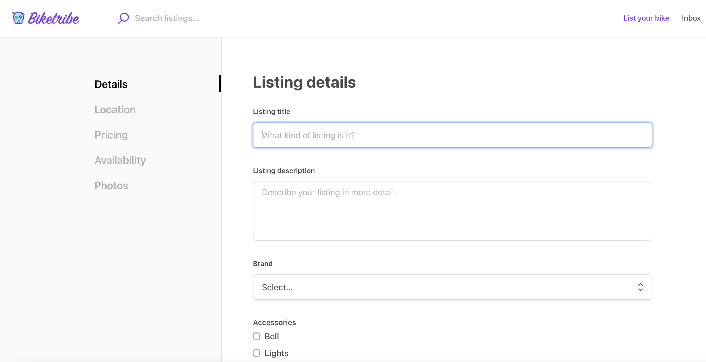
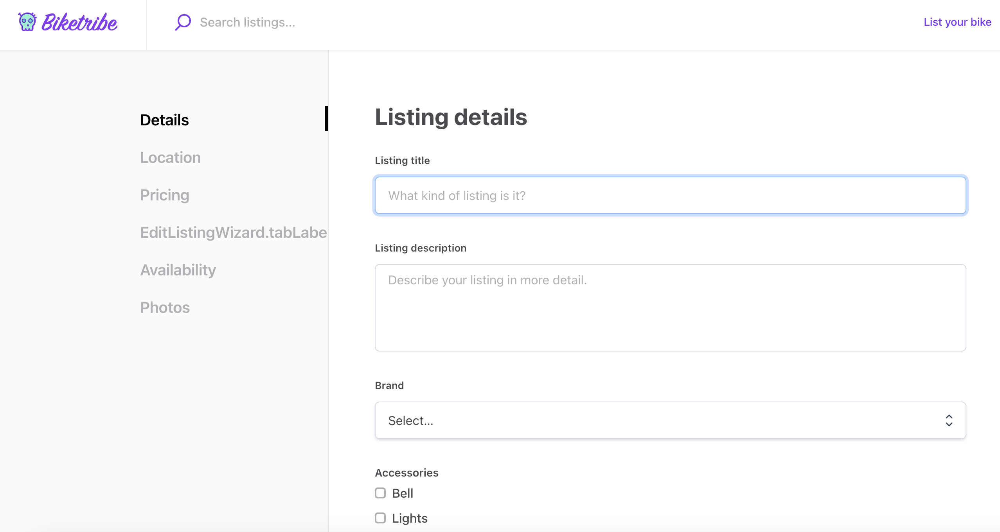
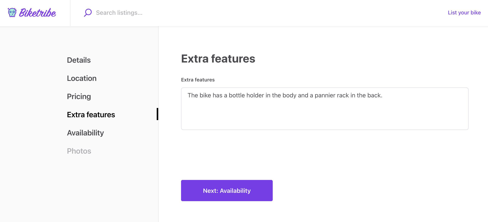
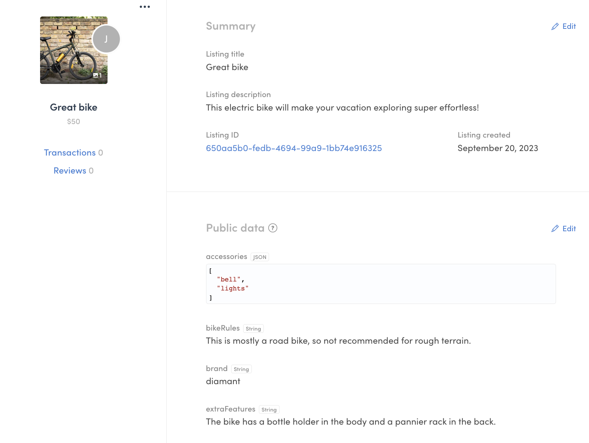
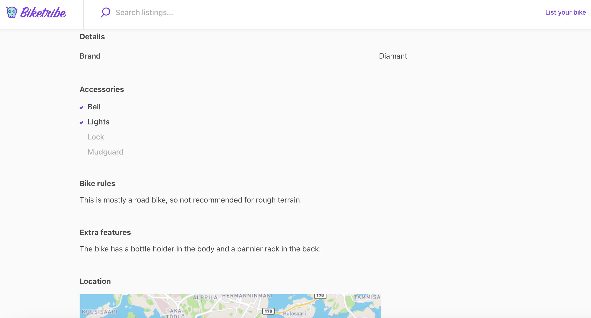

The template has default tabs in the listing creation wizard for both
bookings and purchases. The first of those tabs, “Details” shows the
attributes you have configured for your marketplace listings in
Sharetribe Console. However, you can also add custom tabs to the listing
creation flow.



In addition to having a listing description, we want to allow providers
to explain any potential extra features of their rental bike in more
detail.

In this tutorial, you will

- Add _EditListingExtraFeaturesPanel_ and _EditListingExtraFeaturesForm_
  components
- Use the new panel in _EditListingWizard_
- Show the listing’s extra features on the listing page with the
  _SectionTextMaybe_ component

<info>

This tutorial uses the following marketplace configurations:

- Layout > Listing page image layout: **Image carousel with thumbnails**
- Listing types > Transaction process: **Calendar booking**

</info>

## Add EditListingExtraFeaturesPanel and EditListingExtraFeaturesForm

The different listing wizard panels can be found in the EditListingPage
folder under EditListingWizard.

```shell
└── src
    └── containers
        └── EditListingPage
            └── EditListingWizard
                ├── …
                ├── EditListingAvailabilityPanel
                ├── EditListingDeliveryPanel
                ├── EditListingDetailsPanel
                ├── …
```

Each panel has the same structure:

- EditListing[...]Panel.js and .module.css
- EditListing[...]Form.js, .example.js, .test.js, and .module.css

In this tutorial, we will use the following files.

- [EditListingExtraFeaturesPanel.js](/tutorial-assets/EditListingExtraFeaturesPanel.js)
- [EditListingExtraFeaturesPanel.module.css](/tutorial-assets/EditListingExtraFeaturesPanel.module.css)
- [EditListingExtraFeaturesForm.js](/tutorial-assets/EditListingExtraFeaturesForm.js)
- [EditListingExtraFeaturesForm.module.css](/tutorial-assets/EditListingExtraFeaturesForm.module.css)

Create a new folder titled _EditListingExtraFeaturesPanel_ in the
_EditListingWizard_ folder. Add the above files into the new folder.

```shell
└── src
    └── containers
        └── EditListingPage
            └── EditListingWizard
                └── EditListingExtraFeaturesPanel
                    ├── EditListingExtraFeaturesPanel.js
                    ├── …
```

<extrainfo title="Add .example.js and .test.js files">

If you want to add _EditListingExtraFeaturesForm.example.js_ and
_EditListingExtraFeaturesForm.test.js_ files as well, you can download
them here

- [EditListingExtraFeaturesForm.test.js](/tutorial-assets/EditListingExtraFeaturesForm.test.js)
- [EditListingExtraFeaturesForm.example.js](/tutorial-assets/EditListingExtraFeaturesForm.example.js)

</extrainfo>

<extrainfo title="EditListingExtraFeaturesPanel.js explained">

This section will go through _EditListingExtraFeaturesPanel_ in more
detail.

First, we import the necessary elements used in the file. In this
section, all rows start with `import`.

Next, we create a helper function `getInitialValues` to return any
existing value of the extra features from the listing's public data.

```js
const getInitialValues = params => {
  const { listing } = params;
  const { extraFeatures } = listing?.attributes.publicData || {};

  return { extraFeatures };
};
```

Then, we create the component itself. We first use
[destructuring assignment](https://developer.mozilla.org/en-US/docs/Web/JavaScript/Reference/Operators/Destructuring_assignment)
to set our props into constants for ease of use. We also create a
handful of other constants to then pass to the returned element.

```js
const EditListingExtraFeaturesPanel = props => {
  const {
    className,
    rootClassName,
    listing,
    disabled,
    ready,
    onSubmit,
    submitButtonText,
    panelUpdated,
    updateInProgress,
    errors,
  } = props;

  const classes = classNames(rootClassName || css.root, className);
  const initialValues = getInitialValues(props);
  const isPublished = listing?.id && listing?.attributes?.state !== LISTING_STATE_DRAFT;
  const unitType = listing?.attributes?.publicData?.unitType;
```

The second half of the component is the returned element. First, we show
a title that depends on whether the listing has been published or not.
Then, we show the actual EditListingExtraFeaturesForm.

In the form _onSubmit_ function, we again use destructuring assignment
for retrieving the value of _extraFeatures_ from the incoming values,
and then set _extraFeatures_ as an attribute for _publicData_ before
calling the _onSubmit_ function received as a prop.

```js
  return (
    <div className={classes}>
      <H3 as="h1">
        {isPublished ? (
          <FormattedMessage
            id="EditListingExtraFeaturesPanel.title"
            values={{ listingTitle: <ListingLink listing={listing} />, lineBreak: <br /> }}
          />
        ) : (
          <FormattedMessage
            id="EditListingExtraFeaturesPanel.createListingTitle"
            values={{ lineBreak: <br /> }}
          />
        )}
      </H3>
      <EditListingExtraFeaturesForm
        className={css.form}
        initialValues={initialValues}
        onSubmit={values => {
          const { extraFeatures = '' } = values;

          // New values for listing attributes
          const updateValues = {
            publicData: {
              extraFeatures
            }
          };
          onSubmit(updateValues);
        }}
        unitType={unitType}
        saveActionMsg={submitButtonText}
        disabled={disabled}
        ready={ready}
        updated={panelUpdated}
        updateInProgress={updateInProgress}
        fetchErrors={errors}
      />
    </div>
  );
};
```

The rest of the file defines the necessary props more closely, and
finally exports the component.

</extrainfo>

<extrainfo title="EditListingExtraFeaturesForm.js explained">

This section will go through EditListingExtraFeaturesForm in more
detail.

First, we import the necessary elements used in the file. In this
section, all rows start with `import`.

Then, we create the form component. Forms in the Sharetribe Web Template
use the
[Final Form library](https://final-form.org/docs/final-form/getting-started)
for form state management. This means that on the highest level, we
directly return a _FinalForm_ component from our
EditListingExtraFeaturesFormComponent. We then use the FinalForm
component's _render_ prop to customise our Extra features form behavior.

```js
export const EditListingExtraFeaturesFormComponent = props => (
  <FinalForm
    {...props}
    render={formRenderProps => {
      const {
        formId,
        autoFocus,
        className,
        disabled,
        ready,
        handleSubmit,
        intl,
        invalid,
        pristine,
        saveActionMsg,
        updated,
        updateInProgress,
        fetchErrors,
      } = formRenderProps;

      const classes = classNames(css.root, className);
      const submitReady = (updated && pristine) || ready;
      const submitInProgress = updateInProgress;
      const submitDisabled = invalid || disabled || submitInProgress;
      const { updateListingError, showListingsError } = fetchErrors || {};
```

Above, we have defined the necessary constants to use in the form. It is
good to note that the EditListingExtraFeaturesForm component receives an
_onSubmit_ prop, defined in EditListingExtraFeaturesPanel, that gets
passed directly to the FinalForm component. The FinalForm component
wraps that prop as the _handleSubmit_ form render prop, which we then
pass to the actual Form as _onSubmit_.

The form itself contains only one text field, and the submit button. In
addition, we show any errors from props.

```js
      return (
        <Form onSubmit={handleSubmit} className={classes}>
          {updateListingError ? (
            <p className={css.error}>
              <FormattedMessage id="EditListingExtraFeaturesForm.updateFailed" />
            </p>
          ) : null}
          {showListingsError ? (
            <p className={css.error}>
              <FormattedMessage id="EditListingExtraFeaturesForm.showListingFailed" />
            </p>
          ) : null}
          <FieldTextInput
            id={`${formId}extraFeatures`}
            name="extraFeatures"
            className={css.input}
            autoFocus={autoFocus}
            type="textarea"
            label="Extra features"
            placeholder={intl.formatMessage({ id: 'EditListingExtraFeaturesForm.extraFeaturesInputPlaceholder' })}
          />

          <Button
            className={css.submitButton}
            type="submit"
            inProgress={submitInProgress}
            disabled={submitDisabled}
            ready={submitReady}
          >
            {saveActionMsg}
          </Button>
        </Form>
      );
    }}
  />
);
```

The rest of the file defines the necessary props more closely, and
finally exports the component. Since the form uses Console-editable
marketplace texts, and therefore needs the
[_intl_ object](https://formatjs.io/docs/react-intl/api/#the-intl-object),
we need to compose
[injectIntl](https://formatjs.io/docs/react-intl/api/#injectintl-hoc)
when exporting the component.

```js
export default compose(injectIntl)(
  EditListingExtraFeaturesFormComponent
);
```

</extrainfo>

## Use the new panel in EditListingWizard

When a provider creates their listing, they navigate through the Edit
Listing Wizard. The wizard has a layered structure:

- _EditListingWizardTab_ component imports all different listing edit
  panels, and determines which one to render based on a `tab` prop
- _EditListingWizard_ component imports and shows the
  _EditListingWizardTab_ component and an array of supported tabs, as
  well as navigation and the Stripe onboarding parts of the wizard

So to use our new _EditListingExtraFeaturesPanel_ component, we need to

- import it in the _EditListingWizardTab_ component
- render it in the correct context, and
- add `EXTRAFEATURES` to the list of supported tabs

### Add EditListingExtraFeaturesPanel to EditListingWizardTab

First, import the EditListingExtraFeaturesPanel component in
EditListingWizardTab.

```shell
└── src
    └── containers
        └── EditListingPage
            └── EditListingWizard
                ├── EditListingWizardTab.js
                ├── …
```

```diff
  import EditListingPricingPanel from './EditListingPricingPanel/EditListingPricingPanel';
  import EditListingPricingAndStockPanel from './EditListingPricingAndStockPanel EditListingPricingAndStockPanel';
+ import EditListingExtraFeaturesPanel from './EditListingExtraFeaturesPanel/EditListingExtraFeaturesPanel';

```

The EditListingWizardTab component also exports constants for all
supported panels, so let’s add the new EXTRAFEATURES panel in that list,
as well as into the SUPPORTED_TABS array.

```js
export const DETAILS = 'details';
export const PRICING = 'pricing';
export const PRICING_AND_STOCK = 'pricing-and-stock';
export const EXTRAFEATURES = 'extra-features';
export const DELIVERY = 'delivery';
export const LOCATION = 'location';
export const AVAILABILITY = 'availability';
export const PHOTOS = 'photos';
export const STYLE = 'style';

// EditListingWizardTab component supports these tabs
export const SUPPORTED_TABS = [
  DETAILS,
  PRICING,
  PRICING_AND_STOCK,
  DELIVERY,
  LOCATION,
  AVAILABILITY,
  PHOTOS,
  STYLE,
];
```

The core of the EditListingWizardTab component is a switch statement
that determines, based on the `tab` prop, which panel component to
return. Add the following code block to the switch statement, before the
`default:` row:

```
…
    case STYLE: {
      return (
        <EditListingStylePanel
          {...panelProps(STYLE)}
          listingImageConfig={config.layout.listingImage}
          images={images}
        />
      );
    }
    case EXTRAFEATURES: {
      return (
        <EditListingExtraFeaturesPanel
          {...panelProps(EXTRAFEATURES)}
        />
      );
    }
    default:
      return null;
  }
```

### Show EditListingExtraFeaturesPanel in EditListingWizard

Almost there! We still need to add the EXTRAFEATURES tab handling to
EditListingWizard.

```shell
└── src
    └── containers
        └── EditListingPage
            └── EditListingWizard
                ├── EditListingWizard.js
                ├── …
```

Let’s start by importing the relevant constant from
EditListingWizardTab.

```js
// Import modules from this directory
import EditListingWizardTab, {
  DETAILS,
  PRICING,
  PRICING_AND_STOCK,
  DELIVERY,
  EXTRAFEATURES,
  LOCATION,
  AVAILABILITY,
  PHOTOS,
  STYLE,
} from './EditListingWizardTab';
```

Next, add the `EXTRAFEATURES` tab to the existing `TABS_BOOKING` array.

```js
const TABS_DETAILS_ONLY = [DETAILS];
const TABS_PRODUCT = [
  DETAILS,
  PRICING_AND_STOCK,
  DELIVERY,
  PHOTOS,
  STYLE,
];
const TABS_BOOKING = [
  DETAILS,
  LOCATION,
  PRICING,
  EXTRAFEATURES,
  AVAILABILITY,
  PHOTOS,
  STYLE,
];
const TABS_INQUIRY = [DETAILS, LOCATION, PRICING, PHOTOS, STYLE];
const TABS_ALL = [...TABS_PRODUCT, ...TABS_BOOKING, ...TABS_INQUIRY];
```

The EditListingWizard component checks the tab value in two functions:
_tabLabelAndSubmit_ and _tabCompleted_.

The `tabLabelAndSubmit` function determines the marketplace text keys
for the tab label and the submit button. Add the following block in the
if-else sequence:

```
else if (tab === EXTRAFEATURES) {
    labelKey = 'EditListingWizard.tabLabelExtraFeatures';
    submitButtonKey = `EditListingWizard.${processNameString}${newOrEdit}.saveExtraFeatures`;
  }
```

The `tabCompleted` function checks whether a specific wizard tab is
completed. The way it checks this is by verifying whether the listing
has values in the necessary attributes.

Since the EditListingExtraFeaturesPanel is not a required attribute, we
will add a case to the switch statement and just return `true` whether
or not it has a value. The panel saves the extra feature information in
the listing’s publicData under the `extraFeatures` attribute, so if this
was a required feature, we would check whether
`publicData.extraFeatures` has a value.

```
…
    case STYLE:
      return !!cardStyle;
    case EXTRAFEATURES:
      return true;
      // /** For a required attribute: **/
      // return !!publicData.extraFeatures;
    default:
      return false;
```

Now, if you start creating a new listing, you’ll see a new tab label in
the left side navigation. However, the label only shows the relevant
marketplace text key, since we have not yet added the marketplace texts
in Sharetribe Console.



To fix this, add the following keys and values in your Console > Build >
Content > Marketplace texts editor or _src/translations/en.json_ file:

```json
  "EditListingWizard.tabLabelExtraFeatures": "Extra features",
  "EditListingExtraFeaturesPanel.createListingTitle": "Extra features",
  "EditListingExtraFeaturesPanel.title": "Edit the extra features of {listingTitle}",
  "EditListingExtraFeaturesForm.extraFeaturesInputPlaceholder": "Explain your bike extra features...",
  "EditListingExtraFeaturesForm.updateFailed": "Updating listing failed",
  "EditListingExtraFeaturesForm.showListingFailed": "Fetching listing failed",
  "EditListingWizard.default-booking.new.savePricing": "Next",
  "EditListingWizard.default-booking.new.saveExtraFeatures": "Next",
  "EditListingWizard.edit.saveExtraFeatures": "Save changes",
  "ListingPage.extraFeaturesTitle": "Extra features"
```

After adding these marketplace texts, you can create and edit the extra
features of a listing. You can test the panel functionality by saving
some extra features for the listing.



When you now view the bike in your Sharetribe Console > Manage >
Listings, you can see the extra features get saved in the listing's
public data.



## Show Extra features on listing page with SectionTextMaybe component

Now that the listing has extra features, we want to show them on the
listing page. To do that, we will need to add a section to the listing
page that displays the extra features. We have configured our
marketplace to use the screen-wide cover photo layout, so we will modify
the _ListingPageCoverPhoto.js_ file.

```shell
└── src
    └── containers
        └── ListingPage
            ├── ListingPageCarousel.js
            ├── …
```

The listing pages, ListingPageCarousel and ListingPageCoverPhoto (which
corresponds to the "Screen wide cover photo" layout option), show
listing data using `Section` components, which render different types of
data in a predefined way. Since the bike extra features data is free
text, we can use the pre-existing _SectionTextMaybe_ component to
display the extra features.

Add the following code snippet above the _SectionMapMaybe_ component in
ListingPageCarousel:

```js
<SectionTextMaybe
  text={publicData.extraFeatures}
  heading={intl.formatMessage({ id: 'ListingPage.extraFeaturesTitle' })}
/>
```

You can now see the listing extra features displayed on the listing
page.



## Summary

In this tutorial, you

- Added a new _EditListingWizard_ panel, the related form, and the
  relevant css files
- Edited _EditListingWizardTab_ to support the new panel
- Edited _EditListingWizard_ to
  - show the correct labels and
  - check whether the listing has the necessary information related to
    the new panel
- Added marketplace texts for the different contexts related to the new
  panel
- Used _SectionTextMaybe_ on the listing page for displaying the extra
  features
