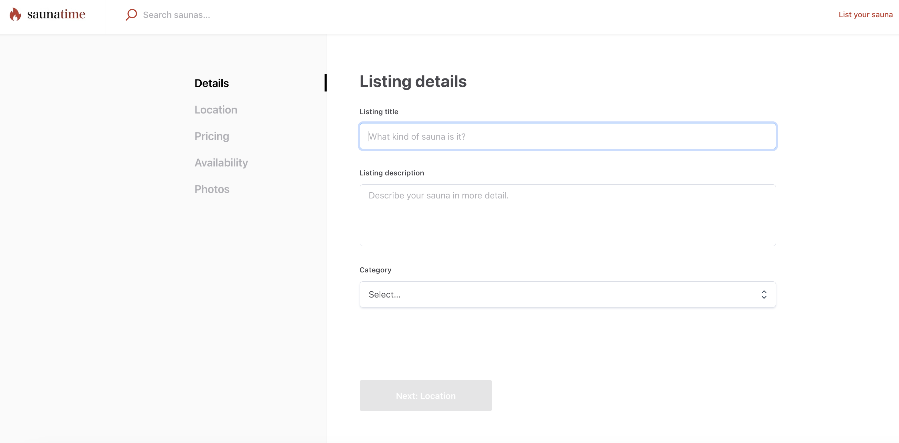
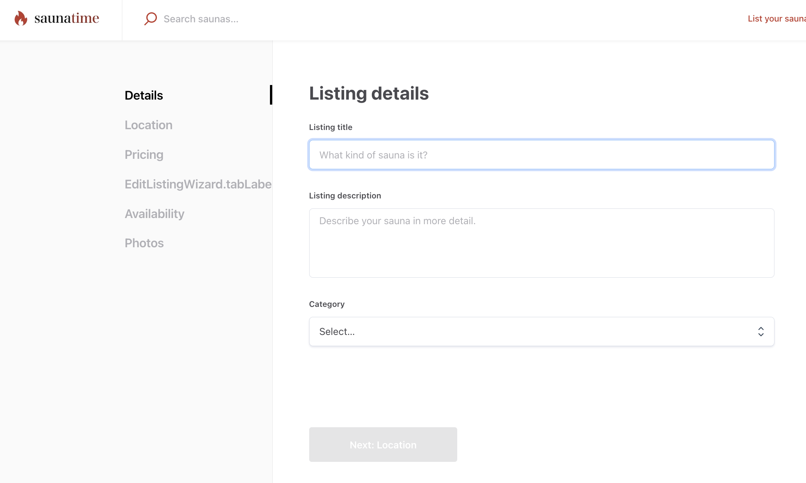
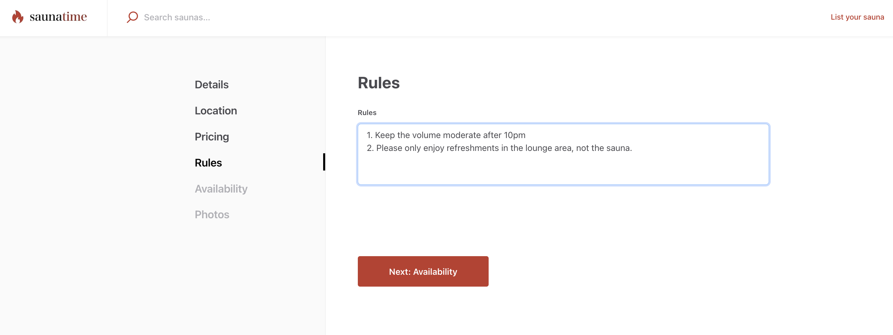
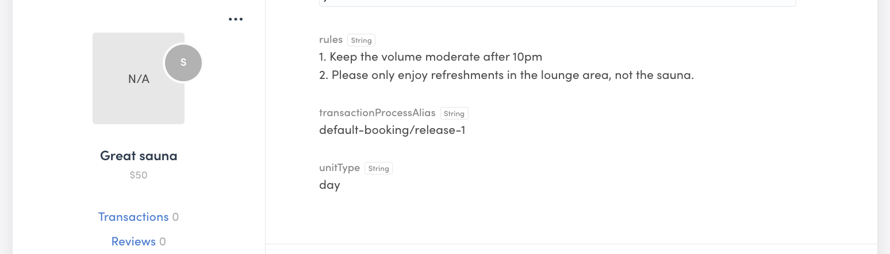

The template has default tabs in the listing creation wizard for both
bookings and purchases. The first of those tabs, “Details” shows the
attributes you have configured for your marketplace listings in Flex
Console. However, you can also add custom tabs to the listing creation
flow.



In addition to having a listing description, we want to allow providers
to explain the rules of their rental sauna in more detail.

In this tutorial, you will

- Add _EditListingRulesPanel_ and _EditListingRulesForm_ components
- Use the new panel in _EditListingWizard_
- Show the listing’s rules on the listing page with the
  _SectionTextMaybe_ component

<info>

This tutorial uses the following marketplace configurations:

- Layout > Listing page image layout: **Screen-wide cover photo**
- Listing types > Transaction process: **Calendar booking**

</info>

## Add EditListingRulesPanel and EditListingRulesForm

The different listing wizard panels can be found in the EditListingPage
folder under EditListingWizard.

```shell
└── src
    └── containers
        └── EditListingPage
            └── EditListingWizard
                ├── …
                ├── EditListingAvailabilityPanel
                ├── EditListingDeliveryPanel
                ├── EditListingDetailsPanel
                ├── …
```

Each panel has the same structure:

- EditListing[...]Panel.js and .module.css
- EditListing[...]Form.js, .example.js, .test.js, and .module.css

In this tutorial, we will use the following files.

- [EditListingRulesPanel.js](/tutorial-assets/EditListingRulesPanel.js)
- [EditListingRulesPanel.module.css](/tutorial-assets/EditListingRulesPanel.module.css)
- [EditListingRulesForm.js](/tutorial-assets/EditListingRulesForm.js)
- [EditListingRulesForm.module.css](/tutorial-assets/EditListingRulesForm.module.css)

Create a new folder titled EditListingRulesPanel in the
EditListingWizard folder. Add the above files into the new folder.

```shell
└── src
    └── containers
        └── EditListingPage
            └── EditListingWizard
                └── EditListingRulesPanel
                    ├── EditListingRulesPanel.js
                    ├── …
```

<extrainfo title="Add .example.js and .test.js files">

If you want to add EditListingRulesForm.example.js and
EditListingRulesForm.test.js files as well, you can download them here

- [EditListingRulesForm.test.js](/tutorial-assets/EditListingRulesForm.test.js)
- [EditListingRulesForm.example.js](/tutorial-assets/EditListingRulesForm.example.js)

</extrainfo>

<extrainfo title="EditListingRulesPanel.js explained">

This section will go through EditListingRulesPanel in more detail.

First, we import the necessary elements used in the file. In this
section, all rows start with `import`.

Next, we create a helper function `getInitialValues` to return any
existing value of the rules from the listing's public data.

```js
const getInitialValues = params => {
  const { listing } = params;
  const { rules } = listing?.attributes.publicData || {};

  return { rules };
};
```

Then, we create the component itself. We first use
[destructuring assignment](https://developer.mozilla.org/en-US/docs/Web/JavaScript/Reference/Operators/Destructuring_assignment)
to set our props into constants for ease of use. We also create a
handful of other constants to then pass to the returned element.

```js
const EditListingRulesPanel = props => {
  const {
    className,
    rootClassName,
    listing,
    disabled,
    ready,
    onSubmit,
    submitButtonText,
    panelUpdated,
    updateInProgress,
    errors,
  } = props;

  const classes = classNames(rootClassName || css.root, className);
  const initialValues = getInitialValues(props);
  const isPublished = listing?.id && listing?.attributes?.state !== LISTING_STATE_DRAFT;
  const unitType = listing?.attributes?.publicData?.unitType;
```

The second half of the component is the returned element. First, we show
a title that depends on whether the listing has been published or not.
Then, we show the actual EditListingRulesForm.

In the form _onSubmit_ function, we again use destructuring assignment
for retrieving the value of _rules_ from the incoming values, and then
set _rules_ as an attribute for _publicData_ before calling the
_onSubmit_ function received as a prop.

```js
  return (
    <div className={classes}>
      <H3 as="h1">
        {isPublished ? (
          <FormattedMessage
            id="EditListingRulesPanel.title"
            values={{ listingTitle: <ListingLink listing={listing} />, lineBreak: <br /> }}
          />
        ) : (
          <FormattedMessage
            id="EditListingRulesPanel.createListingTitle"
            values={{ lineBreak: <br /> }}
          />
        )}
      </H3>
      <EditListingRulesForm
        className={css.form}
        initialValues={initialValues}
        onSubmit={values => {
          const { rules = '' } = values;

          // New values for listing attributes
          const updateValues = {
            publicData: {
              rules
            }
          };
          onSubmit(updateValues);
        }}
        unitType={unitType}
        saveActionMsg={submitButtonText}
        disabled={disabled}
        ready={ready}
        updated={panelUpdated}
        updateInProgress={updateInProgress}
        fetchErrors={errors}
      />
    </div>
  );
};
```

The rest of the file defines the necessary props more closely, and
finally exports the component.

</extrainfo>

<extrainfo title="EditListingRulesForm.js explained">

This section will go through EditListingRulesPanel in more detail.

First, we import the necessary elements used in the file. In this
section, all rows start with `import`.

Then, we create the form component. Forms in the Sharetribe Web Template
use the
[Final Form library](https://final-form.org/docs/final-form/getting-started)
for form state management. This means that on the highest level, we
directly return a _FinalForm_ component from our
EditListingRulesComponent. We then use the FinalForm component's
_render_ prop to customise our Rules form behavior.

```js
export const EditListingRulesFormComponent = props => (
  <FinalForm
    {...props}
    render={formRenderProps => {
      const {
        formId,
        autoFocus,
        className,
        disabled,
        ready,
        handleSubmit,
        intl,
        invalid,
        pristine,
        saveActionMsg,
        updated,
        updateInProgress,
        fetchErrors,
      } = formRenderProps;

      const classes = classNames(css.root, className);
      const submitReady = (updated && pristine) || ready;
      const submitInProgress = updateInProgress;
      const submitDisabled = invalid || disabled || submitInProgress;
      const { updateListingError, showListingsError } = fetchErrors || {};
```

Above, we have defined the necessary constants to use in the form. It is
good to note that the EditListingRulesForm component receives an
_onSubmit_ prop, defined in EditListingRulesPanel, that gets passed
directly to the FinalForm component. The FinalForm component wraps that
prop as the _handleSubmit_ form render prop, which we then pass to the
actual Form as _onSubmit_.

The form itself contains only one text field, and the submit button. In
addition, we show any errors from props.

```js
      return (
        <Form onSubmit={handleSubmit} className={classes}>
          {updateListingError ? (
            <p className={css.error}>
              <FormattedMessage id="EditListingRulesForm.updateFailed" />
            </p>
          ) : null}
          {showListingsError ? (
            <p className={css.error}>
              <FormattedMessage id="EditListingRulesForm.showListingFailed" />
            </p>
          ) : null}
          <FieldTextInput
            id={`${formId}rules`}
            name="rules"
            className={css.input}
            autoFocus={autoFocus}
            type="textarea"
            label="Rules"
            placeholder={intl.formatMessage({ id: 'EditListingRulesForm.rulesInputPlaceholder' })}
            validate={required(
              intl.formatMessage({
                id: 'EditListingDetailsForm.descriptionRequired',
              })
            )}
          />

          <Button
            className={css.submitButton}
            type="submit"
            inProgress={submitInProgress}
            disabled={submitDisabled}
            ready={submitReady}
          >
            {saveActionMsg}
          </Button>
        </Form>
      );
    }}
  />
);
```

The rest of the file defines the necessary props more closely, and
finally exports the component. Since the form uses microcopy, and
therefore needs the
[_intl_ object](https://formatjs.io/docs/react-intl/api/#the-intl-object),
we need to compose
[injectIntl](https://formatjs.io/docs/react-intl/api/#injectintl-hoc)
when exporting the component.

```js
export default compose(injectIntl)(EditListingRulesFormComponent);
```

</extrainfo>

## Use the new panel in EditListingWizard

When a provider creates their listing, they navigate through the Edit
Listing Wizard. The wizard has a layered structure:

- _EditListingWizardTab_ component imports all different listing edit
  panels, and determines which one to render based on a `tab` prop
- _EditListingWizard_ component imports and shows the
  _EditListingWizardTab_ component and an array of supported tabs, as
  well as navigation and the Stripe onboarding parts of the wizard

So to use our new _EditListingRulesPanel_ component, we need to

- import it in the _EditListingWizardTab_ component
- render it in the correct context, and
- add `RULES` to the list of supported tabs

### Add EditListingRulesPanel to EditListingWizardTab

First, import the EditListingRulesPanel component in
EditListingWizardTab.

```shell
└── src
    └── containers
        └── EditListingPage
            └── EditListingWizard
                ├── EditListingWizardTab.js
                ├── …
```

```diff
  import EditListingPricingPanel from './EditListingPricingPanel/EditListingPricingPanel';
  import EditListingPricingAndStockPanel from './EditListingPricingAndStockPanel EditListingPricingAndStockPanel';
+ import EditListingRulesPanel from './EditListingRulesPanel/EditListingRulesPanel';

```

The EditListingWizardTab component also exports constants for all
supported panels, so let’s add the new RULES panel in that list, as well
as into the SUPPORTED_TABS array.

```js
export const DETAILS = 'details';
export const PRICING = 'pricing';
export const PRICING_AND_STOCK = 'pricing-and-stock';
export const RULES = 'rules';
export const DELIVERY = 'delivery';
export const LOCATION = 'location';
export const AVAILABILITY = 'availability';
export const PHOTOS = 'photos';

// EditListingWizardTab component supports these tabs
export const SUPPORTED_TABS = [
  DETAILS,
  PRICING,
  PRICING_AND_STOCK,
  RULES,
  DELIVERY,
  LOCATION,
  AVAILABILITY,
  PHOTOS,
];
```

The core of the EditListingWizardTab component is a switch statement
that determines, based on the `tab` prop, which panel component to
return. Add the following code block to the switch statement, before the
`default:` row:

```
…
    case PHOTOS: {
      return (
        <EditListingPhotosPanel
          {...panelProps(PHOTOS)}
          listingImageConfig={config.layout.listingImage}
          images={images}
          onImageUpload={onImageUpload}
          onRemoveImage={onRemoveImage}
        />
      );
    }
    case RULES: {
      return (
        <EditListingRulesPanel
          {...panelProps(RULES)}
        />
      );
    }
    default:
      return null;
  }
```

### Show EditListingRulesPanel in EditListingWizard

Almost there! We still need to add the RULES tab handling to
EditListingWizard.

```shell
└── src
    └── containers
        └── EditListingPage
            └── EditListingWizard
                ├── EditListingWizard.js
                ├── …
```

Let’s start by importing the relevant constant from
EditListingWizardTab.

```js
// Import modules from this directory
import EditListingWizardTab, {
  DETAILS,
  PRICING,
  PRICING_AND_STOCK,
  DELIVERY,
  RULES,
  LOCATION,
  AVAILABILITY,
  PHOTOS,
} from './EditListingWizardTab';
```

Next, add the `RULES` tab to the existing `TABS_BOOKING` array.

```js
const TABS_DETAILS_ONLY = [DETAILS];
const TABS_PRODUCT = [DETAILS, PRICING_AND_STOCK, DELIVERY, PHOTOS];
const TABS_BOOKING = [
  DETAILS,
  LOCATION,
  PRICING,
  RULES,
  AVAILABILITY,
  PHOTOS,
];
const TABS_ALL = [...TABS_PRODUCT, ...TABS_BOOKING];
```

The EditListingWizard component checks the tab value in two functions:
tabLabelAndSubmit tabCompleted

The `tabLabelAndSubmit` function determines the microcopy keys for the
tab label and the submit button. Add the following block in the if-else
sequence:

```
else if (tab === RULES) {
    labelKey = 'EditListingWizard.tabLabelRules';
    submitButtonKey = `EditListingWizard.${processNameString}${newOrEdit}.saveRules`;
  }
```

The `tabCompleted` function checks whether a specific wizard tab is
completed. The way it checks this is by verifying whether the listing
has values in the necessary attributes. Since the EditListingRulesPanel
saves the rules in the listing’s publicData under the `rules` attribute,
we will add a case to the switch statement that checks whether
`publicData.rules` has a value.

```
…
    case PHOTOS:
      return images && images.length > 0;
    case RULES:
      return !!publicData.rules;
    default:
      return false;
```

Now, If you start creating a new listing, you’ll see a new tab label in
the left side navigation. However, the label only shows the relevant
microcopy key, since we have not yet added the microcopy values in Flex
Console.



To fix this, add the following keys and values in your Flex Console >
Build > Content > Microcopy editor or src/translations/en.json file:

```json
  "EditListingWizard.tabLabelRules": "Rules",
  "EditListingRulesPanel.createListingTitle": "Rules",
  "EditListingRulesPanel.title": "Edit the rules of {listingTitle}",
  "EditListingRulesForm.rulesInputPlaceholder": "Explain your sauna rules...",
  "EditListingRulesForm.rulesRequired": "Adding rules is required",
  "EditListingRulesForm.updateFailed": "Updating listing failed",
  "EditListingRulesForm.showListingFailed": "Fetching listing failed",
  "EditListingWizard.default-booking.new.savePricing": "Next: Rules",
  "EditListingWizard.default-booking.new.saveRules": "Next: Availability",
  "EditListingWizard.edit.saveRules": "Save changes",
  "ListingPage.rulesTitle": "Rules"
```

After adding these microcopy keys and values, you can create and edit
the rules of a listing. You can test the panel functionality by saving
some rules for the listing.



When you now view the sauna in your Flex Console > Manage > Listings,
you can see the rules get saved in the listing's public data.



## Show Rules on listing page with SectionTextMaybe component

Now that the listing has rules, we want to show them on the listing
page. To do that, we will need to add a section to the listing page that
displays the rules. We have configured our marketplace to use the
screen-wide cover photo layout, so we will modify the
_ListingPageCoverPhoto.js_ file.

```shell
└── src
    └── containers
        └── ListingPage
            ├── ListingPageCoverPhoto.js
            ├── …
```

The listing pages, ListingPageCoverPhoto and ListingPageCarousel (which
corresponds to the "Image carousel" layout option), show listing data
using `Section` components, which render different types of data in a
predefined way. Since the sauna rules data is free text, we can use the
pre-existing _SectionTextMaybe_ component to display the rules.

Add the following code snippet above the _SectionMapMaybe_ component in
ListingPageCarousel:

```js
<SectionTextMaybe
  text={publicData.rules}
  heading={intl.formatMessage({ id: 'ListingPage.rulesTitle' })}
/>
```

You can now see the listing rules displayed on the listing page.


## Summary

In this tutorial, you

- Added a new _EditListingWizard_ panel, the related form, and the
  relevant css files
- Edited _EditListingWizardTab_ to support the new panel
- Edited _EditListingWizard_ to
  - show the correct labels and
  - check whether the listing has the necessary information related to
    the new panel
- Added microcopy strings for the different texts related to the new
  panel
- Used _SectionTextMaybe_ on the listing page for displaying the rules
