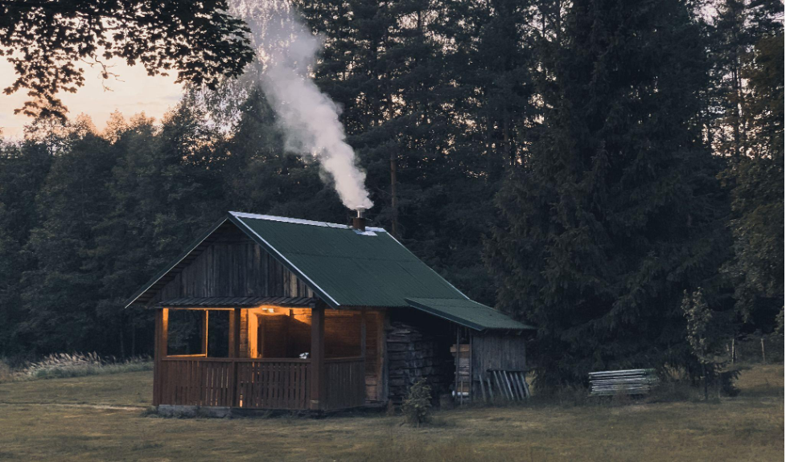

# Basic configuration: Marketplace branding

Branding settings allow you to change the images and main color of your
marketplace. In Console’s test environment, go to Build → Content →
Branding. [Read more about adding nice looking images](https://www.sharetribe.com/docs/operator-guides/how-to-add-good-looking-logos-and-images]

## Follow these steps

### 1. Set the main Color

Click on the color field, then when the dropdown appears, choose “Select
color.” This will allow you to select a color from a color picker. You
can click on the color gradient. You can also choose an RGB coordinate.
Use the RGB coordinates at the bottom to select the exact color. Choose
177,69,49 for R,G,B, respectively.

### 2. Upload the marketplace Logo

Click on the “Upload image” section for the Logo. Once there, you should
be able to upload an image from your computer. Download the image below
and use it for your settings.

You can learn more about marketplace logos [here](https://www.sharetribe.com/docs/operator-guides/how-to-add-good-looking-logos-and-images)

### 3. Upload the marketplace Favicon

Click on the “Upload image” section for the Favicon. Once you click
this, you should be able to upload an image from your computer. Download
the image below and use it for your settings.

### 4. Upload a Background image for login pages

Click on the “Upload image” section for the Background image for login
pages. Upload the JPG image below. [Read more about marketplace
images](Link to guide to good-looking images)

### 5. Upload a Social media image

Click on the “Upload image” section for Social media. Use this image:

## Save Changes

You need to save the changes that you made on this page in order to
activate them. If you get an error when saving, check the error message
on the page. It should be easy to pinpoint the error and fix it.
