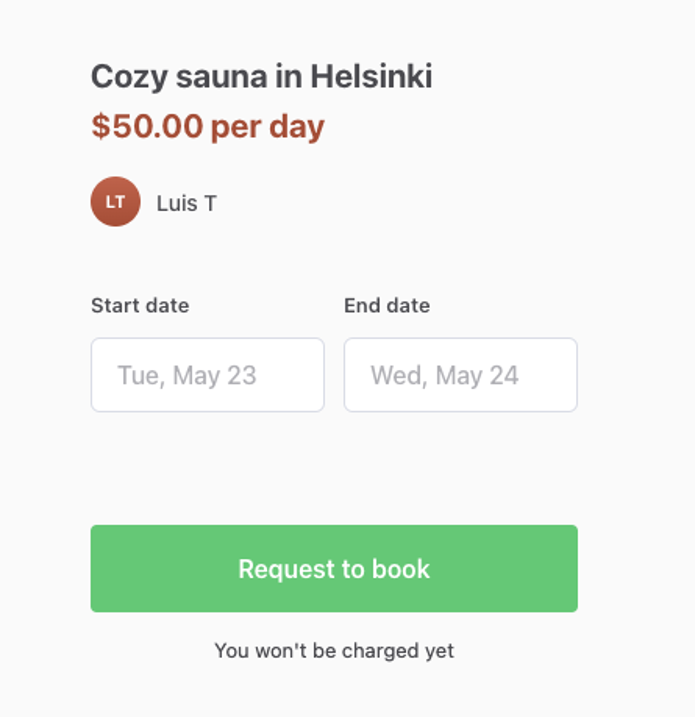

Create a completely new account following the instructions in [the
previous article](LINK TO THE SIGNUP AS A USER ARTICLE). You need to use
a different email.

## Initiating a transaction (as a buyer)

Once you have created a new account, you can initiate a transaction with
it. Make sure you are logged in with this new account. Visit the listing
[you created before](LINK TO THE POST A NEW LISTING ARTICLE from the
tutorial). You should be able to find it by going to your search page.
You can visit the search page in many ways. One of them is through the
link “Find a sauna” in your Footer, which you created in [this
article](LINK TO FOOTER ARTICLE).

Once you are on the listing page, you should be able to see the booking
options on the right side of the page. Select a start and end date and
click on “Request to book”.

On the booking page. Add your payment card details. Since this is
happening in the test environment, you can use a test credit card: 4242
4242 4242 4242 (with any random date and security code if needed). When
adding your payment card details, check “Save card details for future
orders” to save these card details for future (test) transactions.

Once you confirm the booking request, you are redirected to the booking
request confirmation page, it includes the booking breakdown. The
booking is not completely accepted yet, though. The provider still needs
to accept it.

## Receiving a transaction request (as a provider).

You should get an email notification to the email address associated
with the listing author account. Check your inbox and click on the link
from your email to see the details of the transaction request. Once in
the marketplace, review the transaction breakdown and accept the
request.

Voilá! You have initiated and accepted the very first transaction in
your marketplace. You should have received some notifications about each
transition of the transaction to your corresponding email address.

When the transaction period is passed, the transaction will
automatically be marked as completed. And you should be able to
experience the review process. Depending on the dates that you selected,
that might be a bit later.

If you have any questions about the transaction process or anything that
you read about in this tutorial. Feel free to contact [the Sharetribe
support team](mailto: help@sharetribe.com)
