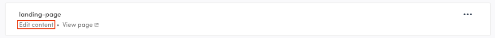
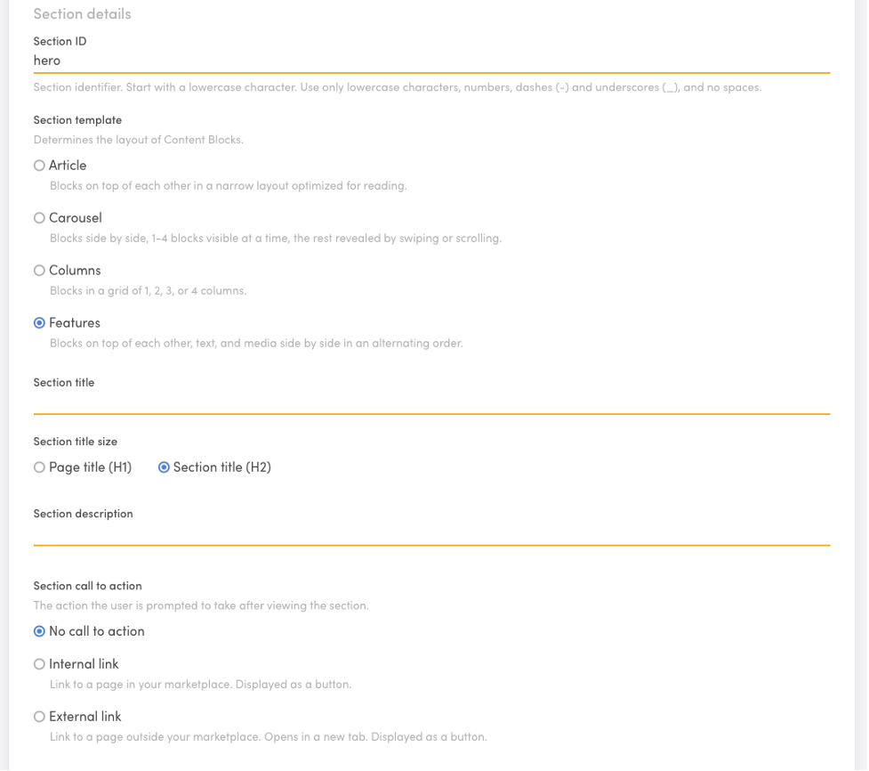
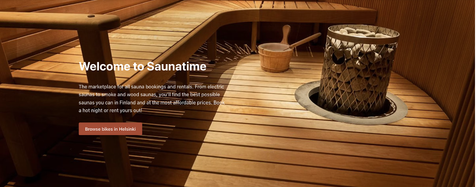
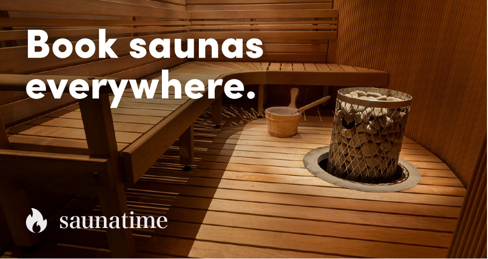

To customize the landing page and construct additional pages, we'll take advantage of the Pages feature. 

All your static content pages can be modified under **Build → Content → Pages**. In this tutorial, we will only work on your Landing page. Once in pages, Go to your landing page card and click on **“Edit content.”**
 

*Optional Tip* Before editing the content, click **“View page,”** which will open the landing page on a separate tab. You can use this tab’s refresh option in your browser and see changes after saving each section. 

## Edit the landing page specific content

Within the landing page edit page, you will encounter several sections. You can add and remove sections according to your needs. In this tutorial, though, we will tackle each section at a time:

### 1. “hero” section
Don’t change Section ID. Don’t change the Section template selection (leave it as “Features”)

Leave the section title and Section description empty. You will affect the look of this section through the section Block

Choose the “No call to action” option.

The settings should look like this: 

In the Section appearance section choose “Custom” And add this image:

The hero section already has a content block called hero-block. Make the following changes:

 - Replace the Image file for the file below (it is a transparent PNG file). Leave the Aspect ratio and Image alt text as they are.
 - Replace the Block title content for: “Welcome to Saunatime” and select Page title (H1) as the Block title size.  
 - Replace the Block text content for: write “The marketplace for all sauna bookings and rentals. From electric saunas to smoke and wood saunas, you'll find the best possible saunas you can in Finland and at the most affordable prices. Book a hot night or rent yours out!”
 - Change the Internal link text to “Browse saunas in Helsinki.” Leave all other call-to-action settings intact. 

Save changes and check the current view on the “view page” tab you opened earlier.

### 2. “locations” section

The next section, locations, can be used to link directly to locations where you have or expect to have, the most listings. By default, the section already contains some locations. We will use the pre-set locations for this tutorial. Make the following changes: 

Change the Section Title to: “Find a Sauna Anywhere”. 
Change the section description to “Find the best saunas at the tap of a button, anywhere in Finland.”

Don’t change the Section call to action or the Section appearance

Within the Content blocks, you will see there are 6 cities pre-set. Within each city’s Content Block open the Block and alter the Block text, and only the Block text. Replace the word **“bikes”** for **“saunas”** i.e 

Replace: [› See bikes in Helsinki](/s?address=Helsinki%2C%20Uusimaa%2C%20Finland&bounds=60.297839%2C25.337729924%2C60.06196768%2C24.807445703)

With: [› See saunas in Helsinki](/s?address=Helsinki%2C%20Uusimaa%2C%20Finland&bounds=60.297839%2C25.337729924%2C60.06196768%2C24.807445703)

### 3. “how-it-works” section
Open the “how-it-works-for-customers” section. Change the section ID to “how-it-works”. Replace the word “Bike” for the word “Sauna” in ever text of the section. You need to change it in: 
 - Section title
 - Section description
 - Content blocks: 
  -  Block titles
  -  Block texts

In Block 3 of the section, **“how-it-works-step-3”**, Change the Block title for **“3. Start enjoying!”** and the Block text for: **“Use Saunatime’s messaging system to iron out the details of the visit, and prepare for a relaxing experience!”**

### 4. Other sections 
Remove all other sections from the Page editor. If you want to learn more about editing pages in your marketplace, you can read [this article in our documentation](https://www.sharetribe.com/docs/operator-guides/how-to-edit-content-pages-in-console/)

Remember to “Save changes” 

### 5. SEO & Social
Set the following text: 

Page title: Saunatime - Book saunas everywhere
Page description: The largest online community for to find and rent a sauna.
Page title for social media: Book saunas everywhere
Page description for social media: The largest online community for to find and rent a sauna.
Social media image: Add the following image

Save changes.

### 6. Other static Pages
By default, your marketplace includes three other static content pages **—About, Privacy Policy, and Terms of Service—** that demand your attention before launching. You can also add more static content pages. Modifying these pages in the tutorial would be redundant. The instructions would be similar to the ones shown above, just with alternate texts. Because of this, we will not pay attention to these pages for now. It's critical for you to remember, however, to refine them before going live. 
