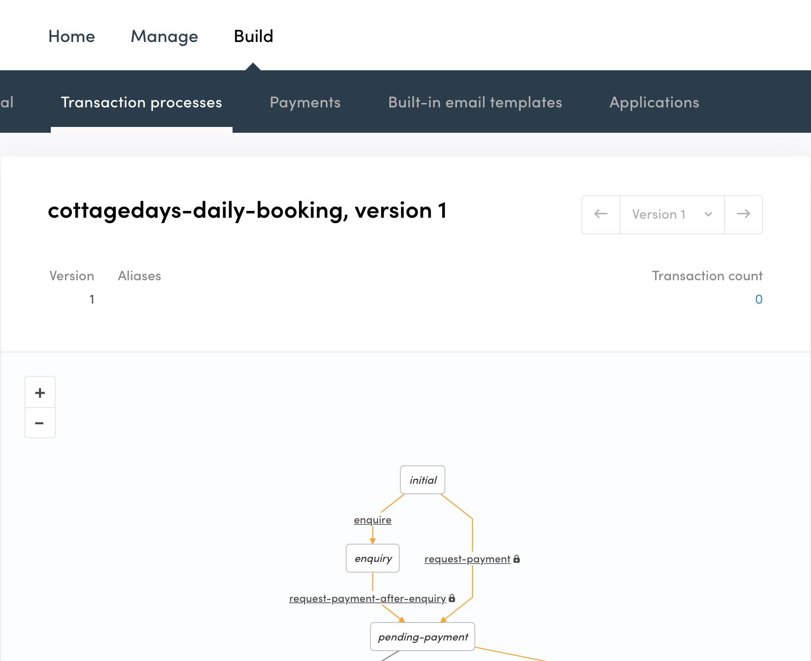
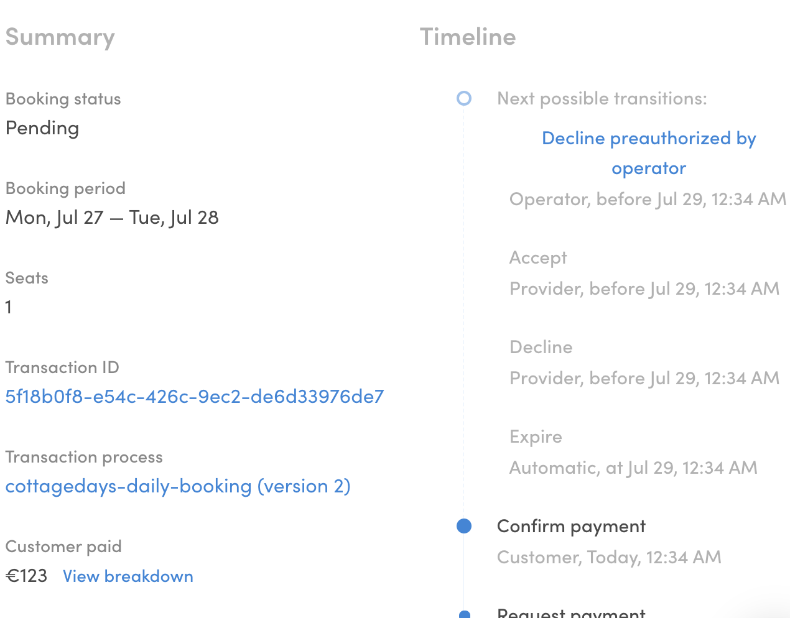

## Create a transaction process

In this tutorial, we'll create a new transaction process for the
CottageDays marketplace. It will be a daily booking process in contrast
to the default nightly process. We make this for demonstration purpose
since it might not be a smart move for an actual cottage-rental
marketplace.

In addition, we also add a new decline transition for the operator and
update the client app so that it uses the new process.

### Clone Flex example processes repository

Writing _process.edn_ file and email templates from scratch is a bit
tedious task. We'll make our life a bit easier by cloning Flex example
processes repository:

```shell
git clone https://github.com/sharetribe/flex-example-processes.git
```

And then we move to that directory:

```shell
cd flex-example-processes/
```

There are several processes listed in
[that directory](https://github.com/sharetribe/flex-example-processes).
The one we are going to use as a basis for our new process is
_flex-default-process_. It has privileged transitions in use and it is
therefore compatible with FTW-daily v8.0.0 or later.

<extrainfo title="What's the preauth-daily-booking example process?">

In the example processes repository, there's another process that
specifically named as daily booking (_preauth-daily-booking_). It's an
old process (created before privilege transitions feature) and its
speciality was about how it counted total price with
[:action/calculate-tx-daily-total-price](https://github.com/sharetribe/flex-example-processes/blob/master/preauth-daily-booking/process.edn#L22).
However, with privileged transitions, the pricing is set on the client
app - so, there is no need for process changes between nightly and daily
booking.

</extrainfo>

### Create a new process

To get up and running with Flex CLI, see the
[Getting started with Flex CLI](https://www.sharetribe.com/docs/flex-cli/getting-started-with-flex-cli/)
guide in Flex Docs.

Let's see what the subcommand `help` gives us about `process create`:

```shell
$ flex-cli help process create
create a new transaction process

USAGE
  $ flex-cli process create

OPTIONS
  --path=LOCAL_PROCESS_DIR          path to the directory where the process.edn file is
  --process=PROCESS_NAME            name for the new process that is created
  -m, --marketplace=MARKETPLACE_ID  marketplace identifier
```

So, if we would like to create a new process, we need to specify a path
to the local directory. That directory should contain process definition
(process.edn file) and templates subdirectory containing correct email
templates for the email notifications defined in that process. We
already have those since we cloned the _flex-example-processes_
repository.

Then we just need to define a name to that process and specify the
marketplace environment, where the new process should be created. We'll
use _"cottagedays-daily-booking"_. Our final command for the
_cottagedays-test_ marketplace would look like this:

```shell
flex-cli process create --path=./flex-default-process --process=cottagedays-daily-booking --marketplace=cottagedays-test
```

> **Note**: you need to modify the command to use your own test
> marketplace ID, which you can find from the Flex Console.

After executing that command, you can go to the Flex Console (Build ->
Transaction processes tab) and see that the
_"cottagedays-daily-booking"_ process is there.



### Create process alias

The process is created, but we still can't reference that process from
our client app, since it doesn't have process alias set. We can create
an alias for our new process with Flex CLI command:

```shell
flex-cli process create-alias --process=cottagedays-daily-booking --version=1 --alias=release-1 --marketplace=cottagedays-test
```

With that command, we are creating a new alias _"release-1"_ and point
it to the previously created process and its version 1.

After that you should see the alias in the Console:<br />
`cottagedays-daily-booking/release-1`.

At this point, we have essentially just copied the default process under
a different name.

## Modify transaction process

One transition that should be considered carefully, is the operator's
ability to cancel a transaction. If the operator needs to cancel a
transaction in a certain state, there needs to be a transition defined
for it in the transaction process. Let's add a new operator transition
to the process.

### Pull the existing transaction process

Before we modify our transaction process, it's better to ensure that we
have most the up-to-date version of the process. You can fetch any
process version with flex-cli:

```shell
flex-cli process pull --process=cottagedays-daily-booking --alias=release-1 --path=./cottagedays-daily-booking --marketplace=cottagedays-test
```

Now, we can open the _process.edn_ file from the new directory with a
text editor and inspect it a bit. You can get familiar with edn format
by reading our
[reference document](/references/transaction-process-format/#the-edn-format)
about it.

There's one existing cancel transition defined for operator in that
file. That cancel transition can be called when the transaction is in
the state: **accepted**.

```clojure
  {:name :transition/cancel,
   :actor :actor.role/operator,
   :actions
   [{:name :action/cancel-booking}
    {:name :action/calculate-full-refund}
    {:name :action/stripe-refund-payment}],
   :from :state/accepted,
   :to :state/cancelled}

```

Let's add another similar transition there:

```clojure
  {:name :transition/decline-preauthorized-by-operator,
   :actor :actor.role/operator,
   :actions
   [{:name :action/decline-booking}
    {:name :action/calculate-full-refund}
    {:name :action/stripe-refund-payment}],
   :from :state/preauthorized,
   :to :state/declined-by-operator}
```

With this configuration, we are creating a new transition called
_:transition/decline-preauthorized-by-operator_ for the operator.
Because it's called before the provider has accepted the booking, it's
using _:action/decline-booking_ instead of _:action/cancel-booking_.
Otherwise, the actions are the same as in _:transition/cancel_. We
calculate refunds and refund the payment through Stripe. If you want to
check all the possible actions, you should read this document:
[Transaction process actions](/references/transaction-process-actions/).

<extrainfo title="What happens to the money in refunds?" id="refund-extra-info">

In the preauthorized state, the money hasn't left the customer's bank
account. There is just a cover reservation made for the future capture
of the payment. This is done to avoid insufficient funds error. Stripe
can hold this preauthorization for 7 days and, therefore, we have an
automatic expiration in the preauthorized state.

In these declines and expire transitions,
**:action/stripe-refund-payment** will release the cover reservation,
but if it's called after the payment is captured, it will refund the
payment. And to be more specific, then both transfers are reversed:

1. Commission (aka application fee) is returned from platform account to
   the provider.
2. Then full payment is returned from the provider's account to the
   customer.

</extrainfo>

The operator can call this transition from Console (from transaction
card's _Timeline_ column) or alternatively through Integration API. This
transition is only possible when a transaction is in the
**preauthorized** state. The last line
`:to :state/declined-by-operator}`, creates actually a new state called
**declined-by-operator**. It is going to be one of the final states for
any transactions since there's no transition away from that state.

### Push a new transaction process

Updating a transaction process is a similar process than creating a new
one. This time we use _push_ command:

```shell
flex-cli process push --process=cottagedays-daily-booking --path=./cottagedays-daily-booking --marketplace=cottagedays-test
```

And if you go to Console, you notice that there's a new version (2)
created of the _cottagedays-daily-booking_ process. However, the alias
is still pointing to the first version. We need to update the alias too:

```shell
flex-cli process update-alias --alias=release-1 --process=cottagedays-daily-booking --version=2 --marketplace=cottagedays-test
```

Now, if you open the process graph from the Flex Console, you'll see
that the new transition and state are visible in the updated version of
the process.


Here's a screenshot of the transaction card in the Flex Console. It
shows a transaction in the preauthorized state - the decline link for
the marketplace operator is on the right-side column.



## Update client app

After we have changed the transaction process, we also need to take the
new process into use in our client app.

In this tutorial, we assume that we don't need to care about ongoing
transactions. It is important to consider this before taking a new
process version into use. When a transaction is created, it is tied to
the version of the process that was in use at that time. Therefore, you
might need to update your client app, so that it supports several
different process versions.

### Update config.js

```shell
└── src
    └── config.js
```

Since we have created a new process, we need to update
**bookingProcessAlias** variable in config.js. This variable defines
what transaction process is used when a new transaction is created from
the web app.

```js
const bookingProcessAlias = 'cottagedays-daily-booking/release-1';
```

In the same file, we need to also update variable: **bookingUnitType**.
It defines some UI changes (mostly about translations) - i.e. is this
booking about _nights_, _days_, or some other _units_.

```js
const bookingUnitType = 'line-item/day';
```

### Update transaction.js

The web app needs to understand how the connected transaction process
works and, therefore, the process graph is actually duplicated in the
current versions of FTW templates.

```shell
└── src
    └── util
        └── transaction.js
```

So, we need to make the transaction process change also there.

**Step 1**: Create a new transition variable:
`TRANSITION_DECLINE_BY_OPERATOR`.

```js
// When the provider accepts or declines a transaction from the
// SalePage, it is transitioned with the accept or decline transition.
export const TRANSITION_ACCEPT = 'transition/accept';
export const TRANSITION_DECLINE = 'transition/decline';

export const TRANSITION_DECLINE_BY_OPERATOR =
  'transition/decline-preauthorized-by-operator';
```

**Step 2**: Create a new state variable: `STATE_DECLINED_BY_OPERATOR`.

```js
const STATE_DECLINED = 'declined';
const STATE_DECLINED_BY_OPERATOR = 'declined-by-operator';
```

**Step 3**: Update the process graph.<br /> Variable _stateDescription_
contains the same process graph in _Xstate_ format. As a first thing,
you could also update the id of the graph.

The mandatory change is that we need to add the new state and transition
into that process description:

```diff
    [STATE_PREAUTHORIZED]: {
      on: {
        [TRANSITION_DECLINE]: STATE_DECLINED,
+       [TRANSITION_DECLINE_BY_OPERATOR]: STATE_DECLINED_BY_OPERATOR,
        [TRANSITION_EXPIRE]: STATE_DECLINED,
        [TRANSITION_ACCEPT]: STATE_ACCEPTED,
      },
    },

    [STATE_DECLINED]: {},
+   [STATE_DECLINED_BY_OPERATOR]: {},
```

**Step 4**: Update relevant helper functions.

- _txIsDeclined_ needs to be updated

  ```js
  const transitionsToDeclined = [
    ...getTransitionsToState(STATE_DECLINED),
    ...getTransitionsToState(STATE_DECLINED_BY_OPERATOR),
  ];
  export const txIsDeclined = tx =>
    transitionsToDeclined.includes(txLastTransition(tx));
  ```

- _isRelevantPastTransition_ needs to be updated too

  ```js
  // Check if a transition is the kind that should be rendered
  // when showing transition history (e.g. ActivityFeed)
  // The first transition and most of the expiration transitions made by system are not relevant
  export const isRelevantPastTransition = transition => {
    return [
      TRANSITION_ACCEPT,
      TRANSITION_CANCEL,
      TRANSITION_COMPLETE,
      TRANSITION_CONFIRM_PAYMENT,
      TRANSITION_DECLINE,
      TRANSITION_DECLINE_BY_OPERATOR,
      TRANSITION_EXPIRE,
      TRANSITION_REVIEW_1_BY_CUSTOMER,
      TRANSITION_REVIEW_1_BY_PROVIDER,
      TRANSITION_REVIEW_2_BY_CUSTOMER,
      TRANSITION_REVIEW_2_BY_PROVIDER,
    ].includes(transition);
  };
  ```

### Update components

Now, the last and most important step is to go through all the
components that import 'util/transaction'. I.e. we need to figure out if
those components need to be updated so that they can handle the changed
process.

In this tutorial, we'll just update **ActivityFeed** component, which is
shown on the transaction page.

```shell
└── src
    └── components
        └── ActivityFeed
            └── ActivityFeed.js
```

The new transition needs to be _imported_ there and then a new
translation should be added into **resolveTransitionMessage** function:

```js
    case TRANSITION_DECLINE_BY_OPERATOR:
      return <FormattedMessage id="ActivityFeed.operatorDecline" />;
```

We'll add the translation to _src/translations/en.json_ file:

```json
"ActivityFeed.operatorDecline": "The booking was cancelled.",
```

### Update pricing on server

When privileged transitions are used, the pricing changes should be made
from a trusted environment. In FTW-daily template, that means the
included server.

```shell
└── server
    └── api-util
        └── lineItems.js
```

Our changes didn't bring any new line-items, but it changed the existing
booking unit type from _night_ to _day_. Therefore, we need to update
_bookingUnitType_ there too:

```js
// This bookingUnitType needs to be one of the following:
// line-item/night, line-item/day or line-item/units
const bookingUnitType = 'line-item/day';
```

---

And that's it. We have created a new process, added a new transition
there and modified our client app to work with the new process.
