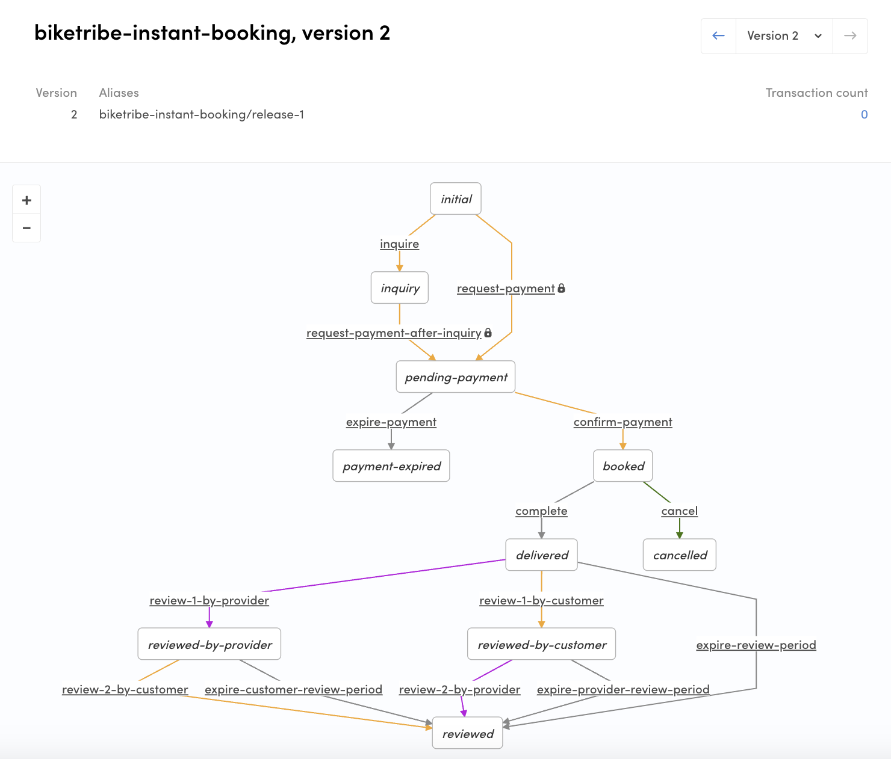

In this tutorial, we'll create a new transaction process for the
CottageDays marketplace. It will be a booking process where we will add
a new transition for the customer to cancel their booking request before
the provider accepts it. We will also update the client app to use the
new process, and to allow the customer to cancel the request.

## Create a transaction process

First, we will use the default booking process to create a similar but
separate transaction process. This will allow us to make changes to the
transaction behavior.

### Clone Flex example processes repository

Writing a _process.edn_ file and the email templates from scratch is a
fairly tedious task. We'll make our life a bit easier by cloning the
Flex example processes repository :

```shell
git clone https://github.com/sharetribe/flex-example-processes.git
```

And then we move to that directory:

```shell
cd flex-example-processes/
```

There are several processes listed in
[that directory](https://github.com/sharetribe/flex-example-processes).
The one we are going to use as a basis for our new process is
_default-booking_.

### Create a new process

To get up and running with Flex CLI, see the
[Getting started with Flex CLI](/introduction/getting-started-with-flex-cli/)
guide in Flex Docs.

Let's see what the subcommand `help` gives us about `process create`:

```shell
$ flex-cli help process create
create a new transaction process

USAGE
  $ flex-cli process create

OPTIONS
  --path=LOCAL_PROCESS_DIR          path to the directory where the process.edn file is
  --process=PROCESS_NAME            name for the new process that is created
  -m, --marketplace=MARKETPLACE_ID  marketplace identifier
```

So, if we would like to create a new process, we need to specify a path
to the local directory. That directory should contain process definition
(process.edn file) and templates subdirectory containing correct email
templates for the email notifications defined in that process. We
already have those since we cloned the _flex-example-processes_
repository.

Then we just need to define a name to that process and specify the
marketplace environment, where the new process should be created. We'll
use _"cottage-days-booking"_. Our final command for the
_cottagedays-test_ marketplace would look like this:

```shell
flex-cli process create --path=./default-booking --process=cottage-days-booking --marketplace=cottagedays-dev
```

<info>

You need to modify the command to use your own test marketplace ID,
which you can find in Flex Console.

</info>

After executing that command, you can go to the Flex Console (Build ->
Transaction processes tab) and see that the _"cottage-days-booking"_
process is there.


### Create process alias

The process is created, but we still can't reference that process from
our client app, since it doesn't have process alias set. We can create
an alias for our new process with Flex CLI command:

```shell
flex-cli process create-alias --process=cottage-days-booking --version=1 --alias=release-1 --marketplace=cottagedays-dev
```

With that command, we are creating a new alias _"release-1"_ and point
it to the previously created process and its version 1.

After that you should see the alias in the Console:<br />
`cottage-days-booking/release-1`.

At this point, we have essentially just copied the default process under
a different name.

## Modify transaction process

In the default booking process, the provider can accept or decline a
booking request. However, we want to also allow the customer to cancel
their booking request before the provider accepts the booking if, for
instance, the customer's schedule changes.

To allow this, we need to add a new transition to the transaction
process.

### Pull the existing transaction process

Before we modify our transaction process, it's better to ensure that we
have most the up-to-date version of the process. You can fetch any
process version with flex-cli:

```shell
flex-cli process pull --process=cottage-days-booking --alias=release-1 --path=./cottage-days-booking --marketplace=cottagedays-dev
```

Now, we can open the _process.edn_ file from the new directory with a
text editor and inspect it a bit. You can get familiar with edn format
by reading our
[reference document](/references/transaction-process-format/#the-edn-format)
about it.

The provider can decline the booking with `transition/decline`. It
refunds the payment and declines the pending booking.

```clojure
  {:name :transition/decline,
   :actor :actor.role/provider,
   :actions
   [{:name :action/calculate-full-refund}
    {:name :action/stripe-refund-payment}
    ;; Keep this action last in the list of actions for
    ;; the transition
    {:name :action/decline-booking}],
   :from :state/preauthorized,
   :to :state/declined}

```

Let's add another similar transition, but for the customer:

```clojure
  {:name :transition/customer-cancel
   :actor :actor.role/customer,
   :actions
   [{:name :action/calculate-full-refund}
    {:name :action/stripe-refund-payment}
    ;; Keep this action last in the list of actions for
    ;; the transition
    {:name :action/decline-booking}],
   :from :state/preauthorized,
   :to :state/declined}
```

With this configuration, we are creating a new transition called
_:transition/customer-cancel_ for the customer. Because it's called
before the provider has accepted the booking, it's using
_:action/decline-booking_ instead of _:action/cancel-booking_, even
though we call it 'cancel'. We calculate refunds and refund the payment
through Stripe. If you want to see all the actions that are possible in
a transaction process, you can read this document:
[Transaction process actions](/references/transaction-process-actions/).

<info>

In the preauthorized state, the money hasn't left the customer's bank
account. There is just a cover reservation made for the future capture
of the payment. This is done to avoid an insufficient funds error.
Stripe can hold this preauthorization for 7 days and, therefore, we have
an automatic expiration in the preauthorized state.

<br/>

In these decline and expire transitions,
**:action/stripe-refund-payment** releases the cover reservation, but if
it's called after the payment is captured, it will refund the payment.
And to be more specific, then both transfers are reversed:

<br/>

1. Commission (aka application fee) is returned from platform account to
   the provider.
2. Then full payment is returned from the provider's account to the
   customer.

</info>

The customer will need to call this transaction from the client
application, and it is only possible when a transaction is in the
**preauthorized** state. We will implement the user interface to calling
the transition later in this tutorial.

### Push a new transaction process

Updating a transaction process is a similar process than creating a new
one. This time we use _push_ command:

```shell
flex-cli process push --process=cottage-days-booking --path=./cottage-days-booking --marketplace=cottagedays-dev
```

And if you go to Console, you notice that there's a new version (2)
created of the _cottage-days-booking_ process. However, the alias is
still pointing to the first version. We need to update the alias too:

```shell
flex-cli process update-alias --alias=release-1 --process=cottage-days-booking --version=2 --marketplace=cottagedays-dev
```

Now, if you open the process graph from the Flex Console, you'll see
that the new transition and state are visible in the updated version of
the process.



Here's a screenshot of the transaction card in the Flex Console. It
shows a transaction in the preauthorized state - the decline link for
the marketplace operator is on the right-side column.


## Update client app

After we have changed the transaction process, we also need to take the
new process into use in our client app.

In this tutorial, we assume that we don't need to care about ongoing
transactions. It is important to consider this before taking a new
process version into use. When a transaction is created, it is tied to
the version of the process that was in use at that time. Therefore, you
might need to update your client app, so that it supports several
different process versions.

### Update configListing.js

```shell
└── src
    └── config
        └── configListing.js
```

The **configListing.js** file details an array listing types, each with
a unique transaction type. The transaction type defines the transaction
process and alias being used, as well as the unit type, such as _day_ or
_night_.

```js
export const listingTypes = [
  {
    listingType: 'daily-booking',
    label: 'Daily booking',
    transactionType: {
      process: 'default-booking',
      alias: 'default-booking/release-1',
      unitType: 'day',
    },
  },
  // Here are some examples for other listingTypes
  // TODO: SearchPage does not work well if both booking and product selling are used at the same time
  {
    listingType: 'nightly-booking',
    label: 'Nightly booking',
    transactionType: {
      process: 'default-booking',
      alias: 'default-booking/release-1',
      unitType: 'night',
    },
  },
```

Let's use the new _cottage-days-booking_ process in the nightly booking
listings:

```diff
  {
    listingType: 'nightly-booking',
    label: 'Nightly booking',
    transactionType: {
-     process: 'default-booking',
-     alias: 'release-1',
+     process: 'cottage-days-booking',
+     alias: 'cottage-days-booking/release-1',
      unitType: 'night',
    },
  },
```

### Create transaction process graph file

The web app needs to understand how the connected transaction process
works and, therefore, the process graph is actually duplicated in the
current version of the template.

```shell
└── src
    └── transactions
        └── transactionProcessBooking.js
```

Since our new process is nearly the same as the default one, we can
duplicate the _transactionProcessBooking.js_ file into a new file in the
same folder named _transactionProcessBookingCustomerCancel.js_ and make
the necessary changes.

```shell
└── src
    └── transactions
        └── transactionProcessBookingCustomerCancel.js
```

**Step 1**: Create a new transition to the **transitions** object:
`CUSTOMER_CANCEL`.

```diff
export const transitions = {
  ...
  // The operator can accept or decline the offer on behalf of the provider
  OPERATOR_ACCEPT: 'transition/operator-accept',
  OPERATOR_DECLINE: 'transition/operator-decline',

+ CUSTOMER_CANCEL: 'transition/customer-cancel',

  // The backend automatically expire the transaction.
  EXPIRE: 'transition/expire',
  ...
```

**Step 2**: Update the process graph.<br /> Variable _stateDescription_
contains the same process graph in _Xstate_ format. As the first thing,
you could also update the id of the graph.

The mandatory change is that we need to add the new state and transition
into that process description:

```diff
export const graph = {
  // id is defined only to support Xstate format.
  // However if you have multiple transaction processes defined,
  // it is best to keep them in sync with transaction process aliases.
+ id: 'cottage-days-booking/release-1',
...
    [states.PREAUTHORIZED]: {
      on: {
        [transitions.DECLINE]: states.DECLINED,
        [transitions.OPERATOR_DECLINE]: states.DECLINED,
        [transitions.EXPIRE]: states.EXPIRED,
        [transitions.ACCEPT]: states.ACCEPTED,
        [transitions.OPERATOR_ACCEPT]: states.ACCEPTED,
+       [transitions.CUSTOMER_CANCEL]: states.DECLINED,
      },
```

**Step 3**: Update relevant helper functions.

- _isRelevantPastTransition_ needs to be updated

```js
// Check if a transition is the kind that should be rendered
// when showing transition history (e.g. ActivityFeed)
// The first transition and most of the expiration transitions made by system are not relevant
export const isRelevantPastTransition = transition => {
  return [
    transitions.ACCEPT,
    transitions.OPERATOR_ACCEPT,
    transitions.CANCEL,
    transitions.COMPLETE,
    transitions.CONFIRM_PAYMENT,
    transitions.DECLINE,
    transitions.OPERATOR_DECLINE,
    transitions.CUSTOMER_CANCEL,
    transitions.EXPIRE,
    transitions.REVIEW_1_BY_CUSTOMER,
    transitions.REVIEW_1_BY_PROVIDER,
    transitions.REVIEW_2_BY_CUSTOMER,
    transitions.REVIEW_2_BY_PROVIDER,
  ].includes(transition);
};
```

### Update transaction.js

We then need to import and use
_transactionProcessBookingCustomerCancel.js_ in the transaction.js file.
This file determines the processes that are supported in the
application.

```shell
└── src
    └── transactions
        └── transaction.js
```

Let's first import the new process and export its name as a constant.

```diff
  import * as log from '../util/log';
  import { ensureTransaction } from '../util/data';
  import * as purchaseProcess from './transactionProcessPurchase';
  import * as bookingProcess from './transactionProcessBooking';
+ import * as customerCancelProcess from './transactionProcessBookingCustomerCancel';

  // Supported unit types
  export const ITEM = 'item';
  export const DAY = 'day';
  export const NIGHT = 'night';
  export const HOUR = 'hour';

  // Then names of supported processes
  export const PURCHASE_PROCESS_NAME = 'default-purchase';
  export const BOOKING_PROCESS_NAME = 'default-booking';
+ export const CUSTOMER_CANCEL_BOOKING_PROCESS_NAME = 'cottage-days-booking';

```

Then, we will add it to the array of supported processes, and set it to
handle unit type _night_.

```jsx
const PROCESSES = [
  {
    name: PURCHASE_PROCESS_NAME,
    alias: 'release-1',
    process: purchaseProcess,
    unitTypes: [ITEM],
  },
  {
    name: BOOKING_PROCESS_NAME,
    alias: 'release-1',
    process: bookingProcess,
    unitTypes: [DAY, HOUR],
  },
  {
    name: CUSTOMER_CANCEL_BOOKING_PROCESS_NAME,
    alias: 'release-1',
    process: customerCancelProcess,
    unitTypes: [NIGHT],
  },
];
```

Finally, we need to update the _isBookingProcess_ helper – we need to
add the new process name to the list used to determine booking
processes.

```diff

export const isBookingProcess = processName => {
  const latestProcessName = resolveLatestProcessName(processName);
  const processInfo = PROCESSES.find(process => process.name === latestProcessName);
+ return [BOOKING_PROCESS_NAME, CUSTOMER_CANCEL_BOOKING_PROCESS_NAME].includes(processInfo?.name);
};

```

The next step is to determine how this transaction process data is used.
By default, the template has two pages that use transaction process data
to show different UI elements depending on the transaction's state:
InboxPage and TransactionPage.

### Update state helpers

First, we will make a simple change to InboxPage state handling, and
then a slightly bigger change to TransactionPage state handling.

#### Update InboxPage state data

```shell
└── src
    └── containers
        └── InboxPage
            └── InboxPage.stateData.js
```

This file compiles the transaction process specific state data mappers
that check the state of the transaction and inject additional data that
is needed in the corresponding container for each state.

Our process change does did not add a new state, and Inbox Page is only
concerned about showing state data and not about initiating transitions.
Therefore, we can use the default booking process state data mapper for
our new process as well.

We will update the _getStateData_ function in this file to use the
_isBookingProcess_ helper function we modified earlier.

```jsx
if (processName === PURCHASE_PROCESS_NAME) {
  return getStateDataForPurchaseProcess(params, processInfo());
} else if (isBookingProcess(processName)) {
  return getStateDataForBookingProcess(params, processInfo());
} else {
  return {};
}
```

#### Update TransactionPage state data

On transaction page, we also need to make state data handling changes.
Here, we want to show the customer cancel button when the transaction is
in the correct state. To do that, we need to inject the relevant data.

Since this behavior is different from the default booking process
behavior, we need to make a dedicated file for transaction page state
data.

```shell
└── src
    └── containers
        └── TransactionPage
            └── TransactionPage.stateData.js
            └── TransactionPage.stateDataBooking.js
```

We will duplicate the _TransactionPage.stateDataBooking.js_ file into
_TransactionPage.stateDataCustomerCancel.js_ file and make the following
changes in the new file.

The process specific state data file determines what to show on
transaction page for each state and each participant. We will make our
changes to the case where the transaction is in preauthorized state and
the authenticated user is the customer.

In the return clause, we add two attributes that determine that we want
to show a button in this state for this user, and that we want that
button to dispatch the _CUSTOMER_CANCEL_ transition when clicked.

```diff
    .cond([states.PREAUTHORIZED, CUSTOMER], () => {
      return {
        processName,
        processState,
        showDetailCardHeadings: true,
        showExtraInfo: true,
+       showActionButtons: true,
+       primaryButtonProps: actionButtonProps(transitions.CUSTOMER_CANCEL, CUSTOMER),
      };
    })
```

There is one more step left to update for the new transaction process –
microcopy strings. If you now try to create a listing with the new
process, you will see microcopy keys that reference the new process.


We will add the necessary microcopy strings next.

### Add microcopy strings

A lot of microcopy strings in Sharetribe Web Template are transaction
process specific. In other words, when you create a new transaction
process, you will also need to add microcopy for the relevant keys in
the new process.

In this case, you can locate the microcopy keys and values that
reference **default-booking** and duplicate them for the new process,
for example:

```json
{
  "EditListingWizard.default-booking.new.saveAvailability": "Next: Photos",
  "EditListingWizard.default-booking.new.saveDetails": "Next: Location",
  "EditListingWizard.default-booking.new.saveLocation": "Next: Pricing",
  "EditListingWizard.default-booking.new.savePhotos": "Publish listing",
  "EditListingWizard.default-booking.new.savePricing": "Next: Availability",
  "EditListingWizard.cottage-days-booking.new.saveAvailability": "Next: Photos",
  "EditListingWizard.cottage-days-booking.new.saveDetails": "Next: Location",
  "EditListingWizard.cottage-days-booking.new.saveLocation": "Next: Pricing",
  "EditListingWizard.cottage-days-booking.new.savePhotos": "Publish listing",
  "EditListingWizard.cottage-days-booking.new.savePricing": "Next: Availability"
}
```

You can now see the correct microcopy strings instead of the keys.


## Summary

We created a new process based on an existing process, and added a new
transition in the new process. We then pushed our changes to the Flex
backend using Flex CLI.

In addition, we modified our client app to work with the new process by
updating

- listing configuration,
- transaction process graph file,
- state data helper files, and
- microcopy strings.

The next tutorial guide will focus on modifying transaction process
email notifications.
