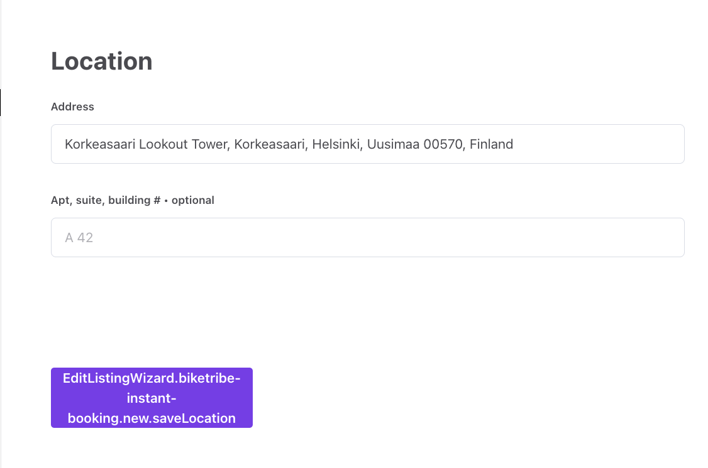

In this tutorial, we'll create a new transaction process for the
Saunatime marketplace. It will be an instant booking process where the
booking is accepted automatically upon making the booking, without the
provider needing to take action. We will also update the client app to
use the new process.

## Create a transaction process

First, we will use an existing instant booking process to create a
similar but separate transaction process. This will allow us to make
changes to the transaction behavior.

### Clone Flex example processes repository

Writing a _process.edn_ file and the email templates from scratch is a
fairly tedious task. We'll make our life a bit easier by cloning the
Flex example processes repository :

```shell
git clone https://github.com/sharetribe/flex-example-processes.git
```

And then we move to that directory:

```shell
cd flex-example-processes/
```

There are several processes listed in
[that directory](https://github.com/sharetribe/flex-example-processes).
The one we are going to use as a basis for our new process is
_instant-booking_.

### Create a new process

To get up and running with Flex CLI, see the
[Getting started with Flex CLI](/introduction/getting-started-with-flex-cli/)
guide in Flex Docs.

Let's see what the subcommand `help` gives us about `process create`:

```shell
$ flex-cli help process create
create a new transaction process

USAGE
  $ flex-cli process create

OPTIONS
  --path=LOCAL_PROCESS_DIR          path to the directory where the process.edn file is
  --process=PROCESS_NAME            name for the new process that is created
  -m, --marketplace=MARKETPLACE_ID  marketplace identifier
```

So, if we would like to create a new process, we need to specify a path
to the local directory. That directory should contain process definition
(process.edn file) and templates subdirectory containing correct email
templates for the email notifications defined in that process. We
already have those since we cloned the _flex-example-processes_
repository.

Then we just need to define a name to that process and specify the
marketplace environment, where the new process should be created. We'll
use _"saunatime-instant-booking"_. Our final command for the
_saunatime-dev_ marketplace would look like this:

```shell
flex-cli process create --path=./instant-booking --process=saunatime-instant-booking --marketplace=saunatime-dev
```

<info>

You need to modify the command to use your own dev marketplace ID, which
you can find in Flex Console.

</info>

After executing that command, you can go to the Flex Console (Build ->
Transaction processes tab) and see that the
_"saunatime-instant-booking"_ process is there.


### Create process alias

The process is created, but we still can't reference that process from
our client app, since it doesn't have process alias set. We can create
an alias for our new process with Flex CLI command:

```shell
flex-cli process create-alias --process=saunatime-instant-booking --version=1 --alias=release-1 --marketplace=saunatime-dev
```

With that command, we are creating a new alias _"release-1"_ and point
it to the previously created process and its version 1.

After that you should see the alias in the Console:<br />
`saunatime-instant-booking/release-1`.

At this point, we have essentially just copied the default process under
a different name.

## Modify transaction process

The instant booking process supports both regular and
[push payments](/concepts/payment-methods-overview/#push-payment-flow)
by default. However, since we will not be integrating push payments to
our marketplace, we will remove those transitions to simplify the
process.

To make this change, we need to update the transaction process.

### Pull the existing transaction process

Before we modify our transaction process, it's better to ensure that we
have most the up-to-date version of the process. You can fetch any
process version with flex-cli:

```shell
flex-cli process pull --process=saunatime-instant-booking --alias=release-1 --path=./saunatime-instant-booking --marketplace=saunatime-dev
```

Now, we can open the _process.edn_ file from the new directory with a
text editor and inspect it a bit. You can get familiar with edn format
by reading our
[reference document](/references/transaction-process-format/#the-edn-format)
about it.

The push payment related transitions in the process are
`:transition/request-push-payment` and
`:transition/request-push-payment-after-inquiry`. We can remove these
transitions from the process, since we are sure we will not be using
push payments on our marketplace.

```clojure
  {:name :transition/request-push-payment,
   :actor :actor.role/customer,
   :actions
   [{:name :action/update-protected-data}
    {:name :action/create-pending-booking, :config {:type :time}}
    {:name :action/privileged-set-line-items}
    {:name :action/stripe-create-payment-intent-push}],
   :to :state/pending-payment,
   :privileged? true}
   ...
   {:name :transition/request-push-payment-after-inquiry,
   :actor :actor.role/customer,
   :actions
   [{:name :action/update-protected-data}
    {:name :action/create-pending-booking, :config {:type :time}}
    {:name :action/privileged-set-line-items}
    {:name :action/stripe-create-payment-intent-push}],
   :from :state/inquiry,
   :to :state/pending-payment,
   :privileged? true}

```

### Push a new transaction process

Updating a transaction process is a similar process than creating a new
one. This time we use _push_ command:

```shell
flex-cli process push --process=saunatime-instant-booking --path=./saunatime-instant-booking --marketplace=saunatime-dev
```

And if you go to Console, you notice that there's a new version (2)
created of the _saunatime-instant-booking_ process. However, the alias
is still pointing to the first version. We need to update the alias too:

```shell
flex-cli process update-alias --alias=release-1 --process=saunatime-instant-booking --version=2 --marketplace=saunatime-dev
```

Now, if you open the process graph from the Flex Console, you'll see
that the push payment transitions have been removed from the process.


## Update client app

After we have changed the transaction process, we also need to take the
new process into use in our client app.

In this tutorial, we assume that we don't need to care about ongoing
transactions. It is important to consider this before taking a new
process version into use. When a transaction is created, it is tied to
the version of the process that was in use at that time. Therefore, you
might need to update your client app so that it supports several
different process versions.

### Update configListing.js

```shell
└── src
    └── config
        └── configListing.js
```

The **configListing.js** file details an array listing types, each with
a unique transaction type. The transaction type defines the transaction
process and alias being used, as well as the unit type, such as _day_ or
_night_.

```js
export const listingTypes = [
  {
    listingType: 'daily-booking',
    label: 'Daily booking',
    transactionType: {
      process: 'default-booking',
      alias: 'default-booking/release-1',
      unitType: 'day',
    },
  },
```

Let's use the new _saunatime-instant-booking_ process as the daily
booking process:

```diff
  {
-   listingType: 'daily-booking',
-   label: 'Daily booking',
+   listingType: 'instant-booking',
+   label: 'Instant booking',
    transactionType: {
-     process: 'default-booking',
-     alias: 'default-booking/release-1',
+     process: 'saunatime-instant-booking',
+     alias: 'saunatime-instant-booking/release-1',
      unitType: 'day',
    },
  },
```

### Use built-in listing configuration alongside hosted

If the template uses listing type configurations from Flex Console by
default, it ignores the changes made in configListing.js. We will need
to set the template to use the default listing type configurations
alongside the hosted ones next.

```shell
└── src
    └── util
        └── configHelpers.js
```

```diff
const mergeListingConfig = (hostedConfig, defaultConfigs) => {
...
  const shouldMerge = mergeDefaultTypesAndFieldsForDebugging(false);
- const listingTypes = shouldMerge
-   ? union(hostedListingTypes, defaultListingTypes, 'listingType')
-   : hostedListingTypes;
+ const listingTypes = union(hostedListingTypes, defaultListingTypes, 'listingType');
  const listingFields = shouldMerge
    ? union(hostedListingFields, defaultListingFields, 'key')
    : hostedListingFields;
...
```

Now, both the built-in listing types and the Flex Console created
listing types are in use. However, the app does not yet know how to
handle the new process, so we need to update our transaction process
handling to use the process when creating a listing.

### Create transaction process graph file

The web app needs to understand how the connected transaction process
works and, therefore, the process graph is actually duplicated in the
current version of the template.

```shell
└── src
    └── transactions
        └── transactionProcessBooking.js
```

Since our new process is very similar as the default one, we can
duplicate the _transactionProcessBooking.js_ file into a new file in the
same folder named _transactionProcessInstantBooking.js_ and make the
necessary changes.

```shell
└── src
    └── transactions
        └── transactionProcessInstantBooking.js
```

The instant booking process is a simplified version of the default
booking process, and it omits a number of states and transitions present
in the default process.

**Step 1**: Update transitions in the **transitions** object, and states
in the **states** object:

```js
export const transitions = {
  // When a customer makes a booking to a listing, a transaction is
  // created with the initial request-payment transition.
  // At this transition a PaymentIntent is created by Marketplace API.
  // After this transition, the actual payment must be made on client-side directly to Stripe.
  REQUEST_PAYMENT: 'transition/request-payment',

  // A customer can also initiate a transaction with an inquiry, and
  // then transition that with a request.
  INQUIRE: 'transition/inquire',
  REQUEST_PAYMENT_AFTER_INQUIRY:
    'transition/request-payment-after-inquiry',

  // Stripe SDK might need to ask 3D security from customer, in a separate front-end step.
  // Therefore we need to make another transition to Marketplace API,
  // to tell that the payment is confirmed.
  CONFIRM_PAYMENT: 'transition/confirm-payment',

  // If the payment is not confirmed in the time limit set in transaction process (by default 15min)
  // the transaction will expire automatically.
  EXPIRE_PAYMENT: 'transition/expire-payment',

  // Admin can also cancel the transition.
  CANCEL: 'transition/cancel',

  // The backend will mark the transaction completed.
  COMPLETE: 'transition/complete',

  // Reviews are given through transaction transitions. Review 1 can be
  // by provider or customer, and review 2 will be the other party of
  // the transaction.
  REVIEW_1_BY_PROVIDER: 'transition/review-1-by-provider',
  REVIEW_2_BY_PROVIDER: 'transition/review-2-by-provider',
  REVIEW_1_BY_CUSTOMER: 'transition/review-1-by-customer',
  REVIEW_2_BY_CUSTOMER: 'transition/review-2-by-customer',
  EXPIRE_CUSTOMER_REVIEW_PERIOD:
    'transition/expire-customer-review-period',
  EXPIRE_PROVIDER_REVIEW_PERIOD:
    'transition/expire-provider-review-period',
  EXPIRE_REVIEW_PERIOD: 'transition/expire-review-period',
};
```

```js
export const states = {
  INITIAL: 'initial',
  INQUIRY: 'inquiry',
  PENDING_PAYMENT: 'pending-payment',
  PAYMENT_EXPIRED: 'payment-expired',
  BOOKED: 'booked',
  CANCELED: 'canceled',
  DELIVERED: 'delivered',
  REVIEWED: 'reviewed',
  REVIEWED_BY_CUSTOMER: 'reviewed-by-customer',
  REVIEWED_BY_PROVIDER: 'reviewed-by-provider',
};
```

**Step 2**: Update the process graph.<br /> Variable _stateDescription_
contains the same process graph in _Xstate_ format. As the first thing,
you could also update the id of the graph.

The mandatory change is that we need to add the new state and transition
into that process description:

```diff
export const graph = {
  // id is defined only to support Xstate format.
  // However if you have multiple transaction processes defined,
  // it is best to keep them in sync with transaction process aliases.
+ id: 'saunatime-instant-booking/release-1',
...
// States
  states: {
    [states.INITIAL]: {
      on: {
        [transitions.INQUIRE]: states.INQUIRY,
        [transitions.REQUEST_PAYMENT]: states.PENDING_PAYMENT,
      },
    },
    [states.INQUIRY]: {
      on: {
        [transitions.REQUEST_PAYMENT_AFTER_INQUIRY]: states.PENDING_PAYMENT,
      },
    },

    [states.PENDING_PAYMENT]: {
      on: {
        [transitions.EXPIRE_PAYMENT]: states.PAYMENT_EXPIRED,
-       [transitions.CONFIRM_PAYMENT]: states.PREAUTHORIZED,
+       [transitions.CONFIRM_PAYMENT]: states.BOOKED,
      },
    },

    [states.PAYMENT_EXPIRED]: {},
-   [states.PREAUTHORIZED]: {
-     on: {
-       [transitions.DECLINE]: states.DECLINED,
-       [transitions.OPERATOR_DECLINE]: states.DECLINED,
-       [transitions.EXPIRE]: states.EXPIRED,
-       [transitions.ACCEPT]: states.ACCEPTED,
-       [transitions.OPERATOR_ACCEPT]: states.ACCEPTED,
-     },
-   },

-   [states.DECLINED]: {},
-   [states.EXPIRED]: {},
-   [states.ACCEPTED]: {
+   [states.BOOKED]: {
      on: {
        [transitions.CANCEL]: states.CANCELED,
        [transitions.COMPLETE]: states.DELIVERED,
-       [transitions.OPERATOR_COMPLETE]: states.DELIVERED,
      },
    },

    [states.CANCELED]: {},
    [states.DELIVERED]: {
    ...
```

**Step 3**: Update relevant helper functions.

- _isRelevantPastTransition_ needs to be updated

```js
// Check if a transition is the kind that should be rendered
// when showing transition history (e.g. ActivityFeed)
// The first transition and most of the expiration transitions made by system are not relevant
export const isRelevantPastTransition = transition => {
  return [
    transitions.CANCEL,
    transitions.COMPLETE,
    transitions.CONFIRM_PAYMENT,
    transitions.REVIEW_1_BY_CUSTOMER,
    transitions.REVIEW_1_BY_PROVIDER,
    transitions.REVIEW_2_BY_CUSTOMER,
    transitions.REVIEW_2_BY_PROVIDER,
  ].includes(transition);
};
```

### Update transaction.js

We then need to import and use _transactionProcessInstantBooking.js_ in
the transaction.js file. This file determines the processes that are
supported in the application.

```shell
└── src
    └── transactions
        └── transaction.js
```

Let's first import the new process and export its name as a constant.

```diff
  import * as log from '../util/log';
  import { ensureTransaction } from '../util/data';
  import * as purchaseProcess from './transactionProcessPurchase';
  import * as bookingProcess from './transactionProcessBooking';
+ import * as instantProcess from './transactionProcessInstantBooking';

  // Supported unit types
  export const ITEM = 'item';
  export const DAY = 'day';
  export const NIGHT = 'night';
  export const HOUR = 'hour';

  // Then names of supported processes
  export const PURCHASE_PROCESS_NAME = 'default-purchase';
  export const BOOKING_PROCESS_NAME = 'default-booking';
+ export const INSTANT_PROCESS_NAME = 'saunatime-instant-booking';

```

Then, we will add it to the array of supported processes, and allow it
to handle all time based unit types.

```jsx
const PROCESSES = [
  {
    name: PURCHASE_PROCESS_NAME,
    alias: `${PURCHASE_PROCESS_NAME}/release-1`,
    process: purchaseProcess,
    unitTypes: [ITEM],
  },
  {
    name: BOOKING_PROCESS_NAME,
    alias: `${BOOKING_PROCESS_NAME}/release-1`,
    process: bookingProcess,
    unitTypes: [DAY, NIGHT, HOUR],
  },
  {
    name: INSTANT_PROCESS_NAME,
    alias: `${INSTANT_PROCESS_NAME}/release-1`,
    process: instantProcess,
    unitTypes: [DAY, NIGHT, HOUR],
  },
];
```

Finally, we need to update the _isBookingProcess_ helper – we need to
add the new process name to the list used to determine booking
processes.

```diff

export const isBookingProcess = processName => {
  const latestProcessName = resolveLatestProcessName(processName);
  const processInfo = PROCESSES.find(process => process.name === latestProcessName);
+ return [BOOKING_PROCESS_NAME, INSTANT_PROCESS_NAME].includes(processInfo?.name);
};

```

Now if you start creating a new listing, you will see a dropdown of
listing types. One of the listing types comes from Flex Console, and the
other comes from our built-in configuration.


The next step is to determine how this transaction process data is used.
By default, the template has two pages that use transaction process data
to show different UI elements depending on the transaction's state:
InboxPage and TransactionPage.

### Update state helpers

First, we will make a simple change to InboxPage state handling, and
then a slightly bigger change to TransactionPage state handling.

#### Update InboxPage and TransactionPage state data

```shell
└── src
    └── containers
        └── InboxPage
            └── InboxPage.stateData.js
        └── TransactionPage
            └── TransactionPage.stateData.js
```

These files compile the transaction process specific state data mappers
that check the state of the transaction and inject additional data that
is needed in the corresponding container for each state.

Our process change does not add a new state or new transitions.
Therefore, we can use the default booking process state data mapper for
our new process on both Inbox Page and Transaction Page.

In both these files, we can import the _isBookingProcess_ helper
function we modified earlier, so we can update the _getStateData_
function in the file to use the helper.

```diff
import {
- BOOKING_PROCESS_NAME,
+ isBookingProcess,
  PURCHASE_PROCESS_NAME,
  resolveLatestProcessName,
  getProcess,
} from '../../transactions/transaction';
```

```jsx
if (processName === PURCHASE_PROCESS_NAME) {
  return getStateDataForPurchaseProcess(params, processInfo());
} else if (isBookingProcess(processName)) {
  return getStateDataForBookingProcess(params, processInfo());
} else {
  return {};
}
```

There is one more step left to update for the new transaction process –
microcopy strings. If you now try to create a listing with the new
process, you will see microcopy keys that reference the new process.



We will add the necessary microcopy strings next.

### Add microcopy strings

A lot of microcopy strings in Sharetribe Web Template are transaction
process specific. In other words, when you create a new transaction
process, you will also need to add microcopy for the relevant keys in
the new process.

In this case, you can locate the microcopy keys and values that
reference **default-booking** and duplicate them for the new process,
for example:

```json
{
  "EditListingWizard.default-booking.new.saveAvailability": "Next: Photos",
  "EditListingWizard.default-booking.new.saveDetails": "Next: Location",
  "EditListingWizard.default-booking.new.saveLocation": "Next: Pricing",
  "EditListingWizard.default-booking.new.savePhotos": "Publish listing",
  "EditListingWizard.default-booking.new.savePricing": "Next: Availability",
  "EditListingWizard.saunatime-instant-booking.new.saveAvailability": "Next: Photos",
  "EditListingWizard.saunatime-instant-booking.new.saveDetails": "Next: Location",
  "EditListingWizard.saunatime-instant-booking.new.saveLocation": "Next: Pricing",
  "EditListingWizard.saunatime-instant-booking.new.savePhotos": "Publish listing",
  "EditListingWizard.saunatime-instant-booking.new.savePricing": "Next: Availability"
}
```

You can now see the correct microcopy strings instead of the keys.


## Summary

We created a new process based on an existing example process, and
removed unnecessary transitions from the new process. We then pushed our
changes to the Flex backend using Flex CLI.

In addition, we modified our client app to work with the new process by
updating

- listing configuration,
- transaction process graph file,
- state data helper files, and
- microcopy strings.

The next tutorial guide will focus on modifying transaction process
email notifications.
