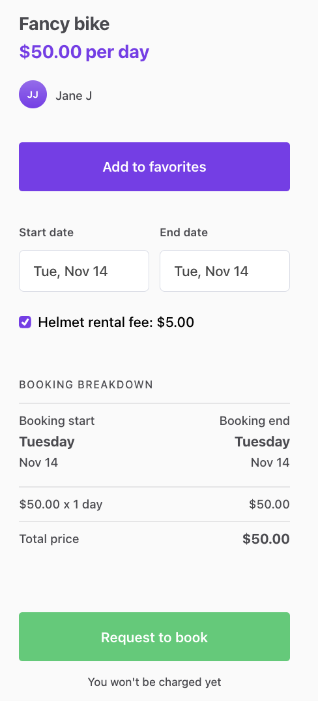
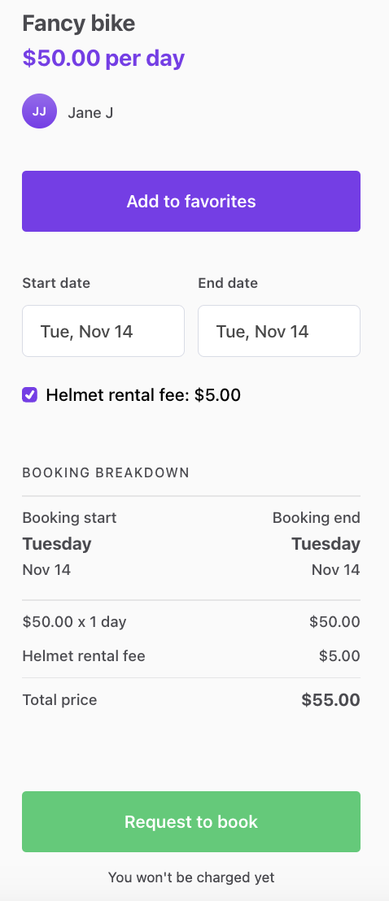

In this tutorial, you will

- Allow providers to add a helmet rental fee to their listings
- Allow customers to select whether they want to include the helmet
  rental fee in their booking
- Include a selected helmet rental fee in the transaction's pricing

<info>

This tutorial uses the following marketplace configurations:

- Listing types > Transaction process: **Calendar booking**

</info>

## Store helmet rental fee into listing

Pricing can be based on a lot of variables, and one practical way to
build it is to base it on information stored as extended data in
listings. In this example, we are using a listing's public data to store
information about the helmet rental fee.

We will not add new fields to listing configuration in Flex Console,
since we do not want to show the helmet rental fee in the Details panel.
Instead, we start by making some changes to **EditListingPricingPanel**
in _EditListingWizard_.

```shell
└── src
    └── containers
        └── EditListingPage
            └── EditListingWizard
                └── EditListingPricingPanel
                    └── EditListingPricingPanel.js
```

<info>

If you want to make corresponding changes to listing types with the
transaction process **Buying and selling products**, you'll need to make
comparable changes to _EditListingPricingAndStockPanel.js_ instead.

</info>

### Save to public data

In _EditListingPricingPanel_, we need to edit the _onSubmit_ function to
save the new public data field called **helmetFee**. Because we are
using _FieldCurrencyInput_ component in this example as the input of
choice, the _helmetFee_ variable will be a Money object when we get it
from the submitted _values_. Money object can't be used directly as
public data, so we need to create a JSON object with keys **amount** and
**currency**, and use it in the underlying API call.

<info>

The _price_ attribute is one of the listing's default attributes, so
it's passed to Marketplace API directly. The new public data attribute
_helmetFee_, on the other hand, needs to be under the _publicData_ key.

</info>

```jsx
onSubmit={values => {
  const { price, helmetFee = null } = values;

  const updatedValues = {
    price,
    publicData: {
      helmetFee: { amount: helmetFee.amount, currency: helmetFee.currency },
    },
  };
  onSubmit(updatedValues);
}}
```

### Initialize the form

Next, we want to pass inital values for _price_ and _helmetFee_. For
this, we need to get the _helmetFee_ from listing attributes under the
_publicData_ key. Also, because _FieldCurrencyInput_ expects the value
to be a Money object, we need to convert the value we get from
Marketplace API back to an instance of Money.

```jsx
const getInitialValues = params => {
  const { listing } = params;
  const { price, publicData } = listing?.attributes || {};

  const helmetFee = publicData?.helmetFee || null;

  const helmetFeeAsMoney = helmetFee
    ? new Money(helmetFee.amount, helmetFee.currency)
    : null;

  return { price, helmetFee: helmetFeeAsMoney };
};
```

Now pass the whole `initialValues` map in the corresponding prop to
_EditListingPricingForm_.

### Add input component

We want to be able to save the listing's helmet rental fee amount, so we
add a new _FieldCurrencyInput_ to the _EditListingPricingForm_. The id
and name of this field will be _helmetFee_.

Adding this fee will be optional, so we don't want to add any _validate_
param to the _FieldCurrencyInput_ like there is in the _price_ input.

```shell
└── src
    └── containers
        └── EditListingPage
            └── EditListingWizard
                └── EditListingPricingPanel
                    └── EditListingPricingForm.js
```

```jsx
...

<FieldCurrencyInput
  id={`${formId}price`}
  name="price"
  className={css.input}
  autoFocus={autoFocus}
  label={intl.formatMessage(
    { id: 'EditListingPricingForm.pricePerProduct' },
    { unitType }
  )}
  placeholder={intl.formatMessage({ id: 'EditListingPricingForm.priceInputPlaceholder' })}
  currencyConfig={appSettings.getCurrencyFormatting(marketplaceCurrency)}
  validate={priceValidators}
/>
<FieldCurrencyInput
  id={`${formId}helmetFee`}
  name="helmetFee"
  className={css.input}
  autoFocus={autoFocus}
  label={intl.formatMessage(
    { id: 'EditListingPricingForm.helmetFee' },
    { unitType }
  )}
  placeholder={intl.formatMessage({ id: 'EditListingPricingForm.helmetFeePlaceholder' })}
  currencyConfig={appSettings.getCurrencyFormatting(marketplaceCurrency)}
/>
...
```

You can use the following microcopy keys:

```js
  "EditListingPricingForm.helmetFee":"Helmet rental fee (optional)",
  "EditListingPricingForm.helmetFeePlaceholder": "Add a helmet rental fee..."
```

After adding the new microcopy keys, the EditListingPricingPanel should
look something like this:


## Update BookingDatesForm

In our example the helmet rental fee is optional, and users can select
it as an add-on to their booking. In this section, we will add the UI
component for selecting the helmet rental fee and pass the information
about the user's choice to the the backend of our client app.

In case you want to add the helmet rental fee automatically to every
booking, you don't need to add the UI component for selecting the helmet
rental fee, and you can move forward to the next section:
[Add a new line item for the helmet rental fee](/tutorial/customize-pricing-tutorial/#add-a-new-line-item-for-the-helmet-fee).

<info>

If you want to make corresponding changes to listing types with the
transaction process **Buying and selling products**, you'll need to make
comparable changes to _ProductOrderForm_ instead of _BookingDatesForm_.

</info>

### Prepare props

To use the information about helmet rental fee inside the
_BookingDatesForm_, we need to pass some new information from
_OrderPanel_ to the form. OrderPanel is the component used on
_ListingPage_ and _TransactionPage_ to show the order breakdown.

```shell
└── src
    └── components
        └── OrderPanel
            └── OrderPanel.js
```

_OrderPanel_ gets **listing** as a prop. The helmet rental fee is now
saved in the listing's public data, so we can find it under the
_publicData_ key in the listing's attributes.

Because adding a helmet rental fee to a listing is optional, we need to
check whether or not the _helmetFee_ exists in public data.

```jsx
const helmetFee = listing?.attributes?.publicData.helmetFee;
```

Once we have saved the helmet rental fee information to the variable
_helmetFee_, we need to pass it forward to _BookingDatesForm_. This form
is used for collecting the order data (e.g. booking dates), and values
from this form will be used when creating the transaction line items. We
will pass the _helmetFee_ to this form as a new prop.

```diff
  <BookingDatesForm
    className={css.bookingForm}
    formId="OrderPanelBookingDatesForm"
    lineItemUnitType={lineItemUnitType}
    onSubmit={onSubmit}
    price={price}
    marketplaceCurrency={marketplaceCurrency}
    dayCountAvailableForBooking={dayCountAvailableForBooking}
    listingId={listing.id}
    isOwnListing={isOwnListing}
    monthlyTimeSlots={monthlyTimeSlots}
    onFetchTimeSlots={onFetchTimeSlots}
    timeZone={timeZone}
    marketplaceName={marketplaceName}
    onFetchTransactionLineItems={onFetchTransactionLineItems}
    lineItems={lineItems}
    fetchLineItemsInProgress={fetchLineItemsInProgress}
    fetchLineItemsError={fetchLineItemsError}
+   helmetFee={helmetFee}
  />
```

### Add helmet rental fee checkbox

Next, we need to add a new field to _BookingDatesForm_ for selecting the
possible helmet rental fee. For this, we will use the **FieldCheckbox**
component, because we want the helmet rental fee to be optional.

```shell
└── src
    └── components
        └── OrderPanel
            └── BookingDatesForm
                └── BookingDatesForm.js
                └── BookingDatesForm.module.css
```

In _BookingDatesForm_ we need to import a couple of new resources we
need to add the helmet rental fee. These will include a few helper
functions necessary to handle the _helmetFee_ price information, as well
as the checkbox component _FieldCheckbox_.

```diff
  import { propTypes } from '../../util/types';
+ import { formatMoney } from '../../../util/currency';
+ import { types as sdkTypes } from '../../../util/sdkLoader';
  ...
import {
  Form,
  IconArrowHead,
  PrimaryButton,
  FieldDateRangeInput,
  H6,
+ FieldCheckbox,
} from '../../../components';

 import EstimatedCustomerBreakdownMaybe from './EstimatedCustomerBreakdownMaybe';

 import css from './BookingDatesForm.module.css';
+ const { Money } = sdkTypes;
```

When we have imported these files, we will add the checkbox component
for selecting the helmet rental fee. For this, we need to extract the
helmetFee from **fieldRenderProps**.

```diff
    ...
    lineItems,
    fetchLineItemsError,
    onFetchTimeSlots,
+   helmetFee,
  } = fieldRenderProps;
```

We want to show the amount of helmet rental fee to the user in the
checkbox label, so we need to format _helmetFee_ to a printable form.
For this, we want to use the _formatMoney_ function that uses localized
formatting. This function expects a Money object as a parameter, so we
need to do the conversion.

```jsx
const formattedHelmetFee = helmetFee
  ? formatMoney(intl, new Money(helmetFee.amount, helmetFee.currency))
  : null;

const helmetFeeLabel = intl.formatMessage(
  { id: 'BookingDatesForm.helmetFeeLabel' },
  { fee: formattedHelmetFee }
);
```

We will also add a new microcopy key _BookingDatesForm.helmetFeeLabel_
to the **_en.json_** file, and we can use the **_fee_** variable to show
the price.

```js
  "BookingDatesForm.helmetFeeLabel": "Helmet rental fee: {fee}",
```

Because there might be listings without a helmet rental fee, we want to
show the checkbox only when needed. This is why we will create the
**helmetFeeMaybe** component which is rendered only if the listing has a
helmet rental fee saved in its public data.

```jsx
const helmetFeeMaybe = helmetFee ? (
  <FieldCheckbox
    className={css.helmetFeeContainer}
    id={`${formId}.helmetFee`}
    name="helmetFee"
    label={helmetFeeLabel}
    value="helmetFee"
  />
) : null;
```

Then we can add the **helmetFeeMaybe** to the returned `<Form>`
component

```diff
...
    isDayBlocked={isDayBlocked}
    isOutsideRange={isOutsideRange}
    isBlockedBetween={isBlockedBetween(monthlyTimeSlots, timeZone)}
    disabled={fetchLineItemsInProgress}
    onClose={event =>
      setCurrentMonth(getStartOf(event?.startDate ?? startOfToday, 'month', timeZone))
    }
  />

+ {helmetFeeMaybe}

  {showEstimatedBreakdown ? (
    <div className={css.priceBreakdownContainer}>
      <h3>
...
```

As the final step for adding the checkbox, add the corresponding CSS
class to _BookingDatesForm.module.css_.

```css
.helmetFeeContainer {
  margin-top: 24px;
}
```

After this step, the BookingDatesForm should look like this. Note that
the helmet rental fee will not be visible in the order breakdown yet,
even though we added the new checkbox. TODO UPDATE IMAGE



### Update the orderData

Next, we want to pass the value of the helmet rental fee checkbox as
part of the **orderData**. This is needed so that we can show the
selected helmet rental fee as a new row in the order breakdown. To
achieve this, we need to edit the _handleOnChange_ function, which takes
the values from the form and calls the _onFetchTransactionLineItems_
function for constructing the transaction line items. These line items
are then shown inside the _bookingInfoMaybe_ component under the form
fields.

<info>

In Flex, the total price of a transaction is defined by its line items.
Line items describe what is included in a transaction. Line items can be
varied, from the number of booked units to customer and provider
commissions, add-ons, discounts, or payment refunds.

Every line item has a unit price and one of the following attributes:
**quantity**, **percentage**, or both **seats** and **units**. The
quantity attribute can be used to denote the number of booked units,
like the number of booked nights. Quantity can also be defined as a
multiplication of units and seats. The percentage param is used, for
instance, when modeling commissions. Based on these attributes, a line
total is calculated for each line item. Line totals then define the
total payin and payout sums of the transaction.

You can read more about line items and pricing in the
[pricing concepts article](/concepts/pricing/).

</info>

In the **orderData** object, we have all the information about the
user's choices. In this case, this includes booking dates, and whether
or not they selected the helmet rental fee.

We only need to know if the helmet rental fee was selected. We will
fetch the helmet rental fee details from Marketplace API later in the
the backend of our client app to make sure this information cannot be
manipulated.

In our case, because there is just one checkbox, it's enough to check
the length of that array to determine if any items are selected. If the
length of the _helmetFee_ array inside _values_ is bigger than 0, the
_hasHelmetFee_ param is true, and otherwise it is false. If we had more
than one item in the checkbox group, we should check which items were
selected.

```jsx
const handleFormSpyChange = (
  listingId,
  isOwnListing,
  fetchLineItemsInProgress,
  onFetchTransactionLineItems
) => formValues => {
  const { startDate, endDate } =
    formValues.values && formValues.values.bookingDates
      ? formValues.values.bookingDates
      : {};

  const hasHelmetFee = formValues.values?.helmetFee?.length > 0;

  if (startDate && endDate && !fetchLineItemsInProgress) {
    onFetchTransactionLineItems({
      orderData: {
        bookingStart: startDate,
        bookingEnd: endDate,
        hasHelmetFee,
      },
      listingId,
      isOwnListing,
    });
  }
};
```

## Add a new line-item for the helmet fee

We are making progress! Next, we need to edit the the backend of our
client app, and add a new line item for the helmet rental fee, so that
it can be included in pricing.

Flex uses privileged transitions to ensure that the pricing logic is
handled in a secure environment. This means that constructing line items
and transitioning requests of privileged transitions are made
server-side.

<info>

Privileged transitions are transaction process transitions that can only
be invoked from a secure context. For example, when using Sharetribe Web
Template, this secure context is the backend of the template app. You
can also build your own server-side validation that sits between your
marketplace UI and the Flex Marketplace API to invoke privileged
transitions.

We are using privileged transitions and the backend of our client app to
construct line items, because we want to make sure it is done in a
secure context. If the client-side code (template front-end) could
freely construct the line items, we couldn't fully trust that the price
calculation follows the model intended in the marketplace.

In theory, a marketplace user could make a direct API call to the Flex
Marketplace API and start a transaction with modified line items – for
instance, change the helmet rental fee amount. We can avoid this
security risk by using privileged transitions and fetching the pricing
information, like the helmet rental fee amount, directly from
Marketplace API in the backend of our client app.

You can read more about privileged transitions in the
[privileged transitions concepts article](/concepts/privileged-transitions/).

</info>

Since we want to add a new line item for the helmet rental fee, we'll
need to update the pricing logic in the _lineItems.js_ file:

```shell
└── server
    └── api-util
        ├── lineItems.js
        └── lineItemHelpers.js
```

### Resolve the helmet rental fee

First, we will add a new helper function for resolving the helmet rental
fee line item. This function will take the listing as a parameter, and
then get the helmet rental fee from its public data. To make sure the
data cannot be manipulated, we don't pass it directly from the template
frontend. Instead, we fetch the listing from Marketplace API, and check
that listing's public data for the accurate helmet rental fee.

If you have several helper functions, you might want to export this
function from the `lineItemHelpers.js` file instead, and import it in
`lineItems.js`.

```jsx
const resolveHelmetFeePrice = listing => {
  const publicData = listing.attributes.publicData;
  const helmetFee = publicData && publicData.helmetFee;
  const { amount, currency } = helmetFee;

  if (amount && currency) {
    return new Money(amount, currency);
  }

  return null;
};
```

### Add line-item

Now the _transactionLineItems_ function can be updated to also provide
the helmet rental fee line item when the listing has a helmet rental
fee.

In this example, the provider commission is calculated from the total of
booking and helmet rental fees. That's why we need to add the
_helmetFee_ item also to _calculateTotalFromLineItems(...)_ function in
the _providerCommission_ line item. If we don't add the helmet rental
fee, the provider commission calculation is only based on the booking
fee.

Also remember to add the helmet rental fee to the _lineItems_ array that
is returned in the end of the function.

```diff
exports.transactionLineItems = (listing, orderData) => {
...

  const order = {
    code,
    unitPrice,
    quantity,
    includeFor: ['customer', 'provider'],
  };

+ const helmetFeePrice = orderData.hasHelmetFee ? resolveHelmetFeePrice(listing) : null;
+ const helmetFee = helmetFeePrice
+   ? [
+       {
+         code: 'line-item/helmet-rental-fee',
+         unitPrice: helmetFeePrice,
+         quantity: 1,
+         includeFor: ['customer', 'provider'],
+       },
+     ]
+   : [];
+

  // Provider commission reduces the amount of money that is paid out to provider.
  // Therefore, the provider commission line-item should have negative effect to the payout total.
  const getNegation = percentage => {
    return -1 * percentage;
  };

  // Note: extraLineItems for product selling (aka shipping fee)
  //       is not included to commission calculation.
  const providerCommissionMaybe = hasCommissionPercentage(providerCommission)
    ? [
        {
          code: 'line-item/provider-commission',
-         unitPrice: calculateTotalFromLineItems([order]),
+         unitPrice: calculateTotalFromLineItems([order, ...helmetFee]),
          percentage: getNegation(providerCommission.percentage),
          includeFor: ['provider'],
        },
      ]
    : [];

  // Let's keep the base price (order) as first line item and provider's commission as last one.
  // Note: the order matters only if OrderBreakdown component doesn't recognize line-item.
- const lineItems = [order, ...extraLineItems, ...providerCommissionMaybe];
+ const lineItems = [order, ...extraLineItems, ...helmetFee, ...providerCommissionMaybe];


  return lineItems;
};
```

Once we have made the changes to the backend of our client app, we can
check the order breakdown again. If you now choose the helmet rental
fee, you should see the helmet rental fee in the booking breakdown:



## Update CheckoutPage to handle helmet rental fee

Finally, we want to update the Checkout Page so that it takes the helmet
rental fee selection into account when the customer actually pays for
the booking.

### Fetch speculated transaction complete with helmet rental fee

When a user clicks "Request to book", `ListingPage.js` sends the booking
details as initial values to the Checkout Page, which then fetches the
possible transaction information, including pricing, to be shown on the
checkout page. In Flex language, this is known as "speculating" the
transaction - the booking has not been made, but the line items are
calculated as if it were.

Since we are dealing with a paid transaction, we need to be modifying
the `CheckoutPageWithPayment.js` component. In that file, we have a
function called _getOrderParams_, which creates the correct set of order
parameters for all line item related API calls. Let's add helmet rental
fee handling to that function.

```shell
└── src
    └── containers
        └── CheckoutPage
            └── CheckoutPageWithPayment.js
```

```diff
const getOrderParams = (pageData, shippingDetails, optionalPaymentParams, config) => {
  const quantity = pageData.orderData?.quantity;
  const quantityMaybe = quantity ? { quantity } : {};
  const deliveryMethod = pageData.orderData?.deliveryMethod;
  const deliveryMethodMaybe = deliveryMethod ? { deliveryMethod } : {};
+ const hasHelmetFee = pageData.orderData?.helmetFee?.length > 0;

  const { listingType, unitType } = pageData?.listing?.attributes?.publicData || {};
  const protectedDataMaybe = {
    protectedData: {
      ...getTransactionTypeData(listingType, unitType, config),
      ...deliveryMethodMaybe,
      ...shippingDetails,
    },
  };

  // These are the order parameters for the first payment-related transition
  // which is either initiate-transition or initiate-transition-after-enquiry
  const orderParams = {
    listingId: pageData?.listing?.id,
    ...deliveryMethodMaybe,
+   hasHelmetFee,
    ...quantityMaybe,
    ...bookingDatesMaybe(pageData.orderData?.bookingDates),
    ...protectedDataMaybe,
    ...optionalPaymentParams,
  };
  return orderParams;
};
```

This function is used to build order parameters when the component loads
initial data for the page, and the order parameters are then passed to a
`speculateTransaction` action in `CheckoutPage.duck.js`. That action, in
turn, calls the template server using the correct endpoint and the order
parameters provided.

Now when the customer selects helmet rental fee on the listing page and
clicks "Request to book", we see the correct price and breakdown on the
checkout page.


The same function builds order parameters that get passed to the final
transaction initialisation.

<info>

In `CheckoutPageWithPayment.js`, the function that does the heavy
lifting in handling the payment processing is
`processCheckoutWithPayment()`, which is imported from a helper file. In
short, it first creates five functions to handle the transaction payment
process, then composes them into a single function
`handlePaymentIntentCreation()`, and then calls that function with the
`orderParams` parameter.

</info>

Now you can try it out! When you complete a booking on a listing that
has a helmet rental fee specified, you can see the helmet rental fee
included in the price on the booking page. In addition, the Flex Console
transaction price breakdown also shows the helmet rental fee.


<extrainfo title="Add helmet rental fee to email notifications">
To add the helmet rental fee into your email notifications, you will need to add it to the email templates.
The <a href="/docs/tutorial/use-protected-data-in-emails/">third step of this tutorial</a> deals with updating email notifications.

```diff
...
-       {{/if}}{{/eq}}{{#eq "line-item/provider-commission" code}}
+       {{/if}}{{/eq}}
+       {{#eq "line-item/helmet-rental-fee" code}}
+       <table align="center" border="0" cellPadding="0" cellSpacing="0" role="presentation" width="100%">
+         <tbody>
+           <tr>
+             <td>
+               <td>
+                 <p style="font-size:16px;line-height:1.4;margin:16px 0;color:#484848;margin-top:1px">Helmet rental fee</p>
+               </td>
+               <td style="text-align:right">
+                 <p style="font-size:16px;line-height:1.4;margin:16px 0;color:#484848;margin-top:1px">{{> format-money money=line-total}}</p>
+               </td>
+             </td>
+           </tr>
+         </tbody>
+       </table>
+       {{/eq}}
+       {{#eq "line-item/provider-commission" code}}
        <table align="center" border="0" cellPadding="0" cellSpacing="0" role="presentation" width="100%">
...
```

The email templates that list the full line items in the default booking
process are

- `booking-new-request` (to provider)
- `booking-request-accepted` (to customer)
- `booking-money-paid` (to provider)

</extrainfo>

## Summary

In this tutorial, you have

- Saved a helmet rental fee attribute to the listing's public data in
  _EditListingPricingPanel_
- Updated the _BookingDatesForm_ and _OrderPanel_ to show and handle
  helmet rental fee selection
- Added helmet rental fee to line item handling server-side
- Updated the _CheckoutPage_ to include helmet rental fee in the
  booking's pricing
