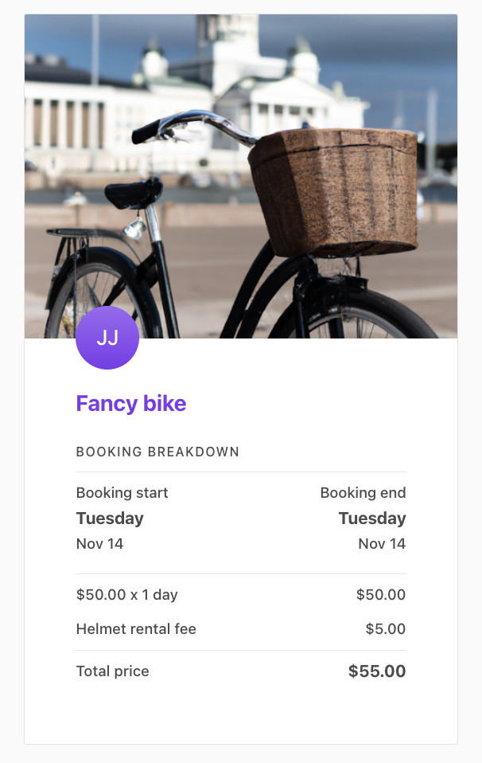

In this tutorial, you will

- Allow providers to add a cleaning fee to their listings
- Allow customers to select whether they want to include the cleaning
  fee in their booking
- Include a selected cleaning fee in the transaction's pricing

<info>

This tutorial uses the following marketplace configurations:

- Listing types > Transaction process: **Calendar booking**

</info>

## Store cleaning fee into listing

Pricing can be based on a lot of variables, and one practical way to
build it is to base it on information stored as extended data in
listings. In this example, we are using a listing's public data to store
information about the cleaning fee.

We will not add new fields to listing configuration in Flex Console,
since we do not want to show the cleaning fee in the Details panel.
Instead, we start by making some changes to **EditListingPricingPanel**
in _EditListingWizard_.

```shell
└── src
    └── containers
        └── EditListingPage
            └── EditListingWizard
                └── EditListingPricingPanel
                    └── EditListingPricingPanel.js
```

<info>

If you want to make corresponding changes to listing types with the
transaction process **Buying and selling products**, you'll need to make
comparable changes to _EditListingPricingAndStockPanel.js_ instead.

</info>

### Save to public data

In _EditListingPricingPanel_, we need to edit the _onSubmit_ function to
save the new public data field called **cleaningFee**. Because we are
using _FieldCurrencyInput_ component in this example as the input of
choice, the _cleaningFee_ variable will be a Money object when we get it
from the submitted _values_. Money object can't be used directly as
public data, so we need to create a JSON object with keys **amount** and
**currency**, and use it in the underlying API call.

<info>

The _price_ attribute is one of the listing's default attributes, so
it's passed to Marketplace API directly. The new public data attribute
_cleaningFee_, on the other hand, needs to be under the _publicData_
key.

</info>

```jsx
onSubmit={values => {
  const { price, cleaningFee = null } = values;

  const updatedValues = {
    price,
    publicData: {
      cleaningFee: { amount: cleaningFee.amount, currency: cleaningFee.currency },
    },
  };
  onSubmit(updatedValues);
}}
```

### Initialize the form

Next, we want to pass inital values for _price_ and _cleaningFee_. For
this, we need to get the _cleaningFee_ from listing attributes under the
_publicData_ key. Also, because _FieldCurrencyInput_ expects the value
to be a Money object, we need to convert the value we get from
Marketplace API back to an instance of Money.

```jsx
const getInitialValues = params => {
  const { listing } = params;
  const { price, publicData } = listing?.attributes || {};

  const cleaningFee = publicData?.cleaningFee || null;

  const cleaningFeeAsMoney = cleaningFee
    ? new Money(cleaningFee.amount, cleaningFee.currency)
    : null;

  return { price, cleaningFee: cleaningFeeAsMoney };
};
```

Now pass the whole `initialValues` map in the corresponding prop to
_EditListingPricingForm_.

### Add input component

We want to be able to save the listing's cleaning fee amount, so we add
a new _FieldCurrencyInput_ to the _EditListingPricingForm_. The id and
name of this field will be _cleaningFee_.

Adding this fee will be optional, so we don't want to add any _validate_
param to the _FieldCurrencyInput_ like there is in the _price_ input.

```shell
└── src
    └── containers
        └── EditListingPage
            └── EditListingWizard
                └── EditListingPricingPanel
                    └── EditListingPricingForm.js
```

```jsx
...

<FieldCurrencyInput
  id={`${formId}price`}
  name="price"
  className={css.input}
  autoFocus={autoFocus}
  label={intl.formatMessage(
    { id: 'EditListingPricingForm.pricePerProduct' },
    { unitType }
  )}
  placeholder={intl.formatMessage({ id: 'EditListingPricingForm.priceInputPlaceholder' })}
  currencyConfig={appSettings.getCurrencyFormatting(marketplaceCurrency)}
  validate={priceValidators}
/>
<FieldCurrencyInput
  id={`${formId}cleaningFee`}
  name="cleaningFee"
  className={css.input}
  autoFocus={autoFocus}
  label={intl.formatMessage(
    { id: 'EditListingPricingForm.cleaningFee' },
    { unitType }
  )}
  placeholder={intl.formatMessage({ id: 'EditListingPricingForm.cleaningFeePlaceholder' })}
  currencyConfig={appSettings.getCurrencyFormatting(marketplaceCurrency)}
/>
...
```

You can use the following microcopy keys:

```js
  "EditListingPricingForm.cleaningFee":"Cleaning fee (optional)",
  "EditListingPricingForm.cleaningFeePlaceholder": "Add a cleaning fee..."
```

After adding the new microcopy keys, the EditListingPricingPanel should
look something like this:


## Update BookingDatesForm

In our example the cleaning fee is optional, and users can select it as
an add-on to their booking. In this section, we will add the UI
component for selecting the cleaning fee and pass the information about
the user's choice to the the backend of our client app.

In case you want to add the cleaning fee automatically to every booking,
you don't need to add the UI component for selecting the cleaning fee,
and you can move forward to the next section:
[Add a new line item for the cleaning fee](/tutorial/customize-pricing-tutorial/#add-a-new-line-item-for-the-cleaning-fee).

<info>

If you want to make corresponding changes to listing types with the
transaction process **Buying and selling products**, you'll need to make
comparable changes to _ProductOrderForm_ instead of _BookingDatesForm_.

</info>

### Prepare props

To use the information about cleaning fee inside the _BookingDatesForm_,
we need to pass some new information from _OrderPanel_ to the form.
OrderPanel is the component used on _ListingPage_ and _TransactionPage_
to show the order breakdown.

```shell
└── src
    └── components
        └── OrderPanel
            └── OrderPanel.js
```

_OrderPanel_ gets **listing** as a prop. The cleaning fee is now saved
in the listing's public data, so we can find it under the _publicData_
key in the listing's attributes.

Because adding a cleaning fee to a listing is optional, we need to check
whether or not the cleaningFee exists in public data.

```jsx
const cleaningFee = listing?.attributes?.publicData.cleaningFee;
```

Once we have saved the cleaning fee information to the variable
_cleaningFee_, we need to pass it forward to _BookingDatesForm_. This
form is used for collecting the order data (e.g. booking dates), and
values from this form will be used when creating the transaction line
items. We will pass the _cleaningFee_ to this form as a new prop.

```diff
  <BookingDatesForm
    className={css.bookingForm}
    formId="OrderPanelBookingDatesForm"
    lineItemUnitType={lineItemUnitType}
    onSubmit={onSubmit}
    price={price}
    marketplaceCurrency={marketplaceCurrency}
    dayCountAvailableForBooking={dayCountAvailableForBooking}
    listingId={listing.id}
    isOwnListing={isOwnListing}
    monthlyTimeSlots={monthlyTimeSlots}
    onFetchTimeSlots={onFetchTimeSlots}
    timeZone={timeZone}
    marketplaceName={marketplaceName}
    onFetchTransactionLineItems={onFetchTransactionLineItems}
    lineItems={lineItems}
    fetchLineItemsInProgress={fetchLineItemsInProgress}
    fetchLineItemsError={fetchLineItemsError}
+   cleaningFee={cleaningFee}
  />
```

### Add cleaning fee checkbox

Next, we need to add a new field to _BookingDatesForm_ for selecting the
possible cleaning fee. For this, we will use the **FieldCheckbox**
component, because we want the cleaning fee to be optional.

```shell
└── src
    └── components
        └── OrderPanel
            └── BookingDatesForm
                └── BookingDatesForm.js
                └── BookingDatesForm.module.css
```

In _BookingDatesForm_ we need to import a couple of new resources we
need to add the cleaning fee. These will include a few helper functions
necessary to handle the _cleaningFee_ price information, as well as the
checkbox component _FieldCheckbox_.

```diff
  import { propTypes } from '../../util/types';
+ import { formatMoney } from '../../../util/currency';
+ import { types as sdkTypes } from '../../../util/sdkLoader';
  ...
import {
  Form,
  IconArrowHead,
  PrimaryButton,
  FieldDateRangeInput,
  H6,
+ FieldCheckbox,
} from '../../../components';

 import EstimatedCustomerBreakdownMaybe from './EstimatedCustomerBreakdownMaybe';

 import css from './BookingDatesForm.module.css';
+ const { Money } = sdkTypes;
```

When we have imported these files, we will add the checkbox component
for selecting the cleaning fee. For this, we need to extract the
cleaningFee from **fieldRenderProps**.

```diff
    ...
    lineItems,
    fetchLineItemsError,
    onFetchTimeSlots,
+   cleaningFee,
  } = fieldRenderProps;
```

We want to show the amount of cleaning fee to the user in the checkbox
label, so we need to format _cleaningFee_ to a printable form. For this,
we want to use the _formatMoney_ function that uses localized
formatting. This function expects a Money object as a parameter, so we
need to do the conversion.

```jsx
const formattedCleaningFee = cleaningFee
  ? formatMoney(
      intl,
      new Money(cleaningFee.amount, cleaningFee.currency)
    )
  : null;

const cleaningFeeLabel = intl.formatMessage(
  { id: 'BookingDatesForm.cleaningFeeLabel' },
  { fee: formattedCleaningFee }
);
```

We will also add a new microcopy key _BookingDatesForm.cleaningFeeLabel_
to the **_en.json_** file, and we can use the **_fee_** variable to show
the price.

```js
  "BookingDatesForm.cleaningFeeLabel": "Cleaning fee: {fee}",
```

Because there might be listings without a cleaning fee, we want to show
the checkbox only when needed. This is why we will create the
**cleaningFeeMaybe** component which is rendered only if the listing has
a cleaning fee saved in its public data.

```jsx
const cleaningFeeMaybe = cleaningFee ? (
  <FieldCheckbox
    className={css.cleaningFeeContainer}
    id={`${formId}.cleaningFee`}
    name="cleaningFee"
    label={cleaningFeeLabel}
    value="cleaningFee"
  />
) : null;
```

Then we can add the **cleaningFeeMaybe** to the returned `<Form>`
component

```diff
...
    isDayBlocked={isDayBlocked}
    isOutsideRange={isOutsideRange}
    isBlockedBetween={isBlockedBetween(monthlyTimeSlots, timeZone)}
    disabled={fetchLineItemsInProgress}
    onClose={event =>
      setCurrentMonth(getStartOf(event?.startDate ?? startOfToday, 'month', timeZone))
    }
  />

+ {cleaningFeeMaybe}

  {showEstimatedBreakdown ? (
    <div className={css.priceBreakdownContainer}>
      <h3>
...
```

As the final step for adding the checkbox, add the corresponding CSS
class to _BookingDatesForm.module.css_.

```css
.cleaningFeeContainer {
  margin-top: 24px;
}
```

After this step, the BookingDatesForm should look like this. Note that
the cleaning fee will not be visible in the order breakdown yet, even
though we added the new checkbox.


### Update the orderData

Next, we want to pass the value of the cleaning fee checkbox as part of
the **orderData**. This is needed so that we can show the selected
cleaning fee as a new row in the order breakdown. To achieve this, we
need to edit the _handleOnChange_ function, which takes the values from
the form and calls the _onFetchTransactionLineItems_ function for
constructing the transaction line items. These line items are then shown
inside the _bookingInfoMaybe_ component under the form fields.

<info>

In Flex, the total price of a transaction is defined by its line items.
Line items describe what is included in a transaction. Line items can be
varied, from the number of booked units to customer and provider
commissions, add-ons, discounts, or payment refunds.

Every line item has a unit price and one of the following attributes:
**quantity** or **percentage**. The quantity attribute can be used to
denote the number of booked units, like the number of booked nights.
Quantity can also be defined as a multiplication of units and seats. The
percentage param is used, for instance, when modeling commissions. Based
on these attributes, a line total is calculated for each line item. Line
totals then define the total payin and payout sums of the transaction.

You can read more about line items and pricing in the
[pricing concepts article](/concepts/pricing/).

</info>

In the **orderData** object, we have all the information about the
user's choices. In this case, this includes booking dates, and whether
or not they selected the cleaning fee.

We only need to know if the cleaning fee was selected. We will fetch the
cleaning fee details from Marketplace API later in the the backend of
our client app to make sure this information cannot be manipulated.

In our case, because there is just one checkbox, it's enough to check
the length of that array to determine if any items are selected. If the
length of the _cleaningFee_ array inside _values_ is bigger than 0, the
_hasCleaningFee_ param is true, and otherwise it is false. If we had
more than one item in the checkbox group, we should check which items
were selected.

```jsx
const handleFormSpyChange = (
  listingId,
  isOwnListing,
  fetchLineItemsInProgress,
  onFetchTransactionLineItems
) => formValues => {
  const { startDate, endDate } =
    formValues.values && formValues.values.bookingDates
      ? formValues.values.bookingDates
      : {};

  const hasCleaningFee = formValues.values?.cleaningFee?.length > 0;

  if (startDate && endDate && !fetchLineItemsInProgress) {
    onFetchTransactionLineItems({
      orderData: {
        bookingStart: startDate,
        bookingEnd: endDate,
        hasCleaningFee,
      },
      listingId,
      isOwnListing,
    });
  }
};
```

## Add a new line-item for the cleaning fee

We are making progress! Next, we need to edit the the backend of our
client app, and add a new line item for the cleaning fee, so that it can
be included in pricing.

Flex uses privileged transitions to ensure that the pricing logic is
handled in a secure environment. This means that constructing line items
and transitioning requests of privileged transitions are made
server-side.

<info>

Privileged transitions are transaction process transitions that can only
be invoked from a secure context. For example, when using Sharetribe Web
Template, this secure context is the backend of the template app. You
can also build your own server-side validation that sits between your
marketplace UI and the Flex Marketplace API to invoke privileged
transitions.

<br/>

We are using privileged transitions and the backend of our client app to
construct line items, because we want to make sure it is done in a
secure context. If the client-side code (template front-end) could
freely construct the line items, we couldn't fully trust that the price
calculation follows the model intended in the marketplace.

<br/>

In theory, a marketplace user could make a direct API call to the Flex
Marketplace API and start a transaction with modified line items – for
instance, change the cleaning fee amount. We can avoid this security
risk by using privileged transitions and fetching the pricing
information, like the cleaning fee amount, directly from Marketplace API
in the backend of our client app.

<br/>

You can read more about privileged transitions in the
[privileged transitions concepts article](/concepts/privileged-transitions/).

</info>

Since we want to add a new line item for the cleaning fee, we'll need to
update the pricing logic in the _lineItems.js_ file:

```shell
└── server
    └── api-util
        ├── lineItems.js
        └── lineItemHelpers.js
```

### Resolve the cleaning fee

First, we will add a new helper function for resolving the cleaning fee
line item. This function will take the listing as a parameter, and then
get the cleaning fee from its public data. To make sure the data cannot
be manipulated, we don't pass it directly from the template frontend.
Instead, we fetch the listing from Marketplace API, and check that
listing's public data for the accurate cleaning fee.

If you have several helper functions, you might want to add this
function to the `lineItemHelpers.js` file instead.

```jsx
const resolveCleaningFeePrice = listing => {
  const publicData = listing.attributes.publicData;
  const cleaningFee = publicData && publicData.cleaningFee;
  const { amount, currency } = cleaningFee;

  if (amount && currency) {
    return new Money(amount, currency);
  }

  return null;
};
```

### Add line-item

Now the transactionLineItems function can be updated to also provide the
cleaning fee line item when the listing has a cleaning fee.

In this example, the provider commission is calculated from the total of
booking and cleaning fees. That's why we need to add the _cleaningFee_
item also to _calculateTotalFromLineItems(...)_ function in the
_providerCommission_ line item. If we don't add the cleaning fee, the
provider commission calculation is only based on the booking fee.

Also remember to add the cleaning fee to the _lineItems_ array that is
returned in the end of the function.

```diff
exports.transactionLineItems = (listing, orderData) => {
...

  const order = {
    code,
    unitPrice,
    quantity,
    includeFor: ['customer', 'provider'],
  };

+ const cleaningFeePrice = orderData.hasCleaningFee ? resolveCleaningFeePrice(listing) : null;
+ const cleaningFee = cleaningFeePrice
+   ? [
+       {
+         code: 'line-item/cleaning-fee',
+         unitPrice: cleaningFeePrice,
+         quantity: 1,
+         includeFor: ['customer', 'provider'],
+       },
+     ]
+   : [];
+

  // Provider commission reduces the amount of money that is paid out to provider.
  // Therefore, the provider commission line-item should have negative effect to the payout total.
  const getNegation = percentage => {
    return -1 * percentage;
  };

  // Note: extraLineItems for product selling (aka shipping fee)
  //       is not included to commission calculation.
  const providerCommissionMaybe = hasCommissionPercentage(providerCommission)
    ? [
        {
          code: 'line-item/provider-commission',
-         unitPrice: calculateTotalFromLineItems([order]),
+         unitPrice: calculateTotalFromLineItems([order, ...cleaningFee]),
          percentage: getNegation(providerCommission.percentage),
          includeFor: ['provider'],
        },
      ]
    : [];

  // Let's keep the base price (order) as first line item and provider's commission as last one.
  // Note: the order matters only if OrderBreakdown component doesn't recognize line-item.
- const lineItems = [order, ...extraLineItems, ...providerCommissionMaybe];
+ const lineItems = [order, ...extraLineItems, ...cleaningFee, ...providerCommissionMaybe];


  return lineItems;
};
```

Once we have made the changes to the backend of our client app, we can
check the order breakdown again. If you now choose the cleaning fee, you
should see the cleaning fee in the booking breakdown:


## Update CheckoutPage to handle cleaning fee

Finally, we want to update the Checkout Page so that it takes the
cleaning fee selection into account when the customer actually pays for
the booking.

### Fetch speculated transaction complete with cleaning fee

When a user clicks "Request to book", `ListingPage.js` sends the booking
details as initial values to `CheckoutPage.js`, which then fetches the
possible transaction information, including pricing, to be shown on the
checkout page. In Flex language, this is known as "speculating" the
transaction - the booking has not been made, but the line items are
calculated as if it were.

This means that we need to first pass the cleaning fee information to
the function that speculatively fetches the transaction in
`CheckoutPage.js`, and then receive it in `CheckoutPage.duck.js`. First,
the CheckoutPage.js `loadInitialData()` does some data processing and,
if necessary, calls `fetchSpeculatedTransaction()`.

```shell
└── src
    └── containers
        └── CheckoutPage
            └── CheckoutPage.js
```

```diff
loadInitialData() {
  ...
      const deliveryMethod = pageData.orderData?.deliveryMethod;
+     const hasCleaningFee = pageData.orderData?.cleaningFee?.length > 0;
      fetchSpeculatedTransaction(
        {
          listingId,
          deliveryMethod,
+         hasCleaningFee,
          ...quantityMaybe,
          ...bookingDatesMaybe(pageData.orderData.bookingDates),
        },
        processAlias,
        transactionId,
        requestTransition,
        isPrivileged
      );
...
```

This function call dispatches a `speculateTransaction` action in
`CheckoutPage.duck.js`, which in turn calls the template server using
the correct endpoint.

```shell
└── src
    └── containers
        └── CheckoutPage
            └── CheckoutPage.duck.js
```

To pass the cleaning fee selection to the API call, we add it to
`orderData` within the `speculateTransaction` action.

```diff
export const speculateTransaction = (
  ...
- const { deliveryMethod, quantity, bookingDates, ...otherOrderParams } = orderParams;
+ const { deliveryMethod, quantity, bookingDates, hasCleaningFee, ...otherOrderParams } = orderParams;
...

  // Parameters only for client app's server
- const orderData = deliveryMethod ? { deliveryMethod } : {};
+ const orderData = deliveryMethod || hasCleaningFee ? { deliveryMethod, hasCleaningFee } : {};

```

Now when the customer selects cleaning fee on the listing page and
clicks "Request to book", we see the correct price and breakdown on the
checkout page.



### Include cleaning fee in the final transaction price

The final step is to add the same logic to the flow that eventually sets
the price for the transaction.

```shell
└── src
    └── containers
        └── CheckoutPage
            └── CheckoutPage.js
```

In `CheckoutPage.js`, the function that does the heavy lifting in
handling the payment processing is `handlePaymentIntent()`. In short, it
first creates five functions to handle the transaction payment process,
then composes them into a single function
`handlePaymentIntentCreation()`, and then calls that function with
parameter `orderParams`.

To add the cleaning fee information into this process, we want to
include it in `orderParams`, which is defined towards the very end of
`handlePaymentIntent()` function.

```diff
    const deliveryMethod = pageData.orderData?.deliveryMethod;
+   const hasCleaningFee = pageData.orderData?.cleaningFee?.length > 0;
...
    const orderParams = {
      listingId: pageData.listing.id,
      deliveryMethod,
+     hasCleaningFee,
      ...quantityMaybe,
      ...bookingDatesMaybe(pageData.orderData.bookingDates),
      ...protectedDataMaybe,
      ...optionalPaymentParams,
    };
```

Then, we still need to add the cleaning fee information to the correct
action in `CheckoutPage.duck.js`.

```shell
└── src
    └── containers
        └── CheckoutPage
            └── CheckoutPage.duck.js
```

The first function in the `handlePaymentIntentCreation()` composition is
`fnRequestPayment`. It initiates the order if there is no existing
paymentIntent, and in practice it dispatches the `initiateOrder` action
that calls the template server. So similarly to the
`speculateTransaction` action, we just need to add the cleaning fee
selection to `orderData` in `initiateOrder`.

```diff
export const initiateOrder = (
  ...

- const { deliveryMethod, quantity, bookingDates, ...otherOrderParams } = orderParams;
+ const { deliveryMethod, quantity, bookingDates, hasCleaningFee, ...otherOrderParams } = orderParams;
...

  // Parameters only for client app's server
- const orderData = deliveryMethod ? { deliveryMethod } : {};
+ const orderData = deliveryMethod || hasCleaningFee ? { deliveryMethod, hasCleaningFee } : {};

```

Now you can try it out! You may have to refresh your application first,
so that the Redux changes take effect. When you complete a booking on a
listing that has a cleaning fee specified, you can see the cleaning fee
included in the price on the booking page. In addition, the Flex Console
transaction price breakdown also shows the cleaning fee.


<extrainfo title="Add cleaning fee to email notifications">
To add the cleaning fee into your email notifications, you will need to add it to the email templates.
The <a href="/docs/tutorial/use-protected-data-in-emails/">third step of this tutorial</a> deals with updating email notifications.

```diff
      {{#each tx-line-items}}
        {{#contains include-for "provider"}}
          {{#eq "line-item/day" code}} ...

+          {{#eq "line-item/cleaning-fee" code}}
+            <tr class="bottom-row">
+              <td>Cleaning fee</td>
+              <td class="right">{{> format-money money=line-total}}</td>
+            </tr>
+          {{/eq}}

          {{#eq "line-item/provider-commission" code}} ...
        {{/contains}}
      {{/each}}
```

The email templates that list the full line items in the default booking
process are

- `new-booking-request` (to provider)
- `booking-request-accepted` (to customer)
- `money-paid` (to provider)

</extrainfo>

## Summary

In this tutorial, you have

- Saved a cleaning fee attribute to the listing's public data in
  _EditListingPricingPanel_
- Updated the _BookingDatesForm_ and _OrderPanel_ to show and handle
  cleaning fee selection
- Added cleaning fee to line item handling server-side
- Updated the _CheckoutPage_ to include cleaning fee in the booking's
  pricing
