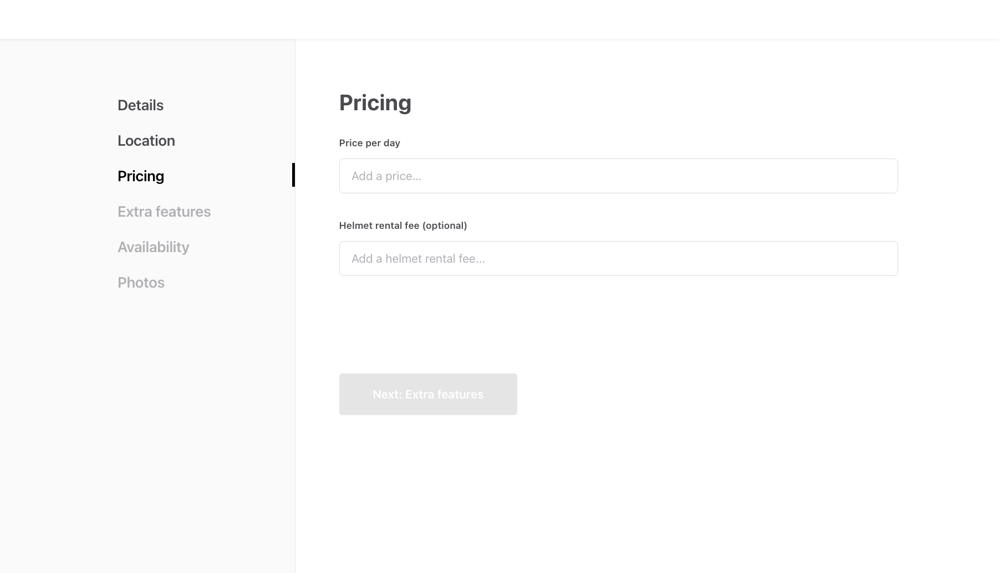
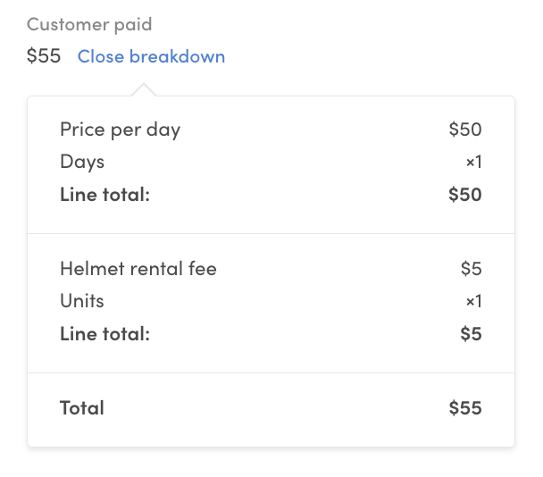

## Store cleaning fee into listing

Pricing can be based on a lot of variables but one practical way to
build it is to base it on information stored as extended data in
listings. In this example, we are using listing's public data to store
information about the cleaning fee. We start by doing some changes to
**EditListingPricingPanel** in _EditListingWizard_.

```shell
└── src
    └── components
        └── EditListingPricingPanel
            └── EditListingPricingPanel.js
```

<extrainfo title="FTW-product has moved EditListingWizard components under EditListingPage">

```shell
└── src
    └── containers
        └── EditListingPage
            └── EditListingWizard
                └── EditListingPricingPanel
                    └── EditListingPricingPanel.js
```

</extrainfo>

Here we will only list the required changes. See the
[Add extended data to listing entity tutorial](/tutorial/add-extended-data/)
for step-by-step instructions on how to add public data field for
listing.

### Save to public data

In _EditListingPricingPanel_, we need to edit the _onSubmit_ function to
save the new public data field called **cleaningFee**. Because we are
using _FieldCurrencyInput_ component in this example as the input of
choice, the _cleaningFee_ variable will be Money object when we get that
from the submitted _values_. Money object can't be used directly as
public data so we need to create a JSON object with keys **amount** and
**currency** and use it in the underlying API call.

> **Note:** _price_ attribute is one of the listing's default attributes
> so it's passed to Marketplace API directly unlike the new public data
> _cleaningFee_ which needs to be under the _publicData_ key.

```jsx
onSubmit={values => {
  const { price, cleaningFee = null } = values;

  const updatedValues = {
    price,
    publicData: {
      cleaningFee: { amount: cleaningFee.amount, currency: cleaningFee.currency },
    },
  };
  onSubmit(updatedValues);
}}
```

### Initialize the form

Next we want to pass inital values for _price_ and _cleaningFee_. For
this we need to get the _cleaningFee_ from listing attributes under the
_publicData_ key. Also, because _FieldCurrencyInput_ expects the value
to be Money object we need to convert the value we get from Marketplace
API back to instance of Money.

```jsx
const { price, publicData } = currentListing.attributes;
const cleaningFee =
  publicData && publicData.cleaningFee ? publicData.cleaningFee : null;

const cleaningFeeAsMoney = cleaningFee
  ? new Money(cleaningFee.amount, cleaningFee.currency)
  : null;

const initialValues = { price, cleaningFee: cleaningFeeAsMoney };
```

Now pass the whole `initialValues` map in the corresponding prop to
_EditListingPricingForm_.

### Add input component

We want to be able to save the amount of listing's cleaning fee so we
add new _FieldCurrencyInput_ to the _EditListingPricingForm_. The id and
name of this field will be _cleaningFee_. Adding this fee will be
optional so we don't want to add any _validate_ param to the
_FieldCurrencyInput_ like there is in the _price_ input.

```shell
└── src
    └── forms
        └── EditListingPricingForm
            └── EditListingPricingForm.js
```

<extrainfo title="FTW-product has moved EditListingWizard components under EditListingPage">

```shell
└── src
    └── containers
        └── EditListingPage
            └── EditListingWizard
                └── EditListingPricingPanel
                    └── EditListingPricingForm.js
```

</extrainfo>

```jsx
...

<FieldCurrencyInput
    id="price"
    name="price"
    className={css.priceInput}
    autoFocus
    label={pricePerUnitMessage}
    placeholder={pricePlaceholderMessage}
    currencyConfig={config.currencyConfig}
    validate={priceValidators}
  />

<FieldCurrencyInput
  id="cleaningFee"
  name="cleaningFee"
  className={css.cleaningFeeInput}
  autoFocus
  label={cleaningFeeMessage}
  placeholder={cleaningFeePlaceholderMessage}
  currencyConfig={config.currencyConfig}
/>
...
```

After adding the new microcopy keys and some padding to price input in
CSS file, the EditListingPricingPanel should look something like this:



## Update BookingDatesForm

In our example the cleaning fee is optional and users can select that as
an add-on to their booking. In this section, we will add the UI
component for selecting the cleaning fee and pass the information about
the user's choice to the the backend of our client app.

> **Note**: In case you would like to add the cleaning fee automatically
> to every booking, you don't need to add the UI component for selecting
> the cleaning fee and you can move forward to the next section: Add a
> transaction line item for the cleaning fee.

> **Note 2**: This tutorial handles changes on top of _FTW-daily_.
> _FTW-hourly_ is pretty close to it, but **_FTW-product_** has major
> differences since that template is not about bookings but product
> orders. With FTW-product, you should make changes to
>
> - _OrderPanel_ (instead of BookingPanel)
> - _ProductOrderForm_ (instead of BookingDatesForm), which is moved
>   under OrderPanel
> - _OrderBreakdown_ (instead of BookingBreakdown)
> - _EstimatedCustomerBreakdownMaybe_ (instead of
>   EstimatedBreakdownMaybe)
> - bookingData is refactored as **orderData**

### Prepare props

In order to be able to use the information about cleaning fee inside the
_BookingDatesForm_ we need to pass some new information from
_BookingPanel_ to the form. BookingPanel is component that is used on
_ListingPage_ and _TransactionPage_ to show the booking breakdown.

```shell
└── src
    └── components
        └── BookingPanel
            └── BookingPanel.js
```

This part of the tutorial is also otherwise changed.
**BookingDatesForm** is not in use, but instead there's
**ProductOrderForm**.

</extrainfo>

_BookingPanel_ gets **listing** as a prop. The cleaning fee is now saved
to listing's public data so we can find it under the _publicData_ key
from listing's attributes. Because we decided that adding a cleaning fee
to listing's information is optional, we need to check if the
cleaningFee exists in public data or not.

```jsx
const cleaningFee =
  listing.attributes.publicData &&
  listing.attributes.publicData.cleaningFee
    ? listing.attributes.publicData.cleaningFee
    : null;
```

Once we have saved the information about the cleaning fee to variable
_cleaningFee_ we need to pass that forward to _BookingDatesForm_. This
form is used for collecting the booking data (e.g. booking dates) and
values from this form will be used when creating the transaction
lineItems. We will pass the _cleaningFee_ to this form as a new prop.

```diff
  <BookingDatesForm
    className={css.bookingForm}
    formId="BookingPanel"
    submitButtonWrapperClassName={css.bookingDatesSubmitButtonWrapper}
    unitType={unitType}
    onSubmit={onSubmit}
    price={price}
    listingId={listing.id}
    isOwnListing={isOwnListing}
    timeSlots={timeSlots}
    fetchTimeSlotsError={fetchTimeSlotsError}
    onFetchTransactionLineItems={onFetchTransactionLineItems}
    lineItems={lineItems}
    fetchLineItemsInProgress={fetchLineItemsInProgress}
    fetchLineItemsError={fetchLineItemsError}
+  cleaningFee={cleaningFee}
  />
```

### Add cleaning fee checkbox

Next, we need to add a new field to _BookingDatesForm_ for selecting the
possible cleaning fee. For this, we will use the **FieldCheckbox**
component because want the cleaning fee to be optional.

```shell
└── src
    └── forms
        └── BookingDatesForm
            └── BookingDatesForm.js
```

In _BookingDatesForm_ we need to import a couple of new resources we
will need for adding the cleaning fee. These will be some helper
functions needed to handle the cleaningFee price information and the
checkbox component _FieldCheckbox_.

```diff
  import { propTypes } from '../../util/types';
+ import { formatMoney } from '../../util/currency';
+ import { types as sdkTypes } from '../../util/sdkLoader';
  import config from '../../config';
  import {
    Form,
    IconSpinner,
    PrimaryButton,
    FieldDateRangeInput,
+   FieldCheckbox,
} from '../../components';
 import EstimatedBreakdownMaybe from './EstimatedBreakdownMaybe';

 import css from './BookingDatesForm.module.css';
+ const { Money } = sdkTypes;
```

When we have imported these files, we will add the component for showing
the checkbox for selecting the cleaning fee. For this, we need to
extract the cleaningFee from **fieldRenderProps**.

```diff
    ...
    lineItems,
    fetchLineItemsInProgress,
    fetchLineItemsError,
+   cleaningFee,
  } = fieldRenderProps;
```

We want to show the amount of cleaning fee to the user in the checkbox
label so we need to format the cleaningFee to printable form. For this
we want to use _formatMoney_ function which will use localized
formatting. This function expects Money object as parameter so we need
to do the conversion.

```jsx
const formattedCleaningFee = cleaningFee
  ? formatMoney(
      intl,
      new Money(cleaningFee.amount, cleaningFee.currency)
    )
  : null;

const cleaningFeeLabel = intl.formatMessage(
  { id: 'BookingDatesForm.cleaningFeeLabel' },
  { fee: formattedCleaningFee }
);
```

We will also add new translation key _BookingDatesForm.cleaningFeeLabel_
to **_en.json_** file where we can use **_fee_** variable to show the
price.

```js
  "BookingDatesForm.cleaningFeeLabel": "Cleaning fee: {fee}",
```

Because there might be listing's without cleaning fee, we want to show
the checkbox only when needed. This is why we will create the
**cleaningFeeMaybe** component which is rendered only if the listing has
the cleaning fee saved to the public data.

```jsx
const cleaningFeeMaybe = cleaningFee ? (
  <FieldCheckbox
    id="cleaningFee"
    name="cleaningFee"
    label={cleaningFeeLabel}
    value="cleaningFee"
  />
) : null;
```

Then we can add the **cleaningFeeMaybe** to the returned `<Form>`
component

```diff
...
    timeSlots={timeSlots}
    useMobileMargins
    validate={composeValidators(
      required(requiredMessage),
      bookingDatesRequired(startDateErrorMessage, endDateErrorMessage)
    )}
    disabled={fetchLineItemsInProgress}
  />

+ {cleaningFeeMaybe}

  {bookingInfoMaybe}
  {loadingSpinnerMaybe}
  {bookingInfoErrorMaybe}
...
```

After this step, the BookingDatesForm should look like this. You should
notice that the cleaning fee will not be visible in the booking
breakdown yet even though we added the new checkbox.


### Update the bookingData

Next, we want to pass the value of the cleaning fee checkbox forward as
part of the **bookingData**. This is needed so that we can show the
selected cleaning fee as a new row on the booking breakdown. To achieve
this, we need to edit the _handleOnChange_ function which takes the
values from the form and calls the _onFetchTransactionLineItems_
function for constructing the transaction line items. These line items
are shown inside the _bookingInfoMaybe_ component under the form fields.

<extraInfo title="What are line items?">

In Flex, the total price of a transaction is defined by its line items.
Line items describe what is included in a transaction. It can be a
varying set of things from the number of booked units to customer and
provider commissions, add-ons, discounts, or payment refunds.

Every line item has a unit price and one of the following attributes:
quantity or percentage. The quantity attribute can be used to denote the
number of booked units, like the number of booked nights. Quantity can
also be defined as a multiplication of units and seats. The percentage
param is used when modeling commissions for example. Based on these
attributes a line total is calculated for each line item. Line totals
then define the total payin and payout sums of the transaction.

You can read more about line items and pricing from
[pricing background article](https://www.sharetribe.com/docs/concepts/pricing/).

</extraInfo>

In the **bookingData** object, we will have all the information about
the user's choices. In this case, it means booking dates and if they
selected the cleaning fee or not. We only need the information if the
cleaning fee was selected. We will fetch the cleaning fee details from
Marketplace API later in the the backend of our client app to make sure
this information can't be manipulated.

In our case, because there is just one checkbox, it's enough to check
the length of that array to determine if any items are selected. If the
length of the cleaningFee array inside values is bigger than 0, the
_hasCleaningFee_ param is true and otherwise false. If we hade more than
one item in the checkbox group then we should check which items were
selected.

```jsx
  handleOnChange(formValues) {
    const { startDate, endDate } =
      formValues.values && formValues.values.bookingDates ? formValues.values.bookingDates : {};
    const hasCleaningFee =
      formValues.values.cleaningFee && formValues.values.cleaningFee.length > 0;

    const listingId = this.props.listingId;
    const isOwnListing = this.props.isOwnListing;

    if (startDate && endDate && !this.props.fetchLineItemsInProgress) {
      this.props.onFetchTransactionLineItems({
        bookingData: { startDate, endDate, hasCleaningFee },
        listingId,
        isOwnListing,
      });
    }
  }
```

## Add a new line-item for the cleaning fee

We are almost there! Next, we need to edit the the backend of our client
app and add a new line item for cleaning fee so that it will be included
in pricing. Flex uses privileged transitions to ensure that the pricing
logic is handled in a secure environment. This means that constructing
line items and transitioning requests of privileged transitions are made
from the server-side.

<extraInfo title="What are privileged transitions and why we use them?">

Privileged transitions are transaction process transitions that can be
invoked only from a secure context. For example, when using Flex
Templates for Web this secure context is the backend of our client app.
You can also build your own server-side validation that sits between
your marketplace UI and the Flex Marketplace API to invoke privileged
transitions.

We are using privileged transitions and the backend of our client app
for constructing line items because we want to make sure this is done in
a secure context. If the client-side code (FTW-frontend) could freely
construct the line items, we couldn't fully trust that the price
calculation follows the model intended in the marketplace. In theory, a
marketplace user could make a direct API call to the Flex Marketplace
API and start a transaction with modified line items (e.g. change the
amount of cleaning fee). When we use the privileged transitions and
fetch the pricing information like the cleaning fee amount directly from
Marketplace API in the backend of our client app, we can avoid this
security risk.

You can read more about privileged transitions from
[privileged transitions background article](/concepts/privileged-transitions/).

</extraInfo>

When we want to add a new line item for cleaning fee, we'll need to
update the pricing logic in the _lineItems.js_ file:

```shell
└── server
    └── api-util
        ├── lineItems.js
        └── lineItemHelpers.js
```

### Resolve the cleaning fee

First, we will add a new helper function for resolving the cleaning fee
line item. This function will take the listing as a parameter and then
get the cleaning fee from its public data. We don't want to pass this
data from FTW-frontend directly so it' can be not manipulated. Instead,
we check it from the listing that was fetched from Marketplace API.

If you have many helper functions you might want to add this function to
the `lineItemHelpers.js` file instead.

```jsx
const resolveCleaningFeePrice = listing => {
  const publicData = listing.attributes.publicData;
  const cleaningFee = publicData && publicData.cleaningFee;
  const { amount, currency } = cleaningFee;

  if (amount && currency) {
    return new Money(amount, currency);
  }

  return null;
};
```

### Add line-item

Now the transactionLineItems function can be updated to also provide the
cleaning fee line item in case the listing has a cleaning fee
configured.

In this example, we decided that the provider commission is calculated
from the total of booking and cleaning fees. That's why we need to add
the _cleaningFee_ item also to _calculateTotalFromLineItems(...)_
function on providerCommission line item. If we don't add the cleaning
fee there the provider commission is calculated only based on the
booking fee.

Remember also to add cleaning fee to _lineItems_ array which is returned
in the end of the function.

```diff
exports.transactionLineItems = (listing, bookingData) => {
  const unitPrice = listing.attributes.price;
  const { startDate, endDate, hasCleaningFee } = bookingData;

  const booking = {
    code: 'line-item/night',
    unitPrice,
    quantity: calculateQuantityFromDates(startDate, endDate, unitType),
    includeFor: ['customer', 'provider'],
  };

+ const cleaningFeePrice = hasCleaningFee ? resolveCleaningFeePrice(listing) : null;
+ const cleaningFee = cleaningFeePrice
+   ? [
+       {
+         code: 'line-item/cleaning-fee',
+         unitPrice: cleaningFeePrice,
+         quantity: 1,
+         includeFor: ['customer', 'provider'],
+       },
+     ]
+   : [];
+

  const providerCommission = {
    code: 'line-item/provider-commission',
+   unitPrice: calculateTotalFromLineItems([booking, ...cleaningFee]),
    percentage: PROVIDER_COMMISSION_PERCENTAGE,
    includeFor: ['provider'],
  };

+ const lineItems = [booking, ...cleaningFee, providerCommission];

  return lineItems;
};
```

Once we have done the changes to the backend of our client app we can
check the booking breakdown again. Now if you choose the cleaning fee,
you should see the cleaning fee also in the booking breakdown:


## Update CheckoutPage to handle cleaning fee

Finally, we want to update the Checkout Page so that it takes the
cleaning fee selection into account when the customer actually pays for
the booking.

### Fetch speculated transaction complete with cleaning fee

When a user clicks "Request to book", `ListingPage.js` sends the booking
details as initial values to `CheckoutPage.js`, which then fetches the
possible transaction information, including pricing, to be shown on the
checkout page. In FTW language, this is known as "speculating" the
transaction - the booking has not been made, but the line items are
calculated as if it were.

This means that we need to pass the cleaning fee information to the
function that speculatively fetches the transaction in
`CheckoutPage.js`, and conversely receive it in `CheckoutPage.duck.js`.
First, on CheckoutPage.js `loadInitialData()` does some data processing
and, if necessary, calls `fetchSpeculatedTransaction()`.

```diff
      fetchSpeculatedTransaction(
        {
          listingId,
          bookingStart: bookingStartForAPI,
          bookingEnd: bookingEndForAPI,
+         hasCleaningFee: bookingData.cleaningFee?.length > 0,
        },
        transactionId
      );

```

This function call dispatches a `speculateTransaction` action in
`CheckoutPage.duck.js`, which in turn calls the FTW server using the
correct endpoint. To pass the cleaning fee selection to the API call, we
add it to `bookingData` within the `speculateTransaction` action.

```diff
  const bookingData = {
    startDate: orderParams.bookingStart,
    endDate: orderParams.bookingEnd,
+   hasCleaningFee: orderParams.hasCleaningFee,
  };
```

Now when the customer selects cleaning fee on the listing page and
clicks "Request to book", we see the correct price and breakdown on the
checkout page.


### Include cleaning fee in the final transaction price

The final step is to add the same logic to the flow that eventually sets
the price for the transaction. In `CheckoutPage.js`, the function that
does the heavy lifting in handling the payment processing is
`handlePaymentIntent()`. In short, it first creates five functions to
handle the transaction payment process, then composes them into a single
function `handlePaymentIntentCreation()`, and then calls that function
with parameter `orderParams`.

To add the cleaning fee information into this process, we want to
include it in `orderParams`, which is defined towards the very end of
`handlePaymentIntent()` function.

```diff
    const orderParams = {
      listingId: pageData.listing.id,
      bookingStart: tx.booking.attributes.start,
      bookingEnd: tx.booking.attributes.end,
+     hasCleaningFee: pageData.bookingData?.cleaningFee?.length > 0,
      ...optionalPaymentParams,
    };
```

Then, we still need to add the cleaning fee information to the correct
action in `CheckoutPage.duck.js`. The first function in the
`handlePaymentIntentCreation()` composition is `fnRequestPayment`. It
initiates the order if there is no existing paymentIntent, and in
practice it dispatches the `initiateOrder` action that calls the FTW
server. So similarly to the `speculateTransaction` action, we just need
to add the cleaning fee selection to `bookingData` in `initiateOrder`.

```diff
  const bookingData = {
    startDate: orderParams.bookingStart,
    endDate: orderParams.bookingEnd,
+   hasCleaningFee: orderParams.hasCleaningFee,
  };
```

Now you can try it out! You may have to refresh your application first,
so that the Redux changes take effect. When you complete a booking on a
listing that has a cleaning fee specified, you can see the cleaning fee
included in the price on the booking page. In addition, the Flex Console
transaction price breakdown also shows the cleaning fee.



<extrainfo title="Add cleaning fee to email notifications">
To add the cleaning fee into your email notifications, you will need to add it to the email templates.
The <a href="/docs/tutorial/use-protected-data-in-emails/">third step of this tutorial</a> deals with updating email notifications.

```diff
      {{#each tx-line-items}}
        {{#contains include-for "provider"}}
          {{#eq "line-item/day" code}} ...

+          {{#eq "line-item/cleaning-fee" code}}
+            <tr class="bottom-row">
+              <td>Cleaning fee</td>
+              <td class="right">{{> format-money money=line-total}}</td>
+            </tr>
+          {{/eq}}

          {{#eq "line-item/provider-commission" code}} ...
        {{/contains}}
      {{/each}}
```

The email templates that list the full line items in the default
transaction process are

- `new-booking-request` (to provider)
- `booking-request-accepted` (to customer)
- `money-paid` (to provider)

</extrainfo>
