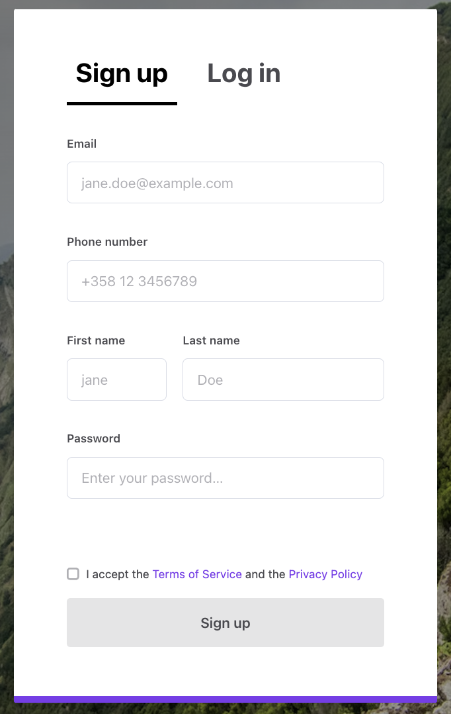
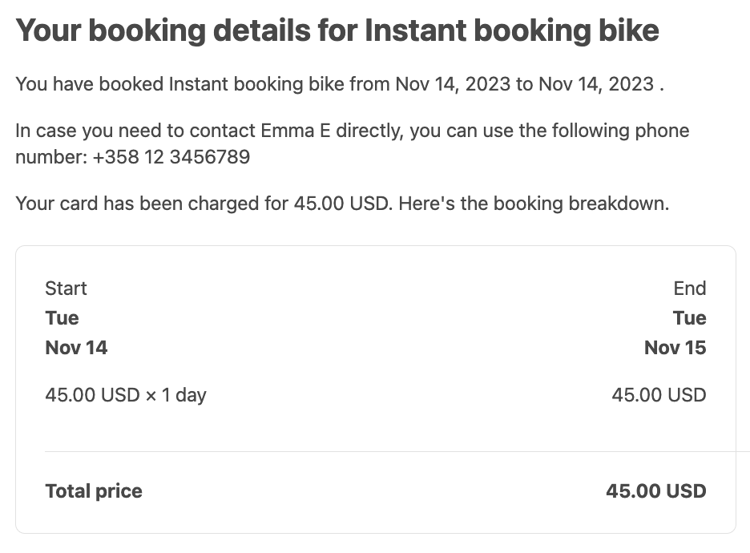

In this example, we will change a transaction process email notification
so that it uses protected data. We will send the provider's phone number
to the customer when the provider accepts the booking request. We will
add a phone number input field to Sign up form and edit the
**cottagedays-nightly-booking** transaction process that was created in
the earlier part of this tutorial.

## Change signup form

By default, users can save phone numbers on Contact details page (path:
_/account/contact-details_). However, it is not required for all users.
Since we want to reveal the provider's phone number to the customer when
the booking is accepted, we need to collect it first. This should be
done on the sign-up page:



### Add input component

To make this change, we need to update _SignupForm_. There's an existing
field to collect phone numbers. It's called **FieldPhoneNumberInput**.

src/containers/AuthenticationPage/SignupForm/SignupForm.js

```shell
└── src
    └── containers
        └── AuthenticationPage
            └── SignupForm
                ├── SignupForm.js
                └── SignupForm.module.css
```

<info>

If you have enabled social logins in your marketplace, you might also
want to add a similar _FieldPhoneNumberInput_ to _ConfirmSignupForm_
This way, users who are signing up with e.g. Facebook can also add their
phone numbers.

</info>

We need to **_import_** _FieldPhoneNumberInput_ component and then add
it to the form. We'll add the following JSX code after the
FieldTextInput that collects the email address.

```jsx
<FieldPhoneNumberInput
  className={css.phone}
  id={formId ? `${formId}.phoneNumber` : 'phoneNumber'}
  name="phoneNumber"
  label={phoneLabel}
  placeholder={phonePlaceholder}
  validate={phoneRequired}
/>
```

The JSX code shown above contains some undefined props - we need to add
those missing variables. We add the following lines after the similarly
declared variables for the email field:

```js
// phone number
const phoneLabel = intl.formatMessage({
  id: 'SignupForm.phoneLabel',
});
const phonePlaceholder = intl.formatMessage({
  id: 'SignupForm.phonePlaceholder',
});
const phoneRequiredMessage = intl.formatMessage({
  id: 'SignupForm.phoneRequired',
});
const phoneRequired = validators.required(phoneRequiredMessage);
```

<info>

You might want to improve the validation. This "_required_" validator
just checks that the input is not empty.

</info>

We also need to add style-rules for **css.phone**. You can add the
following style-rules to _SignupForm.module.css_:

```css
.phone {
  margin-top: 24px;

  @media (--viewportMedium) {
    margin-top: 32px;
  }
}
```

### Update microcopy

Add the required microcopy to the en.json file.

```shell
└── src
    └── translations
        └── en.json
```

```js
"SignupForm.phoneLabel": "Phone number",
"SignupForm.phonePlaceholder": "+358 12 3456789",
"SignupForm.phoneRequired": "You need to add your phone number",
```

After those changes, you can create a new user account using the sign-up
page. Then, if you open the user card in the Flex Console, you should be
able to see the added phone number in the user entity's protected data
section.


This is possible because all the extra fields that are added to
SignupForm component are saved as protected data to the user entity.
This happens in **_signup_** function at _auth.duck.js_.

```shell
└── src
    └── ducks
        └── auth.duck.js
```

## Reveal protected data

There are a couple of ways to reveal the phone number to the other party
of the transaction. In this tutorial, we release a specific protected
data key to the transaction entity. This entity is shared with both
parties. To achieve this goal, we need to change the transaction
process.

### Fetch transaction process

Before we modify our transaction process, it's better to ensure that we
have most the up-to-date version of the process. You can fetch any
process version with Flex CLI:

```shell
flex-cli process pull --process=cottagedays-nightly-booking --alias=release-1 --path=./cottagedays-nightly-booking --marketplace=cottagedays-dev
```

<info>

If you already have _cottagedays-nightly-booking_ directory you can't
pull the process. You need to either change the _--path_ parameter or
use a _--force_ flag at the end of the command to overwrite the existing
directory.

</info>

### Update accept transition

When we open up the _process.edn_ file from the fetched transaction
process, we should be able to find the configuration for
_transition/accept_.

To reveal the provider's protected data, we add a new action to that
transition:
<br/>[action/reveal-provider-protected-data](/references/transaction-process-actions/#actionreveal-provider-protected-data)

In addition, we add a configuration to that action. The **key-mapping**
config means that we use the _:phoneNumber_ attribute from the
provider's protected data, and rename it as _:providerPhoneNumber_ when
it is saved to the transaction entity's protected data.

```diff
  {:name :transition/accept,
   :actor :actor.role/provider,
   :actions
   [{:name :action/accept-booking}
+   {:name :action/reveal-provider-protected-data,
+    :config {:key-mapping {:phoneNumber :providerPhoneNumber}}}
    {:name :action/stripe-capture-payment-intent}],
   :from :state/preauthorized,
   :to :state/accepted}
```

### Update email template

To use the phone number from the transaction entity, we need to update
the email template: _booking-request-accepted-html.html_. You can find
that file from the fetched process directory:

```shell
└── cottagedays-nightly-booking
    └── templates
        └── booking-request-accepted
            └── booking-request-accepted-html.html
```

We add a new paragraph inside a section where **transaction context** is
available: between `{{#with transaction}}` and `{{/with}}`.

```diff
    {{#with transaction}}
    <p>{{provider.display-name}} has accepted your booking request for {{listing.title}} from {{> format-date date=booking.start}} to {{> format-date date=booking.end}}.</p>

+    <p>In case you need to contact {{provider.display-name}} directly, you can use the following phone number: {{protected-data.providerPhoneNumber}}</p>

    <p>We have charged {{> format-money money=payin-total}} from your credit card. Here's your receipt.</p>
```

<extrainfo title="How to test the email template rendering locally?">

To test the protected data using Flex CLI's built-in preview
functionality, you need to use a custom sample-template-context.json.

You can read more from the Flex CLI article:
[Edit email templates with Flex CLI](/how-to/edit-email-templates-with-flex-cli/#sample-email-context)

The short guide of the necessary steps:

1. Download the default sample-template-context.json
2. Change protected data inside it:
   ```json
   "protected-data" : { "providerPhoneNumber": "+358 12 3456789" },
   ```
3. Use Flex CLI's preview with that context:
   ```shell
   flex-cli notifications preview --template cottagedays-nightly-booking/templates/booking-request-accepted --context sample-template-context.json --marketplace=cottagedays-dev
   ```

</extrainfo>

### Push process changes

Now that we have edited the transaction process and its email templates,
we need to push a new version of _cottagedays-nightly-booking_ process.
If you have done the earlier parts of the tutorial this process should
be already quite familiar to you. If you need more detailed information
take a look at the
[Edit transaction process with Flex CLI tutorial](/how-to/edit-transaction-process-with-flex-cli/#validate-and-push-the-process).

Push the updated process:

```shell
flex-cli process push --process=cottagedays-nightly-booking --path=./cottagedays-nightly-booking --marketplace=cottagedays-dev
```

Check the version number from the output of the previous _push_ command.

With _process list_ command you can get the overall picture of versions
and process aliases:

```shell
flex-cli process list --process=cottagedays-nightly-booking --marketplace=cottagedays-dev
```

Update the alias to point to **the latest version** of the transaction
process:

```shell
flex-cli process update-alias --alias=release-1 --process=cottagedays-nightly-booking --version=4 --marketplace=cottagedays-dev
```

## Test transaction in your dev environment

Now all the relevant changes are made, and the transaction process is
updated. It is time to test our new process with a transaction. You
should create 2 new user accounts for your test marketplace and create a
listing for one of them. Then, with the other account, book the newly
created listing.

When you accept the booking request, you should see email notification
sent to the customer's email address.



<info>

Existing transactions are tied to the version of the transaction process
that was used at the time those transactions were created. So, you need
to create new transactions to test the updated process.

</info>
